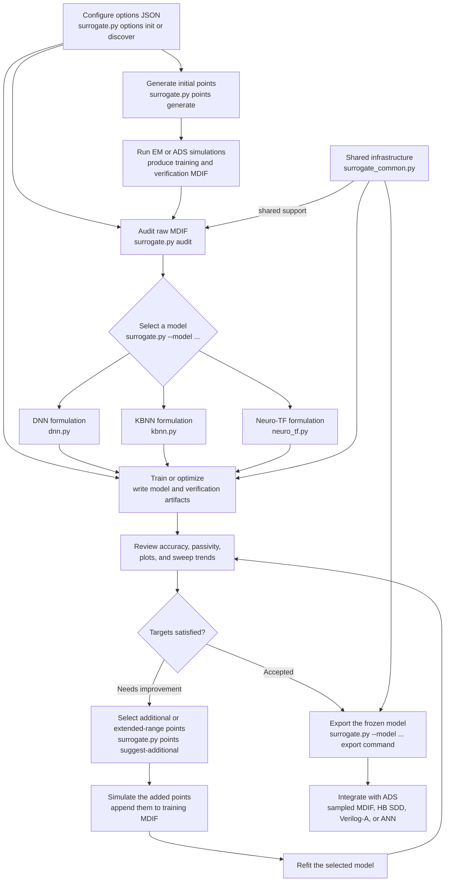

# ADS ANN Surrogate Models

This repository contains offline Python tools for building surrogate models from
parameterized RF/microwave S-parameter MDIF data.

## Repository Workflow



The diagram uses Mermaid's simple quoted-URL click syntax for compatibility
with Mermaid 10 and 11. If a Markdown viewer disables Mermaid links, use these
equivalent links: [options JSON](#configure-the-workflow-with-optionsjson),
[point generation](#1-generate-initial-points),
[data audit](#audit-training-and-verification-data),
[model fitting](#shared-training-and-optimization-workflow),
[DNN](#b3-dnn-direct-response-surrogate),
[KBNN](#b4-kbnn-fitted-coarse-knowledge-based-surrogate),
[Neuro-TF](#b5-neuro-tf-common-pole-rational-coefficient-surrogate), and
[ADS export](#choose-the-ads-handoff).

The code uses a flat script-first layout. `surrogate.py` is the primary entry
point for the entire workflow: it dispatches point generation, data auditing,
model fitting and export, and ADS HB log reporting to their internal
implementations. Shared MDIF parsing, metrics, plotting, sweep orchestration,
and ADS export helpers live in `surrogate_common.py`.

## Repository Layout

```text
.
|-- surrogate.py                          Primary CLI and workflow dispatcher
|-- dnn.py                                DNN backend and implementation
|-- kbnn.py                               KBNN backend and implementation
|-- neuro_tf.py                           Neuro-TF backend and implementation
|-- cli_options.py                        Shared structured options-JSON loading and validation
|-- options_discovery.py                  Recursive artifact and command settings recovery
|-- surrogate_common.py                   Shared training, reporting, and ADS export utilities
|-- generate_points.py                    Internal point-generation implementation
|-- audit_dataset.py                      Internal MDIF-audit implementation
|-- de_generated_scripts/
|   `-- parse_ads_hb_solver_log.py        Internal ADS HB log-report implementation
|-- dnn_sample_training_verification.mdif
|-- kbnn_sample_fine.mdif
|-- kbnn_sample_coarse.mdif
|-- neuro_tf_sample_training_verification.mdif
|-- options.example.json                  Reusable options-JSON template
|-- MODEL_PLUGIN_API.md                   Guide for adding another model family
`-- README.md                              Integrated workflow and command reference
```

### Primary CLI Routes

All supported repository commands start with `python3 surrogate.py`. The
dispatcher calls the relevant internal script and returns its exit status:

| Workflow | Primary command |
| --- | --- |
| Generate a starter options JSON | `python3 surrogate.py options init [--out options.json]` |
| Recover an options JSON from existing work | `python3 surrogate.py options discover DIRECTORY [--out options.json]` |
| Generate or extend geometry points | `python3 surrogate.py points generate [OPTIONS]` |
| Select adaptive points | `python3 surrogate.py points suggest-additional [OPTIONS]` |
| Audit MDIF data | `python3 surrogate.py audit [OPTIONS]` |
| Diagnose model error and passivity | `python3 surrogate.py debug-model --run-dir RUN_DIR [OPTIONS]` |
| Fit, optimize, inspect, predict, rerank, or export a model | `python3 surrogate.py --model {dnn,kbnn,neuro-tf} COMMAND [OPTIONS]` |
| Compare ADS HB solver logs | `python3 surrogate.py hb-report [OPTIONS] LOG [LOG ...]` |

Run `python3 surrogate.py --help` for the routes above, then append `--help` to
the selected route or model command for its complete option list.

## Configure the Workflow with `options.json`

The options JSON is an optional project configuration file. It can hold point
ranges, input-data paths, parameter names, fitting choices, output directories,
and export settings. The same file can be used by every primary command; each
command reads only the section that applies to it and rejects misspelled or
unsupported options before doing work.

### Generate the Starter File

Create a ready-to-edit file with:

```bash
python3 surrogate.py options init --out options.json
```

The command creates missing parent directories and refuses to replace an
existing file. Add `--overwrite` only when replacement is intentional. The
result matches [`options.example.json`](options.example.json) and includes
`null` placeholders showing where project-specific paths, parameter names,
ranges, point counts, and output directories belong. Every required input for
every model and workflow command now has a corresponding JSON key, including
prediction, inspection, reranking, every export type, and the HB report's
positional log list. A `null` value is omitted when a command runs, so replace
the required placeholders for commands you intend to use.

Relative paths inside the JSON are resolved from the directory in which
`surrogate.py` is run, not from the directory containing the JSON. Running all
commands from the repository or project root therefore gives predictable path
behavior.

### Discover Settings from an Existing Project

If geometries, audits, fits, optimization reports, or exports already exist,
recover their reusable settings recursively instead of rebuilding the JSON by
hand:

```bash
python3 surrogate.py options discover . \
  --out options.json
```

Replace `.` with the project/output directory to inspect. Discovery walks that
directory and every subdirectory and recognizes:

- existing options JSON files;
- initial, extended-range, targeted-addition, and cumulative geometry metadata;
- dataset-audit summaries and their block inventories;
- DNN, KBNN, and Neuro-TF model metadata;
- optimize best-configuration JSON; and
- complete `surrogate.py` reproduction and export commands embedded in JSON,
  generated Markdown reports, shell files, and logs.

The resulting `options.json` uses the complete starter structure, then replaces
its defaults and `null` placeholders with every setting discovery can recover.
Consequently every command retains its required JSON keys even when a value
cannot be inferred from the existing artifacts. Exact saved commands have
priority over inferred metadata, while an existing options JSON has the
highest priority because it represents an explicit user configuration. When
different artifacts contain incompatible values for the same exact JSON setting,
discovery deterministically selects the higher-confidence source (or the newer
source when confidence is equal), prints a warning, and records both values.
It never executes a discovered command.

Inputs shared by `train` and `optimize` are recovered into the model's `fit`
scope. In particular, an MDIF recovered from a training report or audit is
available to both commands. Discovery also carries the same source MDIF into
inspection, prediction, ADS ANN export, and audit where applicable, and derives
standard output locations from a recovered model directory. Therefore a
discovered DNN configuration can normally be optimized with no repeated
settings:

```bash
python3 surrogate.py --options-json options.json --model dnn optimize
```

Discovery also writes `options_discovery.json` beside the requested output by
default. This provenance report lists every recognized artifact, recovered
command, selected source for each setting, conflict, and parse warning. Select
another location with `--report`:

```bash
python3 surrogate.py options discover existing_project \
  --out recovered-options.json \
  --report recovered-options-sources.json
```

Both output files are protected against accidental replacement; use
`--overwrite` only after reviewing the existing files. Inferred artifact paths
are written relative to the current working directory whenever possible. Run
from the project root if that is also where the recovered JSON will normally
be used.

After discovery, validate a command and then choose whether to run it:

```bash
python3 surrogate.py --options-json options.json --model dnn train \
  --explain-options
```

Some result formats intentionally do not retain every original CLI choice. For
example, a model `metadata.json` stores the fitted architecture but cannot
reconstruct an optimization search range that was never written to an
artifact. The provenance report calls out such limitations; use
`--explain-options --update-options-json` to fill any missing exact-command
settings.

### Practical Project Configuration

The following is a usable edited example for a three-parameter project. JSON
arrays represent command-line options that would otherwise be repeated, such
as multiple `--parameter`, `--geometry-json`, or `--existing-points` options.

```json
{
  "schema_version": 1,
  "common": {},
  "commands": {},
  "models": {
    "common": {},
    "commands": {
      "fit": {
        "mdif": "data/train_verify.mdif",
        "verification_mdif": null,
        "parameter_names": "W,L,H",
        "frequency_weights": "default=1;1GHz=3;2GHz:4GHz=2",
        "passivity_mode": "auto",
        "reciprocity_mode": "enforce",
        "seed": 1234
      },
      "optimize": {
        "max_trials": 40,
        "require_passive": true,
        "selection_metric": "weighted_evm_pct"
      }
    },
    "dnn": {
      "commands": {
        "fit": {
          "output_domain": "s",
          "sparam_weights": "diag=1;offdiag=0.2"
        },
        "train": {
          "out_dir": "outputs/dnn_model"
        },
        "optimize": {
          "out_dir": "outputs/dnn_optimize"
        },
        "export-veriloga": {
          "model_dir": "outputs/dnn_optimize/best_model",
          "out_dir": "exports/dnn_veriloga",
          "module_name": "my_dnn_model",
          "parameter_input_scales": 1.0
        }
      }
    },
    "kbnn": {
      "commands": {
        "fit": {
          "mdif": "data/fine_train_verify.mdif",
          "coarse_mdif": "data/coarse_train_verify.mdif",
          "mode": "residual"
        },
        "optimize": {
          "out_dir": "outputs/kbnn_optimize"
        }
      }
    },
    "neuro-tf": {
      "commands": {
        "fit": {
          "order": 10
        },
        "optimize": {
          "out_dir": "outputs/neuro_tf_optimize"
        }
      }
    }
  },
  "workflows": {
    "points": {
      "commands": {
        "generate": {
          "parameter": [
            "W=0.40mm:0.80mm",
            "L=1.00mm:1.60mm",
            "H=0.08mm:0.16mm"
          ],
          "count": 32,
          "verification_count": 8,
          "method": "maximin-lhs",
          "decimal_places": 6,
          "out": "geometries.csv"
        },
        "suggest-additional": {
          "fit_dir": "outputs/dnn_optimize/best_model",
          "existing_points": ["geometries.csv"],
          "count": "auto",
          "acquisition": "hybrid",
          "metric": "auto",
          "target_error": 1.0,
          "exploration_weight": "auto",
          "out": "additional_points.csv",
          "combined_out": "additional_all_geometries.csv"
        }
      }
    },
    "audit": {
      "common": {
        "bare_values": "auto",
        "color": "always",
        "mdif": "data/train_verify.mdif",
        "verification_mdif": null,
        "geometry_json": ["geometries.json"],
        "parameter_names": "W,L,H",
        "expect_reciprocal": true,
        "out_dir": "outputs/data_audit"
      }
    }
  }
}
```

### Run Commands with the JSON

Supply the same file to each workflow. No other options are needed when all
required values for that command are populated in the JSON:

```bash
python3 surrogate.py --options-json options.json points generate
python3 surrogate.py --options-json options.json audit
python3 surrogate.py --options-json options.json --model dnn optimize
python3 surrogate.py --options-json options.json --model dnn export-veriloga
```

An explicit command-line option overrides the JSON for that invocation. This
is useful for a one-off trial without editing the saved project settings:

```bash
python3 surrogate.py --options-json options.json --model dnn optimize \
  --max-trials 80 \
  --out-dir outputs/dnn_optimize_80_trials
```

### Inspect the Effective Options Before Running

Add `--explain-options` (short alias: `--show-options`) to any selected command
to see exactly what its backend would receive before deciding whether to run it:

```bash
python3 surrogate.py --options-json options.json points suggest-additional \
  --explain-options
```

The report lists every effective option after type conversion and precedence,
labels its source as an explicit CLI flag, an exact JSON path, or the parser
default, and identifies required options that are still missing. Successful
`OK` validation lines are green and missing or invalid lines are red. Set the
standard `NO_COLOR` environment variable to suppress ANSI color. A configured
`null` is reported as “JSON null ignored” so it cannot be mistaken for a value
that reached the command. Audit data-input placeholders instead fall through
to a populated common or unambiguous model fit value and report that fallback
source explicitly. For
`points suggest-additional`, it also performs two read-only preflight checks:

- it shows whether the parameter domain comes from repeatable `--parameter`
  values, `--parameter-json`, or a companion JSON inferred from
  `--existing-points`; and
- it resolves the `verification_metrics.csv` path and checks whether the
  selected `--metric` column exists.

A typical excerpt looks like:

```text
--count          = 8       [JSON: workflows.points.commands.suggest-additional.count]
--fit-dir        = "..."   [JSON: workflows.points.commands.suggest-additional.fit_dir]
--metric         = "auto"  [JSON: workflows.points.commands.suggest-additional.metric]
--parameter-json = null    [parser default]
```

This is particularly useful if an option was placed at the wrong JSON scope.
For example, `selection_metric: weighted_evm_pct` is valid for model selection,
but `points suggest-additional` needs a per-geometry row metric such as
`metric: evm_pct` or `metric: auto`. The point selector still applies the saved
`normalized_sparam_weight` column, so `evm_pct` respects the fit's S-parameter
weights. When all required options and command-specific preflight checks pass,
the command asks `Execute this command with the options above? [y/N]`. Answer
`y` or `yes` to execute immediately using the displayed values; Enter, `n`, or
any other response exits without executing. Missing or invalid inputs suppress
the prompt. Non-interactive invocations also report the resolved configuration
without executing. By itself `--explain-options` does not update the options
JSON; combine it with `--update-options-json` to capture explicit settings. If
you approve execution, the JSON update occurs after the command completes;
otherwise it is captured immediately after the explanation.

### Build or Repair the JSON After Earlier Work

The options JSON does not have to describe every command you have ever run. To
continue from existing geometries and model results, it only needs pointers to
those artifacts plus the settings for the current and future commands. First
recover everything preserved below the existing project directory:

```bash
python3 surrogate.py options discover existing_project --out options.json
```

If there are no reusable artifacts, use `options init` instead. Then replay any
missing important parts of an earlier command with both
`--explain-options` and `--update-options-json`. This captures the explicit
options at the correct JSON location without executing the command:

```bash
python3 surrogate.py --options-json options.json --model dnn optimize \
  --mdif data/train_verify.mdif \
  --out-dir outputs/dnn_optimize \
  --selection-metric weighted_evm_pct \
  --explain-options \
  --update-options-json
```

Repeat that pattern once for each earlier command whose settings you want to
retain. For example, the following repairs and captures the additional-point
configuration that is causing the `weighted_evm_pct` error:

```bash
python3 surrogate.py --options-json options.json points suggest-additional \
  --fit-dir outputs/dnn_optimize/best_model \
  --existing-points geometries.csv \
  --parameter-json geometries.json \
  --count 8 \
  --metric auto \
  --out additional_points.csv \
  --explain-options \
  --update-options-json
```

The command does not generate points. It writes those values under
`workflows.points.commands.suggest-additional`, replacing a bad exact-scope
`metric` value. `--parameter-json` is optional when `geometries.json` is the
same-stem companion of `geometries.csv`, but supplying it during recovery makes
the intended source unambiguous. Review the printed parameter-domain and
metrics checks, then run the saved configuration normally:

```bash
python3 surrogate.py --options-json options.json points suggest-additional
```

Do not copy `selection_metric: weighted_evm_pct` into the point section.
`selection_metric` belongs to `models.commands.optimize`; the point section
uses `metric: auto` or a per-geometry metric such as `evm_pct`.

### Update the JSON from a Completed Command

Add `--update-options-json` when the explicit options from a command should be
saved back into the file supplied by `--options-json`:

```bash
python3 surrogate.py --options-json options.json points generate \
  --parameter W=0.40mm:0.80mm \
  --parameter L=1.00mm:1.60mm \
  --count 66 \
  --verification-count 18 \
  --out geometries.csv \
  --update-options-json
```

After point generation completes, those values are written to
`workflows.points.commands.generate`. Repeated options such as `--parameter`
are saved as JSON arrays. The next generation can therefore reuse them with:

```bash
python3 surrogate.py --options-json options.json points generate
```

The same pattern applies to audit and additional-point selection:

```bash
python3 surrogate.py --options-json options.json audit \
  --mdif data/train_verify.mdif \
  --geometry-json geometries.json \
  --out-dir outputs/data_audit \
  --update-options-json

python3 surrogate.py --options-json options.json points suggest-additional \
  --fit-dir outputs/dnn_optimize/best_model \
  --existing-points geometries.csv \
  --count 8 \
  --out additional_points.csv \
  --update-options-json
```

For model commands, updates are stored below the selected model and exact
command. This intentionally gives the recorded value precedence over broader
model defaults:

```bash
python3 surrogate.py --options-json options.json --model dnn optimize \
  --mdif data/train_verify.mdif \
  --out-dir outputs/dnn_optimize \
  --max-trials 40 \
  --update-options-json
```

The update behavior is deliberately bounded:

- `--update-options-json` requires `--options-json PATH`; a JSON file cannot
  enable its own future mutation;
- only options explicitly written on that command line are saved, while values
  already inherited from the JSON remain at their existing broader scopes;
- options are written to the narrowest exact command section and are never
  automatically promoted to `models.commands` or another common scope;
- when combined with `--explain-options`, explicit settings are saved after
  parsing if execution is declined, or after successful completion if the
  prompted command is approved;
- the file is replaced atomically after the command completes, including a
  completed audit whose data verdict is `FAIL`; parse errors and runtime
  failures do not modify it; and
- generated geometry metadata, audit results, plots, and model metadata remain
  in their normal artifact files. The options JSON records how to invoke the
  command, not copies of result data.

### Where Each Project Setting Goes

| Project setting | JSON location | Notes |
| --- | --- | --- |
| Geometry parameter names and ranges | `workflows.points.commands.generate.parameter` | Use an array of `NAME=LOW:HIGH[:linear|log]` strings. This is the JSON equivalent of repeating `--parameter`. |
| Initial training/verification point counts | `workflows.points.commands.generate.count` and `verification_count` | The generated CSV contains the split labels. |
| Geometry CSV location | `workflows.points.commands.generate.out` | A same-stem geometry JSON is generated automatically; `geometries.csv` creates `geometries.json`. |
| GP update inputs and output | `workflows.points.commands.suggest-additional` | Put `fit_dir`, `existing_points`, `count`, `out`, and optional `combined_out` here. The companion geometry JSON supplies the saved parameter ranges automatically; after each round, point `existing_points` at the latest combined cumulative all-geometries CSV. |
| Training or combined MDIF | `models.commands.fit.mdif` | Put it here when all model families use the same dataset. A model-specific value, such as `models.kbnn.commands.fit.mdif`, overrides it. |
| Separate verification MDIF | `models.commands.fit.verification_mdif` | Leave `null` when training and verification blocks are combined in `mdif`. |
| Fitted parameter names | `models.commands.fit.parameter_names` | Usually optional because numeric MDIF `VAR` values are inferred. This selects variables; it does not define their fitting ranges. |
| KBNN coarse data | `models.kbnn.commands.fit.coarse_mdif` | KBNN-only, so it belongs below the KBNN model node. |
| Audit data and declared geometry domain | `workflows.audit.common.mdif`, `verification_mdif`, and `geometry_json` | When the audit MDIF values are omitted or `null`, audit reuses populated `models.commands.fit.mdif` and `verification_mdif` values. Non-null audit values override that fallback. `geometry_json` may be an array when the range was extended in multiple campaigns. |
| Training and optimization outputs | `models.MODEL.commands.train.out_dir` and `models.MODEL.commands.optimize.out_dir` | Keep these model-specific to avoid DNN, KBNN, and Neuro-TF writing into the same directory. |
| Export input, output, and module settings | `models.MODEL.commands.EXACT_EXPORT_COMMAND` | Replace both placeholders, for example with `models.dnn.commands.export-veriloga`; exact scope avoids applying unsupported options to other exporters. |

Parameter ranges are intentionally defined for point generation, not model
fitting. The model is fitted to the parameter values actually present in the
MDIF. The generated geometry JSON records the intended complete domain and is
used by auditing and adaptive point generation. `parameter_names` only chooses
which MDIF variables are model inputs; it does not change or expand a range.

### Scope and Override Rules

The headings have deliberately narrow meanings:

| Heading | Applies to |
| --- | --- |
| Root `common` or `generic` | Every command that uses this JSON. Keep this empty unless an option truly exists on every intended command. Flat root option keys are accepted as shorthand. |
| Root `commands` | Every matching command across models and workflows. The special `fit` heading means `train` and `optimize`; `export` means every `export-*` command; `all` means every command. |
| `models.common` or `models.generic` | Every command for DNN, KBNN, and Neuro-TF, but never `points`, `audit`, or `hb-report`. |
| `models.commands` | Every model family for the matching command or group. Put settings shared by all model types here so they are declared once. |
| `models.MODEL.common` | Every selected command for only `dnn`, `kbnn`, or `neuro-tf`. Flat option keys inside a model section are shorthand for this level. |
| `models.MODEL.commands` | A command or command-group override for one model family. Values here override the broader root and `models` values. |
| `workflows.WORKFLOW.common` | Defaults for only `points`, `audit`, or `hb-report`. |
| `workflows.WORKFLOW.commands` | Per-command workflow defaults, such as separate `generate` and `suggest-additional` point settings. |

For a model command, values are merged from broad to specific: root common,
root command, `models.common`, `models.commands`, selected-model common, then
selected-model command. Within a `commands` object, `all` is applied first,
then a group such as `fit`, and finally the exact command. Workflow commands
use the corresponding root and selected-workflow layers. An explicit CLI value
always has final precedence.

For example, `models.commands.fit.frequency_weights` applies to all three model
families. `models.kbnn.commands.fit.frequency_weights` overrides it only for
KBNN, and an explicit `--frequency-weights` overrides both for one invocation.

For compatibility with previously generated JSON files, `train` and
`optimize` also use the other command's fit-compatible settings as a fallback
when neither the selected command nor its `fit` group defines that value. This
includes MDIF paths, frequency/S-parameter weights, architecture single-value
forms, data splits, DC settings, passivity/reciprocity settings, and fixed
training controls. It deliberately excludes output directories and
optimization-only controls, preventing an optimize run from overwriting a
single trained model. New discovery output writes these shared values into
`models.MODEL.commands.fit`, which remains the preferred, explicit location.

Option keys may use hyphens or underscores and may include or omit the leading
`--`. JSON arrays supply repeatable or multi-value options and booleans supply
flag options. Required positional inputs use their argument name as the JSON
key; for example, HB logs are stored as `logs: ["baseline.log", "trial.log"]`.
Remove a key or set it to `null` to omit that option. An empty
string (`""`) is an explicit value and is not equivalent to omission. Unknown
options, invalid choices, invalid types, misspelled headings, and unsupported
schema versions stop before the command runs.

For the exhaustive option tables, see [Appendix D: Complete CLI Command and
Option Reference](#appendix-d-complete-cli-command-and-option-reference).

## Requirements

The local trainers are script-first and currently do not use a packaging file.
Use a Python environment with NumPy installed:

```bash
python3 -m venv .venv
source .venv/bin/activate
python3 -m pip install numpy pillow
```

Matplotlib is optional but recommended for publication-quality verification
plots:

```bash
python3 -m pip install matplotlib
```

ADS is not required for local training, inspection, prediction, MDIF export, or
Verilog-A/SDD file generation. An ADS installation is required to compile and
simulate the generated circuit models. The generated ADS ANN training package must be run on
a licensed ADS machine with the ADS Python environment because it imports
`keysight.ads.ann`.

The `points` workflow uses Pillow for its automatic PNG coverage matrix. Its
`maximin-lhs`, `latin-hypercube`, and `halton` sampling methods otherwise use
only the Python standard library. The `sobol` method uses SciPy's Sobol
implementation when SciPy is available.

The remainder of this README follows the order used to create and deploy a
model:

1. [generate an initial geometry set](#1-generate-initial-points);
2. [simulate it and audit the training/verification data](#2-simulate-and-audit-the-dataset);
3. [fit and optimize DNN, KBNN, or Neuro-TF](#3-fit-and-optimize-a-model);
4. [select additional or extended-range points](#4-update-or-extend-the-sampling-points)
   from the fitted-model error;
5. [simulate those additions and refit](#5-refit-and-iterate) until the held-out
   targets are met; and
6. [export the frozen model](#6-export-and-integrate-with-ads) using the
   appropriate ADS integration method.

## 1. Generate Initial Points

Use `surrogate.py points generate` to create geometry/process sample CSVs
before running EM simulations or assembling MDIF. The default method is
`maximin-lhs`, a
maximin Latin hypercube. For finite surrogate-training campaigns, this is often
more appropriate than a raw Sobol prefix because every parameter is stratified
and the script chooses the candidate design with the largest minimum point
spacing. Sobol remains useful when you want a low-discrepancy sequence that can
grow naturally in power-of-two batches.

```bash
python3 surrogate.py points generate \
  --parameter W=0.40mm:0.80mm \
  --parameter L=1.00mm:1.60mm \
  --count 32 \
  --verification-count 8 \
  --method maximin-lhs \
  --out geometries.csv
```

In an interactive terminal, point generation uses one live status line rather
than printing a new line for every update. Maximin-LHS reports candidate-design
progress, then the same line advances through CSV, metadata, and coverage-plot
creation. The live line is erased before the final `wrote ...` artifact list.
Progress is suppressed automatically when output is redirected to a file or a
non-interactive process.

### How Many Points for the Default Hybrid GP Workflow

The default adaptive workflow deliberately starts lean because the surrogate
is refit after each round. Use

$$
n_{\mathrm{train}}=\max(4d,12),\qquad
n_{\mathrm{acq}}=\max(d+2,6),
$$

where $d$ is the number of geometry parameters and $n_{\mathrm{acq}}$ is the
acquisition-verification set used to construct geometry-level GP error
observations. These are not final independent audit points.

| Geometry parameters | Initial training | Acquisition verification | Initial `generate --count` | Near target | Above target | Far from target |
| ---: | ---: | ---: | ---: | ---: | ---: | ---: |
| 2 | 12 | 6 | 18 | 4 | 4 | 6 |
| 3 | 12 | 6 | 18 | 5 | 6 | 9 |
| 4 | 16 | 6 | 22 | 6 | 8 | 12 |
| 5 | 20 | 7 | 27 | 8 | 10 | 15 |
| 6 | 24 | 8 | 32 | 9 | 12 | 18 |
| 7 | 28 | 9 | 37 | 11 | 14 | 21 |
| 8 | 32 | 10 | 42 | 12 | 16 | 24 |

`suggest-additional --count auto` calculates the round column from the current
RMS geometry error and `--target-error`: target met returns zero, within
$2\times$ uses roughly $1.5d$, $2\times$ to $4\times$ uses $2d$, and at
least $4\times$ uses $3d$. Sparse training or error observations raise the
minimum to $2d$. A latest-round improvement below 5% caps the recommendation
at $2d$ and labels a plateau; a regression reduces it to a diagnostic batch so
the workflow does not spend a large simulation budget on a likely fitting or
data problem. Supply prior metrics in oldest-to-newest order with repeatable
`--previous-verification-metrics` options.

### Automatic Acquisition-Verification Growth

The acquisition-verification column above is a starting error-observation
target, not a fixed count for the entire campaign. Additional training points
improve the RF surrogate without automatically increasing the number of
locations at which its geometry-level error has been measured.

`points suggest-additional` therefore grows the acquisition-verification set
automatically for the default hybrid method and for explicit GP-UCB training
acquisitions. The default milestone policy is:

$$
n_{\mathrm{train},0}=\max(4d,12),\qquad
\Delta n_{\mathrm{train}}=2d,
$$

and each crossed training milestone adds

$$
\Delta n_{\mathrm{verify}}=
\max\!\left(2,\left\lceil\frac{2d}{3}\right\rceil\right)
$$

verification points. One command adds no more than
$\max(d+2,6)$ automatic verification points, so an older campaign can catch up
without creating an unexpectedly unbounded simulation batch. The requested
`--count` remains the number of primary training suggestions; automatically
triggered verification points are additional rows and are reported before the
output paths.

For six dimensions, the lean anchor is 24 training and 8
acquisition-verification points. A campaign with 40 training and 8 verification
points that requests eight more training points reaches the second milestone
at 48 training and receives eight catch-up verification points. Subsequent
$2d$ training milestones add four verification observations at a time.

Automatic verification points use the current GP with at least `3.0`
exploration weight and `2.0` novelty power so they improve error-observation
coverage rather than simply duplicating the strongest exploitation region.
They are labeled `verification`, must remain out of model training, and become
inputs to the next fit's `verification_metrics.csv`. The output JSON records
the complete policy calculation, including the observed counts, projected
training count, milestone interval, verification target, and points actually
selected. It records both the generated verification inventory and the number
of distinct geometries found in `verification_metrics.csv`; the larger count
is used so queued-but-not-yet-simulated verification points are not generated
again. The CLI prints the same decision, including the next scheduled training
trigger, in a compact status line.

The automatic policy applies when the primary batch is a hybrid or GP-UCB
training batch. Set `--verification-policy off` to disable it, or use
`--verification-interval`, `--verification-batch`, and
`--verification-max-add` to override the milestone spacing, growth amount, and
per-command catch-up cap. A parameter-range extension remains a separate
reason to add verification coverage even if no ordinary milestone was crossed.

These acquisition-verification points influence later GP selections and are
therefore not an unbiased final test. Maintain a separate final audit set that
is never supplied to `suggest-additional`.

### How Many Points for the Initial Non-GP Design

Treat each point as one geometry/process setting with a full frequency sweep;
frequency samples within that sweep do not count as additional geometry points.
For a one-shot design intended to work without adaptive refinement, use these
practical initial ranges:

| Geometry parameters | Training points | Verification points |
| ---: | ---: | ---: |
| 2 | 20-35 | 8-12 |
| 3 | 35-60 | 12-18 |
| 4 | 60-100 | 16-25 |
| 5 | 100-160 | 25-40 |
| 6 | 160-250 | 35-55 |
| 7-8 | 250-450 | 50-90 |

`--count` is the total of both groups, while `--verification-count` specifies
how many of those points are held out. The two-parameter command above therefore
creates 24 training and 8 verification points, which falls within the first
recommended row. These ranges are starting guidance rather than guarantees;
strong resonances, discontinuous behavior, or broad parameter ranges can
require adaptive additions after the first fit.

For the non-GP workflow, the table can also be treated as a cumulative dataset
target: generate the whole range initially, or start smaller and approach it
through error-distance training batches after each fit. It is not a
recommendation to add the full table amount during every update round.

For residual KBNN fits with a useful coarse model, start near the low-to-middle
end of each range because the fine network is learning the correction to the
fitted coarse model. A staged KBNN workflow can start with roughly $15d$
training points, with a minimum of about 30, and $4d$ to $6d$ verification
points, with a minimum of about 12, where $d$ is the number of geometry
parameters. Keep the verification set fixed across model comparisons, then add
training points in targeted batches of about $3d$ to $5d$ using current
worst-fit regions.

Each generated CSV contains `point_index`, `dataset`, `split_sequence`,
`train_sequence`, `verification_sequence`, `method`, and one column per
parameter. Add `--include-normalized` when you also want the underlying
unit-cube coordinates. Add `--write-split-files` to also write separate
`*_training.csv` and `*_verification.csv` files for tools that consume the two
simulation queues independently. Use `--decimal-places N` to round generated
parameter values to at most `N` decimal places in each parameter's declared
unit; normalized coordinates are recalculated from those rounded values. During
a range extension, this applies to the newly appended points. Surviving
original row values remain unchanged, while repeated original rows that occupy
the same target-digit key are removed.

The requested decimal places also define geometry identity. For example, with
`--decimal-places 3`, `1.2344um` and `1.23449um` both occupy the `1.234um`
location and cannot appear as separate points. Initial and range-extension
generation retain the unique results from the requested design and draw
deterministic replacement candidates until the requested count is full.
`suggest-additional` removes candidate locations already occupied by any
existing CSV, MDIF, or verification-metrics point, and collapses the remaining
candidate pool on the same declared-unit digit grid before scoring it. If the
selected precision and ranges cannot provide enough unique locations, the
command stops before writing the geometry CSV and reports the grid capacity or
the number of unique points it could find.

Every geometry CSV also gets an automatic same-stem JSON file. For example,
`geometries.csv` produces `geometries.json`. The JSON records the generation
method, point and dataset counts, and each parameter's lower bound, upper bound,
unit, base-unit bounds, linear/log scale, and coverage-plot filename.

The same command also writes `geometries_parameter_coverage.png`. This pair
matrix provides one cell for every ordered parameter pair:

- off-diagonal cells plot one parameter against another, with training points
  in blue and verification points in orange; and
- diagonal cells overlay training and verification histograms for that
  parameter.

Linear and log-scaled parameters are positioned in their normalized design
coordinates so coverage is visually comparable, while the axes retain the
declared physical endpoint values and units. The PNG uses a two-times
high-resolution canvas so it opens at a document-scale size in normal image
viewers, and it does not require Matplotlib. When `--write-split-files` is
used, the combined geometry retains the single companion JSON and its complete
training-plus-verification matrix. The RFPro-friendly split CSVs do not create
additional plots or duplicate JSON files. Range extensions likewise plot the
complete original-plus-appended set once. Targeted additional-point commands
produce a deduplicated `<out>_all_geometries.csv`, same-stem JSON, and one
coverage matrix containing every prior occupied input plus the new batch. The
latest cumulative CSV/JSON pair becomes the geometry input for the next GP
round.

## 2. Simulate and Audit the Dataset

Input data is expected to be MDIF with one block per parameter point. Each block
should provide numeric geometry or process values as `VAR` entries and an
`ACDATA` table containing frequency and complex S-parameters:

```text
VAR dataset=train
VAR W=0.40mm
VAR L=1.20mm
BEGIN ACDATA
% Freq S11 S12 S21 S22
# Hz S RI R 50
1.0e9  0.1 0.0  0.0 0.0  0.8 -0.1  0.1 0.0
2.0e9  0.2 0.0  0.0 0.0  0.6 -0.2  0.2 0.0
END
```

The parser supports `RI`, `MA`, and `DB` complex pair formats. Header names may
use logical S-parameter labels such as `S11` or explicit real/imaginary columns
such as `S11R S11I`.

For combined training and verification files, use a split variable such as
`dataset=train` and `dataset=verification`. If no split values are present, the
trainers can reserve a holdout fraction of blocks for verification. For KBNN,
pass the coarse/prior MDIF together with the fine MDIF. The integrated workflow
first fits and saves an S-domain coarse DNN, then evaluates that frozen DNN at
every fine training and verification point. This matches the two-network model
that will be embedded in a self-contained export.

### Audit Training and Verification Data

Run the model-independent dataset audit before another optimization when every
trial fails passivity. Unlike `inspect-mdif`, this command evaluates every raw
S-matrix and checks whether the split is internally suitable for modeling.

For one combined MDIF containing 160 `dataset=train` blocks and 40
`dataset=verification` blocks:

```bash
python3 surrogate.py audit \
  --mdif train_verify.mdif \
  --geometry-json geometries.json \
  --out-dir outputs/train_verify_audit
```

Parameter names are inferred from the numeric `VAR` values, so
`--parameter-names` is normally unnecessary. Supply it only to exclude another
numeric metadata variable or to enforce a particular parameter set:

```bash
python3 surrogate.py audit \
  --mdif train_verify.mdif \
  --geometry-json geometries.json \
  --parameter-names W,L,H,Er,TanD,Roughness \
  --out-dir outputs/train_verify_audit
```

Use the JSON written alongside the geometry CSV by the `points generate`
command. Its
declared base-unit parameter bounds—not the minimum and maximum values that
happen to appear in the sampled training subset—define whether a verification
point is inside the intended design domain. This avoids false extrapolation
warnings for sparse LHS, Sobol, Halton, and GP-selected training points.

`--geometry-json` can be repeated when the campaign was extended. The audit
uses the combined minimum and maximum declared bounds for each parameter:

```bash
python3 surrogate.py audit \
  --mdif train_verify.mdif \
  --geometry-json original_geometries.json \
  --geometry-json extended_geometries.json \
  --out-dir outputs/train_verify_audit
```

If the MDIF and geometry metadata share a stem and directory, such as
`campaign.mdif` and `campaign.json`, the JSON is detected automatically.
Otherwise, pass it explicitly. Without an applicable geometry JSON, the audit
falls back to the observed training extrema and says so in the CLI and report.

When training and verification are separate files, use the same separation as
the fitting command:

```bash
python3 surrogate.py audit \
  --mdif train.mdif \
  --verification-mdif verification.mdif \
  --geometry-json geometries.json \
  --out-dir outputs/data_audit
```

For an integrated KBNN fit, audit the fine and coarse datasets together:

```bash
python3 surrogate.py audit \
  --mdif fine_train_verify.mdif \
  --coarse-mdif coarse_train_verify.mdif \
  --geometry-json geometries.json \
  --out-dir outputs/kbnn_data_audit
```

Add `--coarse-verification-mdif coarse_verification.mdif` when the coarse split
also uses separate files. The original coarse frequency and geometry points do
not need to equal the fine grid because KBNN evaluates a fitted coarse DNN at
the fine points. The audit instead warns when the fine parameter domain extends
outside the coarse training domain and therefore forces coarse-model
extrapolation.

The audit performs these checks:

- reconstructs every complete S-matrix and calculates its largest singular
  value at every DC and RF frequency;
- reports DC and RF passivity violations separately using
  $\sigma_{\max}(\mathbf S)\leq 1+\epsilon$;
- detects nonfinite data, missing S-parameters, invalid frequency ordering,
  inconsistent port counts, reference impedances, and frequency grids;
- detects redundant or conflicting duplicate geometries and any
  train/verification overlap;
- compares verification parameter coverage with the declared geometry-generation
  range, falling back to observed training extrema only when no geometry JSON is
  supplied or inferred;
- interprets unitless MDIF parameter values per source and parameter against the
  declared geometry units, recording whether base units or parameter units were
  selected;
- ranks abrupt S-response changes between nearest training geometries; and
- optionally checks reciprocity with `--expect-reciprocal`.

The command prints the verdict followed by one actionable explanation per error
or warning code. Each explanation includes its occurrence count, representative
message, affected source/block/frequency examples when available, and a
recommended response. It also writes:

- `dataset_audit.md`: integrated report with a **Why this verdict was issued**
  section, recommended actions, an inset passivity plot, and the detailed
  findings;
- `dataset_audit.json`: machine-readable verdict, issue counts, structured
  `verdict_reasons` entries, the selected coverage-domain source and bounds, and
  per-source `parameter_unit_interpretation` decisions;
- `dataset_passivity.csv`: every block/frequency singular-value calculation;
- `dataset_blocks.csv`: passivity, grid, format, and geometry summary per block;
- `dataset_issues.csv`: every error and warning with source block/frequency;
- `dataset_duplicates.csv`: duplicate-response comparisons;
- `dataset_neighbor_consistency.csv`: ranked local response jumps; and
- parameter-coverage and frequency-grid CSVs.

`FAIL` and exit status 1 mean the raw dataset contains a definite problem such
as non-passive S-data, conflicting duplicates, missing data, or split leakage.
`WARNING` and exit status 0 mean the raw values are usable but deserve review,
for example because verification lies beyond the declared geometry-generation
range. A verification value outside only the sampled training extrema is still
reported in the coverage CSV for diagnosis, but does not create a warning when
it remains inside the declared range. Use `--fail-on-warnings` for CI-style
strict checking.

The CLI result is green for `PASS`, yellow for `WARNING`, and red for `FAIL`;
individual warning/error reason headings use the same colors. The default
`--color always` also works in captured ADS and IDE consoles. Use `--color auto`
to emit colors only for an interactive terminal, or `--color never` when
redirecting stdout to a text file. The standard `NO_COLOR` environment variable
always disables ANSI color. Markdown, JSON, and CSV artifacts never contain
ANSI escapes.

Geometry JSON stores bounds in SI base units. MDIF parameter values with an
explicit suffix such as `400um` are also converted directly to base units.
Unitless values are ambiguous, so `--bare-values auto` evaluates both meanings
for each source and parameter and selects the one consistent with the declared
geometry range. Use `--bare-values parameter-units` when unitless `400` means
`400um`, or `--bare-values base-units` when it means `400` SI units. The CLI,
`dataset_audit.json`, and the **Parameter unit interpretation** report table show
the selected interpretation.

For example, a frequency-grid warning now identifies both the reason and what
to inspect:

```text
dataset audit: WARNING
issues: 0 error(s), 1 warning(s)
verdict reasons:
  - WARNING INCONSISTENT_FREQUENCY_GRIDS (1 occurrence)
    reason: fine data uses 2 distinct frequency grids. Variable grids are supported, but missing or inconsistent sweeps can create uneven fitting coverage.
    action: Compare dataset_frequency_grids.csv with the intended sweep setup. Align accidental differences or confirm adequate coverage.
```

Most importantly, a raw-data `PASS` changes the diagnosis: if all DNN and KBNN
fits remain non-passive while every supplied S-matrix is passive, the dataset
is not by itself proof of the problem. An unconstrained neural network can
leave the passive set between sampled geometries or frequencies. In that case,
inspect the nearest-neighbor outliers and coverage first, then investigate
output-domain conditioning, frequency sampling near resonances, architecture,
or a passivity-preserving formulation.

#### Audit Input Options

| Option | Description | Example |
| --- | --- | --- |
| <nobr><code>--bare-values MODE</code></nobr> | Interpretation for unitless MDIF parameter values: <code>auto</code>, <code>parameter-units</code>, or <code>base-units</code>. Auto compares both interpretations against the geometry JSON independently for each source and parameter. Default: <code>auto</code>. | <nobr><code>--bare-values auto</code></nobr> |
| <nobr><code>--coarse-mdif PATH</code></nobr> | Optional KBNN coarse training or combined MDIF. | <nobr><code>--coarse-mdif coarse_train_verify.mdif</code></nobr> |
| <nobr><code>--coarse-verification-mdif PATH</code></nobr> | Optional separate coarse verification MDIF; requires <code>--coarse-mdif</code>. | <nobr><code>--coarse-verification-mdif coarse_verify.mdif</code></nobr> |
| <nobr><code>--geometry-json PATH</code></nobr> | Geometry-generation metadata whose declared bounds define verification coverage. Repeat for extended campaigns. A valid same-stem JSON beside an MDIF is inferred when this option is omitted. | <nobr><code>--geometry-json geometries.json</code></nobr> |
| <nobr><code>--mdif PATH</code></nobr> | Required direct-model or KBNN fine training/combined MDIF. | <nobr><code>--mdif train_verify.mdif</code></nobr> |
| <nobr><code>--parameter-names NAMES</code></nobr> | Optional comma-separated geometry variables. By default they are inferred from common numeric <code>VAR</code> values. | <nobr><code>--parameter-names W,L,H</code></nobr> |
| <nobr><code>--verification-mdif PATH</code></nobr> | Optional separate direct/fine verification MDIF. Every block in <code>--mdif</code> is then treated as training. | <nobr><code>--verification-mdif verify.mdif</code></nobr> |

#### Audit Split Options

| Option | Description | Example |
| --- | --- | --- |
| <nobr><code>--holdout-fraction FLOAT</code></nobr> | Fitter-compatible random holdout used only when a combined MDIF has no recognized training values. Default: <code>0.2</code>. | <nobr><code>--holdout-fraction 0.25</code></nobr> |
| <nobr><code>--seed INT</code></nobr> | Random-holdout seed. Default: <code>1234</code>. | <nobr><code>--seed 42</code></nobr> |
| <nobr><code>--split-var NAME</code></nobr> | Split <code>VAR</code> name. Default: <code>dataset</code>. | <nobr><code>--split-var dataset</code></nobr> |
| <nobr><code>--train-values VALUES</code></nobr> | Comma-separated training labels. Default: <code>train,training</code>. | <nobr><code>--train-values train</code></nobr> |
| <nobr><code>--verify-values VALUES</code></nobr> | Comma-separated verification labels. Default: <code>verify,verification,test,validation</code>. | <nobr><code>--verify-values verification</code></nobr> |

#### Audit Criteria Options

| Option | Description | Example |
| --- | --- | --- |
| <nobr><code>--expect-reciprocal</code></nobr> | Treat an S-matrix reciprocity mismatch as an error. Leave disabled for intentionally nonreciprocal devices. | <nobr><code>--expect-reciprocal</code></nobr> |
| <nobr><code>--frequency-abs-tolerance-hz FLOAT</code></nobr> | Absolute frequency-grid comparison tolerance in hertz. Default: <code>1e-3</code>. | <nobr><code>--frequency-abs-tolerance-hz 1</code></nobr> |
| <nobr><code>--frequency-rel-tolerance FLOAT</code></nobr> | Relative frequency-grid comparison tolerance. Default: <code>1e-10</code>. | <nobr><code>--frequency-rel-tolerance 1e-9</code></nobr> |
| <nobr><code>--neighbor-min-relative-jump FLOAT</code></nobr> | Minimum relative response RMSE eligible for a nearest-neighbor warning. Default: <code>0.05</code>. | <nobr><code>--neighbor-min-relative-jump 0.1</code></nobr> |
| <nobr><code>--neighbor-outlier-factor FLOAT</code></nobr> | Warning threshold multiplier above the median nearest-neighbor response jump. Default: <code>5</code>. | <nobr><code>--neighbor-outlier-factor 8</code></nobr> |
| <nobr><code>--parameter-abs-tolerance FLOAT</code></nobr> | Base-unit absolute tolerance for duplicate-geometry detection. Default: <code>1e-15</code>. | <nobr><code>--parameter-abs-tolerance 1e-12</code></nobr> |
| <nobr><code>--parameter-rel-tolerance FLOAT</code></nobr> | Relative tolerance for duplicate-geometry detection. Default: <code>1e-10</code>. | <nobr><code>--parameter-rel-tolerance 1e-9</code></nobr> |
| <nobr><code>--passivity-tolerance FLOAT</code></nobr> | Checks <code>sigma_max &lt;= 1 + tolerance</code>. Default: <code>1e-6</code>. | <nobr><code>--passivity-tolerance 1e-5</code></nobr> |
| <nobr><code>--reciprocity-tolerance FLOAT</code></nobr> | Maximum absolute <code>abs(Sij-Sji)</code> when reciprocity is required. Default: <code>1e-3</code>. | <nobr><code>--reciprocity-tolerance 1e-4</code></nobr> |
| <nobr><code>--response-abs-tolerance FLOAT</code></nobr> | Absolute duplicate-response conflict tolerance. Default: <code>1e-6</code>. | <nobr><code>--response-abs-tolerance 1e-5</code></nobr> |
| <nobr><code>--response-rel-tolerance FLOAT</code></nobr> | Relative duplicate-response conflict tolerance. Default: <code>1e-4</code>. | <nobr><code>--response-rel-tolerance 1e-3</code></nobr> |

#### Audit Output Options

| Option | Description | Example |
| --- | --- | --- |
| <nobr><code>--color {auto,always,never}</code></nobr> | ANSI color policy for the CLI verdict and reason headings. Default: <code>always</code>; use <code>never</code> for redirected text. | <nobr><code>--color never</code></nobr> |
| <nobr><code>--fail-on-warnings</code></nobr> | Return exit status 1 for warnings as well as errors. | <nobr><code>--fail-on-warnings</code></nobr> |
| <nobr><code>--out-dir PATH</code></nobr> | Artifact directory. Default: <code>dataset_audit</code>. | <nobr><code>--out-dir outputs/data_audit</code></nobr> |

## 3. Fit and Optimize a Model

Choose one model family for the initial fit, validate its held-out response,
and then optimize only the settings that materially affect the result. DNN,
KBNN, and Neuro-TF are deliberately grouped here because model-family choice
is part of fitting—not point generation or ADS integration.

### Unified Model CLI

The same primary `surrogate.py` entry point handles every model-family command,
including all export formats. Select the backend with
`--model` and leave the selected backend's subcommand and options
unchanged:

```text
python3 surrogate.py --model {dnn,kbnn,neuro-tf} SUBCOMMAND [OPTIONS]
```

For example, these commands display the model-specific training help:

```bash
python3 surrogate.py --model dnn train --help
python3 surrogate.py --model kbnn train --help
python3 surrogate.py --model neuro-tf train --help
```

`neuro_tf` and `neurotf` are accepted as aliases for `neuro-tf`. The dispatcher
uses the current Python interpreter, preserves relative paths from the calling
directory, forwards all remaining arguments without modification, and returns
the selected backend's exit status. The backend files remain directly
executable for development and compatibility, but generated reports and the
commands in this README use the unified entry point.

### Choose a Model Family

| Model | Entry point | Best fit for | Basic idea |
| --- | --- | --- | --- |
| DNN | `surrogate.py --model dnn` | General parameterized S-parameter fitting when you want a direct neural response model. | A multilayer perceptron predicts S-parameters, or optionally Y-parameters, from geometry/process variables plus frequency features. |
| KBNN | `surrogate.py --model kbnn` | Cases where a fast coarse model or lower-fidelity EM result is available. | A neural network learns the correction from coarse/prior response to fine/target response, or uses the coarse response as an input. |
| Neuro-TF | `surrogate.py --model neuro-tf` | Smooth frequency responses where a rational transfer-function structure is useful. | Fixed stable poles define rational transfer functions; a neural network maps geometry/process variables to the fitted coefficients. |

All three tools read MDIF, train models, run sweeps, write verification
artifacts, predict new response blocks, and export sampled ADS MDIF packages or
self-contained Verilog-A n-ports. All three also export self-contained, linear
ADS SDD subnetworks for harmonic balance. DNN and KBNN additionally support
native ADS ANN package generation.

### DNN

Use the direct neural response model for a general-purpose first fit:

```bash
python3 surrogate.py --model dnn train \
  --mdif dnn_sample_training_verification.mdif \
  --out-dir outputs/dnn_model \
  --parameter-names W,L \
  --hidden-layers 128,128,64
```

See the [DNN command reference](#dnn-command-reference) for prediction,
optimization, weighting, reranking, and export options.

### KBNN

Use the integrated fitted-coarse workflow when lower-fidelity data are available:

```bash
python3 surrogate.py --model kbnn train \
  --mdif kbnn_sample_fine.mdif \
  --coarse-mdif kbnn_sample_coarse.mdif \
  --out-dir outputs/kbnn_model \
  --parameter-names W,L \
  --mode residual
```

This command fits and saves the coarse DNN first, evaluates that frozen model
at every fine-data geometry and positive frequency, and then fits the fine
correction network. Both saved networks are required by the composite model and
its self-contained exports.

See the [KBNN command reference](#kbnn-command-reference) for coarse/fine
fitting, optimization, prediction, and composite export options.

### Neuro-TF

Use the common-pole rational formulation for smooth frequency responses:

```bash
python3 surrogate.py --model neuro-tf train \
  --mdif neuro_tf_sample_training_verification.mdif \
  --out-dir outputs/neuro_tf_model \
  --parameter-names W,L \
  --order 10
```

To let the data relocate one common stable pole set before coefficient
extraction, enable adaptive placement explicitly:

```bash
python3 surrogate.py --model neuro-tf train \
  --mdif neuro_tf_sample_training_verification.mdif \
  --out-dir outputs/neuro_tf_adaptive_poles \
  --parameter-names W,L \
  --order 10 \
  --pole-placement adaptive \
  --pole-iterations 6
```

`fixed` remains the default so existing commands reproduce the established
model. Adaptive placement starts from that same grid, performs shared
denominator relocation on the dominant broadband training-response modes, and
retains the fixed grid if none of the relocation iterations lowers the
representative rational-fit RMSE. Compare both methods during optimization
with `--pole-placements fixed,adaptive` or
`--optimize-parameter pole_placement=fixed,adaptive`.

See the [Neuro-TF command reference](#neuro-tf-command-reference) for rational
orders, pole controls, passivity/reciprocity handling, optimization, prediction,
and export options. Neuro-TF trains in a response-conditioned coefficient basis
by default; raw pole/residue coefficients are produced only after the learned
map, so an ill-conditioned rational basis cannot hide a large S-parameter error
behind a small coefficient loss.

### Shared Training and Optimization Workflow

#### Train and optimize option naming

Optimize/sweep commands use plural names for candidate lists and accept the
matching train option for a single candidate. This makes a train command easy
to reuse: change `train` to `optimize`, keep singular options when their value
should stay fixed, and pluralize only the settings that should be swept.
Existing `*-options` spellings remain supported as compatibility aliases.

| Train or one optimize value | Multiple optimize values |
| --- | --- |
| `--activation relu` | `--activations tanh,relu` |
| `--learning-rate 0.002` | `--learning-rates 0.001,0.002,0.005` |
| `--freq-transform log` | `--freq-transforms log,linear,log-linear` |
| `--hidden-layers 64,64` | `--hidden-layers '32;64;64,64'` |
| `--order 10` | `--orders 6,10,14` |
| `--pole-damping 0.18` | `--pole-dampings 0.12,0.18,0.28` |
| `--pole-iterations 6` | `--pole-iterations 6` |
| `--pole-placement adaptive` | `--pole-placements fixed,adaptive` |
| `--ridge 1e-8` | `--ridges 1e-10,1e-8,1e-6` |
| KBNN `--mode residual` | KBNN `--modes residual,prior-input` |

Use `--search-mode adaptive|grid|random` for the optimize search strategy.
Legacy `--mode grid|random` commands remain valid; on KBNN optimize commands,
`--mode plain|residual|prior-input` now has the same model meaning as it does
for `train`.

Run a discrete random sweep and keep the best completed model:

```bash
python3 surrogate.py --model dnn optimize \
  --mdif train_verify.mdif \
  --out-dir outputs/dnn_sweep \
  --parameter-names W,L,H \
  --search-mode random \
  --max-trials 40 \
  --selection-metric weighted_evm_pct \
  --require-passive
```

#### Running Adaptive Hyperparameter Optimization

Use `--search-mode adaptive` when a grid is too large and random trials are not
learning from previous results. Specify only the settings that should vary with
repeatable `--optimize-parameter` options. Unspecified model settings stay at
the first value supplied through their normal optimize option, including the
documented default when that option is omitted.

The practical workflow is:

1. Start from a working `train` command and change `train` to `optimize`.
2. Add `--search-mode adaptive`.
3. Add one repeatable `--optimize-parameter NAME=DOMAIN` option for every
   setting that should vary. Leave fixed settings on their normal train-style
   options.
4. Set the actual fitting budget with `--max-trials`. A useful first run is
   24–40 trials, with 6–8 initial space-filling trials.
5. Choose the performance objective with `--selection-metric` and add
   `--require-passive` when passivity is mandatory.

`--adaptive-candidate-pool` is the number of unevaluated configurations made
available to the optimizer; it is not the number of models fitted.
`--max-trials` is the fitting budget. `--adaptive-initial-trials` controls how
many category-balanced, maximin-separated trials run before GP guidance. For
every categorical `--optimize-parameter`, the initial selector first minimizes
unseen and underrepresented levels, then maximizes distance among candidates
with equally good category balance. If the requested initial count is smaller
than the largest categorical domain, it is automatically raised enough to try
each level once when the total trial budget permits. This balances each
categorical parameter marginally without requiring every Cartesian combination.
After initialization, the GP may deliberately favor a better-performing
category, but `--adaptive-category-balance 0.5` keeps every level at no less
than half of its equal-allocation count by default. Set it to `1` for nearly
equal marginal coverage throughout the search or `0` for unrestricted GP
exploitation after initialization. The report's `Categorical coverage` column
shows cumulative counts at every trial. `--adaptive-exploration` controls how strongly the later
lower-confidence-bound selection favors uncertain regions. Adaptive fitting is
sequential and forces one job because every new selection uses the preceding
trial results.

In the sweep Markdown table, `Trial` is the chronological iteration and
`Rank` is the final post-fit ordering. `Metric` is the measured selection
error, while `Predicted objective` is the value estimated before that trial
ran. `Categorical coverage` gives the cumulative per-level counts as of that
trial; the model-specific `*_sweep_results.csv` is sorted directly by trial.

Supported adaptive domains by model are:

| Model | `--optimize-parameter` names |
| --- | --- |
| DNN | `activation`, `batch_size`, `epochs`, `freq_transform`, `hidden_layers`, `learning_rate`, `output_domain`, `passivity_penalty`, `patience`, `target_z0` |
| KBNN | `activation`, `batch_size`, `epochs`, `freq_transform`, `hidden_layers`, `include_coarse_input`, `learning_rate`, `mode`, `passivity_penalty`, `patience` |
| Neuro-TF | `activation`, `batch_size`, `epochs`, `hidden_layers`, `learning_rate`, `order`, `patience`, `pole_damping`, `pole_iterations`, `pole_placement`, `ridge` |

This example searches learning rate, activation, and neural architecture while
requiring a passive result:

```bash
python3 surrogate.py --model dnn optimize \
  --mdif train_verify.mdif \
  --out-dir outputs/dnn_adaptive \
  --parameter-names W,L,H \
  --search-mode adaptive \
  --optimize-parameter learning_rate=1e-4:1e-2:log \
  --optimize-parameter activation=tanh,relu \
  --optimize-parameter 'hidden_layers=1:4x32:256:log' \
  --adaptive-initial-trials 8 \
  --adaptive-candidate-pool 768 \
  --adaptive-category-balance 0.5 \
  --adaptive-exploration 1.5 \
  --max-trials 32 \
  --selection-metric weighted_evm_pct \
  --require-passive
```

For a one-parameter study, provide only one range and fix the architecture with
the normal train-compatible option:

```bash
python3 surrogate.py --model dnn optimize \
  --mdif train_verify.mdif \
  --out-dir outputs/dnn_learning_rate \
  --parameter-names W,L,H \
  --hidden-layers 128,128,64 \
  --activation tanh \
  --search-mode adaptive \
  --optimize-parameter learning_rate=2e-4:8e-3:log \
  --max-trials 20 \
  --selection-metric rmse_abs \
  --require-passive
```

Domain syntax:

| Domain type | Syntax | Example |
| --- | --- | --- |
| Linear numeric range | `NAME=LOW:HIGH` or `NAME=LOW:HIGH:linear` | `batch_size=64:512` |
| Logarithmic numeric range | `NAME=LOW:HIGH:log` | `learning_rate=1e-4:1e-2:log` |
| Categorical choices | `NAME=VALUE1,VALUE2,...` | `activation=tanh,relu` |
| Explicit hidden layouts | `hidden_layers=LAYOUT1;LAYOUT2;...` | `hidden_layers=64,64;128,128,64;256,128,64` |
| Hidden depth/width range | `hidden_layers=MIN_DEPTH:MAX_DEPTHxMIN_WIDTH:MAX_WIDTH[:SCALE]`, where scale is `linear` or `log` | `hidden_layers=1:4x32:256:log` |

Integer parameters such as Neuro-TF `order`, `batch_size`, `epochs`, and
`patience` are sampled as integers. A structured hidden-layer range creates
uniform-width networks; widths are rounded to `--adaptive-hidden-width-step`,
which defaults to 8. Use explicit layouts when tapered networks are important.
Quote hidden-layer domains in the shell because semicolons are command
separators.

The search begins with maximin-separated configurations, then fits a small
Matérn-5/2 GP to a feasibility-aware objective and selects each later trial by
a lower confidence bound. With `--require-passive` or a passivity limit,
eligible trials are ranked by `--selection-metric`; until one exists,
passivity-violation count and singular-value excess guide the search. Adaptive
search is sequential, so it uses one job even if a larger `--jobs` value is
given.

After the command finishes, open the model-specific Markdown report in the
chosen output directory:

| Model | Trial results | Markdown report | Selection JSON |
| --- | --- | --- | --- |
| DNN | `dnn_sweep_results.csv` | `dnn_sweep_summary.md` | `dnn_best_config.json` |
| KBNN | `kbnn_sweep_results.csv` | `kbnn_sweep_summary.md` | `kbnn_best_config.json` |
| Neuro-TF | `neurotf_sweep_results.csv` | `neurotf_sweep_summary.md` | `neurotf_best_config.json` |

The report contains a dedicated **Trial Ranking** section, adaptive search
stage and uncertainty, inline trend plots, and links to the detailed
diagnostics. When an eligible winner exists, `best_model/` contains the
promoted model and the report includes a copyable command for reproducing it by
itself.

If every completed trial fails training or the passivity constraints, the
command returns a nonzero status and does not promote `best_model/`, but it
still writes the normal results CSV, best-config JSON, Markdown sweep summary,
diagnostic PDF, inline PNG trend plots, and diagnostic CSV. The Markdown
identifies the closest available ineligible trial and embeds the trend plots
directly in the report. Diagnostic plots retain all trial points, and the CSV
contains both passive-only statistics and `all_*` statistics so trends are
visible even when the passive subset is empty.

### Fitting Output Artifacts

A normal `train` run writes:

- `model.npz` and `metadata.json` with the trained RF model state and assumptions.
- `dc_model.npz` and `dc_model.json` with the separate geometry-to-DC model
  and its extraction diagnostics.
- `ads_export_template.mdif` with every fitted geometry block and frequency
  row, ready to pass to `export-ads-mdif`. It contains only model parameter
  `VAR`s; its S-parameter columns are clearly marked zero placeholders.
- `predicted_verification.mdif` for held-out verification blocks.
- `verification_metrics.csv` with per-block and per-S-parameter errors,
  including EVM.
- `verification_summary.json` with global errors and passivity summary data.
- `training_history.csv` and `training_history.pdf` with train/verification
  loss history and convergence plots.
- `dc_training_history.csv` and `dc_training_history.pdf` with convergence of
  the independent geometry-only DC model.
- `training_summary.md` with a human-readable run summary and copyable export
  commands using paths relative to the repository root.
- `worst_case_plots/*.pdf` with S-parameter Smith/complex, magnitude, phase,
  and error views.
- `worst_case_y_plots/*.pdf` with real/imaginary Y-parameter diagnostics.

An integrated residual or prior-input KBNN run also writes a complete coarse
DNN package under `coarse_model/` and a `composite_model_manifest.json` that
identifies and hashes both saved networks for later Verilog-A or ADS HB extraction.
The reported circuit-export commands include an explicit default module name and a
single `--parameter-input-scales 1.0` value applied to every fitted parameter.
A new model's saved DC network is self-contained, so its report does not add
`--dc-mdif` or export-time open-threshold overrides. Legacy-model commands add
`--dc-open-threshold 1e12` and `--dc-open-resistance 1e19`. When the fit saved
an explicit path selection, commands also include `--dc-port-paths`. These
values are easy to edit before export.

### Model Fitting Troubleshooting

#### Generate a Model Debug Report

Use the model debugger when fitting error improves but every DNN, KBNN, or
Neuro-TF trial still violates passivity, or when Neuro-TF stops improving. It
reads the optimize ranking CSV and each retained
`verification_summary.json`, so it does not require the trial's
`metadata.json` or `model.npz`:

```bash
python3 surrogate.py debug-model \
  --run-dir outputs/dnn_opt \
  --audit outputs/data_audit \
  --out-dir outputs/dnn_opt/model_debug
```

For KBNN, point `--run-dir` at the KBNN optimize root and either allow model
inference or add `--model kbnn`. `--audit` accepts either the audit directory or
its `dataset_audit.json`; omit it only when the audit is unavailable.

The command writes:

- `model_debug.md`, with prioritized reasons, observed-versus-suggested option
  changes, and copyable follow-up commands;
- `model_debug.json`, for automated review, including the structured
  `suggested_commands` list;
- `model_debug_trials.csv`, combining the ranking and retained per-trial
  verification/passivity fields; and
- `model_debug_passivity.png`, comparing response error and maximum S-matrix
  singular value by trial.

The findings distinguish raw non-passive data, disabled enforcement, training
rows that are passive while verification rows are not, marginal versus material
singular-value excursions, excessive global RF contraction, and response-error
improvement without passivity feasibility. A missing per-trial `metadata.json`
indicates a legacy cleaned run or a trial that failed before saving its model.
New optimize runs retain `metadata.json` for every completed DNN, KBNN, and
Neuro-TF trial. Use `--keep-trial-models` only when the actual network weights
or complete KBNN coarse/fine packages must also remain available; it is not
needed for this report.

For Neuro-TF, the report adds a staged error table and diagnoses five distinct
sources: rational-only training error, rational-only verification error,
geometry-to-coefficient interpolation error, rational-basis conditioning, and
global passivity contraction. It reports the rational-to-final verification
RMSE ratio and emits separate copyable commands for an adaptive-pole search, a
coefficient-network search, or response-aware additional points. This is the
preferred way to decide whether more EM geometries can help before spending
another simulation batch.

The suggested-command section is conditional. It can produce:

- a source-data audit command before any fitting change when audit evidence is
  missing or non-passive RF rows are present;
- a constrained adaptive DNN/KBNN search that varies passivity penalty and
  learning rate, applies an evidence-based passivity margin, and makes
  feasibility part of adaptive selection;
- a passive-only reranking command when usable passive trials already exist;
  or
- a small metadata-refresh run for legacy optimize directories.

When `debug-model` is itself run with `--options-json`, generated fitting and
audit commands reuse that file for unchanged MDIF, split, weighting, and model
settings. Without it, commands clearly mark `PATH_TO_*` values that must be
replaced. Commands never recommend forcing passivity while the supplied audit
still reports non-passive positive-frequency training rows.

The same command can be configured in `options.json`. New starter files already
contain this location. In an existing file, edit the `debug-model` member inside
the one existing top-level `workflows` object; do not add a second complete
`workflows` object:

```json
{
  "workflows": {
    "debug-model": {
      "commands": {
        "debug-model": {
          "run_dir": "outputs/dnn_opt",
          "audit": "outputs/data_audit",
          "out_dir": "outputs/dnn_opt/model_debug",
          "top": 12
        }
      }
    }
  }
}
```

Then run `python3 surrogate.py --options-json options.json debug-model`.
To confirm the selected file, resolved paths, and their exact JSON locations
before execution, run:

```bash
python3 surrogate.py --options-json options.json debug-model --explain-options
```

The `--run-dir` value must name the completed DNN, KBNN, or Neuro-TF train or optimize output,
not the future `model_debug` output directory. Disjoint duplicate object
fragments are merged for compatibility, while conflicting duplicate settings
now produce a specific duplicate-key error instead of being silently ignored.

Use `training_history.csv` and `training_history.pdf` to distinguish optimizer
instability from overfitting or a data problem. The RF trainer records
`epoch`, `train_loss`, and `val_loss`; `dc_training_history.csv` is a separate
geometry-only DC fit and should be diagnosed independently. KBNN also retains
the fitted coarse model's history under `coarse_model/`, so first identify
whether the coarse network or the final fine network is unstable.

The shared neural engine uses Adam with a fixed learning rate. It does not
currently schedule the learning rate or clip gradients. Without passivity
collocation, it restores the weights and biases from the epoch with the lowest
recorded validation loss. With collocation enabled, checkpoint selection first
requires collocation feasibility; validation loss then selects the most accurate
feasible epoch. Consequently, a bad-looking tail in the history wastes time and
is evidence of instability, but it should not by itself replace an earlier good
checkpoint in the saved model. If the saved model is still poor, compare
the best conditioned validation loss with physical verification metrics such
as EVM, worst-case S-parameter error, and passivity; they are related but are
not the same ranking quantity.

#### Passivity-First Collocation and Hard-Negative Mining

Use passivity collocation when training rows are passive but every DNN or KBNN
optimization trial remains non-passive on verification. Ordinary passivity
penalties see only fitted response rows. Collocation adds geometry/frequency
coordinates throughout the declared domain and evaluates the predicted matrix
singular values there. These coordinates have no S-parameter targets and require
no additional EM or RFPro simulations.

The implementation maintains two physics-only sets:

1. A fixed stratified geometry set with center and parameter-face anchors,
   crossed with a stratified RF frequency grid, preserves broad domain coverage.
2. A larger candidate set is rescored periodically. The worst predicted
   singular-value samples are added to each auxiliary training pass as hard
   negatives.

Checkpoint selection is feasibility-first. While every checkpoint violates the
target, fewer violations and lower maximum singular value win. Once a checkpoint
has zero collocation violations, validation response error selects the saved
checkpoint. The final RF contraction is calculated from both measured training
rows and the complete collocation pool. Verification responses remain holdout
data and are never used as passivity-loss targets.

For a six-dimensional model, start with 48 to 64 collocation geometries and 32
frequencies. These are inexpensive neural evaluations, not new simulated
geometries. Increase to 96 geometries or 48 frequencies only if violations remain
localized between the initial constraint samples. A candidate multiplier of 4
and refresh interval of 25 epochs are reasonable defaults.

Run a DNN passivity-first search with:

```bash
python3 surrogate.py --options-json options.json --model dnn optimize \
  --output-domain s \
  --passivity-mode enforce \
  --passivity-margin 0.005 \
  --passivity-collocation-geometries 64 \
  --passivity-collocation-frequencies 32 \
  --passivity-collocation-candidate-multiplier 4 \
  --passivity-collocation-refresh 25 \
  --passivity-collocation-geometry-json path/to/geometries.json \
  --loss-interval 5 \
  --search-mode adaptive \
  --selection-metric passivity.max_singular_value \
  --require-passive \
  --max-passivity-sigma 1.000001 \
  --optimize-parameter passivity_penalty=1:100:log \
  --optimize-parameter learning_rate=1e-4:1e-3:log \
  --optimize-parameter activation=tanh,relu \
  --optimize-parameter 'hidden_layers=1:3x64:192:log' \
  --adaptive-initial-trials 8 \
  --max-trials 24 \
  --keep-trial-models \
  --out-dir outputs/dnn_passivity_collocation
```

For KBNN, constrain the reconstructed fine response. The integrated coarse DNN
also receives the collocation settings and is fitted before the fine trials:

```bash
python3 surrogate.py --options-json options.json --model kbnn optimize \
  --mode residual \
  --passivity-mode enforce \
  --passivity-margin 0.005 \
  --passivity-collocation-geometries 64 \
  --passivity-collocation-frequencies 32 \
  --passivity-collocation-candidate-multiplier 4 \
  --passivity-collocation-refresh 25 \
  --passivity-collocation-geometry-json path/to/geometries.json \
  --loss-interval 5 \
  --search-mode adaptive \
  --selection-metric passivity.max_singular_value \
  --require-passive \
  --max-passivity-sigma 1.000001 \
  --optimize-parameter passivity_penalty=1:100:log \
  --optimize-parameter learning_rate=1e-4:1e-3:log \
  --optimize-parameter activation=tanh,relu \
  --optimize-parameter 'hidden_layers=1:3x64:192:log' \
  --adaptive-initial-trials 8 \
  --max-trials 24 \
  --keep-trial-models \
  --out-dir outputs/kbnn_passivity_collocation
```

The geometry JSON is optional; without it, the fitted training minima and maxima
define the constraint domain. Supplying it is preferred because it covers the
intended generation range. Its declared and base-unit ranges are compared with
the MDIF values automatically, preventing `um` versus base-unit mismatches.

After passive trials appear, rerank them by accuracy as described under sweep
selection, then narrow the learning-rate, penalty, and architecture ranges around
the passive configurations. `metadata.json` and `verification_summary.json`
record the collocation domain, fixed/candidate sample counts, hard-negative count,
checkpoint policy, and singular-value summaries before and after final scaling.

#### Read the Loss Pattern First

For each history, locate the minimum `val_loss`, its epoch and corresponding
`train_loss`, the final-to-minimum loss ratio, and the first epoch that exceeds
five to ten times its running minimum. Treat `nan` or `inf` as immediate
optimizer failure.

| Observed pattern | Most likely explanation | First diagnostic or correction |
| --- | --- | --- |
| Training and validation losses rise sharply together | Learning rate or gradient magnitude is too large | Reduce `--learning-rate` by four to ten times. |
| Training loss continues downward while validation rises | Overfitting, verification-domain mismatch, or leakage | Use early stopping, reduce network capacity, and audit the train/verification split. |
| Both curves show isolated or periodic spikes | A rare geometry, frequency, or heavily weighted minibatch produces a large update | Increase `--batch-size`; temporarily remove weights; inspect the affected data. |
| Loss is stable until passivity enforcement becomes influential | DNN/KBNN passivity penalty is overwhelming the response-error gradient | Compare with `--passivity-mode off`, then lower `--passivity-penalty`. |
| A `tanh` run jumps and then becomes almost flat | Hidden activations have saturated | Lower the learning rate and try a smaller network; compare with ReLU. |
| A ReLU run becomes flat after a jump | Many units may have become inactive | Lower the learning rate and compare with `tanh`. |
| Validation is noisy while training is smooth | Verification set is too small, uneven, or changing between rounds | Keep a fixed comparison subset and grow acquisition verification as documented in Section 1. |
| Instability begins only after adding new GP points | One or more new simulations, parameter units, or block associations may be inconsistent | Audit the new MDIF alone, then audit it together with the accumulated data. |
| KBNN fine history is unstable but its coarse history is stable | Fine residuals or reconstructed-response passivity gradients are difficult | Inspect coarse-versus-fine residual magnitude and reduce the fine learning rate or penalty. |
| Neuro-TF history is unstable | Learning rate, frequency weighting, or rational-basis conditioning is suspect | Reduce the learning rate and inspect rational-fit condition diagnostics, order, damping, and ridge. |

#### Isolate One Cause at a Time

Keep the data, seed, architecture, and split fixed during the following
comparisons. Changing several controls at once makes a better curve difficult
to attribute.

1. Re-run the same configuration with `--loss-interval 1`, a finite
   `--patience`, and the same `--seed`. A large loss interval hides the exact
   divergence epoch and makes early stopping less responsive.
2. Reduce the default `0.002` learning rate to `0.0005`; if both curves still
   diverge, try `0.0002`. This is the highest-value first test when both losses
   fail together.
3. Increase the batch size. Frequency weights are normalized over the complete
   training set, not separately inside every shuffled minibatch, so a small
   batch containing several high-weight rows can still have a much larger
   update than an ordinary batch.
4. Temporarily omit `--frequency-weights` and, for DNN/KBNN,
   `--sparam-weights`. If this fixes the history, restore them with a smaller
   maximum-to-minimum weight ratio or retain the larger batch size.
5. For DNN or KBNN, run one diagnostic with `--passivity-mode off`. If that is
   stable, restore the required passivity policy and reduce
   `--passivity-penalty` from `10` to `1`, then to `0.1` if necessary. A zero
   penalty or `off` is a diagnostic unless non-passive output is acceptable.
6. Compare `tanh` and `relu` at the stabilized learning rate. Do not use an
   activation comparison to conceal an otherwise exploding optimizer.
7. Audit the newest blocks and review per-geometry verification errors. A
   duplicate geometry with different S-parameters, an incorrect unit scale,
   or one corrupt frequency sweep can resemble optimizer divergence.

A controlled low-learning-rate diagnostic run using reusable JSON settings is:

```bash
python3 surrogate.py --options-json options.json --model dnn train \
  --learning-rate 5e-4 \
  --loss-interval 1 \
  --patience 100 \
  --out-dir outputs/dnn_lr_diagnostic
```

For an optimize run, include learning rate, activation, batch size, and—on DNN
or KBNN—passivity penalty in the adaptive domains instead of relying on a broad
preselected grid:

```bash
python3 surrogate.py --options-json options.json --model dnn optimize \
  --search-mode adaptive \
  --optimize-parameter learning_rate=1e-4:2e-3:log \
  --optimize-parameter batch_size=64:512:log \
  --optimize-parameter activation=tanh,relu \
  --optimize-parameter passivity_penalty=0.1:10:log \
  --adaptive-initial-trials 8 \
  --max-trials 32 \
  --out-dir outputs/dnn_stability_optimize
```

The detailed domain syntax, supported names, interactions, and JSON form are
listed in [Appendix D.9](#detailed-optimize-parameter-domain-reference).

### Distinct DC Point

DC is a separate, geometry-dependent model derived only from the actual
exact-zero-frequency S-matrix in each fitted MDIF block.
It is not a target of the RF DNN, KBNN, or Neuro-TF. Zero-Hz rows are removed
before RF neural training and rational fitting, so changing DC data cannot
change RF weights, poles, sweep ranking, or the positive-frequency response.

Declare the only viable DC connections with `--dc-port-paths`. For example,
`--dc-port-paths 1-2,3-4` extracts and stamps independent paths between ports
1–2 and 3–4. Every undeclared path remains open at DC. Use `1-ground` for a
port-to-simulator-reference path. Omitting the option instead fits both the real
and imaginary component of every ordered DC S-parameter: `S11.real`,
`S11.imag`, …, `SNN.imag`. The complete complex S matrix is then converted to Y
for electrical stamping. This does not discard information in an intermediate
real-Y projection and imposes no resistor-graph or reciprocity constraint.
Reports therefore show `dc_port_paths: []` for this unrestricted mode and list
all modeled entries separately under `dc_sparameter_entries` and
`dc_matrix_entries`; the empty path list does not mean S-parameters were omitted.
When `--dc-mdif` is supplied without `--dc-port-paths`, this full-complex-S mode is
also used to upgrade an older saved path-only DC model. Repeat an explicit
`--dc-port-paths` value when a restricted resistor topology is intentional.
Export stops with upgrade guidance if an older model saved the former automatic
path graph but no source MDIF is available; it never silently presents that
subset as a full-complex-S result.

1. Each finite exact-zero-Hz S-matrix is checked for passivity using its largest
   singular value. Rows above $1+10^{-6}$ are ignored.
2. With no path option, both components of every ordered $S_{ij}$ value are fitted
   directly. No intermediate real-Y projection is used.
3. With an explicit path option, the S matrix is converted to Y and all declared
   branches are solved together with a non-negative least-squares projection
   onto that resistor graph.
4. In explicit-path mode, conductances below the reciprocal of
   `--dc-open-threshold` are represented by the reciprocal of
   `--dc-open-resistance`. The natural logarithm of each positive branch
   conductance is then fitted by a small geometry-only MLP.
5. The saved diagnostics include the measured-S → extracted-Y → model-Y →
   reconstructed-S round-trip error, filtered-row counts, matrix/path errors,
   and train/verification errors.

The DC MLP reuses the command's hidden-layer layout, activation, epoch, batch,
learning-rate, patience, seed, and progress settings, but it has its own scaler,
weights, history, and loss. Its inputs are geometry/process parameters only;
frequency, RF samples, KBNN coarse responses, and S-parameter/frequency loss
weights are not inputs to the DC fit.

Every training and verification geometry must contain at least one exact-zero-
Hz row. Non-passive or non-finite zero-Hz rows are discarded, and a geometry
with no usable passive DC row is excluded from the separate DC fit. Fitting
stops only when no usable passive DC geometries remain. A missing zero-Hz row
in a training block is still an error. The lowest positive frequency is never substituted,
and the RF response is never extrapolated to DC. RF verification metrics,
worst-case plots, sweep ranking, and passivity selection use only positive-
frequency rows. `predicted_verification.mdif` still contains both the separately
predicted DC point and all RF points, while `verification_summary.json` reports
the DC network's own train/verification round-trip errors separately.

At exactly zero Hz, prediction and sampled-MDIF export evaluate only the saved
geometry-to-DC model. Sampled ADS exports
prepend this zero-Hz point automatically. Direct Verilog-A exports embed the DC
MLP and electrically enable its branch matrix only at zero frequency. Positive
frequencies use the RF model. The exporter selects DC or fitted Y
coefficients before an unconditional current contribution, so `ddt()` is never
placed in a conditional and the generated source remains legal for ADS
Verilog-A. Export also verifies that DC came from exact-zero-frequency data.
ADS HB exports make the same DC/RF separation in the SDD frequency weights:
the geometry-dependent exact-DC matrix or explicit-path network is used only at
$f=0$, and the fitted RF surrogate is used only at non-zero spectral frequencies.

To export an older fitted model without retraining it, pass the original DC data
directly to `export-veriloga`, `export-ads-hb`, or `export-ads-mdif`:

```bash
python3 surrogate.py --model dnn export-veriloga \
  --model-dir dnn_model \
  --out-dir dnn_model/veriloga_export \
  --dc-mdif training_with_dc.mdif \
  --dc-port-paths 1-2,3-4 \
  --dc-open-threshold 1e12 \
  --dc-open-resistance 1e19
```

`--dc-mdif` validates a saved geometry-dependent DC network directly against
the supplied exact-DC rows. If it differs by more than $10^{-4}$ in maximum
absolute S-parameter error, or if the saved model is legacy, export fits a new
DC-only full-complex-S or explicit-path network from that MDIF. This never changes
or refits the RF model. The export manifest records `dc_mdif_action` plus the topology and final
DC-model S-parameter errors. An explicit resistor-path export is rejected if its
maximum absolute S-parameter error remains above $10^{-3}$, because that means the
declared topology cannot reproduce the data. The unrestricted complex-S mode
has no topology/projection mismatch: it receives a larger export-only network
and convergence budget, and any remaining interpolation error is reported as
`dc_mdif_warning` without preventing the requested export.
For a combined training/verification MDIF, export reuses the fitted model's
`--split-var`, `--train-values`, and `--verify-values` metadata and fits or
validates DC from the training split only. Verification blocks are never added
to the DC optimizer; any verification blocks that do contain usable DC may be
reported as validation during the original model fit, while verification blocks
without DC are skipped. Missing-DC errors identify one-based `ACDATA` block
positions in the original MDIF.

For an integrated residual or prior-input KBNN, the composite Verilog-A and ADS
HB components use the DC conductance surrogate fitted only from the fine-data
MDIF and bypass both fine and coarse RF networks at zero Hz. The coarse model
and coarse MDIF are not used to calculate composite DC. Native ADS ANN
retraining excludes zero-Hz rows,
but its generated ANN alone does not implement the distinct resistor branch;
use the direct Verilog-A or sampled-MDIF handoff when DC behavior is required.

Sweep runs add result CSVs, best-configuration JSON, Markdown summaries,
per-trial loss-vs-epoch plots, diagnostic plots, and a promoted `best_model/`
directory. At completion, each sweep prints a copyable standalone `train`
command for the winning configuration; the same command is saved in the
best-configuration JSON and Markdown summary. The sweep summary and the
promoted model's `training_summary.md` also contain export commands resolved to
`best_model/`. DNN, KBNN, and Neuro-TF sweep results can be reranked after the
fact to choose a different passive or weighted-error winner without repeating
every trial.

## 4. Update or Extend the Sampling Points

After the initial fit, use its geometry-level verification errors to select new
EM points. Simulate the returned points before continuing to the refit stage.
There are four supported adaptive selectors plus the separate range-extension
workflow:

| Update method | Acquisition option | Use it when |
| --- | --- | --- |
| Hybrid adaptive GP | `--acquisition hybrid` | **Default.** Divides every dimension-scaled batch among predicted-error exploitation, posterior-uncertainty reduction, and maximin coverage. |
| Rational-response hybrid | `--acquisition rational-hybrid` | Experimental response-aware alternative. Uses verification error for exploitation, a common-pole rational/PCA/GP helper for broadband-response uncertainty, and maximin coverage. Requires simulated training responses through `--existing-mdif`. |
| Gaussian-process UCB | `--acquisition gp-ucb` | Compatibility method using a single upper-confidence score plus novelty. It now posterior-updates between batch selections. |
| Non-GP error-distance | `--acquisition error-distance` | Use it for direct, local refinement around measured high-error verification points without fitting an error-surface model. |
| One-sided range extension | `generate --extend-range` | A declared parameter bound must move outward and the new slab needs guaranteed coverage before error-directed refinement. |

In an interactive terminal, `suggest-additional` reports candidate-pool
construction, GP or rational-helper fitting, point-by-point acquisition,
automatic verification selection, cumulative inventory creation, coverage
plotting, and output validation on one rewritten status line. The line is
cleared before warnings and before the complete final artifact summary.

Quick links: [hybrid sizing table](#how-many-points-for-the-default-hybrid-gp-workflow),
[non-GP batch-size table](#non-gp-error-distance-batch-size-table), and
[one-sided range extension](#extending-an-existing-parameter-range).

The dimension table in Section 1 gives the cumulative dataset target for this
non-GP path. The smaller table below sizes each individual error-distance
addition batch so that the model can be refitted and reassessed before spending
the rest of the simulation budget.

### Non-GP Error-Distance Additional Points

The non-GP method is not removed or deprecated, but the hybrid GP is now the default.
Select this alternative explicitly with `--acquisition error-distance`. It
requires a completed fit with `verification_metrics.csv`, but it does not fit a
Gaussian process and does not depend on a particular neural-network size.

#### Non-GP Error-Distance Batch-Size Table

Use smaller batches than the cumulative dataset table in Section 1 because the
selector is repairing observed error rather than covering the entire domain
from scratch:

| Geometry parameters | First error-distance batch | Later batches |
| ---: | ---: | ---: |
| 2 | 4-8 | 2-4 |
| 3 | 6-12 | 3-6 |
| 4 | 8-16 | 4-8 |
| 5 | 10-20 | 5-10 |
| 6 | 12-24 | 6-12 |
| 7-8 | 14-32 | 7-16 |

Equivalently, start with roughly $2d$ to $4d$ points, then use $d$ to $2d$
per later round. Prefer the low end when EM simulation is expensive or errors
are concentrated in one region; prefer the high end when several separated
regions have large error. This method adds training points only, so keep the
original verification set fixed.

For every candidate geometry $\mathbf p$, the selector constructs a local focus
score from the measured geometry-level verification errors:

$$
F(\mathbf p)=\sum_i e_i^q
\exp\!\left(-\frac{\lVert\mathbf p-\mathbf x_i\rVert_2^2}{2r^2}\right),
$$

where $e_i$ is the selected error metric at verification geometry
$\mathbf x_i$, $r$ is `--focus-radius`, and $q$ is `--focus-power`. It then
balances error focus against separation from already simulated and newly
selected points:

$$
A(\mathbf p)=F(\mathbf p)
\left[\min\!\left(1,\frac{D(\mathbf p)}{\sqrt d}\right)\right]^{\nu},
$$

where $D(\mathbf p)$ is the nearest normalized geometry distance, $d$ is the
number of parameters, and $\nu$ is `--novelty-power`. Candidates closer than
`--min-distance` are rejected. After each point is chosen, it becomes occupied
before the next point is selected, so one batch does not collapse onto a single
verification geometry.

For a six-parameter model, this requests a 12-point first correction batch
without re-entering the parameter definitions; `geometries.json` is inferred
from `--existing-points geometries.csv`:

```bash
python3 surrogate.py points suggest-additional \
  --count 12 \
  --fit-dir outputs/dnn_model \
  --existing-points geometries.csv \
  --acquisition error-distance \
  --candidate-method maximin-lhs \
  --candidate-count 2400 \
  --metric evm_pct \
  --focus-radius 0.25 \
  --focus-power 1.0 \
  --novelty-power 1.0 \
  --min-distance 0.05 \
  --target-dataset train \
  --out outputs/error_distance_round_1.csv
```

Then simulate the returned rows, append their results only to the training
MDIF, refit the same provisional model, and run the command again against the
new `verification_metrics.csv`. The command also writes
`outputs/error_distance_round_1_all_geometries.csv` and its companion
JSON; pass that cumulative CSV as the single `--existing-points` input in the
next round so no previous geometry can be selected again.

### Using the Hybrid GP to Determine Additional Points

This is the direct workflow for using the Gaussian-process selector to choose
new EM geometries. It is separate from GP hyperparameter optimization: this
command models the current surrogate's **geometry-level verification error**
and writes the next physical data points to simulate.

The GP workflow requires an existing DNN, KBNN, or Neuro-TF fit containing
`verification_metrics.csv`; it cannot choose an informed first design before
any verification errors exist.

Use the [default hybrid sizing table](#how-many-points-for-the-default-hybrid-gp-workflow)
in Section 1 for the initial training/acquisition-verification split. For later
rounds, prefer `--count auto` with an explicit accuracy target.

#### First GP Addition Round

Assume:

- `geometries.csv` contains every geometry already simulated;
- `geometries.json` is the companion metadata written when that CSV was
  generated and contains the parameter names, ranges, units, and linear/log
  scaling;
- `outputs/dnn_adaptive/` is the optimize result containing `best_model/`; and
- the fit's verification metrics use the same geometry parameters.

Let the current accuracy and dimensionality determine the primary batch:

```bash
python3 surrogate.py points suggest-additional \
  --count auto \
  --fit-dir outputs/dnn_adaptive \
  --existing-points geometries.csv \
  --acquisition hybrid \
  --candidate-method maximin-lhs \
  --candidate-count 1600 \
  --lhs-candidates 32 \
  --metric evm_pct \
  --target-error 1.0 \
  --exploration-weight auto \
  --gp-ard auto \
  --gp-noise-variance 1e-6 \
  --novelty-power 1.0 \
  --min-distance 0.05 \
  --seed 1234 \
  --decimal-places 4 \
  --include-normalized \
  --target-dataset train \
  --analysis-out outputs/gp_round_1_verification_error_regions.csv \
  --combined-out outputs/gp_round_1_all_geometries.csv \
  --out outputs/gp_round_1_points.csv
```

The important inputs are:

| Input | Purpose |
| --- | --- |
| `--fit-dir` | Current fit/model directory or optimize/sweep root. A successful sweep root resolves `best_model/` automatically. If every completed model failed only the passivity criteria, add `--allow-nonpassive` to use its retained acquisition-only error observations. |
| `--existing-points` | CSV of already simulated geometries that must not be suggested again. Its same-stem JSON is loaded automatically as the parameter domain. Repeat for multiple CSVs. `--existing-mdif` can be used together with it. |
| `--combined-out` | Optional combined cumulative geometry CSV path. It contains the deduplicated union of existing CSV/MDIF points and the new suggestions. Its name must not contain a training or verification role word. Default: `<out>_all_geometries.csv`. Its same-stem JSON, single all-point coverage PNG, and strict cumulative `_training.csv`/`_verification.csv` views are written automatically. |
| `--parameter-json` | Explicit geometry metadata source when no original point CSV is supplied, such as an MDIF-only workflow. It is normally unnecessary. |
| `--parameter` | Optional backward-compatible domain override. Repeat it for every parameter only when intentionally bypassing the generated JSON. |
| `--count` | Primary training geometries to return, or `auto` for the dimension-, accuracy-, and progress-scaled recommendation. Automatic verification additions are extra. |
| `--candidate-count` | Number of inexpensive candidate locations scored by the GP. Only the best `--count` locations are written for simulation. |
| `--metric` | Per-row error column from `verification_metrics.csv`. Typical choices are `evm_pct`, `rmse_abs`, and `max_abs`; `auto` chooses an available metric. |
| `--target-error` | Desired RMS geometry-level value of `--metric`; this gives `--count auto` an explicit definition of acceptable accuracy. |
| `--previous-verification-metrics` | Repeat prior-round metrics paths in oldest-to-newest order so the recommendation can detect improvement, plateau, or regression. |
| `--exploration-weight` | `auto` uses 2.5 while error observations are sparse, then reduces to 1.0 or 0.75 as the error model matures or plateaus. A numeric value overrides the schedule. |
| `--novelty-power` and `--min-distance` | Encourage separation from simulated points and from other points selected in the same batch. Distances use normalized geometry coordinates. |

The command writes a new-point simulation set, a cumulative history set, and
the acquisition diagnostics:

- `outputs/gp_round_1_points.csv`: the recommended new geometries to simulate;
- `outputs/gp_round_1_points.json`: parameter ranges and GP/acquisition
  metadata;
- `outputs/gp_round_1_points_training.csv` and
  `outputs/gp_round_1_points_verification.csv`: current-round simulation queues
  containing only the new points of the named type;
- `outputs/gp_round_1_all_geometries.csv`: all existing and newly
  suggested geometries, deduplicated and ready to use as the next round's
  single `--existing-points` input;
- `outputs/gp_round_1_all_geometries_training.csv` and
  `outputs/gp_round_1_all_geometries_verification.csv`: cumulative inventories
  containing every previous and new point of the named type;
- `outputs/gp_round_1_all_geometries.json`: the companion parameter-domain
  and provenance metadata for that cumulative CSV;
- `outputs/gp_round_1_verification_error_regions.csv`: current verification geometries
  ranked by the error used to fit the GP.

Only `<combined-out>_parameter_coverage.png` is written (by default,
`<out>_all_geometries_parameter_coverage.png`). It always uses
the full cumulative inventory: existing training points are blue, existing
verification points are orange, newly added training points are green, and
newly added verification points are purple. The same four roles are used for
off-diagonal scatter plots and diagonal histograms. The classification is
round-relative: when the cumulative CSV is supplied as the next round's
`--existing-points`, its prior additions become existing training or
verification coverage. A `point_origin` column keeps this distinction
independent of `--target-dataset`. Explicit `dataset` values take precedence.
Legacy `_train`, `_verify`, `_validation`, and `_test` names remain accepted as
inputs, but new files use the complete `_training` and `_verification`
suffixes. The new-point and cumulative JSON files also contain an
`output_files` object that labels every CSV by role and identifies the sole
all-point coverage plot. `verification_metrics_resolution` records whether the
errors came from a direct fit, `best_model`, recovered best model, retained
selected trial, explicit metrics file, or a non-passive optimization fallback.
Fallback outputs are marked `export_eligible=false`; this limits only model
export and does not change point selection or geometry-file completeness.

#### Geometry File Roles and Split Integrity

Geometry CSV naming is strict and deliberately matches file content:

| Filename form | Required contents |
| --- | --- |
| `<out>.csv` | New points from the current command, with every row explicitly labeled `train` or `verification`. |
| `<out>_training.csv` | New training points from the current command only. |
| `<out>_verification.csv` | New verification points from the current command only. |
| `<out>_all_geometries.csv` | All previous geometries plus all new training and verification points. |
| `<out>_all_geometries_training.csv` | All previous training points plus the new training points. |
| `<out>_all_geometries_verification.csv` | All previous verification points plus the new verification points. |

Always pass `<out>_all_geometries.csv` into the next round. If an options JSON
or command accidentally supplies a generated new-only CSV or one of its split
views, `suggest-additional` now follows the companion JSON's `output_files`
manifest back to the authoritative cumulative CSV before it counts, selects,
plots, or writes points. The substitution is printed and recorded under
`existing_geometry_resolution` in the new metadata. This also prevents a
new-only training queue from silently dropping the existing verification
inventory.

`--out` and `--combined-out` are combined outputs and therefore reject names
containing a complete training or verification role word. Every
`suggest-additional` run derives its split CSVs from the same deduplicated
combined inventory. The split sets are checked for internal duplicates and
for any train/verification intersection before they are written. Output
rounding is checked too; if `--decimal-places` would collapse two selected
geometries, initial generation draws replacements and acquisition excludes the
duplicate locations before scoring. Final validation still stops before a file
can be written if any internal or cross-split duplicate survives. Before the
command reports success, it rereads every new-only and cumulative CSV, proves
that each split exactly matches its parent, proves every new point appears in
the cumulative inventory with the same dataset role, validates both JSON links
to the sole plot, and rejects stale split files or redundant plots.

Only `train` and `verification` are written to the `dataset` column. Older
`targeted`, `additional`, `added`, `new`, and `acquisition` dataset values are
migrated to `train`; the separate `point_origin=additional` and `method`
columns preserve acquisition provenance. A legacy mixed cumulative file with
`training` in its name can be read for migration, but the source file is never
rewritten and every newly produced file follows the strict naming contract.

If the same geometry is found in both datasets, training wins: a response that
has been used for fitting cannot remain an independent verification response.
The duplicate is written once as training, a warning is printed, and the
cumulative JSON records `cross_split_duplicates_removed`, the
`training_wins` resolution, and a source/geometry entry in
`cross_split_conflicts`. Such overlapping verification-metrics geometries can
still guide GP acquisition, but they are excluded from the independent
verification count used by the automatic growth policy. Every geometry JSON
also contains a `geometry_integrity` object with unique training and
verification counts, a cross-split overlap count, and an explicit duplicate
flag. `suggest-additional` prints the same zero-overlap integrity summary at
the end of a successful run.

#### Recovering an Existing Set with Duplicate Points

Do not change the coordinates on a row that has already been simulated: its
S-parameter response belongs to the original geometry. Instead, use the same
target digits that will be used by RFPro, retain one row for each unique
declared-unit digit key, and generate replacements for the deficit:

$$
N_{\text{replacement}} = N_{\text{intended}} - N_{\text{unique at target digits}}.
$$

If the geometry has not been simulated, rerun the original `points generate`
command with this version and the same seed. It automatically replaces any
rounded collisions and returns the full requested count. If it has been
simulated and verification metrics are available, let the cumulative GP flow
remove the repeated inventory rows and request the deficit as a new batch:

```bash
python3 surrogate.py points suggest-additional \
  --existing-points outputs/current_all_geometries.csv \
  --fit-dir outputs/current_fit \
  --count N_REPLACEMENT \
  --verification-policy off \
  --decimal-places 4 \
  --out outputs/duplicate_replacements.csv
```

The replacement points are selected only from unoccupied target-digit keys and
the resulting `duplicate_replacements_all_geometries.csv` is the cleaned,
complete inventory for the next round. When duplicate geometries have already
been simulated, compare their S-parameter responses before discarding copies.
Materially different responses at the same target-digit geometry indicate a
simulation or data-association problem and should be investigated rather than
averaged. If a duplicate crosses the train/verification split, retain it as
training because it is no longer an independent verification sample.
To preserve the original split sizes exactly, calculate training and
verification deficits separately. Run the command above first with
`--target-dataset train --verification-policy off`, then run a second suggestion
against its cumulative output with `--target-dataset verification` for the
verification deficit.

For the first run after upgrading, an older mixed file can remain the input,
but give the new combined output a role-neutral name:

```bash
python3 surrogate.py points suggest-additional \
  --existing-points outputs/gp_round_2_training_geometries.csv \
  --fit-dir outputs/current_fit \
  --count 8 \
  --combined-out outputs/gp_round_3_all_geometries.csv \
  --out outputs/gp_round_3_points.csv
```

The old file is read only as a migration source. The new all-geometries CSV,
its `_training.csv` and `_verification.csv` views, and its JSON duplicate audit
become the authoritative inputs for later rounds. Update the corresponding
`combined_out` and `existing_points` values in `options.json` if they still use
the former `*_training_geometries.csv` convention. Likewise, rename an
explicit `analysis_out` to include `verification`, because that report contains
verification error regions only.

If earlier geometry queues have already been simulated and merged into an
MDIF, audit that MDIF before refitting:

```bash
python3 surrogate.py audit \
  --mdif updated_train_verify.mdif \
  --geometry-json outputs/gp_round_3_all_geometries.json \
  --out-dir outputs/round_3_audit
```

`TRAIN_VERIFICATION_OVERLAP` is an audit error, and
`dataset_duplicates.csv` identifies the source files and one-based blocks for
every matching geometry so contaminated verification blocks can be removed or
regenerated.

When automatic verification growth adds both datasets in one GP command, the
main new-points CSV remains the auditable combined result and receives the one
companion JSON. The command also writes RFPro-ready `<out>_training.csv` and
`<out>_verification.csv` queues without duplicate split JSON or plot files.
Every `suggest-additional` invocation writes each nonempty split view for both
the current batch and the cumulative all-geometries inventory; a training-only
batch therefore has a `_training.csv` view but no empty `_verification.csv`.
The single cumulative coverage PNG distinguishes existing/new and
training/verification roles using four colors.

The cumulative CSV preserves canonical dataset labels from existing CSV and
MDIF rows and assigns primary new rows according to `--target-dataset`.

The new-point CSV includes `predicted_error`, `gp_log_uncertainty`,
`gp_upper_confidence_error`, `distance_to_existing`, and
`acquisition_score`. The original `geometries.csv` and every MDIF remain
unchanged; accumulation is written to the new combined all-geometries CSV.

The selector first looks for `geometries.json` beside
`--existing-points geometries.csv`. If a split file such as
`geometries_training.csv` is supplied, it also finds the single combined
`geometries.json`; split generation intentionally does not create duplicate
JSON files. Use `--parameter-json PATH` only when the CSV/JSON names no longer
match or when occupied points are supplied only through `--existing-mdif`.

For a persistent RFPro split-file workflow, pass both inventories; the option
is repeatable and the cumulative plot preserves their roles:

```bash
python3 surrogate.py --options-json options.json points suggest-additional \
  --existing-points geometries_training.csv \
  --existing-points geometries_verification.csv \
  --fit-dir outputs/current_fit \
  --count 8 \
  --target-dataset train \
  --out gp_round_2.csv
```

If duplicate coordinates appear in separate inputs, training status wins
regardless of input order because the point is no longer a valid independent
holdout. The cumulative JSON records the conflict for auditability.

#### After Simulating the First GP Batch

Run the following sequence:

1. Simulate every row in `outputs/gp_round_1_points.csv`.
2. Add the resulting blocks to the training MDIF.
3. Refit the same provisional model architecture and fitting objective.
4. Produce a new `verification_metrics.csv` from verification data not used as
   training data.
5. Run a second GP command using the new fit and the first round's cumulative
   combined all-geometries CSV as the occupied set.

For example:

```bash
python3 surrogate.py points suggest-additional \
  --count 6 \
  --fit-dir outputs/dnn_gp_round_1_refit \
  --existing-points outputs/gp_round_1_all_geometries.csv \
  --acquisition gp-ucb \
  --candidate-method maximin-lhs \
  --candidate-count 1400 \
  --metric evm_pct \
  --exploration-weight 1.5 \
  --gp-noise-variance 1e-6 \
  --novelty-power 1.0 \
  --min-distance 0.05 \
  --seed 1235 \
  --target-dataset train \
  --analysis-out outputs/gp_round_2_verification_error_regions.csv \
  --combined-out outputs/gp_round_2_all_geometries.csv \
  --out outputs/gp_round_2_points.csv
```

Repeat the simulate, append, refit, and acquire cycle until the verification
target stops improving or the EM budget is exhausted. Keep a separate final
audit set that never supplies GP error observations.

#### Which Fit Path to Use

| Current model result | GP error input |
| --- | --- |
| Direct `train` run | `--fit-dir outputs/dnn_model` (or the corresponding KBNN/Neuro-TF model directory) |
| Successful DNN optimize run | `--fit-dir outputs/dnn_adaptive` (the selector resolves `best_model/`) |
| Successful KBNN optimize run | `--fit-dir outputs/kbnn_adaptive` (the selector resolves `best_model/`) |
| Successful Neuro-TF optimize run | `--fit-dir outputs/neuro_tf_adaptive` (the selector resolves `best_model/`) |
| All optimize trials failed only the passivity criteria | `--fit-dir <sweep> --allow-nonpassive` uses the automatically retained lowest-error completed trial for point selection only. |

For example, after an all-passivity-ineligible DNN optimize run:

```bash
python3 surrogate.py points suggest-additional \
  --count 8 \
  --fit-dir outputs/dnn_adaptive \
  --allow-nonpassive \
  --existing-points geometries.csv \
  --acquisition gp-ucb \
  --candidate-method maximin-lhs \
  --metric evm_pct \
  --exploration-weight 2.5 \
  --gp-noise-variance 1e-5 \
  --novelty-power 1.25 \
  --min-distance 0.05 \
  --target-dataset train \
  --out outputs/gp_from_trial_0007.csv
```

More GP examples—including six-parameter, range-extension, KBNN, Neuro-TF,
and exploration-versus-exploitation commands—are provided under
[Copyable Adaptive Point-Generation Examples](#copyable-adaptive-point-generation-examples).

### Rational-Response Hybrid Additional Points

Use `rational-hybrid` when the final-model verification error is improving
slowly, narrowband resonances move with geometry, or Neuro-TF reports a large
rational verification-to-training gap. This is an acquisition-only helper: it
does not change the DNN, KBNN, or Neuro-TF that will eventually be exported.

The method retains the standard hybrid allocation but changes its uncertainty
source:

- `exploitation` still uses the GP fitted to measured geometry-level
  `verification_metrics.csv` error;
- `rational-uncertainty` uses GPs fitted to low-rank,
  response-conditioned common-pole coefficients from simulated training data;
- `coverage` still uses maximin distance in normalized parameter space.

Pass the cumulative geometry CSV for domain and duplicate handling, and pass
the MDIF containing the corresponding simulated responses. A combined MDIF is
valid: blocks labeled verification are excluded from the rational helper and
never become helper training data; measured exploitation error comes from the
separate `verification_metrics.csv` resolved by `--fit-dir` or
`--verification-metrics`.

If no optimize trial passed the promotion passivity filter, use the sweep root
with `--allow-nonpassive`. That opt-in supplies the retained error metrics for
acquisition only; it does not make that source model exportable. The rational
response helper still uses only training-labeled blocks from `--existing-mdif`.

```bash
python3 surrogate.py points suggest-additional \
  --fit-dir outputs/dnn_refit \
  --existing-points outputs/round_3_all_geometries.csv \
  --existing-mdif data/train_verify_round_3.mdif \
  --acquisition rational-hybrid \
  --count auto \
  --target-error 1.0 \
  --rational-order 12 \
  --rational-pole-placement adaptive \
  --rational-pole-iterations 6 \
  --rational-components 8 \
  --rational-variance 0.995 \
  --rational-ridge 1e-8 \
  --gp-ard auto \
  --min-distance 0.05 \
  --out outputs/round_4_points.csv \
  --combined-out outputs/round_4_all_geometries.csv
```

`--rational-frequency-weights` optionally applies the same exact-frequency and
band syntax as model `--frequency-weights`, but only to this acquisition
helper. The new-points CSV adds `rational_response_uncertainty` and
`rational_response_change`. Compare `acquisition_score` only within the same
`selection_component`, because exploitation, rational uncertainty, and
coverage intentionally have different score units.

The companion JSON records the pole-relocation history, rational basis
conditioning, retained PCA variance, latent GP length scales, and candidate
uncertainty/change distributions. If relocation does not improve the compact
broadband fitting criterion, the helper records `fixed_grid_retained=true` and
uses the original stable logarithmic pole grid. Appendix C gives the complete
mathematics and limitations.

### Extending an Existing Parameter Range

To extend one side of an existing design, keep the original bounds in
`--parameter`, provide the new overall bounds with `--extend-range`, and pass
the original CSV with `--existing-points`. This example changes only the upper
`W` bound from `0.80mm` to `1.00mm`:

```bash
python3 surrogate.py points generate \
  --parameter W=0.40mm:0.80mm \
  --parameter L=1.00mm:1.60mm \
  --extend-range W=0.40mm:1.00mm \
  --existing-points geometries.csv \
  --out geometries_extended.csv
```

The new sampler covers only the added slab: `W=0.80mm:1.00mm` across the full
original `L` range. The output contains the original rows first and the new
rows afterward, with continued point/split sequences and normalized columns
recomputed for the new overall range. The unchanged bound must exactly match
the corresponding original bound. To extend the lower side instead, enter a
lower new bound and retain the old upper bound. You may set `--out` to the same
path as `--existing-points` for an in-place combined result; a separate output
is safer until the new EM batch has been checked.

The extended geometry's JSON uses the new overall parameter ranges and also
includes `range_extension` details containing the original ranges, the slab
used to sample only the new points, the extended side, and the original and
added point counts.

#### How Many New Points to Add

When `--count` is omitted, the script prints and uses a density-based point
recommendation. Let $r$ be the added design-space volume divided by the old
volume. For a one-variable linear extension this is the added width divided by
the old width; log variables use log-width. Let $d$ be the number of geometry
parameters.

| New point group | Recommended count |
| --- | --- |
| Training | $\max(\lceil n_{\mathrm{train,old}}r\rceil, 4d)$ |
| Verification, when the original set contains verification points | $\max(\lceil n_{\mathrm{verify,old}}r\rceil, 2d)$ |

For example, extending one range by 50% from an 80-point, two-parameter design containing 64 training and
16 verification points recommends 32 new training and 8 new verification
points. This maintains roughly the original sampling density while ensuring
basic coverage of the new boundary. It is a practical lower target, not a
mathematical guarantee; after refitting, use `suggest-additional` if errors are
still concentrated in the new slab. An explicit `--count` overrides the total,
and the original train/verification ratio is retained unless
`--verification-count` is also supplied.

`--range-factor NAME=FACTOR` remains available when you want a new independent
point set with a symmetrically wider range. It does not perform the one-sided
append workflow.

To compare the current Sobol-style workflow with the recommended space-filling
design, ask for both methods. The `{method}` placeholder is replaced in the
output path:

```bash
python3 surrogate.py points generate \
  --parameter W=0.40mm:0.80mm \
  --parameter L=1.00mm:1.60mm \
  --count 64 \
  --method sobol \
  --method maximin-lhs \
  --out geometries_{method}.csv
```

### Hybrid Gaussian-Process Adaptive Loop

`suggest-additional` defaults to a long-term hybrid acquisition. It fits a
Matérn-5/2 GP to the natural logarithm of the current geometry-level error,
then divides each dimension-scaled batch among three jobs:

- `exploitation` resolves areas with high GP-predicted fitting error;
- `uncertainty` improves areas where the error GP does not yet know enough;
- `coverage` protects against repeatedly sampling only the current error
  hotspot.

The explicit `gp-ucb` compatibility mode combines those motives into one
score for candidate point $\mathbf p$:

$$
A(\mathbf p)=
\exp\!\left(\mu_{\log e}(\mathbf p)+
\kappa\sigma_{\log e}(\mathbf p)\right)
D(\mathbf p)^{\nu},
$$

where $D$ is normalized distance from already simulated or selected points,
$\kappa$ is `--exploration-weight`, and $\nu$ is `--novelty-power`. The GP
length scale is selected from a normalized candidate grid by log marginal
likelihood unless `--gp-length-scale` is supplied.
[Appendix C](#appendix-c-gaussian-process-adaptive-point-selection) documents
the exact target construction, covariance, posterior, batch acquisition,
diagnostics, limitations, and references.

The Section 1 sizing table retains the lean $\max(4d,12)$ training anchor and
$\max(d+2,6)$ acquisition-verification seed. Its six-parameter row therefore
starts with 32 points: 24 training and 8 acquisition-verification points. The
verification inventory then grows automatically as training crosses the
dimension-scaled milestones described in Section 1.

```bash
python3 surrogate.py points generate \
  --parameter P1=0:1 --parameter P2=0:1 \
  --parameter P3=0:1 --parameter P4=0:1 \
  --parameter P5=0:1 --parameter P6=0:1 \
  --count 32 \
  --verification-count 8 \
  --out adaptive_round_0.csv
```

Both initial generation and adaptive candidate generation use `maximin-lhs` by
default. `minimax-lhs` is accepted as an alias for the same standard maximin
Latin-hypercube method. After simulating the initial points and fitting the
chosen provisional network, let current accuracy choose the next batch:

```bash
python3 surrogate.py points suggest-additional \
  --fit-dir outputs/dnn_compact \
  --existing-points adaptive_round_0.csv \
  --acquisition hybrid \
  --target-error 1.0 \
  --target-dataset train \
  --out adaptive_round_1.csv
```

For each round:

1. Simulate the suggested geometry batch.
2. Evaluate the pre-refit network at those new geometries when practical; a
   geometry-level cross-validation or accumulated pre-refit error CSV is a
   better GP target than training residuals.
3. Append the simulated blocks to the training MDIF and retrain the same
   provisional architecture and fitting objective.
4. Regenerate `verification_metrics.csv`, run `suggest-additional` again, and
   repeat until the error target stops improving or the simulation budget is
   reached.
5. Evaluate a separate final audit set that was never used by GP acquisition.

The acquisition is model-aware: keep the model family, S/Y output domain,
frequency transform, weighting, and provisional network architecture fixed
during the loop. The physical samples remain reusable, so after acquisition
you can rescreen architectures and run one cleanup GP round with the final
configuration. Persistent failure of only the compact network, while a larger
reference succeeds at the same points, indicates capacity limitation rather
than missing data.

The suggested CSV records `selection_component`, `predicted_error`,
`gp_log_uncertainty`, `distance_to_existing`, and
`gp_upper_confidence_error`. A spread-out GP batch is normally selecting
uncertainty or coverage; a tightly clustered error-distance batch is resolving
the currently measured hotspots. For long campaigns, the hybrid output keeps
both behaviors visible instead of allowing either one to consume the whole
round. Use `--acquisition gp-ucb` for the former combined score or
`--acquisition error-distance` for a controlled, fully local comparison.

Under hybrid selection, compare `acquisition_score` only between rows with the
same `selection_component`: exploitation, uncertainty, and coverage deliberately
use different score definitions and their raw values are not cross-component
ranks. The companion JSON records the fitted per-parameter length scales,
observation count, likelihood, noise variance, component allocation, and
accuracy-based point-count recommendation.

### Copyable Adaptive Point-Generation Examples

Most examples below use the same two geometry variables so the differences
between workflows are explicit. `geometries.csv` is assumed to list every
geometry already simulated, `geometries.json` is its automatically generated
parameter metadata, and each `--fit-dir` is assumed to contain the
`verification_metrics.csv` produced by the current fit. Replace the DNN output
directory with a KBNN or Neuro-TF output directory without changing the point
generation options.

#### GP Additions From a Successful DNN Optimize Run

For an optimize or sweep result, `--fit-dir` may point at either the sweep root
or `best_model/`. From the sweep root, the selector automatically resolves the
promoted model's `verification_metrics.csv`. `--existing-mdif` prevents the
selector from requesting a geometry already present in the simulated MDIF:

```bash
python3 surrogate.py points suggest-additional \
  --count 10 \
  --fit-dir outputs/dnn_adaptive/best_model \
  --existing-points geometries.csv \
  --existing-mdif train_verify.mdif \
  --acquisition gp-ucb \
  --candidate-method maximin-lhs \
  --candidate-count 2000 \
  --lhs-candidates 32 \
  --metric evm_pct \
  --exploration-weight 2.0 \
  --gp-noise-variance 1e-6 \
  --novelty-power 1.0 \
  --min-distance 0.05 \
  --seed 1234 \
  --decimal-places 4 \
  --include-normalized \
  --target-dataset train \
  --analysis-out outputs/gp_round_1_verification_error_regions.csv \
  --out outputs/gp_round_1_points.csv
```

Use a per-row column present in `verification_metrics.csv`, such as `evm_pct`,
`rmse_abs`, or `max_abs`, or specify `--metric auto`. The geometry aggregation
automatically uses `normalized_sparam_weight` when it is present, so an
`evm_pct` target still respects the S-parameter priorities stored by the fit.
Global summary fields such as `weighted_evm_pct` are not per-geometry input
columns. The requested CSV contains only the ten new geometries; it does not
append or rewrite the original MDIF. The separately generated
`gp_round_1_points_all_geometries.csv` contains the cumulative occupied
geometry set for the next acquisition round.

#### GP Additions From KBNN and Neuro-TF Optimize Runs

The point selector is model-family independent. Use the fine-model verification
metrics under the selected KBNN model:

```bash
python3 surrogate.py points suggest-additional \
  --count 8 \
  --fit-dir outputs/kbnn_adaptive/best_model \
  --parameter-json fine_geometries.json \
  --existing-mdif fine_train_verify.mdif \
  --acquisition gp-ucb \
  --candidate-method maximin-lhs \
  --metric evm_pct \
  --exploration-weight 2.0 \
  --novelty-power 1.0 \
  --min-distance 0.05 \
  --target-dataset train \
  --out outputs/kbnn_gp_round_1.csv
```

Use the same workflow with the selected Neuro-TF model:

```bash
python3 surrogate.py points suggest-additional \
  --count 8 \
  --fit-dir outputs/neuro_tf_adaptive/best_model \
  --parameter-json geometries.json \
  --existing-mdif train_verify.mdif \
  --acquisition gp-ucb \
  --candidate-method maximin-lhs \
  --metric rmse_abs \
  --exploration-weight 2.0 \
  --novelty-power 1.0 \
  --min-distance 0.05 \
  --target-dataset train \
  --out outputs/neuro_tf_gp_round_1.csv
```

#### GP Additions When Every Optimize Trial Failed Passivity

An all-ineligible sweep has no `best_model/`. The sweep now retains the
verification errors from the completed trial with the lowest raw selection
metric under `point_generation_fallback/`; it does not retain or promote that
trial's model files. Explicitly opt in to those observations:

```bash
python3 surrogate.py points suggest-additional \
  --count 10 \
  --fit-dir outputs/dnn_adaptive \
  --allow-nonpassive \
  --parameter-json geometries.json \
  --existing-mdif train_verify.mdif \
  --acquisition gp-ucb \
  --candidate-method maximin-lhs \
  --candidate-count 2000 \
  --metric evm_pct \
  --exploration-weight 2.5 \
  --gp-noise-variance 1e-5 \
  --novelty-power 1.25 \
  --min-distance 0.05 \
  --target-dataset train \
  --out outputs/gp_from_ineligible_trial.csv
```

The sweep best-config JSON records `point_generation_trial`,
`point_generation_metric`, and `point_generation_fallback_dir`. The fallback's
`point_generation_source.json` repeats the source trial, metric, and passivity
result and marks `eligible_for_export` as `false`. This mechanism supplies an
error surface for GP acquisition only: it does not classify the failed model
as acceptable, make it exportable, or weaken passivity checks during refitting.
Only the selected fallback CSV is retained, so `--keep-trial-models` is no
longer required for this workflow.

#### A Second GP Acquisition Round

After simulating `gp_round_1_points.csv`, add those blocks to the training
MDIF, refit the same provisional model, and generate fresh verification
metrics. Pass the cumulative CSV from round 1 as the single
`--existing-points` input so round 2 cannot suggest any earlier geometry:

```bash
python3 surrogate.py points suggest-additional \
  --count 6 \
  --fit-dir outputs/dnn_gp_round_1_refit \
  --existing-points outputs/gp_round_1_all_geometries.csv \
  --existing-mdif train_verify_plus_round_1.mdif \
  --acquisition gp-ucb \
  --candidate-method maximin-lhs \
  --candidate-count 1600 \
  --metric evm_pct \
  --exploration-weight 1.5 \
  --gp-noise-variance 1e-6 \
  --novelty-power 1.0 \
  --min-distance 0.05 \
  --seed 1235 \
  --target-dataset train \
  --analysis-out outputs/gp_round_2_verification_error_regions.csv \
  --combined-out outputs/gp_round_2_all_geometries.csv \
  --out outputs/gp_round_2_points.csv
```

Using both CSV and MDIF sources is allowed; duplicate occupied geometries are
collapsed in both acquisition and the new cumulative CSV. Incrementing
`--seed` changes the finite candidate pool.
Keep the seed fixed instead when comparing GP tuning settings on exactly the
same candidate population.

#### Six-Parameter GP Batch With Linear and Logarithmic Ranges

This higher-dimensional example assumes `six_parameter_geometries.json` was
written with the original six-parameter geometry CSV and therefore already
contains the complete mix of linear and logarithmic ranges. It uses an explicit
candidate budget and includes the normalized coordinates in the result for
auditing:

```bash
python3 surrogate.py points suggest-additional \
  --count 8 \
  --fit-dir outputs/dnn_six_parameter/best_model \
  --parameter-json six_parameter_geometries.json \
  --existing-mdif six_parameter_train_verify.mdif \
  --acquisition gp-ucb \
  --candidate-method maximin-lhs \
  --candidate-count 2000 \
  --lhs-candidates 24 \
  --metric auto \
  --exploration-weight 2.5 \
  --gp-noise-variance 1e-5 \
  --novelty-power 1.25 \
  --min-distance 0.04 \
  --seed 2026 \
  --decimal-places 5 \
  --include-normalized \
  --target-dataset train \
  --out outputs/six_parameter_gp_additional.csv
```

For a first adaptive round, request roughly one or two new points per geometry
dimension; the example requests eight for six dimensions. Increase the next
batch only when the first acquisition remains broadly uncertain. Small batches
allow the GP error surface to be rebuilt after each set of expensive
simulations.

#### Exploitation-Focused and Exploration-Focused Variants

To concentrate near currently predicted high-error regions, start from the
successful-DNN command and change these controls:

```bash
  --exploration-weight 0.5 \
  --novelty-power 0.75 \
  --min-distance 0.03
```

To search uncertain or sparsely sampled portions of the range more strongly,
use:

```bash
  --exploration-weight 3.0 \
  --novelty-power 1.5 \
  --min-distance 0.07
```

These are starting points, not universal optima. For a controlled comparison,
keep `--seed`, `--candidate-count`, `--candidate-method`, `--metric`, the fit,
and all occupied-point inputs identical; change only the acquisition controls.

Before sending a suggested batch to EM simulation, inspect the generated
outputs:

- `<out>.csv` is ordered by `additional_sequence` and contains the selected
  geometries, `selection_component`, `predicted_error`, `gp_log_uncertainty`,
  `gp_upper_confidence_error`, `distance_to_existing`, and the final
  `acquisition_score`.
- The same-stem `*_verification_error_regions.csv`, or the explicit `--analysis-out`,
  ranks the measured verification geometries used to fit the GP. Use it to
  confirm that the expected bad regions and parameter values were parsed.
- The same-stem JSON records the normalized parameter ranges, selected Matérn
  length scale, GP observation count, likelihood, noise variance, and
  acquisition settings needed to reproduce the batch.

Interpret the hybrid rows as follows:

| `selection_component` | What should stand out in that row | Why it was selected |
| --- | --- | --- |
| `exploitation` | High `predicted_error`; usually a relatively small `nearest_error_distance` and high nearby `fit_error_score` | Repair a measured or GP-predicted error region. |
| `uncertainty` | High `gp_log_uncertainty`, even when `predicted_error` is only moderate | Learn where the sparse error GP does not yet know whether the RF fit is good. |
| `coverage` | High `distance_to_existing`; error columns may be unremarkable | Prevent a targeted campaign from leaving large parameter-space holes. |
| `verification-uncertainty` | `dataset=verification` with high uncertainty and separation | Expand the acquisition-error observation set; never put this row into training. |

If `predicted_error` is nearly constant while `gp_log_uncertainty` and
`distance_to_existing` drive every row, the GP is behaving mostly as a
space-filling design. If every error-distance row sits near the same top
`fit_error_score`, it is strongly exploiting one known hotspot and may miss
another region. The hybrid method makes that tradeoff explicit instead of
requiring either extreme.

If the command warns that there are fewer than $\max(3d,12)$ distinct error
observations, expect the allocation to reserve more uncertainty and coverage
points. ARD activates automatically when that observation target is reached.

For a one-sided range change, first create guaranteed coverage of only the new
slab. This shared seed step extends the upper `W` bound from `0.80mm` to
`1.00mm`, retains the original rows, and appends 20 maximin-LHS points:

```bash
python3 surrogate.py points generate \
  --parameter W=0.40mm:0.80mm \
  --parameter L=1.00mm:1.60mm \
  --extend-range W=0.40mm:1.00mm \
  --existing-points geometries.csv \
  --count 20 \
  --verification-count 4 \
  --method maximin-lhs \
  --include-normalized \
  --out geometries_extended_seed.csv
```

Simulate the appended rows, include their results in the training and
verification MDIF, and refit over the expanded domain. Then use one of the two
following alternatives for another range-extension refinement batch.

#### Range Extension With the Non-GP Error-Distance Selector

```bash
python3 surrogate.py points suggest-additional \
  --count 8 \
  --fit-dir outputs/dnn_extended_seed \
  --existing-points geometries_extended_seed.csv \
  --acquisition error-distance \
  --candidate-method maximin-lhs \
  --metric evm_pct \
  --focus-radius 0.25 \
  --novelty-power 1.0 \
  --min-distance 0.05 \
  --target-dataset train \
  --out range_extension_legacy_additional.csv
```

#### Range Extension With the GP-UCB Selector

```bash
python3 surrogate.py points suggest-additional \
  --count 8 \
  --fit-dir outputs/dnn_extended_seed \
  --existing-points geometries_extended_seed.csv \
  --acquisition gp-ucb \
  --candidate-method maximin-lhs \
  --metric evm_pct \
  --exploration-weight 2.0 \
  --gp-noise-variance 1e-6 \
  --novelty-power 1.0 \
  --min-distance 0.05 \
  --target-dataset train \
  --out range_extension_gp_additional.csv
```

These refinement commands score candidates over the entire expanded rectangle,
so they may also repair an error remaining in the original range. The initial
`generate --extend-range` command is what guarantees coverage specifically in
the new slab.

When the parameter ranges are unchanged, omit the slab-generation step.

#### Standard Addition With the Non-GP Error-Distance Selector

Use the legacy selector to concentrate additions around observed high-error
verification geometries:

```bash
python3 surrogate.py points suggest-additional \
  --count 8 \
  --fit-dir outputs/dnn_current \
  --existing-points geometries.csv \
  --acquisition error-distance \
  --candidate-method maximin-lhs \
  --metric evm_pct \
  --focus-radius 0.25 \
  --focus-power 1.0 \
  --novelty-power 1.0 \
  --min-distance 0.05 \
  --target-dataset train \
  --out standard_legacy_additional.csv
```

#### Standard Addition With the GP-UCB Selector

Use GP-UCB over the same unchanged range to balance predicted error against
uncertainty and point separation:

```bash
python3 surrogate.py points suggest-additional \
  --count 8 \
  --fit-dir outputs/dnn_current \
  --existing-points geometries.csv \
  --acquisition gp-ucb \
  --candidate-method maximin-lhs \
  --metric evm_pct \
  --exploration-weight 2.0 \
  --gp-noise-variance 1e-6 \
  --novelty-power 1.0 \
  --min-distance 0.05 \
  --target-dataset train \
  --out standard_gp_additional.csv
```

For a controlled comparison, run the legacy and GP commands from the same fit,
with the same existing-point files, candidate count, random seed, metric, and
batch size. Simulate the two output batches separately; do not combine one
method's new results into the fit used to judge the other method.

The explicit `generate` subcommand after `points` is optional for compatibility,
but the README uses `surrogate.py points generate` so copied command history is
unambiguous.

### Parameter Ranges

| Option | Subcommands | Description | Example |
| --- | --- | --- | --- |
| <nobr><code>--extend-range SPEC</code></nobr> | <code>generate</code> | Optional one-sided append workflow. Supplies the new overall bounds as <code>NAME=NEW_LOW:NEW_HIGH</code>; exactly one bound must match the original <code>--parameter</code> range and the other must move outward. Requires <code>--existing-points</code>. | <nobr><code>--extend-range W=0.40mm:1.00mm</code></nobr> |
| <nobr><code>--parameter SPEC</code></nobr> | <code>generate</code>, <code>suggest-additional</code> | Repeatable definition in the form <code>NAME=LOW:HIGH[:linear\|log]</code>. Required for <code>generate</code>. For <code>suggest-additional</code>, it is an optional complete override when intentionally bypassing generated metadata. | <nobr><code>--parameter W=0.40mm:0.80mm</code></nobr> |
| <nobr><code>--parameter-json PATH</code></nobr> | <code>suggest-additional</code> | Explicit generated geometry JSON from which to load every parameter name, bound, unit, and linear/log scale. Omit it when a companion JSON can be inferred from <code>--existing-points</code>. Cannot be combined with <code>--parameter</code>. | <nobr><code>--parameter-json geometries.json</code></nobr> |
| <nobr><code>--range-factor SPEC</code></nobr> | <code>generate</code>, <code>suggest-additional</code> | Optional and repeatable. Expands the named parameter's total span around its existing center, whether the domain came from <code>--parameter</code> or JSON. The finite factor must be greater than 1. | <nobr><code>--range-factor W=1.5</code></nobr> |

### Sampling

| Option | Subcommands | Description | Example |
| --- | --- | --- | --- |
| <nobr><code>--candidate-method METHOD</code></nobr> | <code>suggest-additional</code> | Candidate-pool method: <code>halton</code>, <code>latin-hypercube</code>, <code>maximin-lhs</code>, or <code>sobol</code>. <code>minimax-lhs</code> is accepted as an alias for <code>maximin-lhs</code>. Default: <code>maximin-lhs</code>. | <nobr><code>--candidate-method sobol</code></nobr> |
| <nobr><code>--lhs-candidates INT</code></nobr> | <code>generate</code>, <code>suggest-additional</code> | Candidate Latin hypercubes tried when using <code>maximin-lhs</code>. Default: <code>64</code>. | <nobr><code>--lhs-candidates 128</code></nobr> |
| <nobr><code>--method METHOD</code></nobr> | <code>generate</code> | Repeat or comma-separate point-set methods. Choices: <code>halton</code>, <code>latin-hypercube</code>, <code>maximin-lhs</code>, and <code>sobol</code>. <code>minimax-lhs</code> is accepted as an alias for <code>maximin-lhs</code>. Default: <code>maximin-lhs</code>. | <nobr><code>--method sobol,maximin-lhs</code></nobr> |
| <nobr><code>--no-scramble</code></nobr> | <code>generate</code>, <code>suggest-additional</code> | Disables Sobol scrambling, which is enabled by default. | <nobr><code>--no-scramble</code></nobr> |
| <nobr><code>--seed INT</code></nobr> | <code>generate</code>, <code>suggest-additional</code> | Random seed used by randomized sampling methods. Default: <code>1234</code>. | <nobr><code>--seed 42</code></nobr> |
| <nobr><code>--skip INT</code></nobr> | <code>generate</code>, <code>suggest-additional</code> | Non-negative number of leading Sobol or Halton points to skip. Default: <code>0</code>. | <nobr><code>--skip 64</code></nobr> |

### Gaussian-Process Acquisition

| Option | Subcommands | Description | Example |
| --- | --- | --- | --- |
| <nobr><code>--acquisition MODE</code></nobr> | <code>suggest-additional</code> | Candidate acquisition: default <code>hybrid</code>, response-aware <code>rational-hybrid</code>, compatibility <code>gp-ucb</code>, or non-GP <code>error-distance</code>. The two hybrid methods assign explicit exploitation, uncertainty, and coverage roles. | <nobr><code>--acquisition rational-hybrid</code></nobr> |
| <nobr><code>--allow-nonpassive</code></nobr> | <code>suggest-additional</code> | Allows an all-passivity-ineligible optimize/sweep run's retained verification errors to drive point selection. This is an explicit acquisition-only opt-in and never makes the source model exportable. | <nobr><code>--fit-dir outputs/dnn_adaptive --allow-nonpassive</code></nobr> |
| <nobr><code>--exploration-weight VALUE</code></nobr> | <code>suggest-additional</code> | Non-negative GP uncertainty multiplier or <code>auto</code>. Auto starts at <code>2.5</code> for sparse observations and reduces to <code>1.0</code> or <code>0.75</code> as the fit matures. Default: <code>auto</code>. | <nobr><code>--exploration-weight auto</code></nobr> |
| <nobr><code>--gp-ard {auto,on,off}</code></nobr> | <code>suggest-additional</code> | Per-parameter length-scale fitting. Auto activates at <code>max(3*d,12)</code> error observations. Default: <code>auto</code>. | <nobr><code>--gp-ard auto</code></nobr> |
| <nobr><code>--gp-error-floor FLOAT</code></nobr> | <code>suggest-additional</code> | Positive floor applied before taking the natural logarithm of geometry error. Default: <code>1e-12</code>. | <nobr><code>--gp-error-floor 1e-9</code></nobr> |
| <nobr><code>--gp-length-scale VALUE</code></nobr> | <code>suggest-additional</code> | Optional fixed normalized Matérn-5/2 scale: one value for isotropic behavior or one comma-separated value per parameter. Omit it for likelihood/ARD selection. | <nobr><code>--gp-length-scale 0.3,0.6,0.4</code></nobr> |
| <nobr><code>--gp-noise-variance FLOAT</code></nobr> | <code>suggest-additional</code> | Non-negative normalized covariance nugget for GP stability and noisy error observations. Default: <code>1e-6</code>. | <nobr><code>--gp-noise-variance 1e-5</code></nobr> |
| <nobr><code>--previous-verification-metrics PATH</code></nobr> | <code>suggest-additional</code> | Repeat prior metrics files in oldest-to-newest order to include latest RMS improvement in automatic count and allocation decisions. | <nobr><code>--previous-verification-metrics round_2/verification_metrics.csv</code></nobr> |
| <nobr><code>--rational-components INT</code></nobr> | <code>suggest-additional</code> with <code>rational-hybrid</code> | Maximum response PCA coordinates modeled by latent GPs. Default: <code>8</code>. | <nobr><code>--rational-components 8</code></nobr> |
| <nobr><code>--rational-frequency-weights SPEC</code></nobr> | <code>suggest-additional</code> with <code>rational-hybrid</code> | Optional acquisition-helper frequency weights, using the same exact-frequency/range syntax as model fitting. | <nobr><code>--rational-frequency-weights 'default=1;8GHz:12GHz=4'</code></nobr> |
| <nobr><code>--rational-order INT</code></nobr> | <code>suggest-additional</code> with <code>rational-hybrid</code> | Positive common-pole order. Default: <code>12</code>. | <nobr><code>--rational-order 16</code></nobr> |
| <nobr><code>--rational-pole-damping FLOAT</code></nobr> | <code>suggest-additional</code> with <code>rational-hybrid</code> | Positive damping for the initial stable pole grid. Default: <code>0.18</code>. | <nobr><code>--rational-pole-damping 0.12</code></nobr> |
| <nobr><code>--rational-pole-iterations INT</code></nobr> | <code>suggest-additional</code> with <code>rational-hybrid</code> | Maximum adaptive common-pole relocation iterations. Default: <code>6</code>. | <nobr><code>--rational-pole-iterations 8</code></nobr> |
| <nobr><code>--rational-pole-placement {fixed,adaptive}</code></nobr> | <code>suggest-additional</code> with <code>rational-hybrid</code> | Helper pole construction. Default: <code>adaptive</code>, with automatic fixed-grid fallback when relocation does not improve representative response RMSE. | <nobr><code>--rational-pole-placement adaptive</code></nobr> |
| <nobr><code>--rational-ridge FLOAT</code></nobr> | <code>suggest-additional</code> with <code>rational-hybrid</code> | Non-negative rational coefficient regularization. Default: <code>1e-8</code>. | <nobr><code>--rational-ridge 1e-7</code></nobr> |
| <nobr><code>--rational-variance FLOAT</code></nobr> | <code>suggest-additional</code> with <code>rational-hybrid</code> | PCA variance fraction in $(0,1]$, subject to the component cap. Default: <code>0.995</code>. | <nobr><code>--rational-variance 0.999</code></nobr> |
| <nobr><code>--target-error FLOAT</code></nobr> | <code>suggest-additional</code> | Positive desired RMS geometry-level value of the selected metric. Enables target-relative automatic sizing and a zero-point target-met result. | <nobr><code>--target-error 1.0</code></nobr> |
| <nobr><code>--verification-batch INT</code></nobr> | <code>suggest-additional</code> | Automatic acquisition-verification points per crossed training milestone. Default: <code>max(2,ceil(2*d/3))</code>. | <nobr><code>--verification-batch 4</code></nobr> |
| <nobr><code>--verification-interval INT</code></nobr> | <code>suggest-additional</code> | Positive training-point growth between automatic verification milestones. Default: <code>2*d</code>. | <nobr><code>--verification-interval 12</code></nobr> |
| <nobr><code>--verification-max-add INT</code></nobr> | <code>suggest-additional</code> | Positive cap on automatic verification points added by one command, including catch-up. Default: <code>max(d+2,6)</code>. | <nobr><code>--verification-max-add 8</code></nobr> |
| <nobr><code>--verification-policy {auto,off}</code></nobr> | <code>suggest-additional</code> | Enables dimension-scaled acquisition-verification growth for hybrid, rational-hybrid, and GP-UCB training batches. Default: <code>auto</code>. | <nobr><code>--verification-policy off</code></nobr> |

### Output and Dataset Splits

| Option | Subcommands | Description | Example |
| --- | --- | --- | --- |
| <nobr><code>--analysis-out PATH</code></nobr> | <code>suggest-additional</code> | Ranked verification-error-region CSV. Because it contains verification information only, its basename must contain <code>verification</code>. Default: <code>&lt;out&gt;_verification_error_regions.csv</code>. | <nobr><code>--analysis-out verification_error_regions.csv</code></nobr> |
| <nobr><code>--combined-out PATH</code></nobr> | <code>suggest-additional</code> | Deduplicated combined cumulative geometry CSV containing prior CSV/MDIF points and the new suggestions. Its basename cannot contain a training or verification role word. Same-stem JSON, one all-point coverage PNG, and strict cumulative split CSVs are also written. Default: <code>&lt;out&gt;_all_geometries.csv</code>. | <nobr><code>--combined-out gp_round_1_all_geometries.csv</code></nobr> |
| <nobr><code>--count VALUE</code></nobr> | <code>generate</code>, <code>suggest-additional</code> | Generate accepts a positive integer. Suggest accepts a positive integer or defaults to <code>auto</code>, which uses dimension, current/target RMS error, observation density, and optional prior progress. Automatically triggered verification points are additional. | <nobr><code>--count auto</code></nobr> |
| <nobr><code>--decimal-places INT</code></nobr> | <code>generate</code>, <code>suggest-additional</code> | Rounds generated values and defines duplicate identity at this many decimal places in each declared unit. Generation refills rounded collisions; acquisition excludes occupied/collapsed candidates. Accepts <code>0</code> through <code>15</code>; omitted values retain the existing full-precision behavior. | <nobr><code>--decimal-places 3</code></nobr> |
| <nobr><code>--existing-points PATH</code></nobr> | <code>generate</code>, <code>suggest-additional</code> | With <code>generate --extend-range</code>, the original CSV retained at the start of the combined output. With <code>suggest-additional</code>, a CSV of simulated points to avoid; its same-stem geometry JSON supplies the parameter domain automatically. After the first acquisition, use the latest <code>*_all_geometries.csv</code> combined cumulative output. The option remains repeatable for compatibility and multiple independent sources. | <nobr><code>--existing-points gp_round_1_all_geometries.csv</code></nobr> |
| <nobr><code>--include-normalized</code></nobr> | <code>generate</code>, <code>suggest-additional</code> | Adds each parameter's normalized <code>u_NAME</code> coordinate to the output. | <nobr><code>--include-normalized</code></nobr> |
| <nobr><code>--out PATH</code></nobr> | <code>generate</code>, <code>suggest-additional</code> | Primary output CSV path. For <code>suggest-additional</code>, this file contains only the new points to simulate; the cumulative history and sole coverage PNG are written through <code>--combined-out</code>. | <nobr><code>--out gp_round_1_points.csv</code></nobr> |
| <nobr><code>--split-var NAME</code></nobr> | <code>generate</code>, <code>suggest-additional</code> | CSV column used for dataset labels. Default: <code>dataset</code>. | <nobr><code>--split-var dataset</code></nobr> |
| <nobr><code>--target-dataset {train,verification}</code></nobr> | <code>suggest-additional</code> | Canonical dataset assigned to primary suggested points. Default: <code>train</code>; automatic verification additions are labeled <code>verification</code> independently. Legacy acquisition labels are migrated to <code>train</code> and retained only through provenance columns. | <nobr><code>--target-dataset train</code></nobr> |
| <nobr><code>--verification-count INT</code></nobr> | <code>generate</code> | Number of new tail points labeled verification; must be smaller than <code>--count</code>. Default: <code>0</code>, or the original split ratio during a range extension. | <nobr><code>--verification-count 16</code></nobr> |
| <nobr><code>--write-split-files</code></nobr> | <code>generate</code> | Also writes separate <code>*_training.csv</code> and, when applicable, <code>*_verification.csv</code> files. The combined geometry keeps the one companion JSON and one complete coverage PNG; split CSVs do not create duplicate plots or JSON files. | <nobr><code>--write-split-files</code></nobr> |

### Existing Input and Targeted Selection

| Option | Subcommands | Description | Example |
| --- | --- | --- | --- |
| <nobr><code>--bare-values MODE</code></nobr> | <code>generate</code>, <code>suggest-additional</code> | Interprets unitless values from existing input rows. Generate accepts <code>parameter-units</code> or <code>base-units</code> and defaults to parameter units. Suggest also accepts and defaults to <code>auto</code>, which tests both interpretations independently for the metrics file and each geometry/MDIF source against the saved domain. This supports generated values expressed in <code>um</code> even when ADS rewrites fitted metrics in unitless SI base units. | <nobr><code>--bare-values auto</code></nobr> |
| <nobr><code>--candidate-count INT</code></nobr> | <code>suggest-additional</code> | Positive candidate-pool size. Default: the greater of 1000 and the planned primary-plus-automatic-verification count times <code>candidate-factor</code>. | <nobr><code>--candidate-count 5000</code></nobr> |
| <nobr><code>--candidate-factor INT</code></nobr> | <code>suggest-additional</code> | Positive candidate multiplier used when <code>--candidate-count</code> is omitted. Default: <code>200</code>. | <nobr><code>--candidate-factor 300</code></nobr> |
| <nobr><code>--existing-mdif PATH</code></nobr> | <code>suggest-additional</code> | Repeatable MDIF containing previously simulated parameter points to avoid. It is also the required positive-frequency training-response source for <code>rational-hybrid</code>; verification-labeled blocks remain excluded from its helper fit. | <nobr><code>--existing-mdif training.mdif</code></nobr> |
| <nobr><code>--fit-dir PATH</code></nobr> | <code>suggest-additional</code> | Direct fit/model directory or optimize/sweep root. A sweep root resolves <code>best_model/verification_metrics.csv</code>, or its acquisition-only fallback when <code>--allow-nonpassive</code> is present. Ignored when <code>--verification-metrics</code> is given. | <nobr><code>--fit-dir outputs/dnn_adaptive</code></nobr> |
| <nobr><code>--focus-power FLOAT</code></nobr> | <code>suggest-additional</code> | With <code>--acquisition error-distance</code>, non-negative exponent applied to verification-error scores. Default: <code>1.0</code>. | <nobr><code>--focus-power 1.5</code></nobr> |
| <nobr><code>--focus-radius FLOAT</code></nobr> | <code>suggest-additional</code> | With <code>--acquisition error-distance</code>, positive unit-cube radius around high-error verification points. Default: <code>0.25</code>. | <nobr><code>--focus-radius 0.2</code></nobr> |
| <nobr><code>--metric NAME</code></nobr> | <code>suggest-additional</code> | Verification-metrics column used to target errors; <code>auto</code> selects a known available metric. Default: <code>evm_pct</code>. | <nobr><code>--metric auto</code></nobr> |
| <nobr><code>--min-distance FLOAT</code></nobr> | <code>suggest-additional</code> | Rejects candidates closer than this non-negative normalized distance to existing or already suggested points. Default: <code>0.0</code>. | <nobr><code>--min-distance 0.05</code></nobr> |
| <nobr><code>--novelty-power FLOAT</code></nobr> | <code>suggest-additional</code> | Non-negative exponent applied to distance from existing and suggested points. Default: <code>1.0</code>. | <nobr><code>--novelty-power 2</code></nobr> |
| <nobr><code>--verification-metrics PATH</code></nobr> | <code>suggest-additional</code> | Direct path to <code>verification_metrics.csv</code>; overrides <code>--fit-dir</code>. | <nobr><code>--verification-metrics trial/verification_metrics.csv</code></nobr> |

## 5. Refit and Iterate

Append the newly simulated blocks to the training MDIF, retain an independent
verification or audit set, and rerun the same model family and fitting objective
used in step 3. Keeping those choices fixed makes the effect of the added data
measurable instead of confounding it with an architecture change.

For each adaptive round:

1. Simulate every geometry written by `suggest-additional`.
2. Add those results to the training split; do not move the final audit set into
   training.
3. Rerun the original `train` command, or repeat `optimize` when hyperparameter
   selection itself must be reconsidered.
4. Compare the new `verification_summary.json`, passivity results, and worst-case
   plots with the preceding round.
5. Request another small point batch only while held-out performance continues
   to improve meaningfully.

For automatic sizing, preserve the earlier metrics paths and pass them in
oldest-to-newest order. The current file still comes from `--fit-dir`:

```bash
python3 surrogate.py --options-json options.json points suggest-additional \
  --count auto \
  --target-error 1.0 \
  --previous-verification-metrics outputs/round_1/verification_metrics.csv \
  --previous-verification-metrics outputs/round_2/verification_metrics.csv \
  --fit-dir outputs/round_3 \
  --existing-points outputs/round_2_all_geometries.csv \
  --out outputs/round_3_points.csv
```

The console prints current RMS, p90, maximum error, current/target ratio,
latest improvement, recommendation stage, and resolved count. The same data is
saved under `point_count_recommendation` in both generated geometry JSON files.

Each round writes `<out>_all_geometries.csv` with a same-stem JSON. This
cumulative pair carries the union of prior and new geometries plus the parameter
names, ranges, units, and linear/log scaling. Pass only the latest cumulative
CSV as `--existing-points` in the next round; its JSON is inferred automatically.

Once the error and passivity targets are satisfied on data that did not
participate in acquisition, freeze the selected model directory and proceed to
ADS export.

## 6. Export and Integrate with ADS

Use the validated, frozen model from step 5. The fitting report already
contains copyable relative-path export commands with editable module-name and
common parameter-scaling flags.

### Optional Prediction Before Export

Predict a new set of parameter/frequency blocks after training:

```bash
python3 surrogate.py --model dnn predict \
  --model-dir outputs/dnn_model \
  --mdif new_parameter_blocks.mdif \
  --out-mdif predicted.mdif
```

### Export Commands

Export any trained model family as a sampled ADS MDIF package:

```bash
python3 surrogate.py --model dnn export-ads-mdif \
  --model-dir outputs/dnn_model \
  --out-dir outputs/dnn_ads_mdif \
  --template-mdif outputs/dnn_model/ads_export_template.mdif
```

Every `train`, `sweep`, and `optimize` fit produces this template. The export
command printed in the fitting report uses it automatically. You may also omit
`--template-mdif` entirely when exporting from that model directory; the
exporter discovers the generated template. A separate hand-written template is
needed only when you want a different sampling grid.

Export any trained model family as a direct Verilog-A n-port:

```bash
python3 surrogate.py --model dnn export-veriloga \
  --model-dir outputs/dnn_model \
  --out-dir outputs/dnn_veriloga \
  --module-name my_dnn_4port \
  --parameter-input-scales 1.0
```

For a passive, power-independent component that ADS can use directly in
harmonic balance, export the HB-native SDD subnetwork instead:

```bash
python3 surrogate.py --model dnn export-ads-hb \
  --model-dir outputs/dnn_model \
  --out-dir outputs/dnn_ads_hb \
  --module-name my_dnn_4port_hb \
  --parameter-input-scales 1.0
```

The SDD implements

$$
\mathbf V-Z_0\mathbf I=\mathbf S(f)(\mathbf V+Z_0\mathbf I)
$$

and ADS evaluates the embedded
surrogate independently at every HB spectral frequency. It has no input-power
parameter and creates no compression; compression and harmonic generation come
only from nonlinear devices elsewhere in the circuit. Negative-frequency
weights are the complex conjugates of the corresponding positive-frequency
predictions, preserving the real-waveform symmetry expected from an
S-parameter file.

Cover every HB frequency that can carry meaningful energy in the training and
verification range. The exporter preserves linearity and power independence,
but it does not project an unconstrained fit onto a passive matrix; use
passivity-aware sweep selection and validate the exported component across the
full parameter/frequency range. Frequencies outside the fitted range remain
model extrapolation, just as an under-ranged S-parameter dataset would require
an extrapolation policy.

Residual and prior-input KBNNs use the packaged frozen coarse DNN at runtime.
The composite exporters find and validate that saved network automatically:

```bash
python3 surrogate.py --model kbnn export-veriloga \
  --model-dir outputs/kbnn_model \
  --out-dir outputs/kbnn_veriloga \
  --module-name my_kbnn_4port

python3 surrogate.py --model kbnn export-ads-hb \
  --model-dir outputs/kbnn_model \
  --out-dir outputs/kbnn_ads_hb \
  --module-name my_kbnn_4port_hb
```

The generated KBNN module computes both networks and the S-to-Y conversion
internally. ADS supplies only the electrical ports, geometry/process instance
parameters, and simulator frequency. The exporter automatically finds the
packaged `coarse_model/` directory and verifies its saved file hashes.

Export a DNN or KBNN dataset for native ADS ANN extraction:

```bash
python3 surrogate.py --model dnn export-ads-ann \
  --mdif train_verify.mdif \
  --model-dir outputs/dnn_model \
  --out-dir outputs/dnn_ads_ann \
  --ads-output-format all
```

The ADS ANN export writes a portable package with `train_ads_ann.py` and the
scoped `ads_qt_runtime.py` bootstrap; run the trainer with ADS Python on the ADS
machine to produce the native `.inc`, `.c`, `.equation`, `.struc`, and `.scale`
artifacts. When the output format includes text equations, the same training
run also creates a complete ADS SDD `.net` subnetwork for
`NetlistInclude`; no ANN coefficients or N-port SDD entries are entered by
hand. By default, that subnetwork also carries the separate exact-DC model;
`--no-include-dc` creates the older RF-only, open-at-DC form.

### Native ADS ANN: Detailed ADS Integration

This section describes `export-ads-ann`, not the sampled-MDIF or
`export-ads-hb` paths. Native ADS ANN export is available for DNN and KBNN. It
creates an ANN evaluator and, for final-fine S-parameter targets, automatically
packages it inside a native ADS SDD subnetwork. A graphical adapter symbol is
optional; the complete electrical model can be loaded with `NetlistInclude`
and instantiated with native subnetwork calls. Keysight documents SDD and FDD
components as the electrical stimulus/response shells for an ANN equation.

#### 1. Understand What Is Retrained

The local model supplies the selected parameter names, frequency transform,
S-parameter order, activation, and an initial architecture choice. The ADS-side
script converts every positive-frequency MDIF row into one supervised ANN row:

$$
\mathbf{x}=
\left[p_1,\ldots,p_d,\phi_1(f),\ldots,\phi_k(f)\right]
$$

$$
\mathbf{y}=
\left[
\Re S_{11},\ldots,\Re S_{NN},
\Im S_{11},\ldots,\Im S_{NN}
\right].
$$

`train_ads_ann.py` then trains a new network through `keysight.ads.ann`. It does
not load the weights in `model.npz`. The ADS ANN API uses one common neuron
count for all hidden layers. Local DNN/KBNN layer sizes are recorded but are no
longer inherited automatically: unless overridden, ADS ANN export uses the
documented-example layout of two hidden layers with 20 neurons each. This keeps
the quasi-Newton native allocation practical; use `--ads-hidden-layers` and
`--ads-neurons-per-layer` deliberately when increasing it.
Local per-S-parameter/frequency weights, passivity enforcement, and reciprocity
projection are not transferred automatically to this retrained network.

Exact-zero-Hz rows are intentionally excluded from native ANN training. They
are handled only by the separately extracted geometry-dependent DC branch,
which is included in the generated netlist by default. If no usable passive
exact-zero-Hz fitting data or saved DC model exists, export stops; use
`--no-include-dc` only when an intentionally open DC model is acceptable.

#### 2. Generate the Portable Package

For a DNN:

```bash
python3 surrogate.py --model dnn export-ads-ann \
  --mdif train_verify.mdif \
  --model-dir outputs/dnn_model \
  --out-dir outputs/dnn_ads_ann \
  --module-name my_dnn_ann_4port \
  --parameter-input-scales 1.0 \
  --z0 50 \
  --ads-hidden-layers 2 \
  --ads-neurons-per-layer 20 \
  --ads-iterations 1000 \
  --ads-output-format all
```

For the simplest KBNN component, request final fine S-parameters:

```bash
python3 surrogate.py --model kbnn export-ads-ann \
  --mdif fine_train_verify.mdif \
  --coarse-mdif coarse_train_verify.mdif \
  --model-dir outputs/kbnn_model \
  --out-dir outputs/kbnn_ads_ann \
  --ads-ann-target fine \
  --no-include-coarse-input \
  --module-name my_kbnn_ann_4port \
  --parameter-input-scales 1.0 \
  --z0 50 \
  --ads-iterations 1000 \
  --ads-output-format all
```

The KBNN default, `--ads-ann-target native`, preserves a residual target. That
form requires the ADS wrapper to evaluate the matching coarse model and add
$\Delta\mathbf S$ at the same parameter/frequency point. Use `fine` unless that
additional integration complexity is intentional.

The `1.0` scale in these examples is correct when the MDIF contains engineering
quantities such as `W=500um`: the parser stores `0.0005` in the ANN CSV and ADS
also evaluates `500um` as `0.0005`. Do **not** use `1um` in that case, because
it would divide by a micron a second time. Use `--parameter-input-scales 1um`
only when the fitting data contains a bare dimensionless micron count such as
`W=500`, while the ADS instance supplies the physical value `W=500um`.

Copy the complete output directory to the ADS computer, for example:

```text
my_workspace_wrk/
  models/
    dnn_ads_ann/
      ads_ann_manifest.json
      ads_ann_training.csv
      ads_ann_verification.csv
      train_ads_ann.py
      ads_qt_runtime.py
      ADS_ANN_README.md
      ADS_SDD_SETUP.md
      my_dnn_ann_4port.net.in
      ADS_ANN_INSTANCE_TEMPLATE.txt
```

The package may live under `models/`; it does not need to be put in the ADS
workspace `data/` directory.

#### 3. Run the ADS ANN Extraction

The Python interpreter and ANN module must come from the same ADS installation
used for simulation. Keysight's ADS 2025 release notes state that the ANN Python
API requires a Harmonic Balance license.

`train_ads_ann.py` initializes Qt before importing `keysight.ads.ann`:

1. `ads_qt_runtime.py` imports PySide6 from the active ADS interpreter.
2. If ADS already owns a `QApplication`, it is reused without changing any Qt
   environment variables or searching for plugins.
3. Otherwise, the helper first checks deterministic runtime evidence:
   `QLibraryInfo.PluginsPath`, `QCoreApplication.libraryPaths()`, standard
   PySide6 `plugins/platforms` layouts, and the existing
   `QT_QPA_PLATFORM_PLUGIN_PATH` and `QT_PLUGIN_PATH` entries.
4. It requires the platform binary that matches the operating system:
   `qwindows.dll` on Windows, `libqxcb.so` on Linux, or `libqcocoa.dylib` on
   macOS. Only if the deterministic paths fail does it perform a bounded
   recursive fallback search under the imported PySide6 package, `sys.prefix`,
   the Keysight product root inferred from `sys.executable`, `HPEESOF_DIR`, and
   `EMPROHOME`.
5. On Linux, `ldd` is checked for unresolved dependencies before Qt starts. A
   newly created application requires `DISPLAY` or `WAYLAND_DISPLAY` unless
   the caller explicitly selected `QT_QPA_PLATFORM=offscreen` or `minimal`.
6. `QT_QPA_PLATFORM_PLUGIN_PATH` is redirected only around
   `QApplication([])` construction. A `finally` block restores the exact prior
   value—or removes the variable if it was originally absent.
7. The returned application remains referenced for the entire ANN extraction.

This is a process-local, temporary bootstrap. It does not edit the shell,
registry, ADS launcher, `hpeesofsim.cfg`, or a persistent user setting. It also
does not force `QT_QPA_PLATFORM=offscreen`, because that could hide a missing
display or an ADS operation that genuinely requires a graphical session.

From the package directory, use the ADS-bundled interpreter:

Windows:

```text
"%HPEESOF_DIR%/tools/python/python.exe" train_ads_ann.py
```

Linux:

```text
"$HPEESOF_DIR/tools/python/bin/python3" train_ads_ann.py
```

With VS Code and ADS Python Utilities, configure the ADS interpreter, open
`train_ads_ann.py`, and invoke the extension command
`keysight-technologies.ael-debug.runPythonScript` (its visible label can vary by
extension release). The script changes its working directory to the package
directory, so generated files remain together.

To validate just the Qt runtime with the exact same interpreter and launcher:

Windows:

```text
"%HPEESOF_DIR%/tools/python/python.exe" ads_qt_runtime.py
```

Linux:

```text
"$HPEESOF_DIR/tools/python/bin/python3" ads_qt_runtime.py
```

The helper prints the active Python executable, PySide6 package location,
selected platform plugin, active Qt platform, whether the application was
created or reused, and whether the environment was restored. Run this helper
using the same route that fails—standalone ADS Python, ADS Python Utilities, or
a live ADS process—because different launchers can have different Qt paths.

Before invoking the native extractor, validate the package and inspect the ANN
size without importing Qt or `keysight.ads.ann`:

```text
python train_ads_ann.py --preflight-only
```

This reports row/input/output counts, estimated ANN parameter count, numeric
data size, and the size of one dense float64 square matrix over those
parameters. The matrix value is a diagnostic for quasi-Newton allocation risk,
not a documented ADS memory formula. A GiB-scale result is a strong reason to
re-export with `--ads-hidden-layers 2 --ads-neurons-per-layer 20`.

The normal command is `python train_ads_ann.py`; add `--verbose` to enable the
public ADS ANN verbose mode. The script prints its current phase, resets stale
process-local ADS ANN configuration, and identifies whether a native allocation
failure occurred during import, setup, configuration, or extraction.

Expected output with `--ads-output-format all`:

| File | Role |
| --- | --- |
| `<prefix>.equation` | Native ANN text equations. Its `_vN` identifiers are ANN inputs, not electrical SDD port voltages. |
| `<prefix>_sdd.equation` | Created by `train_ads_ann.py`; the ANN inputs and outputs are safely renamed to `ann_in_N` and `ann_out_N` for use in an SDD wrapper. |
| `<module>.net` | Created automatically by `train_ads_ann.py`; complete native ADS subnetwork containing the RF ANN evaluator, N-port S-to-Y conversion, negative-frequency conjugation, separate exact-DC branch when enabled, and SDD stamps. Point `NetlistInclude` here. |
| `<module>.net.in` | Pre-generated wrapper template filled by `train_ads_ann.py`; do not include this incomplete template. |
| `ADS_ANN_INSTANCE_TEMPLATE.txt` | Two copyable native ADS calls with the exact node and geometry-parameter order. |
| `<prefix>.inc` | Verilog-A-oriented ANN evaluator. Inspect it before use because the installed ADS release determines whether it is a complete module or a fragment. |
| `<prefix>.struc`, `<prefix>.scale` | Native ANN structure and scaling used by ADS ANN simulation APIs; these are not `NetlistInclude` files. |
| `<prefix>.c` | C-oriented model source for advanced compiled-model development. |
| `ads_ann_training_fit.csv` | ADS ANN results on training rows. |
| `ads_ann_verification_prediction.csv` | ADS ANN truth/prediction comparison for held-out rows. |
| `ADS_SDD_SETUP.md` | Package-specific ANN input/output mapping, exact SDD field values for every modeled port, and an isolated SP testbench checklist. |

Do not start schematic integration until the native verification CSV is
acceptable. If it is already wrong there, change ADS ANN training settings;
the wrapper is not the cause.

#### 4. Read the Manifest as an Interface Contract

Open `ads_ann_manifest.json`. The order in `input_columns`, `output_columns`,
`parameter_names`, and `sparam_labels` is mandatory.

Typical DNN inputs are:

```text
[W, L, freq_log10_hz]
```

or, for `log-linear`:

```text
[W, L, freq_log10_hz, freq_hz]
```

Map frequency features as:

$$
f_{\mathrm{linear}}=f_{\mathrm{ADS}}\quad\text{in Hz},
\qquad
f_{\log}=\log_{10}\!\left(\max(f_{\mathrm{ADS}},1\ \mathrm{Hz})\right).
$$

The training CSV stores parsed SI values. If the ADS instance parameter is
entered as `W=500um`, map `W_model=W`, which ADS evaluates as `0.0005`. If the
symbol intentionally exposes a unitless `W_um=500`, map
`W_model=W_um*1e-6`. Passing the bare value `500` to an ANN trained on
`0.0005` produces an extreme extrapolation.

Output columns always place every real component before every imaginary
component. Reconstruct each value explicitly:

$$
S_{ij}=S_{ij,\mathrm{real}}+jS_{ij,\mathrm{imag}}.
$$

Do not infer output ordering from the visual port layout.

#### 5. Use the Automatic NetlistInclude/SDD Model

`<prefix>.equation` by itself remains an evaluator fragment and must not be
used as a `NetlistInclude`. Instead, `train_ads_ann.py` inserts the renamed
equation into `<module>.net.in` and writes the complete `<module>.net` model.
That final file already contains every N-port conversion and SDD equation.

On the top-level ADS simulation schematic, place one `NetlistInclude`:

```text
IncludePath="./models/dnn_ads_ann"
IncludeFiles[1]="my_dnn_ann_4port.net"
UsePreprocessor=yes
```

Load the definition once. Instantiate the module separately using the calls in
`ADS_ANN_INSTANCE_TEMPLATE.txt`, for example:

```text
my_dnn_ann_4port:X1 x1_p1 x1_p2 x1_p3 x1_p4 W=W_A L=L_A Gap=Gap_A
my_dnn_ann_4port:X2 x2_p1 x2_p2 x2_p3 x2_p4 W=W_B L=L_B Gap=Gap_B
```

The parameter being swept is the expression on the **right** side of the
instance assignment. Thus the example above responds to a sweep of `W_A`, not
to an unrelated top-level variable named `W`. New exports also include an
`X_SWEEP` call that uses explicit names such as `W=ann_sweep_W`; copy that call,
define the `ann_sweep_*` variables in a top-level `VAR/Eqn` block, and configure
the sweep controller with that exact variable name. Generate the ADS simulator
netlist once and confirm the instance line contains every parameter assignment.
If the line contains only the nodes, the subnetwork is using its fixed generated
defaults and every sweep point will have the same S-parameters.

The include receives no geometry values. Each subnetwork call receives its own
physical ADS-side parameters. The generated input scale implements
`model_value=instance_value/input_scale`; with
`--parameter-input-scales 1um`, pass `W=10um`, not `W=10` and not a manually
pre-divided value.

For visible schematic placement, create or generate one N-pin adapter symbol
whose netlist line is the same module call. This is the only remaining
schematic-specific step; the ANN, S-to-Y, and SDD implementation are already
inside the included definition.

The automatic native-ANN subnetwork evaluates the ANN only at nonzero
frequency. It evaluates positive spectral frequency magnitude and uses the
complex conjugate at negative frequency for HB real-wave symmetry. At exact
zero hertz, the RF weights are zero and the separately extracted
geometry-dependent DC branch is active. This keeps DC completely independent
from RF extrapolation.

The automatic and manual routes use the same trained ANN and implement the
same positive-frequency ANN-to-S-to-Y-to-current relationship, so their
isolated S-parameters should agree. They are not identical simulator expression
graphs. The automatic N-port netlist expands the S-to-Y conversion into scalar
Gauss-Jordan equations and adds negative-frequency conjugation; the manual
fallback for more than two ports uses ADS matrix operations. For a multiport HB
simulation, the scalar conversion is reevaluated for every spectral frequency,
Newton iteration, and model instance, and can therefore time differently. The
`NetlistInclude` itself primarily changes how ADS loads the definition and is
not expected to account for a large steady-state simulation slowdown.

#### 6. Manual Wrapper Fallback

If the automatic netlist is disabled in `ads_ann_manifest.json`—for example,
because KBNN exports residual outputs or requires external `coarse_*`
inputs—regenerate with `--ads-ann-target fine` and without
`--include-coarse-input`. The following manual construction remains available
for specialized integrations.

Create the wrapper as follows:

1. In the normal ADS library, create a cell such as `dnn_ann_nport` with a
   schematic and symbol.
2. Add one single-ended electrical pin per S-parameter port. Match the port
   numbering in `sparam_labels`.
3. Add one cell parameter per `parameter_names` entry. These are the values set
   independently on every wrapper instance.
4. Place a `Var/Eqn` block. Copy the contents of
   `<prefix>_sdd.equation` into it. Define `ann_in_1`, `ann_in_2`, and so on
   from `input_columns` in manifest order. For example, if the order is
   `[W, L, freq_log10_hz]`, use:

   ```text
   ann_in_1=W
   ann_in_2=L
   ann_in_3=log10(max(abs(freq),1.0))
   ```

   `W=500um` is already the numeric SI value `0.0005` in ADS. If the exposed
   parameter is deliberately unitless, such as `W_um=500`, use
   `ann_in_1=W_um*1e-6` instead.
5. In the same `Var/Eqn` block, map each `ann_out_N` to the corresponding
   `output_columns[N-1]` entry and reconstruct complex S. For example:

   ```text
   S11=complex(ann_out_1,ann_out_5)
   S12=complex(ann_out_2,ann_out_6)
   S21=complex(ann_out_3,ann_out_7)
   S22=complex(ann_out_4,ann_out_8)
   ```

   That example assumes the exact output order
   `[S11_real,S12_real,S21_real,S22_real,S11_imag,S12_imag,S21_imag,S22_imag]`.
   Use the manifest rather than assuming those positions. For native residual
   KBNN, first calculate
   $\mathbf S_{\mathrm{fine}}=\mathbf S_{\mathrm{coarse}}+\Delta\mathbf S$.
6. Convert S to the wrapper's admittance matrix:

   $$
   \mathbf Y(f,\mathbf p)=
   \frac{1}{Z_0}
   \left(\mathbf I-\mathbf S(f,\mathbf p)\right)
   \left(\mathbf I+\mathbf S(f,\mathbf p)\right)^{-1}.
   $$

7. Use Component Search to place the matching N-port **Symbolically Defined
   Device (SDD)** from **Eqn-based Nonlinear**. Connect each SDD `+` terminal
   to the correspondingly numbered wrapper pin and each `-` terminal to
   ground. Do not place 50-ohm resistors inside the wrapper.
8. Double-click the SDD and add the current and weighting entries described
   below. Do not enter one frequency-independent current formula. The desired
   frequency-domain result is:

   $$
   I_i=\sum_{j=1}^{N}Y_{ij}V_j.
   $$

   ADS implements that response by applying each frequency-dependent
   $Y_{ij}(f)$ as a custom SDD weight. ADS defines positive SDD current into the
   device. $Z_0$ is the wave reference in the conversion, not a physical
   termination.
9. Generate/update the symbol. Expose only the N electrical pins and intended
   geometry/process parameters.

For a two-port, these are the exact SDD component values:

| Purpose | Parameter Entry Mode | Port | Weight | Formula |
| --- | --- | ---: | ---: | --- |
| Port 1 baseline | Explicit | 1 | 0 | `0.0` |
| $Y_{11}V_1$ term | Explicit | 1 | 2 | `_v1` |
| $Y_{11}$ weight | Weighting | — | 2 | `if (freq equals 0) then 0.0 else Y11 endif` |
| $Y_{12}V_2$ term | Explicit | 1 | 3 | `_v2` |
| $Y_{12}$ weight | Weighting | — | 3 | `if (freq equals 0) then 0.0 else Y12 endif` |
| Port 2 baseline | Explicit | 2 | 0 | `0.0` |
| $Y_{21}V_1$ term | Explicit | 2 | 4 | `_v1` |
| $Y_{21}$ weight | Weighting | — | 4 | `if (freq equals 0) then 0.0 else Y21 endif` |
| $Y_{22}V_2$ term | Explicit | 2 | 5 | `_v2` |
| $Y_{22}$ weight | Weighting | — | 5 | `if (freq equals 0) then 0.0 else Y22 endif` |

For each `I[]` row, choose **Parameter Entry Mode = Explicit**, then enter the
Port, Weight, and Formula exactly as listed. For each `H[]` row, add another
entry, choose **Parameter Entry Mode = Weighting**, enter the listed Weight,
and enter the formula; the Port field is not used. Leave every `C[]` controlling
current empty. Weight 0 is unity and weight 1 is the built-in $j\omega$, so
custom weights start at 2. The exact-zero guard keeps this RF-only ANN branch
open at DC because DC was excluded from native ANN training.

For more than two ports, use one baseline `I[i,0]=0.0` for every port, then one
pair `I[i,w]=_vj` and `H[w]=Yij` for every matrix element, with a unique
`w>=2`. The exported `ADS_SDD_SETUP.md` prints that full table automatically.

For a two-port, these explicit equations are convenient for checking the
matrix implementation:

$$
D=(1+S_{11})(1+S_{22})-S_{12}S_{21},
$$

$$
Y_{11}=\frac{(1-S_{11})(1+S_{22})+S_{12}S_{21}}{Z_0D},
\quad
Y_{12}=\frac{-2S_{12}}{Z_0D},
$$

$$
Y_{21}=\frac{-2S_{21}}{Z_0D},
\quad
Y_{22}=\frac{(1-S_{22})(1+S_{11})+S_{21}S_{12}}{Z_0D}.
$$

If $D$ is close to zero, inspect the ANN S-matrix and mapping before adding any
stabilizing conductance. A wrong input scale or swapped output can look like an
S-to-Y singularity.

For the first isolated SP testbench, the remaining manual setup is only:

- one wrapper instance with every geometry/process parameter set;
- one `Term` per wrapper pin, numbered consecutively from 1 through N and set
  to `Z=50 Ohm`;
- an SP controller whose sweep stays inside the fitted positive-frequency
  range; and
- ground on every SDD negative terminal inside the wrapper.

Do not add a `NetlistInclude`, 50-ohm shunts, controlling-current references,
DC bias sources, or a second copy of the generated ANN equations. This native
ANN package is RF-only; use the repository's separate exported DC/HB model when
those behaviors are required.

#### 7. Instantiate the Manual Cell More Than Once

Keep the ANN equations and current stamp inside the hierarchical wrapper. Each
symbol instance can then pass independent parameter expressions:

```text
XANN1 W=420um L=1.10mm
XANN2 W=610um L=1.40mm
```

Top-level `VAR` values can drive those parameters, for example `W_A`, `L_A`,
`W_B`, and `L_B`. The ANN coefficient files are shared, while every instance
evaluates them with its own input values.

#### 8. Validate in This Order

1. Compare `ads_ann_verification_prediction.csv` with its truth columns.
2. At one verification geometry, expose and plot every reconstructed ANN
   $S_{ij}$ before S-to-Y conversion.
3. Run an isolated ADS SP simulation and compare every port pair with the source
   MDIF at the same point.
4. Repeat at parameter corners, interior verification points, and both RF
   frequency limits.
5. Recheck reciprocity and the largest singular value; ADS retraining does not
   inherit local structural enforcement.
6. Instantiate two copies at different parameter values and confirm that the
   responses differ.
7. Only then place the wrapper in the larger circuit or optimizer.

For HB, use `export-ads-hb` rather than assuming the SP-oriented ANN wrapper is
complete. The dedicated HB export evaluates each spectral frequency, provides
negative-frequency conjugation, and carries the separate DC network.

#### Common Problems

| Symptom | Likely first check |
| --- | --- |
| `keysight.ads.ann` import fails | Wrong Python interpreter, mismatched ADS installation, or missing required license. |
| Native verification CSV is inaccurate | ADS ANN architecture, optimizer, iteration count, or tolerance. |
| Native CSV is accurate but ADS SP is wrong | Manifest input order, SI scaling, frequency transform, S-port order, or real/imaginary reconstruction. |
| Response is constant with frequency | The wrapper is not using the simulator frequency or mapped the wrong frequency feature. |
| S12 and S21 appear swapped | `sparam_labels` and real-then-imaginary output ordering. |
| Multiple instances give the same response | Geometry values were fixed globally instead of passed through cell instance parameters. |
| DC is open or incorrect | Expected for native ANN export; use sampled MDIF, Verilog-A, or ADS HB export for the saved separate DC model. |
| HB differs from SP | Use the purpose-built `export-ads-hb` package. |

The generated `ADS_ANN_README.md` carries this same implementation checklist
with the package's actual input/output names and output prefix.

Keysight implementation references:

- [Measurement-Based Artificial Neural Network Simulation Models for RF Power Amplifiers](https://www.keysight.com/us/en/assets/3124-1550/application-notes/Measurement-Based-Artificial-Neural-Network-Simulation-Models-for-RF-Power-Amplifiers.pdf)
- [Adapting an ANN Model to an RF Simulation](https://www.youtube.com/watch?v=mWkHV1wfzFs)
- [Using the ANN Model for Advanced Emulation](https://www.keysight.com/us/en/assets/3123-1787/how-to-videos/Using-the-ANN-model-for-Advanced-Emulation.html)

Reference status: this repository documentation was checked in reference-only
mode because the development machine did not contain a licensed ADS
installation or its `doc/ann` tree. The API calls match the documented ADS 2026
Update 2.1 paths already used by the generated script and the linked official
Keysight material. Before production use, compare the emitted `.equation` and
`.inc` contracts with the same ANN examples/reference pages in the installed
ADS release.

### Choose the ADS Handoff

Choose the ADS handoff based on the level of simulator integration you need:

| Export path | Commands | Use when |
| --- | --- | --- |
| Sampled MDIF | `export-ads-mdif` | You want the lowest-risk ADS integration. ADS interpolates a dense generated MDIF table using normal data-based components. |
| Native ADS HB passive network | `export-ads-hb` | You need one integrated, linear, power-independent component whose fitted matrix is evaluated at every HB spectral frequency and explicitly stamped as admittance. |
| Native ADS ANN package | `export-ads-ann` | You want ADS to retrain/extract the neural network and emit native ANN artifacts on a licensed ADS machine. |
| Direct Verilog-A | `export-veriloga` | You want to embed local trained weights for S-parameter or small-signal AC analysis and validate them with the target ADS Verilog-A compiler. |

Use `export-ads-hb` for harmonic balance. The generated SDD is a linear
frequency-dependent multiport, just like an S-parameter file, but its response
is calculated from the geometry-dependent surrogate instead of a fixed table.
Every model type uses the explicit circuit stamp
$\mathbf I=\mathbf Y(f)\mathbf V$. DNN models trained
with `--output-domain y` supply Y directly. S-output DNNs, KBNNs, and Neuro-TFs
are converted to Y by generated frequency-only equations before the explicit
stamp. The separately extracted DC conductance is a different parallel branch:
the RF branch is open at DC and the DC branch is open at every RF frequency.
This avoids the additional modified-nodal branch unknowns created by the former
implicit S-wave implementation.

DNN `export-ads-hb` can also write a direct-Y comparison trial while the
S-domain baseline remains unchanged. Train the comparison DNN separately with
`--output-domain y`, then pass its directory through
`--direct-y-trial-model-dir`. The exporter requires matching parameters,
S-parameter order, frequency transform, activation, layer sizes, and reference
impedance. Both packages reuse the baseline's exact-DC model and two-branch SDD
topology; only the RF model formulation changes. The default manifest lists the
trial files and compatibility checks under `trial_exports`.

### Parsing ADS Gain Compression solver logs

The `surrogate.py hb-report` command converts the plain Status/Summary text from
an ADS Gain Compression or HB run into comparable tables. Its internal parser
requires only standard Python and does not need to run inside ADS.

Set the Gain Compression controller's **Freq > Levels > Status level** to `4`
and copy each model's Status/Summary text into a plain log file. Level 4 is
sufficient because every Newton summary row contains the number of Krylov
iterations used for that step. Level 5 also works; the parser deliberately
ignores its additional inner-Krylov residual table to avoid double-counting.

Compare any number of model logs in one command:

```bash
python3 surrogate.py hb-report \
  baseline_status.log direct_y_status.log \
  --labels baseline direct_y \
  --out-dir hb_solver_comparison
```

For a single copied log, pass `-` instead of a filename, paste the text into the
terminal, and end standard input with Ctrl-D on Linux/macOS or Ctrl-Z followed
by Enter on Windows.

The report directory contains:

- `ads_hb_solver_points.csv`: one row per detected HB solve, including
  frequency and input power when ADS printed them, Newton count, total Krylov
  count, final residuals, line numbers, and convergence/retry messages;
- `ads_hb_solver_summary.csv`: totals plus mean, median, 95th-percentile, and
  worst-case solver work, ADS total and simulation stopwatch times, total
  stopwatch time per detected solve, and CPU time for every model;
- `ads_hb_solver_summary.json`: the same aggregate data and messages in a
  machine-readable form, plus the exact content-versioned PNG filenames used
  by the Markdown report;
- `ads_hb_solver_report.md`: an easy-to-scan comparison report containing the
  runtime and solver-work summary tables, changes relative to the first model,
  per-frequency results, highest-work solves, source coverage, and inline
  plots;
- `runtime_comparison.png`: ADS total stopwatch time, simulation stopwatch time,
  and derived total stopwatch time per detected HB solve;
- `solver_work_totals.png`: total Newton and Krylov work by model;
- `krylov_per_solve_statistics.png`: mean, median, 95th-percentile, and maximum
  Krylov work per detected HB solve;
- `krylov_by_solve.png`: solve-sequence comparison for finding localized
  convergence-cost differences.

Each stable PNG also has a content-versioned copy such as
`runtime_comparison.a1b2c3d4e5f6.png`. The Markdown report references these
physical copies directly, and `embedded_plot_artifacts` in the summary JSON
lists all four filenames.

The PNG plots are generated as document-scale raster images and are referenced
with relative paths inside `ads_hb_solver_report.md`, so the report directory is
portable and the plots render inline in normal Markdown viewers. The image links
point to real PNG files whose filenames include a content fingerprint. This
keeps the links portable across Markdown renderers and prevents a rerun in the
same directory from displaying a stale cached plot. The stable PNG filenames
are also retained for direct access and automation. The first log is treated as
the baseline for percentage-change tables; put the standard model first in the
command.

#### ADS Resource usage timing

The parser reads these exact fields from the `Resource usage` block at the end
of an ADS log:

- `Total stopwatch time` is the primary end-to-end wall-clock comparison;
- `Simulation stopwatch time` is reported separately as time spent in the
  simulation portion;
- `Total CPU time` is retained as supporting processor-time context.

The exact stopwatch labels take priority over generic timing lines elsewhere in
the log. The parser also accepts fallback labels such as `Total elapsed time`,
`Total simulation time`, `Wall clock time`, `CPU time`, and paired
`CPU/Elapsed time` values for older or differently configured logs. Clock-form
durations such as `0:24:52` are converted to seconds. The selected source line
for every metric is included in the Markdown report and summary outputs so a
timing match is visible rather than silent.

If ADS does not print timing, enable its diagnostic event recording before
starting ADS, then display that recording in the simulation log:

1. set `ADSSIM_ENABLE_DEBUG_EVENTS=Y` in the environment or the applicable
   `hpeesofsim.cfg` before ADS starts;
2. place an Options controller, expose **Display > Other**, and set
   `Other=ResourceUsage=2`;
3. use the same event settings for every model being timed.

Keysight documents that the event log includes elapsed and CPU time for license
acquisition, netlist parsing, simulation, and matrix-solver steps, and that its
recording system is disabled by default in releases using the newer event
subsystem. See the [Keysight circuit-simulator documentation](https://edadownload.software.keysight.com/eedl/ads/2011/pdf/cktsim.pdf)
and [ADS diagnostic-event release note](https://docs.keysight.com/download/attachments/4403386/Advanced%20Design%20System%202017%20Release%20Notes_RC1.pdf?api=v2).

For logs without an embedded `Total stopwatch time`, supply independently
measured times in log order. These values override parsed total timing:

```bash
python3 surrogate.py hb-report \
  baseline_status.log trial_status.log \
  --labels baseline trial \
  --wall-clock-seconds 123.4 118.9 \
  --cpu-time-seconds 211.2 205.7 \
  --out-dir hb_solver_comparison
```

The report never estimates runtime from iteration counts. `Total/solve` is only
`Total stopwatch time` divided by the number of detected HB solves. Use total
stopwatch time as the primary end-to-end comparison, use simulation stopwatch
time to isolate the simulator portion, and treat CPU time as supporting context,
especially for multi-core runs. Diagnostic event recording can add overhead to
very short sweeps, so benchmark every model with identical logging settings.

The parser starts a new solve when a printed frequency or input-power label
changes, or when the Newton iteration counter resets. The reset fallback still
produces correct aggregate solver-work comparisons when ADS does not print the
adaptive Gain Compression power values. In that case, the frequency and power
columns are intentionally blank. UTF-8, UTF-8-with-BOM, and UTF-16 Message
Window exports are detected automatically, and wrapped multi-line table headers
are accepted.

For model $m$, the most useful normalized comparison in the summary is

$$
\overline{K}_m=
\frac{\sum_{q=1}^{N_m}\sum_{n=1}^{M_q}K_{q,n}}{N_m},
$$

where $N_m$ is the number of detected HB solves, $M_q$ is the number of Newton
steps in solve $q$, and $K_{q,n}$ is the Krylov iteration count printed on a
Newton summary row. Also compare `solve_count`: Gain Compression searches
adaptively, so models can require different power-point sequences. Use the same
status level and initial-guess policy for every timed run.

If a particular ADS release uses different frequency or power wording, provide
a release-specific regular expression with a named `value` group and optional
`unit` group through `--frequency-regex` or `--power-regex`. Run `--help` for
the exact syntax. A log that contains no recognized Newton/Krylov summary rows
fails with an explicit request to enable status level 4 or 5 and prints the
relevant candidate lines it found for release-specific diagnosis.

### Reusing an ADS HB model at multiple parameter values

The exported `.net` file contains one native ADS subnetwork definition. Load
that definition once and call it any number of times:

```text
top-level HB testbench
|- one NetlistInclude -> loads my_model_hb.net
|- my_model_hb:X1     -> parameter set A
|- my_model_hb:X2     -> parameter set B
`- HB controller
```

Copy the complete export directory below the ADS workspace, for example
`./hb_models/my_model_hb/`. On the top-level schematic containing the HB
controller, place one `NetlistInclude` from the **Data Items** palette and set:

```text
IncludePath="./hb_models/my_model_hb"
IncludeFiles[1]="my_model_hb.net"
UsePreprocessor=yes
```

Use the generated filename and directory in place of the example. The include
must be at the top simulation level because the file contains a `define`
subnetwork declaration. Do not put the include in every model instance.
`NetlistInclude` does not have electrical pins and receives no geometry or
process parameters; it only makes the definition available to the simulator.

Geometry/process parameters belong on each subnetwork call after its ordered
electrical nodes. A two-port with parameters `W` and `L` can be called twice as:

```text
my_model_hb:X1 x1_p1 x1_p2 W=W_A L=L_A
my_model_hb:X2 x2_p1 x2_p2 W=W_B L=L_B
```

`W_A`, `L_A`, `W_B`, and `L_B` may be top-level ADS `VAR` expressions or the
values can be written directly. The call must use the sanitized names from
`parameter_identifiers` in `ads_hb_manifest.json`; its node order is `p1`,
`p2`, and so on from the opening `define` line of the generated `.net` file.
Parameters omitted from a call use their generated defaults.

The package includes `ADS_HB_INSTANCE_TEMPLATE.txt` with calls matching the
actual module, port count, and parameter names. One direct integration method
is to copy those calls into a second top-level `.net` fragment, replace its node
labels with matching top-level schematic net labels, and list that fragment in
the same `NetlistInclude` after the model definition, for example
`IncludeFiles[2]="my_model_instances.net"`. These instances work but are
visually hidden. For normal schematic reuse, create one custom ADS adapter
component/symbol whose generated native ADS line has the same call form, expose
the geometry parameters on it, and then place that symbol repeatedly. The
export is already native ADS syntax, so do not import its `.net` file through a
SPICE parser.

The parameter scaling equation is

$$
p_{\mathrm{model}}=
\frac{p_{\mathrm{ADS\ instance}}}{p_{\mathrm{input\ scale}}}.
$$

Pass the physical ADS-side value; do not pass a manually pre-scaled model
value. For a model trained with dimensionless micron counts such as `W=10`,
export with `--parameter-input-scales 1um` and pass `W=10um` on the instance.
The generated `W_input_scale=1um` makes the embedded network receive `10`. If
the MDIF value already parsed into SI, for example `W=0.40mm` became `0.0004`,
export with scale `1.0` and pass `W=0.40mm`. Normally leave all generated
`*_input_scale` parameters unchanged on every instance.

For KBNN, the external call is identical: pass one set of geometry parameters
per instance. The embedded fine and frozen coarse networks both receive the
same converted model values internally; the coarse model is not instantiated
or parameterized separately.

## Extending The Repository

New model families can reuse the common support layer by following
[MODEL_PLUGIN_API.md](MODEL_PLUGIN_API.md). Add one root-level model script and
register it in the unified `surrogate.py` dispatcher. The backend can call
shared helpers for MDIF I/O, splitting, metrics, plots, sweep orchestration,
summaries, and ADS package generation.

---

# Detailed Command Reference

The lifecycle above is the recommended reading order. This reference is
grouped under model fitting and optimization for option lookup; each model
entry also retains its prediction and export subcommands so one CLI remains
documented in one place.

## Model Fitting and Optimization Commands

The following sections contain the complete command references for all three
model types. Every command uses `surrogate.py --model ...` and is intended
to run from the repository root.

### DNN Command Reference

This is the direct DNN companion to the Neuro-TF and KBNN prototypes. It trains
a deep multilayer perceptron from parameterized S-parameter MDIF data.

Model structure:

$$
[\mathbf p,\boldsymbol\phi(f)]
\xrightarrow{\mathrm{DNN}}
\widehat{\mathbf S}(\mathbf p,f)
\quad\text{or}\quad
\widehat{\mathbf Y}(\mathbf p,f)
$$

The DNN treats frequency as an input and predicts real/imaginary response
values directly. The default target is S-parameters. For direct Verilog-A use,
`--output-domain y` trains the same network against converted admittance
targets, which lets the exported ADS model stamp Y directly and skip a runtime
S-to-Y matrix inversion at every simulator evaluation.

For the default S-domain fit, passive training data now enables passivity-aware
loss and a saved-model safeguard automatically. Reciprocity is enforced by
default, tying each $S_{ij}$/$S_{ji}$ pair exactly. Both operations are folded into the
last neural layer, so the saved model and every existing export path retain the
same inference cost and file format. Direct-Y fitting is rejected when
$\mathbf I+\mathbf S$ is too ill-conditioned to produce a meaningful learning
target; use S-domain output for ideal or nearly lossless through structures.

The trainer automatically floors zero-variance output scaler columns to a
representative response scale, which prevents constant terms such as an exactly
zero isolation path from becoming large admittance errors in direct-Y models.

#### Expected MDIF Shape

Each block should contain numeric geometry variables as `VAR` values and an
ACDATA table. Use a split variable such as `dataset=train` or
`dataset=verification` when training and verification data are in one file.

```text
VAR dataset=train
VAR W=0.40mm
VAR L=1.20mm
BEGIN ACDATA
% Freq S11 S12 S21 S22
# Hz S RI R 50
1.0e9  0.1 0.0  0.0 0.0  0.8 -0.1  0.1 0.0
2.0e9  0.2 0.0  0.0 0.0  0.6 -0.2  0.2 0.0
END
```

Supported pair formats in the option line are `RI`, `MA`, and `DB`. Header
names may be logical names (`S11`) or explicit columns (`S11R S11I`).

#### Inspect MDIF

Use `inspect-mdif` first when you want to confirm block count, S-parameter
labels, inferred numeric variables, split values, and frequency span.

```bash
python3 surrogate.py --model dnn inspect-mdif \
  --mdif train_verify.mdif
```

#### Usage

Train one DNN model with `train`:

```bash
python3 surrogate.py --model dnn train \
  --mdif train_verify.mdif \
  --out-dir dnn_model \
  --parameter-names W,L \
  --hidden-layers 128,128,64
```

Outputs:

- `model.npz` and `metadata.json`: trained DNN model
- `ads_export_template.mdif`: all fitted parameter/frequency blocks for a
  direct sampled-MDIF export; S values are zero placeholders
- `predicted_verification.mdif`: model predictions at verification points
- `verification_metrics.csv`: per-block and per-S-parameter errors, including EVM
- `verification_summary.json`: global error, passivity summary, and plot paths
- `training_history.csv`: neural training loss history
- `training_history.pdf`: train/verification loss versus epoch convergence plot
- `worst_case_plots/*.pdf`: multi-page worst verification case plots
- `worst_case_y_plots/*.pdf`: matching Y-parameter implementation-view plots

For plots that match the Matplotlib styling used by the reference example,
install Matplotlib into the Python environment used to run the trainer:

```bash
python3 -m pip install matplotlib
```

If Matplotlib is unavailable, the trainer still writes PDFs with a lightweight
built-in renderer, but those plots are intended as a fallback rather than an
exact visual match to the example.

Training writes multi-page PDF plots for the worst verification cases by
default. Each S-parameter plot contains a Smith/complex response grid, a
magnitude grid, an unwrapped phase grid, and an error-focus page. The same cases
are also converted to Y-parameters with `--target-z0` and written under
`worst_case_y_plots/`, where modeled and measured admittance are shown as
real/imaginary frequency plots. Use `--worst-plots 0` to skip both plot sets
during large experiments.
Each single `train` run also writes `training_summary.md`, which collects the
chosen settings, final loss values, verification metrics, passivity summary,
links to the generated S- and Y-parameter worst-case plots, and copyable
self-contained Verilog-A and sampled ADS MDIF export commands.

#### Sweeping / Optimizing

Use `sweep` or its alias `optimize` to try multiple DNN configurations. The
command writes `dnn_sweep_results.csv` and `dnn_sweep_summary.md`, chooses the
best trial using `--selection-metric`, and keeps the current best completed
trial in `best_model/` as the sweep runs. This avoids a final refit after all
trials finish. When the sweep completes, it prints a copyable standalone
`train` command for the winning configuration and records that command in
`dnn_best_config.json` and `dnn_sweep_summary.md`.

##### Adaptive range optimization

This is the recommended command when the useful values are not already known
as a short discrete list. It searches continuous learning-rate and integer
batch-size ranges, categorical activations, and the hidden-layer depth/width
space:

```bash
python3 surrogate.py --model dnn optimize \
  --mdif train_verify.mdif \
  --out-dir dnn_adaptive \
  --parameter-names W,L,H \
  --search-mode adaptive \
  --optimize-parameter learning_rate=1e-4:1e-2:log \
  --optimize-parameter batch_size=64:512:log \
  --optimize-parameter activation=tanh,relu \
  --optimize-parameter freq_transform=log,linear,log-linear \
  --optimize-parameter 'hidden_layers=1:4x32:256:log' \
  --optimize-parameter passivity_penalty=1:30:log \
  --adaptive-initial-trials 8 \
  --adaptive-candidate-pool 768 \
  --adaptive-exploration 1.5 \
  --max-trials 32 \
  --sparam-weights 'diag=1;offdiag=0.2' \
  --selection-metric weighted_evm_pct \
  --require-passive
```

Here, only the six named domains vary. Options such as `--epochs`,
`--patience`, `--output-domain`, and `--target-z0` retain their normal values
unless they are also supplied through `--optimize-parameter`. To test specific
architectures instead of uniform-width depth/width combinations, use an
explicit domain such as
`--optimize-parameter 'hidden_layers=64,64;128,128,64;256,128,64'`.

##### Discrete grid or random optimization

Use the plural list options with `grid` or `random` when the complete candidate
set is already known. This is the original discrete optimization method:

```bash
python3 surrogate.py --model dnn optimize \
  --mdif train_verify.mdif \
  --out-dir dnn_sweep \
  --parameter-names W,L,H \
  --freq-transforms log,linear,log-linear \
  --hidden-layers '64,64;128,128,64;256,128,64' \
  --activations tanh,relu \
  --learning-rates 0.001,0.002,0.005 \
  --sparam-weights 'diag=1;offdiag=0.2' \
  --output-domain y \
  --target-z0 50 \
  --search-mode random \
  --max-trials 40 \
  --selection-metric weighted_evm_pct \
  --require-passive
```

Use `--sparam-weights` to make some S-parameters matter less during training
and sweep selection. The same weight is applied to the real and imaginary
columns for each selected S-parameter. Rules are applied left to right, so later
rules override earlier broad rules. Weights are normalized internally so their
average across S-parameter labels is 1.0. For DNN training, the implementation
also compensates for each output standard deviation, so a requested weight is
a weight on physical S- or Y-response error rather than an accidental weight
on standardized coordinates. Scale-sensitive weighted verification metrics use
the requested normalized weights directly.

Examples:

```bash
--sparam-weights 'diag=1;offdiag=0.2'
--sparam-weights 'all=0.2;S21=1;S12=0.8'
--sparam-weights 'offdiag=0.1;S11,S22,S33,S44=1;S21,S12=0.8'
--sparam-weights 'default=0.2;row1=1;col1=1'
--sparam-weights 'offdiag=0.25;S1*=1;S*1=1'
```

Available selectors:

- `all` or `default`: every S-parameter
- `diag`, `diagonal`, `return`, or `reflection`: $S_{ii}$
- `offdiag`, `off-diagonal`, or `transmission`: $S_{ij}$ where $i \ne j$
- `upper`: all $S_{ij}$ where $i < j$
- `lower`: all $S_{ij}$ where $i > j$
- `rowN`, `outN`, or `outputN`: all $S_{Nj}$
- `colN`, `columnN`, `inN`, or `inputN`: all $S_{iN}$
- Wildcards such as `S1*` or `S*1`
- Explicit groups such as `S11,S22,S33,S44`

##### Frequency weighting

Use `--frequency-weights` with DNN, KBNN, or Neuro-TF training and sweep
commands to prioritize particular frequencies or bands. Rules are separated by
semicolons, applied left to right, and normalized over the positive-frequency
training samples so their mean is 1.0. Zero Hz remains the separate
data-derived DC model and is never part of the RF fitted loss.

```bash
--frequency-weights 'default=1;1GHz=5'
--frequency-weights 'default=0.25;2GHz:4GHz=2'
--frequency-weights 'all=1;900MHz,1GHz,1.1GHz=4;5GHz:8GHz=2'
```

Selectors accept engineering units understood by the MDIF parser. A single
value matches that sampled frequency; `start:stop` matches an inclusive band;
`all`, `default`, or `*` matches every fitted frequency. The normalized
frequency weight multiplies the normalized S-parameter weight, so both options
can be used together. Weighted verification metrics and weighted sweep
selection metrics use the same combined priority.

DNN and KBNN apply the weight directly to each neural-network sample. Neuro-TF
applies it to the frequency-domain rational least-squares coefficient fit. For
an integrated KBNN, the coarse DNN inherits `--frequency-weights`; use
`--coarse-frequency-weights` when the coarse fit needs different priorities.
The resulting saved weights and coefficients are used unchanged by the
self-contained Verilog-A and sampled-MDIF exports. Native ADS ANN export
re-trains through the ADS API, which does not expose per-sample loss weights;
use the local Verilog-A or sampled-MDIF path when these frequency priorities
must be preserved exactly.

##### Passive and reciprocal DNN fitting

The recommended S-domain behavior is enabled by default:

```bash
python3 surrogate.py --model dnn train \
  --mdif train_verify.mdif \
  --out-dir dnn_model \
  --parameter-names W,L \
  --passivity-mode auto \
  --passivity-penalty 10 \
  --passivity-margin 0.001 \
  --reciprocity-mode enforce
```

`--passivity-mode auto` first audits only the positive-frequency training
blocks. If they form a complete passive S-matrix, the DNN loss penalizes the
amount by which the largest singular value exceeds
$1-\texttt{passivity-margin}$. The penalty combines the mean squared excess
with an RMS-of-squared-excess term, so a narrow violation is not hidden by a
large frequency grid. With passivity collocation enabled, the same loss also
receives physics-only parameter/frequency rows selected from fixed coverage and
hard-negative candidate sets. After training, any remaining sampled guard-domain
overshoot is removed by the uniform factor

$$
\alpha
=\min\!\left(
1,
\frac{1-\texttt{passivity-margin}}
     {\max_{(\mathbf p,f)\in\mathcal D_{\mathrm{guard}}}
      \sigma_{\max}(\widehat{\mathbf S}(\mathbf p,f))}
\right).
$$

Here $\mathcal D_{\mathrm{guard}}$ is the measured training set alone when
collocation is disabled, or training plus the complete fixed/candidate
collocation pool when enabled. This last factor is folded into the existing
linear output layer. It does not
add an SVD or any other operation to prediction, Verilog-A, sampled MDIF, or
ADS HB evaluation. Verification responses are never used in the passivity loss,
early-stage audit, collocation mining, or final scale; their independent
passivity result remains in `verification_summary.json`. `--passivity-mode
enforce` applies the same guard-domain behavior even when the source data are
non-passive, while
`off` disables both the loss and safeguard. If contraction is larger than you
are willing to accept, inspect `rf_response_scale` and optimize
`passivity_penalty` rather than silently accepting the RF error tradeoff.

`--reciprocity-mode enforce`, the default, folds the exact projection

$$
\widehat S_{ij}\leftarrow
\widehat S_{ji}\leftarrow
\frac{\widehat S_{ij}+\widehat S_{ji}}{2}
$$

into the last layer regardless of source-data mismatch. Use `auto` when the
projection should be conditional on the source data's relative
$S_{ij}$/$S_{ji}$ disagreement satisfying `--reciprocity-tolerance`; `off`
leaves the two response entries independent.

Direct-Y fitting cannot use the S-domain passivity loss or folded contraction.
It also becomes numerically meaningless for structures near a lossless through,
where $\mathbf I+\mathbf S$ is singular or nearly singular. Before fitting,
`--max-y-condition` therefore checks
$\kappa(\mathbf I+\mathbf S)$ over the positive-frequency training rows and
stops with the exact source block, frequency, and parameters when the default
$10^{10}$ limit is exceeded. Use `--output-domain s` in that case. Raising the
limit is an expert override, not a way to repair unbounded Y targets.

Useful selection metrics:

- `evm_db`: EVM in dB
- `evm_pct`: EVM as a percentage
- `evm_rms`: RMS error vector magnitude normalized to RMS measured magnitude
- `max_abs`: worst absolute complex error
- `max_abs_db`: worst dB magnitude error, ignoring near-zero magnitudes
- `passivity.max_singular_value`: worst predicted S-matrix singular value
- `passivity.violating_points`: number of sampled frequency points with singular value above 1
- `rmse_abs`: global complex S-parameter RMSE
- `rmse_db`: dB magnitude RMSE, ignoring near-zero magnitudes
- `weighted_rmse_abs`, `weighted_evm_pct`, and the other `weighted_*`
  variants: the same metrics using the configured S-parameter and frequency
  weights
- `weighted_evm_db`: S-parameter-weighted EVM in dB
- `weighted_evm_pct`: S-parameter-weighted EVM as a percentage
- `weighted_evm_rms`: S-parameter-weighted EVM ratio
- `weighted_rmse_abs`: S-parameter-weighted complex RMSE

Set `--search-mode grid` to exhaustively test all combinations, keep the
default `--search-mode random --max-trials N` to sample a discrete product, or
use `--search-mode adaptive` with `--optimize-parameter` ranges so later trials
target the best results observed so far.

Use `--require-passive` when passivity is a hard acceptance criterion. The
sweep still records every trial, but `best_model/` is selected from the passive
trials only. For softer limits, use `--max-passivity-violations` or
`--max-passivity-sigma` with any error-based `--selection-metric`.

For faster sweeps, use `--jobs N` to train independent trials in parallel and
set `--trial-worst-plots 0` to skip per-trial PDFs. Because `best_model/` is
promoted from the best completed trial by default, its plot set comes from
`--trial-worst-plots`. Use `--retrain-best` when you want the older behavior:
the winning configuration is fit again after the sweep and `--worst-plots`
controls that final model's verification plots. After each sweep, the summary
embeds PNG trend plots and links a diagnostics PDF and CSV under
`sweep_diagnostics/`, comparing error metrics against each swept option.
Passivity-failing trials are shown in red on those plots. Passive-only grouped
statistics remain available, while dashed all-trial means and `all_*` CSV
columns preserve trends when every trial fails passivity. If the goal is
fastest direct
Verilog-A simulation, add `--output-domain y` to the sweep command so the
winning model can be exported as a direct admittance-stamping n-port. During a
DNN sweep, parsed MDIF blocks and prepared feature/target matrices are cached
inside each process, so repeated trials with the same data and frequency
transform do not rebuild the same training arrays.

#### Post-Run Sweep Reranking

Passivity is computed and saved for every sweep trial, regardless of the
selection metric used during the original run. If you later decide that the
best model should be the lowest-error passive candidate, rerank the existing
sweep instead of rerunning the whole optimization:

```bash
python3 surrogate.py --model dnn rerank-sweep \
  --sweep-dir dnn_sweep \
  --selection-metric weighted_evm_pct \
  --require-passive
```

This writes `dnn_reranked_sweep_results.csv`,
`dnn_reranked_sweep_summary.md`, `dnn_reranked_best_config.json`, and refreshed
diagnostic artifacts and inset PNG trend plots under `sweep_diagnostics/`. The
reranker accepts both current `dnn_sweep_results.csv` folders and older
`sweep_results.csv` folders.

If the original sweep used `--keep-trial-models`, the selected model can be
copied without retraining:

```bash
python3 surrogate.py --model dnn rerank-sweep \
  --sweep-dir dnn_sweep \
  --selection-metric weighted_evm_pct \
  --require-passive \
  --promote-best
```

Without kept trial models, reranking still identifies the winning
configuration, but the script cannot copy deleted `model.npz` files. In that
case, retrain only the selected configuration rather than rerunning the full
sweep.

#### Predict

Predict new parameter blocks after training:

```bash
python3 surrogate.py --model dnn predict \
  --model-dir dnn_model \
  --mdif new_parameter_blocks.mdif \
  --out-mdif predicted.mdif
```

For prediction, the input MDIF must provide the geometry `VAR`s and frequency
grid. Placeholder S-parameter columns are acceptable; their values are ignored.

#### ADS MDIF Export

After training, export a parameterized S-parameter table that ADS can use
directly through an MDIF-capable data-based n-port or data access component.

The safest export is template driven. Training creates
`dnn_model/ads_export_template.mdif` from all training and verification blocks,
with only the actual model parameters retained as `VAR`s. Its zero placeholder
S-parameter values are ignored by the exporter. If neither `--template-mdif`
nor `--parameter-grid` is supplied, this model-directory template is selected
automatically.

```bash
python3 surrogate.py --model dnn export-ads-mdif \
  --model-dir dnn_model \
  --out-dir ads_export \
  --template-mdif dnn_model/ads_export_template.mdif
```

You can also generate a rectangular parameter/frequency grid directly:

```bash
python3 surrogate.py --model dnn export-ads-mdif \
  --model-dir dnn_model \
  --out-dir ads_export \
  --parameter-grid W=0.40mm:0.80mm:9 \
  --parameter-grid L=1.00mm:1.60mm:7 \
  --freqs 1GHz:20GHz:401
```

Exported files:

- `surrogate_ads.mdif`: predicted parameterized S-parameter MDIF
- `ads_model_manifest.json`: model and export metadata
- `ADS_README.md`: ADS usage note for the exported package

Copy the MDIF into the ADS workspace data area, point the data-based component
at that file, and drive the same schematic variable names as the MDIF `VAR`s`.
For optimization, constrain ADS variables inside the exported grid; ADS will
interpolate between sampled points rather than evaluate the neural network.

#### ADS ANN Export

Use `export-ads-ann` when you want ADS ANN to train/extract the neural model
natively and emit the ADS ANN artifacts, including Verilog-A-oriented `.inc`,
C `.c`, text equation `.equation`, `.struc`, and `.scale` files.

```bash
python3 surrogate.py --model dnn export-ads-ann \
  --mdif train_verify.mdif \
  --model-dir dnn_sweep/best_model \
  --out-dir dnn_ads_ann \
  --module-name my_dnn_ann \
  --parameter-input-scales 1.0 \
  --z0 50 \
  --ads-iterations 1000 \
  --ads-output-format all
```

The export writes `ads_ann_training.csv`, optional
`ads_ann_verification.csv`, `ads_ann_manifest.json`, `train_ads_ann.py`,
`ads_qt_runtime.py`, and `ADS_ANN_README.md`. Run `train_ads_ann.py` with the
ADS Python interpreter on a licensed ADS machine. The Qt helper is invoked
automatically before `keysight.ads.ann` is imported. This path retrains the
network in ADS ANN; it does not import the local NumPy `model.npz` weights.
When text equations are requested, the training run also writes a complete
`my_dnn_ann.net` RF SDD subnetwork and `ADS_ANN_INSTANCE_TEMPLATE.txt`.

ADS reference used:

- Primary example: Keysight ADS 2026 Update 2.1 ANN Python Documentation,
  `doc/ann/examples/inmemory_extraction.py`
- HTML page: `doc/ann/html/examples/ex_inmemory_extraction.html`
- API references: `doc/ann/html/reference/ann/annsetup.html`,
  `doc/ann/html/reference/ann/index.html`, `outputformat.html`,
  `modeleroptimizer.html`, `networktrainingtype.html`, and
  `neuronactivationfunctiontype.html` under the same reference folder

That example establishes the DataFrame-based flow used by `train_ads_ann.py`:
configure `keysight.ads.ann.AnnSetup`, call `ann.configure_setup(setup)`, train
with `ann.auxiliary_functions.extract_inmemory(...)`, then verify with
`ann.auxiliary_functions.simulate_inmemory(...)` after loading the generated
`.struc`/`.scale` files. If your ADS machine uses a different release, compare
the same pages under its installed `$HPEESOF_DIR/doc/ann` tree.

For weighted fitting context, Keysight's
`doc/ann/examples/training_error_weighting.py` demonstrates sample/row error
weighting. The documented example does not establish direct per-output
S-parameter loss weights for a multi-output ANN, so the export records
S-parameter weights in the manifest but does not apply them inside ADS ANN.

Portable workflow:

1. Run `train` or `optimize` on any machine.
2. Run `export-ads-ann` on that same machine with `--model-dir` pointed at the
   trained model directory, or at an optimize run's `best_model/` directory.
3. Copy the entire `--out-dir` folder to the ADS machine.
4. On the ADS machine, run `train_ads_ann.py` with ADS Python to generate the
   native ADS ANN files.

ADS use:

1. Run `train_ads_ann.py`; confirm native verification before circuit use.
2. Place one top-level `NetlistInclude` that loads the generated `.net`, not
   the raw `.equation`, `.struc`, or `.scale` artifacts.
3. Copy an instance call from `ADS_ANN_INSTANCE_TEMPLATE.txt`; set its ordered
   electrical nodes and geometry values independently for every instance.
4. The generated subnetwork maps the manifest inputs, reconstructs complex S,
   performs the complete N-port S-to-Y conversion, and stamps the SDD. Its RF
   ANN is bypassed at exact zero hertz; the separate DC model is stamped there
   unless the package was exported with `--no-include-dc`.
5. Validate all S-parameters in an isolated SP testbench before circuit
   optimization or HB use.

#### ADS Harmonic-Balance Passive Network Export

Use `export-ads-hb` when the fitted structure must behave like a linear
S-parameter network inside harmonic balance:

```bash
python3 surrogate.py --model dnn export-ads-hb \
  --model-dir dnn_model \
  --out-dir dnn_ads_hb \
  --module-name my_dnn_4port_hb \
  --parameter-input-scales 1.0 \
  --z0 50
```

The default package contains `<module>.net`, `ads_hb_manifest.json`,
`ADS_HB_INSTANCE_TEMPLATE.txt`, and `ADS_HB_README.md`. Include the netlist with
an ADS `NetlistInclude`, then
instantiate `<module>:X1` with the electrical nodes and geometry parameters.
ADS applies the embedded matrix independently to the fundamental, harmonics,
and mixing products requested by the HB controller. The model is linear and
power independent. Direct-Y DNNs use
$\mathbf I=\mathbf Y(f)\mathbf V$ immediately; S-output DNNs are
converted to Y in frequency-only equations and use the same explicit current
stamp. DC is stamped separately from the fitted RF response.

The next timing trial requires a separate direct-Y fit. Start from the exact
training command used for the S-domain baseline. Keep its MDIFs, split options,
parameter and S-parameter order, frequency transform, activation, hidden layer
sizes, weights, and seed. Change only the output directory and response domain,
and set the reference impedance used by the MDIF:

```bash
python3 surrogate.py --model dnn train \
  --mdif train_verify.mdif \
  --out-dir dnn_model_direct_y_trial \
  --parameter-names W,L \
  --freq-transform log \
  --hidden-layers 128,128,64 \
  --activation tanh \
  --output-domain y \
  --target-z0 50 \
  --seed 1234
```

Then export the unchanged S-domain baseline and the separately trained trial
together:

```bash
python3 surrogate.py --model dnn export-ads-hb \
  --model-dir dnn_model \
  --direct-y-trial-model-dir dnn_model_direct_y_trial \
  --out-dir dnn_ads_hb \
  --module-name my_dnn_4port_hb \
  --parameter-input-scales 1.0 \
  --z0 50
```

In addition to the default package, this writes:

- `<module>_direct_y_trial.net`
- `ads_hb_direct_y_trial_manifest.json`
- `ADS_HB_DIRECT_Y_TRIAL_INSTANCE_TEMPLATE.txt`
- `ADS_HB_DIRECT_Y_TRIAL_README.md`

The baseline learns $\widehat{\mathbf S}(\mathbf p,f)$ and evaluates

$$
\mathbf Y_{\mathrm{RF}}=
\frac{1}{Z_0}
(\mathbf I-\widehat{\mathbf S})
(\mathbf I+\widehat{\mathbf S})^{-1}
$$

inside ADS at every RF spectral frequency. The trial instead learns
$\widehat{\mathbf Y}(\mathbf p,f)$ and stamps that matrix directly. Consequently,
the trial netlist has `response_domain: "y"` and `rf_source_conversion: "none"`.
It deliberately retains the baseline two-SDD topology and explicit neural
scalers, and it uses the baseline's exact-DC model rather than the DC model from
the direct-Y directory. Earlier combined-SDD, scaler-folding, and
constant-output trials are not stacked into it.

This is a refitted formulation, not an algebraically identical weight
transformation. Validate S-parameters, passivity, DC, HB fundamental power,
convergence, and both cold- and warm-run timing. The export stops on architecture
or impedance mismatch. Differences found in comparable training metadata are
recorded under `direct_y_comparison.training_metadata_differences` so the timing
trial does not silently combine unrelated fitting changes.

#### Direct Verilog-A Export

Use `export-veriloga` when you want to embed the trained local DNN weights
directly in a Verilog-A n-port instead of exporting a sampled MDIF table or
retraining with ADS ANN.

For ADS solve speed, first train or optimize the DNN with `--output-domain y`,
then export it normally. That formulation stores the learned response as
Y-parameters, so the generated Verilog-A stamps admittance directly instead of
performing a complex S-to-Y matrix inversion during every simulator evaluation:

```bash
python3 surrogate.py --model dnn train \
  --mdif train_verify.mdif \
  --out-dir dnn_y_model \
  --parameter-names W,L \
  --output-domain y \
  --target-z0 50
```

```bash
python3 surrogate.py --model dnn export-veriloga \
  --model-dir dnn_y_model \
  --out-dir dnn_veriloga \
  --module-name my_dnn_4port
```

The export writes `<module>.va`, `veriloga_manifest.json`, and
`VERILOGA_README.md`. The generated module evaluates the neural network at the
simulator frequency and contributes the corresponding port currents. For
S-output models it reconstructs the complex S-matrix and converts it to
admittance with
$\mathbf Y=(\mathbf I-\mathbf S)(\mathbf I+\mathbf S)^{-1}/Z_0$. For Y-output models it
stamps the predicted admittance directly. In both cases, the model must contain
a complete square S-parameter matrix, such as all 16 terms for a four-port.

By default, the exporter folds input standardization into the first neural
layer and output scaling into the final neural layer. This reduces explicit
arithmetic in the ADS Verilog-A analog block without changing the evaluated
model.

This path is intended for S-parameter and small-signal AC use in ADS. It uses
`$freq` as the default frequency expression; if your ADS Verilog-A environment
uses a different frequency symbol, set `--frequency-expression` during export.
Validate the generated component against `predicted_verification.mdif` before
using it in optimization.

Only the electrical ports and geometry/process parameters need to be provided
for normal ADS use. Generated scale parameters named like `*_input_scale` are
unit-conversion constants with export-time defaults; leave them unchanged unless
you intentionally change the ADS unit convention. The `freq_hz` and
`freq_log10_hz` feature names in `veriloga_manifest.json` or
`VERILOGA_README.md` are computed inside the Verilog-A module from simulator
frequency; do not add external pins or parameters for them.

If all MDIF training parameters were scaled dimensionless values but the ADS
schematic uses base units, export with one common scale. For example, if the
MDIF parameter values are expressed in microns and ADS passes them in meters,
use `--parameter-input-scales 1um`. The generated Verilog-A divides every
fitted parameter by its generated input-scale parameter before evaluating the
network.

#### ADS Note

The `export-ads-mdif` command is the lowest-risk direct ADS handoff. It exports
the trained DNN response onto a dense parameter/frequency table, so ADS can use
normal MDIF interpolation during circuit optimization without embedding Python
or NumPy in the simulator. The `export-ads-hb` command embeds the same local
weights in a linear SDD whose frequency weights are evaluated per HB spectral
component. The `export-veriloga` command targets SP/AC use and should be
validated in the target ADS Verilog-A compiler. The `export-ads-ann` command is
the native ADS ANN handoff for generating ADS ANN
Verilog-A/C/equation artifacts on an ADS machine.

#### Options Reference

Options are grouped by purpose below. Rows are alphabetical within each table;
the **Subcommands** column includes accepted command aliases.

##### Files, data, and outputs

| Option | Subcommands | Description | Example |
| --- | --- | --- | --- |
| <nobr><code>--dc-mdif PATH</code></nobr> | <code>export-ads-mdif</code>, <code>export-ads</code>, <code>export-ads-hb</code>, <code>export-veriloga</code> | Exact-DC validation/override source. A mismatch or legacy model triggers a DC-only conductance fit for the export; RF is never refitted. | <nobr><code>--dc-mdif train_with_dc.mdif</code></nobr> |
| <nobr><code>--direct-y-trial-model-dir PATH</code></nobr> | <code>export-ads-hb</code> | Optional separately trained direct-Y DNN used to emit the next ADS HB timing trial beside an unchanged S-domain baseline. Parameters, response order, frequency transform, activation, layer sizes, and reference impedance must match. | <nobr><code>--direct-y-trial-model-dir dnn_model_direct_y_trial</code></nobr> |
| <nobr><code>--mdif PATH</code></nobr> | <code>inspect-mdif</code>, <code>train</code>, <code>sweep</code>, <code>optimize</code>, <code>predict</code>, <code>export-ads-ann</code> | Input MDIF to inspect, fit, predict, or use as an ADS ANN retraining source, depending on the subcommand. | <nobr><code>--mdif train_verify.mdif</code></nobr> |
| <nobr><code>--model-dir PATH</code></nobr> | <code>predict</code>, <code>export-ads-mdif</code>, <code>export-ads</code>, <code>export-ads-ann</code>, <code>export-ads-hb</code>, <code>export-veriloga</code> | Directory containing the trained <code>model.npz</code> and <code>metadata.json</code> used for prediction or export. | <nobr><code>--model-dir dnn_model</code></nobr> |
| <nobr><code>--out-dir PATH</code></nobr> | <code>train</code>, <code>sweep</code>, <code>optimize</code>, <code>export-ads-mdif</code>, <code>export-ads</code>, <code>export-ads-ann</code>, <code>export-ads-hb</code>, <code>export-veriloga</code> | Destination directory for the model, sweep, or export artifacts generated by the selected command. | <nobr><code>--out-dir dnn_model</code></nobr> |
| <nobr><code>--out-mdif PATH</code></nobr> | <code>predict</code> | Required. Output MDIF containing predicted S-parameters. | <nobr><code>--out-mdif predicted.mdif</code></nobr> |
| <nobr><code>--output-name NAME</code></nobr> | <code>export-ads-mdif</code>, <code>export-ads</code> | Output MDIF file name. Default: `surrogate_ads.mdif`. | <nobr><code>--output-name dnn_ads.mdif</code></nobr> |
| <nobr><code>--output-prefix NAME</code></nobr> | <code>export-ads-ann</code> | Prefix for native ADS ANN outputs such as `.inc`, `.c`, `.equation`, `.scale`, and `.struc`. Default: `dnn_ads_ann`. | <nobr><code>--output-prefix dnn_filter_ann</code></nobr> |
| <nobr><code>--template-mdif PATH</code></nobr> | <code>export-ads-mdif</code>, <code>export-ads</code> | Optional. MDIF containing the exact geometry and frequency blocks to evaluate for ADS. S-parameter values are ignored. Training generates <code>MODEL_DIR/ads_export_template.mdif</code> from all fitted blocks. | <nobr><code>--template-mdif dnn_model/ads_export_template.mdif</code></nobr> |
| <nobr><code>--verification-mdif PATH</code></nobr> | <code>train</code>, <code>sweep</code>, <code>optimize</code>, <code>export-ads-ann</code> | Optional. Separate MDIF containing verification blocks. When supplied, every block in `--mdif` is treated as training data and every block in this file is treated as verification data. | <nobr><code>--verification-mdif verify.mdif</code></nobr> |

##### Data selection and loss weighting

| Option | Subcommands | Description | Example |
| --- | --- | --- | --- |
| <nobr><code>--frequency-weights SPEC</code></nobr> | <code>train</code>, <code>sweep</code>, <code>optimize</code> | Optional per-frequency fitting and sweep-selection weights. Select exact frequencies or inclusive ranges; later rules override earlier rules and weights are normalized to mean 1. | <nobr><code>--frequency-weights 'default=1;1GHz=5;2GHz:4GHz=3'</code></nobr> |
| <nobr><code>--holdout-fraction FLOAT</code></nobr> | <code>train</code>, <code>sweep</code>, <code>optimize</code>, <code>export-ads-ann</code> | Fraction of blocks to reserve for verification when no split values are found in a combined MDIF. Default: `0.2`. | <nobr><code>--holdout-fraction 0.25</code></nobr> |
| <nobr><code>--parameter-names LIST</code></nobr> | <code>train</code>, <code>sweep</code>, <code>optimize</code>, <code>export-ads-ann</code> | Comma-separated geometry/process variable names to use as DNN inputs. If omitted, the trainer infers numeric `VAR`s common to all blocks, excluding the split variable. | <nobr><code>--parameter-names W,L,H</code></nobr> |
| <nobr><code>--sparam-weights SPEC</code></nobr> | <code>train</code>, <code>sweep</code>, <code>optimize</code>, <code>export-ads-ann</code> | Optional S-parameter fitting and sweep-selection weights. ADS ANN export records the stored or overridden weights in its manifest, but the generated ADS script cannot apply per-output weights because the documented ADS ANN API does not expose them. | <nobr><code>--sparam-weights 'diag=1;offdiag=0.2'</code></nobr> |
| <nobr><code>--split-var NAME</code></nobr> | <code>inspect-mdif</code>, <code>train</code>, <code>sweep</code>, <code>optimize</code>, <code>export-ads-ann</code> | Name of the <code>VAR</code> used to split or summarize a combined MDIF. Default: <code>dataset</code>. | <nobr><code>--split-var dataset</code></nobr> |
| <nobr><code>--train-values LIST</code></nobr> | <code>train</code>, <code>sweep</code>, <code>optimize</code>, <code>export-ads-ann</code> | Comma-separated values of `--split-var` that identify training blocks. Default: `train,training`. | <nobr><code>--train-values train,training</code></nobr> |
| <nobr><code>--verify-values LIST</code></nobr> | <code>train</code>, <code>sweep</code>, <code>optimize</code>, <code>export-ads-ann</code> | Comma-separated values of `--split-var` that identify verification blocks. Default: `verify,verification,test,validation`. | <nobr><code>--verify-values verification,test</code></nobr> |

##### Model architecture and fitting

| Option | Subcommands | Description | Example |
| --- | --- | --- | --- |
| <nobr><code>--activation {tanh,relu}</code></nobr> | <code>train</code>, <code>sweep</code>, <code>optimize</code>, <code>export-ads-ann</code> | Hidden-layer activation. `tanh` is smoother for small microwave datasets; `relu` can help larger datasets. Default: `tanh`. | <nobr><code>--activation tanh</code></nobr> |
| <nobr><code>--activations LIST</code></nobr> | <code>sweep</code>, <code>optimize</code> | Comma-separated activation functions to try. `--activation` accepts one train-compatible value; `--activation-options` remains an alias. Default: `tanh,relu`. | <nobr><code>--activations tanh,relu</code></nobr> |
| <nobr><code>--batch-size INT</code></nobr> | <code>train</code>, <code>sweep</code>, <code>optimize</code> | Number of frequency-sample rows per Adam update. Default: `256`. | <nobr><code>--batch-size 256</code></nobr> |
| <nobr><code>--debug</code></nobr> | <code>train</code>, <code>sweep</code>, <code>optimize</code> | Enable diagnostic output and command tracebacks. Sweeps also print the candidate list and retain failed-trial tracebacks; use `--jobs 1` for the cleanest trace. | <nobr><code>--debug</code></nobr> |
| <nobr><code>--epochs INT</code></nobr> | <code>train</code>, <code>sweep</code>, <code>optimize</code> | Maximum Adam training epochs. Early stopping may stop before this value. Default: `2000`. | <nobr><code>--epochs 2000</code></nobr> |
| <nobr><code>--freq-transform {log,linear,log-linear}</code></nobr> | <code>train</code>, <code>sweep</code>, <code>optimize</code>, <code>export-ads-ann</code> | Frequency input transform. `log` uses $\log_{10}(f_{\mathrm{Hz}})$, `linear` uses raw Hz, and `log-linear` uses both. Default: `log`. | <nobr><code>--freq-transform log-linear</code></nobr> |
| <nobr><code>--freq-transforms LIST</code></nobr> | <code>sweep</code>, <code>optimize</code> | Comma-separated frequency transforms to try. `--freq-transform` accepts one train-compatible value; `--freq-transform-options` remains an alias. Default: `log,linear,log-linear`. | <nobr><code>--freq-transforms log,linear,log-linear</code></nobr> |
| <nobr><code>--hidden-layers LIST</code></nobr> | <code>train</code>, <code>sweep</code>, <code>optimize</code>, <code>export-ads-ann</code> | Comma-separated hidden-layer sizes for one model. Sweeps also accept semicolon-separated candidate layouts. Train default: `128,128,64`; sweep default: `64,64;128,128,64;128,128,128;256,128,64`. `--hidden-layer-layouts` and `--hidden-layer-options` remain aliases. | <nobr><code>--hidden-layers 128,128,64</code></nobr> |
| <nobr><code>--learning-rate FLOAT</code></nobr> | <code>train</code>, <code>sweep</code>, <code>optimize</code> | Adam optimizer step size. Lower values are safer; higher values may converge faster but can overshoot. Default: `0.002`. | <nobr><code>--learning-rate 0.002</code></nobr> |
| <nobr><code>--learning-rates LIST</code></nobr> | <code>sweep</code>, <code>optimize</code> | Comma-separated Adam learning rates to try. `--learning-rate` accepts one train-compatible value. Default: `0.001,0.002,0.005`. | <nobr><code>--learning-rates 0.001,0.002,0.005</code></nobr> |
| <nobr><code>--loss-interval INT</code></nobr> | <code>train</code>, <code>sweep</code>, <code>optimize</code> | Full train/verification loss check interval in epochs. Increasing this reduces full-dataset scoring overhead during long runs while early stopping still uses epoch-based patience. Default: `1`. | <nobr><code>--loss-interval 5</code></nobr> |
| <nobr><code>--max-y-condition FLOAT</code></nobr> | <code>train</code>, <code>sweep</code>, <code>optimize</code> | Reject direct-Y fitting when the worst training-row $\kappa(\mathbf I+\mathbf S)$ exceeds this value. The error identifies the block, frequency, and parameters. Default: $10^{10}$. | <nobr><code>--max-y-condition 1e8</code></nobr> |
| <nobr><code>--output-domain {s,y}</code></nobr> | <code>train</code>, <code>sweep</code>, <code>optimize</code> | Training target domain. `s` predicts S-parameters and supports automatic reciprocity/passivity protection. `y` converts the MDIF S-data to admittance targets using `--target-z0`, but is rejected for ill-conditioned conversions and cannot use S-domain passivity enforcement. Default: `s`. | <nobr><code>--output-domain s</code></nobr> |
| <nobr><code>--passivity-collocation-candidate-multiplier INT</code></nobr> | <code>train</code>, <code>sweep</code>, <code>optimize</code> | Additional geometry-pool multiplier for periodic worst-singular-value mining. Default: `4`. | <nobr><code>--passivity-collocation-candidate-multiplier 4</code></nobr> |
| <nobr><code>--passivity-collocation-frequencies INT</code></nobr> | <code>train</code>, <code>sweep</code>, <code>optimize</code> | Positive RF constraint frequencies per collocation geometry. Default: `32`. | <nobr><code>--passivity-collocation-frequencies 32</code></nobr> |
| <nobr><code>--passivity-collocation-geometries INT</code></nobr> | <code>train</code>, <code>sweep</code>, <code>optimize</code> | Physics-only geometry count. A positive value enables hard-negative passivity training and feasibility-first checkpointing; `0` disables it. Default: `0`. | <nobr><code>--passivity-collocation-geometries 64</code></nobr> |
| <nobr><code>--passivity-collocation-geometry-json PATH</code></nobr> | <code>train</code>, <code>sweep</code>, <code>optimize</code> | Generated geometry metadata defining the intended parameter domain. Declared/base-unit bounds are matched automatically to MDIF coordinates. | <nobr><code>--passivity-collocation-geometry-json geometries.json</code></nobr> |
| <nobr><code>--passivity-collocation-refresh INT</code></nobr> | <code>train</code>, <code>sweep</code>, <code>optimize</code> | Epoch interval for rescoring hard-negative candidates. Default: `25`. | <nobr><code>--passivity-collocation-refresh 25</code></nobr> |
| <nobr><code>--passivity-margin FLOAT</code></nobr> | <code>train</code>, <code>sweep</code>, <code>optimize</code> | Saved S-domain response target below unit maximum singular value. The final safeguard uses training plus enabled collocation samples and targets $1-\text{margin}$. Must be in $[0,1)$. Default: `0.001`. | <nobr><code>--passivity-margin 0.0001</code></nobr> |
| <nobr><code>--passivity-mode {auto,enforce,off}</code></nobr> | <code>train</code>, <code>sweep</code>, <code>optimize</code> | `auto` protects complete passive positive-frequency training data; `enforce` always protects an S-domain complete matrix; `off` disables the passivity loss and folded safeguard. Verification data remain independent. Default: `auto`. | <nobr><code>--passivity-mode auto</code></nobr> |
| <nobr><code>--passivity-penalty FLOAT</code></nobr> | <code>train</code>, <code>sweep</code>, <code>optimize</code> | Non-negative weight for the differentiable largest-singular-value loss. It may also be varied with `--optimize-parameter passivity_penalty=...`; collocation requires a positive value. Default: `10`. | <nobr><code>--passivity-penalty 10</code></nobr> |
| <nobr><code>--patience INT</code></nobr> | <code>train</code>, <code>sweep</code>, <code>optimize</code> | Early-stopping patience measured in epochs without checkpoint improvement. Checkpoints use validation loss normally and passivity feasibility followed by validation loss when collocation is enabled. Use `0` to disable. Default: `200`. | <nobr><code>--patience 200</code></nobr> |
| <nobr><code>--progress-interval INT</code></nobr> | <code>train</code>, <code>sweep</code>, <code>optimize</code> | Console progress update interval in epochs. Updates redraw one terminal status line and include epoch count, elapsed time, and loss values when that epoch also matches `--loss-interval`. Use `0` to disable. Default: `25`. | <nobr><code>--progress-interval 10</code></nobr> |
| <nobr><code>--reciprocity-mode {auto,enforce,off}</code></nobr> | <code>train</code>, <code>sweep</code>, <code>optimize</code> | `enforce` always ties reciprocal pairs; `auto` ties them only when positive-frequency training data pass the tolerance; `off` keeps independent outputs. The projection is folded into the last layer. Default: `enforce`. | <nobr><code>--reciprocity-mode enforce</code></nobr> |
| <nobr><code>--reciprocity-tolerance FLOAT</code></nobr> | <code>train</code>, <code>sweep</code>, <code>optimize</code> | Maximum relative $S_{ij}$/$S_{ji}$ source-data mismatch accepted by reciprocity `auto` mode. Default: $10^{-6}$. | <nobr><code>--reciprocity-tolerance 1e-5</code></nobr> |
| <nobr><code>--seed INT</code></nobr> | <code>train</code>, <code>sweep</code>, <code>optimize</code>, <code>export-ads-ann</code> | Random seed for data splitting, model initialization, minibatch order, ADS ANN data preparation, and sweep candidate selection where applicable. Default: `1234`. | <nobr><code>--seed 1234</code></nobr> |
| <nobr><code>--target-z0 FLOAT</code></nobr> | <code>train</code>, <code>sweep</code>, <code>optimize</code> | Reference impedance used only when `--output-domain y` converts S-parameters into Y-parameter training targets. Use the same value as the MDIF option line reference impedance. Default: `50.0`. | <nobr><code>--target-z0 50</code></nobr> |
| <nobr><code>--worst-plots INT</code></nobr> | <code>train</code>, <code>sweep</code>, <code>optimize</code> | Number of worst verification S/Y plot pairs to generate. In a sweep it applies to a final `--retrain-best`; otherwise the promoted trial retains its `--trial-worst-plots` output. Default: `6`. | <nobr><code>--worst-plots 6</code></nobr> |

##### Sweep and model selection

| Option | Subcommands | Description | Example |
| --- | --- | --- | --- |
| <nobr><code>--adaptive-candidate-pool INT</code></nobr> | <code>sweep</code>, <code>optimize</code> | Raw candidate configurations requested for adaptive search. The generator requests at least `--max-trials`, removes duplicates, and warns if the requested ranges contain fewer unique configurations. Must be positive. Default: `512`. | <nobr><code>--adaptive-candidate-pool 768</code></nobr> |
| <nobr><code>--adaptive-category-balance FLOAT</code></nobr> | <code>sweep</code>, <code>optimize</code> | Categorical coverage floor during GP-guided trials, expressed from `0` (unrestricted after balanced initialization) to `1` (nearly equal marginal counts). Default: `0.5`. | <nobr><code>--adaptive-category-balance 0.75</code></nobr> |
| <nobr><code>--adaptive-exploration FLOAT</code></nobr> | <code>sweep</code>, <code>optimize</code> | Non-negative GP lower-confidence-bound uncertainty multiplier. Larger values explore uncertain configurations more strongly. Default: `1.5`. | <nobr><code>--adaptive-exploration 2</code></nobr> |
| <nobr><code>--adaptive-hidden-width-step INT</code></nobr> | <code>sweep</code>, <code>optimize</code> | Positive neuron-width increment used by structured `hidden_layers` ranges. Default: `8`. | <nobr><code>--adaptive-hidden-width-step 16</code></nobr> |
| <nobr><code>--adaptive-initial-trials INT</code></nobr> | <code>sweep</code>, <code>optimize</code> | Category-balanced, maximin-separated trials evaluated before GP guidance. Categorical marginal counts differ by at most one when the candidate pool permits; the count is raised to cover every level once if necessary. Default: `6`. | <nobr><code>--adaptive-initial-trials 8</code></nobr> |
| <nobr><code>--best-model-dir PATH</code></nobr> | <code>rerank-sweep</code> | Destination for `--promote-best`. Default: `<sweep-dir>/best_model_reranked`. | <nobr><code>--best-model-dir dnn_sweep/best_model_passive</code></nobr> |
| <nobr><code>--jobs INT</code></nobr> | <code>sweep</code>, <code>optimize</code> | Number of independent grid/random trials to train in parallel. Adaptive search is sequential and forces one job. Default: `1`. | <nobr><code>--jobs 4</code></nobr> |
| <nobr><code>--keep-trial-models</code></nobr> | <code>sweep</code>, <code>optimize</code> | Keep full per-trial model directories under `trials/`. Without this flag, each completed trial still retains `metadata.json`, its verification summary, and lightweight plots, while large model-weight and auxiliary files are removed. | <nobr><code>--keep-trial-models</code></nobr> |
| <nobr><code>--max-passivity-sigma FLOAT</code></nobr> | <code>sweep</code>, <code>optimize</code>, <code>rerank-sweep</code> | Only consider trials whose worst predicted S-matrix singular value is at or below this value when selecting `best_model/`. | <nobr><code>--max-passivity-sigma 1.000001</code></nobr> |
| <nobr><code>--max-passivity-violations INT</code></nobr> | <code>sweep</code>, <code>optimize</code>, <code>rerank-sweep</code> | Only consider trials with this many or fewer passivity-violating frequency points when selecting `best_model/`. | <nobr><code>--max-passivity-violations 0</code></nobr> |
| <nobr><code>--max-trials INT</code></nobr> | <code>sweep</code>, <code>optimize</code> | Maximum configurations evaluated. In `adaptive` mode this is the sequential trial budget; in `random` mode it limits the sample; in `grid` mode it truncates the product list. Default: `24`. | <nobr><code>--max-trials 40</code></nobr> |
| <nobr><code>--optimize-parameter SPEC</code></nobr> | <code>sweep</code>, <code>optimize</code> | Repeatable adaptive domain. DNN supports `freq_transform`, `hidden_layers`, `activation`, `learning_rate`, `passivity_penalty`, `output_domain`, `target_z0`, `batch_size`, `epochs`, and `patience`. | <nobr><code>--optimize-parameter passivity_penalty=1:30:log</code></nobr> |
| <nobr><code>--overwrite</code></nobr> | <code>rerank-sweep</code> | Allow `--promote-best` to replace an existing `--best-model-dir`. | <nobr><code>--overwrite</code></nobr> |
| <nobr><code>--promote-best</code></nobr> | <code>rerank-sweep</code> | Copy the selected trial model to `--best-model-dir` if that trial still contains `model.npz` and `metadata.json`. Requires the original sweep to have used `--keep-trial-models`. | <nobr><code>--promote-best</code></nobr> |
| <nobr><code>--replace-current-best</code></nobr> | <code>rerank-sweep</code> | Overwrite `<sweep-dir>/best_model` with the selected trial model if the trial model files are available. | <nobr><code>--replace-current-best</code></nobr> |
| <nobr><code>--require-passive</code></nobr> | <code>sweep</code>, <code>optimize</code>, <code>rerank-sweep</code> | Only consider trials with zero passivity-violating frequency points when selecting `best_model/`. Equivalent to `--max-passivity-violations 0` unless a stricter value is supplied. | <nobr><code>--require-passive</code></nobr> |
| <nobr><code>--retrain-best</code></nobr> | <code>sweep</code>, <code>optimize</code> | Retrain the selected best configuration at the end of the sweep instead of using the best completed trial model promoted during the sweep. Use this when you want `--worst-plots` to apply only to the final model. | <nobr><code>--retrain-best</code></nobr> |
| <nobr><code>--search-mode {adaptive,grid,random}</code></nobr> | <code>sweep</code>, <code>optimize</code> | Search strategy. `adaptive` learns sequentially from completed trials, `grid` follows product order, and `random` samples the discrete product. Legacy `--mode` remains an alias. Default: `random`. | <nobr><code>--search-mode adaptive</code></nobr> |
| <nobr><code>--selection-metric NAME</code></nobr> | <code>sweep</code>, <code>optimize</code>, <code>rerank-sweep</code> | Metric minimized when choosing the best trial. Options include `evm_pct`, `rmse_abs`, passivity metrics, and weighted metrics such as `weighted_evm_pct` and `weighted_rmse_abs`. Default: `rmse_abs`. | <nobr><code>--selection-metric weighted_evm_pct</code></nobr> |
| <nobr><code>--sweep-dir PATH</code></nobr> | <code>rerank-sweep</code> | Required. Existing DNN sweep or optimize output directory. | <nobr><code>--sweep-dir dnn_sweep</code></nobr> |
| <nobr><code>--trial-seed-mode {fixed,indexed}</code></nobr> | <code>sweep</code>, <code>optimize</code> | Controls the seed used inside each sweep trial. `fixed` uses `--seed` for every trial so repeated candidates compare directly across sweeps. `indexed` restores the older `--seed + trial_number` behavior. Default: `fixed`. | <nobr><code>--trial-seed-mode fixed</code></nobr> |
| <nobr><code>--trial-worst-plots INT</code></nobr> | <code>sweep</code>, <code>optimize</code> | Number of lightweight worst-case S/Y PDF pairs generated and linked for each sweep trial. Default: `1`. | <nobr><code>--trial-worst-plots 1</code></nobr> |

##### Export and ADS integration

| Option | Subcommands | Description | Example |
| --- | --- | --- | --- |
| <nobr><code>--ads-hidden-layers INT</code></nobr> | <code>export-ads-ann</code> | Override ADS `AnnSetup.num_hidden_layers`. Default: `2`; local model layers are not inherited because large quasi-Newton models can require excessive native memory. | <nobr><code>--ads-hidden-layers 2</code></nobr> |
| <nobr><code>--ads-iterations INT</code></nobr> | <code>export-ads-ann</code> | ADS ANN maximum training iterations. Default: `500`. | <nobr><code>--ads-iterations 1000</code></nobr> |
| <nobr><code>--ads-network-training-type {standard,adjoint,classification}</code></nobr> | <code>export-ads-ann</code> | ADS ANN training type. Use `standard` for normal S-parameter regression. Default: `standard`. | <nobr><code>--ads-network-training-type standard</code></nobr> |
| <nobr><code>--ads-neurons-per-layer INT</code></nobr> | <code>export-ads-ann</code> | Override ADS `AnnSetup.num_neurons_per_layer`. Default: `20`, matching Keysight's in-memory extraction example. | <nobr><code>--ads-neurons-per-layer 20</code></nobr> |
| <nobr><code>--ads-optimizer {quasi-newton,bayesian-regularization}</code></nobr> | <code>export-ads-ann</code> | ADS ANN modeler optimizer. `bayesian-regularization` can improve generalization at additional training cost. Default: `quasi-newton`. | <nobr><code>--ads-optimizer bayesian-regularization</code></nobr> |
| <nobr><code>--ads-output-format {all,verilog-a,c-code,equation,struct-scale}</code></nobr> | <code>export-ads-ann</code> | ADS ANN native artifact format. `all` and `equation` also enable the automatic NetlistInclude/SDD package. Default: `all`. | <nobr><code>--ads-output-format all</code></nobr> |
| <nobr><code>--ads-training-stop-tolerance FLOAT</code></nobr> | <code>export-ads-ann</code> | ADS ANN RMSE stop tolerance. Use `0` to rely on the iteration limit. Default: `0.0`. | <nobr><code>--ads-training-stop-tolerance 0</code></nobr> |
| <nobr><code>--dc-open-resistance FLOAT</code></nobr> | <code>train</code>, <code>sweep</code>, <code>optimize</code>, <code>export-ads-mdif</code>, <code>export-ads</code>, <code>export-ads-ann</code>, <code>export-ads-hb</code>, <code>export-veriloga</code> | Finite resistance used to represent an open DC branch. Default: `1e19` ohm. | <nobr><code>--dc-open-resistance 1e19</code></nobr> |
| <nobr><code>--dc-open-threshold FLOAT</code></nobr> | <code>train</code>, <code>sweep</code>, <code>optimize</code>, <code>export-ads-mdif</code>, <code>export-ads</code>, <code>export-ads-ann</code>, <code>export-ads-hb</code>, <code>export-veriloga</code> | A selected branch conductance below the reciprocal of this resistance is treated as open. Default: `1e12` ohm. | <nobr><code>--dc-open-threshold 1e12</code></nobr> |
| <nobr><code>--dc-port-paths SPEC</code></nobr> | <code>train</code>, <code>sweep</code>, <code>optimize</code>, <code>export-ads-mdif</code>, <code>export-ads</code>, <code>export-ads-ann</code>, <code>export-ads-hb</code>, <code>export-veriloga</code> | Optional comma-separated restricted DC resistor paths. If omitted, both components of every ordered complex DC $S_{ij}$ value are fitted directly. | <nobr><code>--dc-port-paths 1-2,3-4</code></nobr> |
| <nobr><code>--include-dc</code>, <code>--no-include-dc</code></nobr> | <code>export-ads-ann</code> | Include the separate exact-DC model in the generated native ANN netlist. Enabled by default; `--no-include-dc` intentionally leaves the model open at DC. | <nobr><code>--include-dc</code></nobr> |
| <nobr><code>--freqs SPEC</code></nobr> | <code>export-ads-mdif</code>, <code>export-ads</code> | Frequency grid used with `--parameter-grid`. `SPEC` can be a comma list or `start:stop:count`. | <nobr><code>--freqs 1GHz:20GHz:401</code></nobr> |
| <nobr><code>--frequency-expression EXPR</code></nobr> | <code>export-veriloga</code> | Verilog-A expression for simulator frequency in Hz. Default: `$freq`. Change this only if your ADS Verilog-A release requires a different frequency expression. | <nobr><code>--frequency-expression '$freq'</code></nobr> |
| <nobr><code>--module-name NAME</code></nobr> | <code>export-ads-ann</code>, <code>export-ads-hb</code>, <code>export-veriloga</code> | Optional ADS subnetwork or Verilog-A module name. ADS ANN defaults to `<output-prefix>_sdd`; other exporters derive it from the model directory. | <nobr><code>--module-name my_dnn_4port</code></nobr> |
| <nobr><code>--no-fold-scalers</code></nobr> | <code>export-veriloga</code> | Debug option. Keep input/output standardization as explicit Verilog-A arithmetic instead of folding it into the first and final neural layers. Leaving this unset is faster. | <nobr><code>--no-fold-scalers</code></nobr> |
| <nobr><code>--parameter-grid NAME=SPEC</code></nobr> | <code>export-ads-mdif</code>, <code>export-ads</code> | Optional repeatable grid definition. `SPEC` can be a comma list or `start:stop:count`. Repeat once for every model parameter when not using `--template-mdif`. | <nobr><code>--parameter-grid W=0.40mm:0.80mm:9</code></nobr> |
| <nobr><code>--parameter-input-scales SCALE</code></nobr> | <code>export-ads-ann</code>, <code>export-ads-hb</code>, <code>export-veriloga</code> | Common positive ADS-side unit scale used for every geometry/process parameter: $p_{\mathrm{model}}=p_{\mathrm{instance}}/s_{\mathrm{input}}$. Default: `1.0`. | <nobr><code>--parameter-input-scales 1um</code></nobr> |
| <nobr><code>--z0 FLOAT</code></nobr> | <code>export-ads-ann</code>, <code>export-ads-hb</code>, <code>export-veriloga</code> | S-parameter reference impedance. Direct-Y DNNs use the saved training `--target-z0` metadata instead. Default: `50.0`. | <nobr><code>--z0 50</code></nobr> |

---

### KBNN Command Reference

This is the KBNN companion to the Neuro-TF prototype. It trains a neural model
from a fine/target S-parameter MDIF and, for knowledge-based modes, the
predictions of a frozen S-domain DNN previously fitted to the coarse response.

Supported forms:

$$
\begin{aligned}
\text{plain:}\quad
\widehat{\mathbf s}_{\mathrm f}
  &=n(\mathbf p,\boldsymbol\phi(f)),\\
\text{residual:}\quad
\widehat{\mathbf s}_{\mathrm f}
  &=\mathbf c(\mathbf p,f)
    +n(\mathbf p,\boldsymbol\phi(f)[,\mathbf c]),\\
\text{prior-input:}\quad
\widehat{\mathbf s}_{\mathrm f}
  &=n(\mathbf p,\boldsymbol\phi(f),\mathbf c(\mathbf p,f)).
\end{aligned}
$$

The default is `residual`, which is the classic knowledge-based difference
method: the fitted coarse DNN carries most of the physics and the KBNN learns
the remaining correction. Using the fitted response here makes training match
the two-network model used for prediction and self-contained export.

The trainer automatically floors zero-variance output scaler columns to a
representative response scale, which prevents constant residual or isolation
terms from becoming oversized learned delta-S errors in exported models.

KBNN uses the same physical-response weighting and structural RF controls as
the direct DNN, but applies them to the **reconstructed fine response**. The
default `--reciprocity-mode enforce` ties reciprocal pairs exactly. The default
`--passivity-mode auto` activates a differentiable singular-value penalty and a
final sampled-training safeguard whenever the positive-frequency fine training
data are passive. In residual mode these operations see
$\widehat{\mathbf S}_{\mathrm{coarse}}+\widehat{\boldsymbol\Delta}$, not the
correction by itself.

An integrated coarse DNN is reciprocal by construction under its own default.
If `--coarse-model-dir` points to an older nonreciprocal coarse fit, residual
training with `--reciprocity-mode enforce` stops with an actionable error:
projecting only the correction cannot make a nonreciprocal baseline exactly
reciprocal. Retrain that coarse DNN with reciprocity enforcement, or explicitly
choose `auto` or `off` for the fine fit.

#### Expected MDIF Shape

Fine and coarse MDIF files use the same generic block structure as the Neuro-TF
trainer. Supply them together with `--mdif` and `--coarse-mdif`. The integrated
workflow fits the coarse DNN first and enforces the same parameter names/order
and S-parameter labels when fitting the fine KBNN.

```text
VAR dataset=train
VAR W=0.40mm
VAR L=1.20mm
BEGIN ACDATA
% Freq S11 S12 S21 S22
# Hz S RI R 50
1.0e9  0.08 -0.12  0.92 -0.10  0.92 -0.10  0.08 -0.12
2.0e9  0.03 -0.18  0.73 -0.24  0.73 -0.24  0.03 -0.18
END
```

KBNN evaluates the fitted coarse DNN directly at every fine-data geometry and
frequency point. The original coarse grid therefore does not need to match the
fine grid, provided the fitted DNN is valid across the fine model's domain.

#### Inspect MDIF

Use `inspect-mdif` first when you want to confirm block count, S-parameter
labels, inferred numeric variables, split values, and frequency span.

```bash
python3 surrogate.py --model kbnn inspect-mdif \
  --mdif fine_train_verify.mdif
```

#### Usage

Train one KBNN model with `train`:

```bash
python3 surrogate.py --model kbnn train \
  --mdif fine_train_verify.mdif \
  --coarse-mdif coarse_train_verify.mdif \
  --out-dir kbnn_model \
  --parameter-names W,L \
  --mode residual \
  --freq-transform log-linear \
  --passivity-mode auto \
  --reciprocity-mode enforce
```

Outputs:

- `model.npz` and `metadata.json`: trained fine KBNN/correction network
- `ads_export_template.mdif`: all fine-data parameter/frequency blocks for a
  direct sampled-MDIF export; S values are zero placeholders
- `coarse_model/model.npz` and `coarse_model/metadata.json`: fitted frozen
  coarse S-domain DNN
- `coarse_model/`: the coarse model's training history, verification metrics,
  predicted verification MDIF, summary, and plots
- `composite_model_manifest.json`: both required model paths, file hashes,
  fit order, and a copyable self-contained Verilog-A extraction command
- `predicted_verification.mdif`: model predictions at verification points
- `verification_metrics.csv`: per-block and per-S-parameter errors, including EVM
- `verification_summary.json`: global error, passivity summary, plot paths
- `training_summary.md`: settings, final loss values, verification metrics,
  passivity summary, links to S- and Y-parameter worst-case plots, and
  copyable self-contained Verilog-A and sampled ADS MDIF export commands
- `training_history.csv`: neural training loss history
- `training_history.pdf`: train/verification loss versus epoch convergence plot
- `worst_case_plots/*.pdf`: multi-page worst verification case plots
- `worst_case_y_plots/*.pdf`: matching Y-parameter implementation-view plots

For plots that match the Matplotlib styling used by the reference example,
install Matplotlib into the Python environment used to run the trainer:

```bash
python3 -m pip install matplotlib
```

If Matplotlib is unavailable, the trainer still writes PDFs with a lightweight
built-in renderer, but those plots are intended as a fallback rather than an
exact visual match to the example.

Training writes multi-page PDF plots for the worst verification cases by
default. The S-parameter plots include Smith/complex response grids along with
magnitude, phase, and error-focus pages. The matching Y-parameter plots under
`worst_case_y_plots/` show the admittance response as modeled-vs-measured
real/imaginary frequency plots. Use `--worst-plots 0` to skip both plot sets
during large experiments.

For `plain` models, omit both coarse-source options. For `residual` and
`prior-input`, use `--coarse-mdif` to fit and package both models together.
`--coarse-model-dir` remains available when intentionally reusing a previously
fitted coarse DNN. Residual targets are computed as
`fine - fitted_coarse_dnn`; when coarse inputs are enabled, those same
predictions are appended to the input. Prior-input mode always uses the
predictions as inputs. The KBNN metadata records relative and absolute coarse
model paths plus file hashes for later prediction and export.

#### Sweeping / Optimizing

Use `sweep` or its alias `optimize` to try multiple KBNN configurations. The
command writes `kbnn_sweep_results.csv` and `kbnn_sweep_summary.md`, chooses
the best trial using `--selection-metric`, and keeps the current best completed
trial in `best_model/` as the sweep runs. This avoids a final refit after all
trials finish. When the sweep completes, it prints a copyable standalone
`train` command for the winning configuration and records that command in
`kbnn_best_config.json` and `kbnn_sweep_summary.md`.

##### Adaptive range optimization

For an integrated KBNN, pass `--coarse-mdif` as usual. The coarse DNN is fitted
once, frozen, and reused while the adaptive optimizer trials different fine
model configurations:

```bash
python3 surrogate.py --model kbnn optimize \
  --mdif fine_train_verify.mdif \
  --coarse-mdif coarse_train_verify.mdif \
  --out-dir kbnn_adaptive \
  --parameter-names W,L \
  --search-mode adaptive \
  --optimize-parameter mode=residual,prior-input \
  --optimize-parameter include_coarse_input=false,true \
  --optimize-parameter freq_transform=log,linear,log-linear \
  --optimize-parameter passivity_penalty=1:30:log \
  --optimize-parameter learning_rate=1e-4:8e-3:log \
  --optimize-parameter batch_size=64:512:log \
  --optimize-parameter activation=tanh,relu \
  --optimize-parameter 'hidden_layers=1:4x32:192:log' \
  --adaptive-initial-trials 8 \
  --adaptive-candidate-pool 768 \
  --adaptive-exploration 1.5 \
  --max-trials 32 \
  --sparam-weights 'diag=1;offdiag=0.2' \
  --selection-metric weighted_evm_pct \
  --require-passive
```

Invalid KBNN combinations are removed automatically: `plain` cannot use a
coarse input, and `prior-input` always requires it. Residual candidates may be
tested with either coarse-input setting. The coarse-model architecture is
fixed by the normal `--coarse-*` options; the adaptive hidden-layer and fitting
domains above apply to the fine network. Use `--coarse-model-dir` in place of
`--coarse-mdif` only when intentionally reusing a previously fitted coarse
network.

##### Discrete grid or random optimization

Use the plural list options when the KBNN modes and network configurations are
already known as a finite candidate set:

```bash
python3 surrogate.py --model kbnn optimize \
  --mdif fine_train_verify.mdif \
  --coarse-mdif coarse_train_verify.mdif \
  --out-dir kbnn_sweep \
  --parameter-names W,L \
  --modes residual,prior-input \
  --include-coarse-inputs false,true \
  --freq-transforms log,linear,log-linear \
  --hidden-layers '32;64;64,64' \
  --activations tanh,relu \
  --learning-rates 0.001,0.002,0.005 \
  --sparam-weights 'diag=1;offdiag=0.2' \
  --max-trials 24 \
  --selection-metric weighted_evm_pct \
  --require-passive
```

In a sweep, `--include-coarse-inputs` is the list of boolean values to
try for the single-model `--include-coarse-input` switch. `false` trains
residual candidates from geometry and frequency only; `true` also feeds the
coarse real/imaginary S-parameters into the residual network. Impossible mode
combinations are skipped: `plain` forces this off and `prior-input` forces it
on. With `--coarse-mdif`, the coarse DNN is fitted exactly once under
`kbnn_sweep/coarse_model/` and the same frozen model is evaluated for every
trial. The winning copyable `train` command repeats the integrated coarse fit
with the same coarse MDIF and settings, so it regenerates both saved networks.
The coarse package is also copied into `best_model/coarse_model/`, making
`best_model/` independently movable. Its `composite_model_manifest.json`
records both selected networks and the Verilog-A extraction command.

All integrated coarse-DNN controls listed for `train` (`--coarse-hidden-layers`,
`--coarse-epochs`, activation, learning rate, batch size, patience, frequency
transform, seed, weights, and reporting intervals) also apply to `optimize`.
They configure the one shared coarse fit, not separate per-trial fits.

In addition to the domains shown in the adaptive example, `epochs` and
`patience` can be ranged with integer `--optimize-parameter` domains. Any
setting omitted from those domains remains fixed at its normal option value.
The fitted coarse model is still prepared once and shared by every fine-model
trial.

For fitting failures that do not produce an obvious Python error, rerun a small
or representative sweep with `--debug --jobs 1`. The shared sweep debug mode
prints the selected candidate list and failed-trial tracebacks. KBNN also prints
per-trial block/sample counts, feature and target scaling statistics, constant
columns, and initial-to-final scaled losses, and each trial writes
`kbnn_training_debug.json` in its trial directory.

Use `--sparam-weights` to make some S-parameters matter less during training
and sweep selection. In residual KBNN mode, the fine-response error equals the
residual-prediction error because the same frozen coarse value appears in the
target and reconstruction. Requested weights are multiplied by the squared
target-column standard deviations before scaled-coordinate training, so output
standardization does not silently change their physical final-S priorities.
Rules are applied left to right, so later rules override earlier broad rules.
Frequency weights are normalized over positive-frequency training rows.

Examples:

```bash
--sparam-weights 'diag=1;offdiag=0.2'
--sparam-weights 'all=0.2;S21=1;S12=0.8'
--sparam-weights 'offdiag=0.1;S11,S22,S33,S44=1;S21,S12=0.8'
--sparam-weights 'default=0.2;row1=1;col1=1'
--sparam-weights 'offdiag=0.25;S1*=1;S*1=1'
```

Available selectors:

- `all` or `default`: every S-parameter
- `diag`, `diagonal`, `return`, or `reflection`: $S_{ii}$
- `offdiag`, `off-diagonal`, or `transmission`: $S_{ij}$ where $i \ne j$
- `upper`: all $S_{ij}$ where $i < j$
- `lower`: all $S_{ij}$ where $i > j$
- `rowN`, `outN`, or `outputN`: all $S_{Nj}$
- `colN`, `columnN`, `inN`, or `inputN`: all $S_{iN}$
- Wildcards such as `S1*` or `S*1`
- Explicit groups such as `S11,S22,S33,S44`

Useful selection metrics:

- `evm_db`: EVM in dB
- `evm_pct`: EVM as a percentage
- `evm_rms`: RMS error vector magnitude normalized to RMS measured magnitude
- `max_abs`: worst absolute complex error
- `max_abs_db`: worst dB magnitude error, ignoring near-zero magnitudes
- `passivity.max_singular_value`: worst predicted S-matrix singular value
- `passivity.violating_points`: number of sampled frequency points with singular value above 1
- `rmse_abs`: global complex S-parameter RMSE
- `rmse_db`: dB magnitude RMSE, ignoring near-zero magnitudes
- `weighted_evm_db`: S-parameter-weighted EVM in dB
- `weighted_evm_pct`: S-parameter-weighted EVM as a percentage
- `weighted_evm_rms`: S-parameter-weighted EVM ratio
- `weighted_rmse_abs`: S-parameter-weighted complex RMSE

Use `--require-passive` when passivity is a hard acceptance criterion. The
sweep still records every trial, but `best_model/` is selected from the passive
trials only. For softer limits, use `--max-passivity-violations` or
`--max-passivity-sigma` with any error-based `--selection-metric`.

For faster sweeps, use `--jobs N` to train independent trials in parallel and
set `--trial-worst-plots 0` to skip per-trial PDFs. Because `best_model/` is
promoted from the best completed trial by default, its plot set comes from
`--trial-worst-plots`. Use `--retrain-best` when you want the older behavior:
the winning configuration is fit again after the sweep and `--worst-plots`
controls that final model's verification plots. After each sweep, the summary
embeds PNG trend plots and links a diagnostics PDF and CSV under
`sweep_diagnostics/`, comparing error metrics against each swept option.
Passivity-failing trials are shown in red. Passive-only grouped statistics
remain available, while dashed all-trial means and `all_*` CSV columns preserve
trends when every trial fails passivity. During a KBNN sweep, parsed MDIF
blocks, aligned/interpolated coarse responses, and prepared feature/target
matrices are cached inside each process. Repeated trials with the same data,
mode, coarse-input setting, and frequency transform reuse those arrays instead
of rebuilding them.

#### Post-Run Sweep Reranking

Passivity is computed and saved for every sweep trial, regardless of the
selection metric used during the original run. If you later decide that the
best model should be the lowest-error passive candidate, rerank the existing
sweep instead of rerunning the whole optimization:

```bash
python3 surrogate.py --model kbnn rerank-sweep \
  --sweep-dir kbnn_sweep \
  --selection-metric weighted_evm_pct \
  --require-passive
```

This writes `kbnn_reranked_sweep_results.csv`,
`kbnn_reranked_sweep_summary.md`, `kbnn_reranked_best_config.json`, and
refreshed diagnostic artifacts and inset PNG trend plots under
`sweep_diagnostics/`. The reranker accepts
both current `kbnn_sweep_results.csv` folders and older `sweep_results.csv`
folders.

If the original sweep used `--keep-trial-models`, the selected model can be
copied without retraining:

```bash
python3 surrogate.py --model kbnn rerank-sweep \
  --sweep-dir kbnn_sweep \
  --selection-metric weighted_evm_pct \
  --require-passive \
  --promote-best
```

Without kept trial models, reranking still identifies the winning
configuration, but the script cannot copy deleted `model.npz` files. In that
case, retrain only the selected configuration rather than rerunning the full
sweep.

#### Predict

Predict new parameter blocks after training:

```bash
python3 surrogate.py --model kbnn predict \
  --model-dir kbnn_model \
  --mdif new_fine_shape.mdif \
  --out-mdif predicted.mdif
```

For residual and prior-input models, prediction evaluates the same frozen
coarse DNN used during KBNN training. The packaged relative path is used first,
then the recorded absolute path. If the coarse model was moved separately, pass
its new path with
`--coarse-model-dir`; the saved model and metadata hashes must still match.

#### ADS MDIF Export

After training, export a parameterized S-parameter table that ADS can use
directly through an MDIF-capable data-based n-port or data access component.
For residual and prior-input KBNNs, the frozen fitted coarse DNN is evaluated
during export; ADS only needs the final exported fine-response MDIF.

The safest export is template driven. Training creates
`kbnn_model/ads_export_template.mdif` from all fine-data training and
verification blocks; it never uses coarse-model blocks as the exported grid.
The zero placeholder S-parameter values are ignored by the exporter. If neither
`--template-mdif` nor `--parameter-grid` is supplied, this template is selected
automatically.

```bash
python3 surrogate.py --model kbnn export-ads-mdif \
  --model-dir kbnn_model \
  --out-dir ads_export \
  --template-mdif kbnn_model/ads_export_template.mdif
```

You can also generate a rectangular parameter/frequency grid directly. The
exporter evaluates the packaged coarse DNN at every generated point. If that
model was moved separately, provide its new path with `--coarse-model-dir`.

```bash
python3 surrogate.py --model kbnn export-ads-mdif \
  --model-dir kbnn_model \
  --out-dir ads_export \
  --parameter-grid W=0.40mm:0.80mm:9 \
  --parameter-grid L=1.00mm:1.60mm:7 \
  --freqs 1GHz:20GHz:401
```

Exported files:

- `surrogate_ads.mdif`: predicted parameterized S-parameter MDIF
- `ads_model_manifest.json`: model and export metadata
- `ADS_README.md`: ADS usage note for the exported package

Copy the MDIF into the ADS workspace data area, point the data-based component
at that file, and drive the same schematic variable names as the MDIF `VAR`s`.
For optimization, constrain ADS variables inside the exported grid; ADS will
interpolate between sampled points rather than evaluate the neural network.

#### ADS ANN Export

Use `export-ads-ann` when you want ADS ANN to train/extract the neural model
natively and emit the ADS ANN artifacts, including Verilog-A-oriented `.inc`,
C `.c`, text equation `.equation`, `.struc`, and `.scale` files.

```bash
python3 surrogate.py --model kbnn export-ads-ann \
  --mdif fine_train_verify.mdif \
  --coarse-mdif coarse_train_verify.mdif \
  --model-dir kbnn_sweep/best_model \
  --out-dir kbnn_ads_ann \
  --ads-ann-target native \
  --ads-iterations 1000 \
  --ads-output-format all
```

The default `--ads-ann-target native` preserves the KBNN formulation. In
`residual` mode the ADS ANN output is `delta_S*`, so the final response is
$\mathbf S_{\mathrm{fine}}=\mathbf S_{\mathrm{coarse}}+\Delta\mathbf S$.
Use `--ads-ann-target fine` when you want ADS ANN to
emit final fine S-parameter outputs directly; that is simpler to consume in ADS
but does not preserve the residual target that usually reduces sample count.

The export writes `ads_ann_training.csv`, optional
`ads_ann_verification.csv`, `ads_ann_manifest.json`, `train_ads_ann.py`,
`ads_qt_runtime.py`, and `ADS_ANN_README.md`. Run `train_ads_ann.py` with the
ADS Python interpreter on a licensed ADS machine. The Qt helper is invoked
automatically before `keysight.ads.ann` is imported. This path retrains the
network in ADS ANN; it does not import the local NumPy `model.npz` weights.
Consequently, this separate ADS ANN retraining workflow still accepts raw
coarse MDIF data; it is distinct from local KBNN fitting, prediction,
sampled-MDIF export, and direct Verilog-A export.

ADS reference used:

- Primary example: Keysight ADS 2026 Update 2.1 ANN Python Documentation,
  `doc/ann/examples/inmemory_extraction.py`
- HTML page: `doc/ann/html/examples/ex_inmemory_extraction.html`
- API references: `doc/ann/html/reference/ann/annsetup.html`,
  `doc/ann/html/reference/ann/index.html`, `outputformat.html`,
  `modeleroptimizer.html`, `networktrainingtype.html`, and
  `neuronactivationfunctiontype.html` under the same reference folder

That example establishes the DataFrame-based flow used by `train_ads_ann.py`:
configure `keysight.ads.ann.AnnSetup`, call `ann.configure_setup(setup)`, train
with `ann.auxiliary_functions.extract_inmemory(...)`, then verify with
`ann.auxiliary_functions.simulate_inmemory(...)` after loading the generated
`.struc`/`.scale` files. If your ADS machine uses a different release, compare
the same pages under its installed `$HPEESOF_DIR/doc/ann` tree.

For weighted fitting context, Keysight's
`doc/ann/examples/training_error_weighting.py` demonstrates sample/row error
weighting. The documented example does not establish direct per-output
S-parameter loss weights for a multi-output ANN, so the export records
S-parameter weights in the manifest but does not apply them inside ADS ANN.

Portable workflow:

1. Run `train` or `optimize` on any machine.
2. Run `export-ads-ann` on that same machine with `--model-dir` pointed at the
   trained model directory, or at an optimize run's `best_model/` directory.
3. Copy the entire `--out-dir` folder to the ADS machine.
4. On the ADS machine, run `train_ads_ann.py` with ADS Python to generate the
   native ADS ANN files.

Schematic use:

1. Create a small ADS wrapper cell. For Verilog-A, include/call the generated
   `.inc` file. For an SDD or equation-based wrapper, use the generated
   `.equation` file as the ANN equation source/reference.
2. Feed the wrapper inputs from the `input_columns` in `ads_ann_manifest.json`.
   For example, `freq_log10_hz` means the wrapper must pass
   $\log_{10}(f_{\mathrm{Hz}})$.
   If coarse S-parameter columns are listed as inputs, the wrapper must evaluate
   or instantiate the coarse circuit response at the same parameter/frequency
   point and pass those values into the ANN.
3. For `--ads-ann-target fine`, interpret `output_columns` as final fine
   S-parameters. For the default native residual export, interpret
   `output_columns` as `delta_S*` and reconstruct
   $S_{ij,\mathrm{fine}}=S_{ij,\mathrm{coarse}}+\Delta S_{ij}$.
4. Convert the final complex S-matrix to a circuit relation before driving the
   schematic pins. For reference impedance $Z_0$, use
   $\mathbf Y=(\mathbf I-\mathbf S)(\mathbf I+\mathbf S)^{-1}/Z_0$, then
   $\mathbf I_{\mathrm{port}}=\mathbf Y\mathbf V_{\mathrm{port}}$.
5. Validate the wrapper in an S-parameter or AC simulation before circuit
   optimization.

#### ADS Harmonic-Balance Passive Network Export

Use `export-ads-hb` to package the fitted fine KBNN and its exact frozen coarse
DNN as one linear ADS subnetwork:

```bash
python3 surrogate.py --model kbnn export-ads-hb \
  --model-dir kbnn_model \
  --out-dir kbnn_ads_hb \
  --module-name my_kbnn_4port_hb \
  --parameter-input-scales 1.0 \
  --z0 50
```

For residual and prior-input modes, export is refused unless the matching
coarse model can be loaded and its saved hashes match. Both networks are then
embedded in `<module>.net`: the coarse prediction is evaluated at the same HB
spectral frequency as the fine network, and the final fine S-matrix drives the
generated S-to-Y conversion followed by an explicit current stamp. The DC
conductance is stamped by a separate branch, and no external coarse hooks,
implicit port-current unknowns, or power parameter remain.

#### Direct Verilog-A Export

Use `export-veriloga` when you want a self-contained Verilog-A n-port instead
of exporting a sampled MDIF table or retraining with ADS ANN. A residual or
prior-input KBNN needs two saved models: the optimized KBNN and an S-domain DNN
trained on the coarse MDIF. The KBNN itself must have been trained with that
frozen DNN, so its fitted response is represented in both optimization and
export.

Fit the coarse DNN once and optimize the fine KBNN in one command. Supply
`--parameter-names` explicitly so both model inputs have the same order:

```bash
python3 surrogate.py --model kbnn optimize \
  --mdif fine_train_verify.mdif \
  --coarse-mdif coarse_train_verify.mdif \
  --out-dir kbnn_sweep \
  --parameter-names W,L \
  --coarse-hidden-layers 64,64 \
  --modes residual,prior-input
```

This writes the coarse DNN and all of its verification outputs under
`kbnn_sweep/coarse_model/`, the selected fine KBNN under
`kbnn_sweep/best_model/`, a packaged copy under
`kbnn_sweep/best_model/coarse_model/`, and a composite manifest under
`best_model/`. Review both training summaries and verification reports because
coarse-model approximation error contributes to the final composite response.

Finally, export the composite model. The packaged relative coarse-model path is
used automatically, so `best_model/` can be moved as one unit:

```bash
python3 surrogate.py --model kbnn export-veriloga \
  --model-dir kbnn_sweep/best_model \
  --out-dir kbnn_veriloga \
  --module-name my_kbnn_4port
```

The export writes `<module>.va`, `veriloga_manifest.json`, and
`VERILOGA_README.md`. The generated module evaluates the neural network at the
simulator frequency, reconstructs the complex S-matrix, converts it to
admittance with
$\mathbf Y=(\mathbf I-\mathbf S)(\mathbf I+\mathbf S)^{-1}/Z_0$, and contributes the
corresponding port currents. The model must contain a complete square
S-parameter matrix, such as all 16 terms for a four-port.

Plain KBNN exports contain one network. Residual and prior-input exports contain
two networks. The embedded coarse DNN evaluates
`Scoarse(geometry, frequency)` internally. A residual export adds the KBNN
correction to that response; a prior-input export feeds that response into the
KBNN. The exporter then applies the saved `rf_response_scale` to the complete
reconstructed RF S-matrix, converts it to Y, and stamps the electrical ports.
The exact-DC branch bypasses that RF scale. No coarse MDIF, coarse circuit,
coarse S-parameter instance settings, or extra pins are needed in ADS.

For safety, residual and prior-input exports verify the coarse DNN's saved-model
and metadata hashes against the identity recorded during KBNN training. If the
joint output directory moved, its packaged relative path is used automatically.
If the coarse model moved separately, pass its new location with
`--coarse-model-dir`; a different model is rejected. `--allow-coarse-hooks`
restores the legacy zero-default hook
package only for fixed-point diagnostics or hand-written coarse equations; that
package is explicitly marked as not self-contained.

This path is intended for S-parameter and small-signal AC use in ADS. It uses
`$freq` as the default frequency expression; if your ADS Verilog-A environment
uses a different frequency symbol, set `--frequency-expression` during export.
Validate the generated component against `predicted_verification.mdif` before
using it in optimization.

Only the electrical ports and geometry/process parameters need to be provided
for normal ADS use. Generated scale parameters named like `*_input_scale` are
unit-conversion constants with export-time defaults; leave them unchanged unless
you intentionally change the ADS unit convention. The `freq_hz` and
`freq_log10_hz` feature names in `veriloga_manifest.json` or
`VERILOGA_README.md` are computed inside the Verilog-A module from simulator
frequency; do not add external pins or parameters for them.

If all MDIF training parameters were scaled dimensionless values but the ADS
schematic uses base units, export with one common scale. For example, if the
MDIF parameter values are expressed in microns and ADS passes them in meters,
use `--parameter-input-scales 1um`. The generated Verilog-A divides every
fitted parameter by its generated input-scale parameter before evaluating both
the fine and embedded coarse networks.

#### ADS Note

The `export-ads-mdif` command is the lowest-risk direct ADS handoff. It exports
the trained KBNN response onto a dense parameter/frequency table, so ADS can use
normal MDIF interpolation during circuit optimization without embedding Python,
NumPy, or the coarse circuit evaluator in the simulator. The `export-veriloga`
command embeds the KBNN and, for residual or prior-input mode, the supplied
coarse S-domain DNN into one Verilog-A n-port for SP/AC use. The
`export-ads-hb` command embeds both networks in one linear SDD subnetwork for
harmonic balance. The `export-ads-ann` command is
the native ADS ANN handoff for generating ADS ANN Verilog-A/C/equation
artifacts on an ADS machine.

#### Options Reference

Options are grouped by purpose below. Rows are alphabetical within each table;
the **Subcommands** column includes accepted command aliases.

##### Files, data, and outputs

| Option | Subcommands | Description | Example |
| --- | --- | --- | --- |
| <nobr><code>--coarse-mdif PATH</code></nobr> | <code>train</code>, <code>sweep</code>, <code>optimize</code>, <code>export-ads-ann</code> | Recommended coarse source for `residual` and `prior-input`. Fits an S-domain DNN first and saves its complete outputs under `<out-dir>/coarse_model/`. Mutually exclusive with `--coarse-model-dir`. | <nobr><code>--coarse-mdif coarse_train_verify.mdif</code></nobr> |
| <nobr><code>--coarse-model-dir PATH</code></nobr> | <code>train</code>, <code>sweep</code>, <code>optimize</code>, <code>predict</code>, <code>export-ads-mdif</code>, <code>export-ads</code>, <code>export-ads-hb</code>, <code>export-veriloga</code> | Directory containing the frozen coarse DNN used by the KBNN. Training may create it from coarse MDIF data; prediction and export can use the packaged model or a validated relocated copy. | <nobr><code>--coarse-model-dir coarse_dnn_model</code></nobr> |
| <nobr><code>--coarse-verification-mdif PATH</code></nobr> | <code>train</code>, <code>sweep</code>, <code>optimize</code>, <code>export-ads-ann</code> | Optional separate coarse/prior verification MDIF. Use this with `--verification-mdif` when fine and coarse verification data are stored separately. | <nobr><code>--coarse-verification-mdif coarse_verify.mdif</code></nobr> |
| <nobr><code>--dc-mdif PATH</code></nobr> | <code>export-ads-mdif</code>, <code>export-ads</code>, <code>export-ads-hb</code>, <code>export-veriloga</code> | Exact fine-data DC validation/override source. A mismatch or legacy model triggers a fine-data DC-only fit; neither RF network is refitted. | <nobr><code>--dc-mdif fine_with_dc.mdif</code></nobr> |
| <nobr><code>--mdif PATH</code></nobr> | <code>inspect-mdif</code>, <code>train</code>, <code>sweep</code>, <code>optimize</code>, <code>predict</code>, <code>export-ads-ann</code> | Fine/target MDIF to inspect, fit, predict, or use as an ADS ANN retraining source, depending on the subcommand. | <nobr><code>--mdif fine_train_verify.mdif</code></nobr> |
| <nobr><code>--model-dir PATH</code></nobr> | <code>predict</code>, <code>export-ads-mdif</code>, <code>export-ads</code>, <code>export-ads-ann</code>, <code>export-ads-hb</code>, <code>export-veriloga</code> | Directory containing the trained <code>model.npz</code> and <code>metadata.json</code> used for prediction or export. | <nobr><code>--model-dir kbnn_model</code></nobr> |
| <nobr><code>--out-dir PATH</code></nobr> | <code>train</code>, <code>sweep</code>, <code>optimize</code>, <code>export-ads-mdif</code>, <code>export-ads</code>, <code>export-ads-ann</code>, <code>export-ads-hb</code>, <code>export-veriloga</code> | Destination directory for the model, sweep, or export artifacts generated by the selected command. | <nobr><code>--out-dir kbnn_model</code></nobr> |
| <nobr><code>--out-mdif PATH</code></nobr> | <code>predict</code> | Required. Output MDIF containing predicted S-parameters. | <nobr><code>--out-mdif predicted.mdif</code></nobr> |
| <nobr><code>--output-name NAME</code></nobr> | <code>export-ads-mdif</code>, <code>export-ads</code> | Output MDIF file name. Default: `surrogate_ads.mdif`. | <nobr><code>--output-name kbnn_ads.mdif</code></nobr> |
| <nobr><code>--output-prefix NAME</code></nobr> | <code>export-ads-ann</code> | Prefix for native ADS ANN outputs such as `.inc`, `.c`, `.equation`, `.scale`, and `.struc`. Default: `kbnn_ads_ann`. | <nobr><code>--output-prefix kbnn_filter_ann</code></nobr> |
| <nobr><code>--template-mdif PATH</code></nobr> | <code>export-ads-mdif</code>, <code>export-ads</code> | Optional. MDIF containing the exact fine-data geometry and frequency blocks to evaluate for ADS. Fine S-parameter values are ignored. Training generates <code>MODEL_DIR/ads_export_template.mdif</code>. | <nobr><code>--template-mdif kbnn_model/ads_export_template.mdif</code></nobr> |
| <nobr><code>--verification-mdif PATH</code></nobr> | <code>train</code>, <code>sweep</code>, <code>optimize</code>, <code>export-ads-ann</code> | Optional separate fine/target verification MDIF. When supplied, all blocks in `--mdif` are training blocks. | <nobr><code>--verification-mdif fine_verify.mdif</code></nobr> |

##### Data selection and loss weighting

| Option | Subcommands | Description | Example |
| --- | --- | --- | --- |
| <nobr><code>--coarse-frequency-weights SPEC</code></nobr> | <code>train</code>, <code>sweep</code>, <code>optimize</code> | Optional coarse-DNN frequency loss weights. Defaults to the fine `--frequency-weights`. | <nobr><code>--coarse-frequency-weights 'default=1;1GHz=4'</code></nobr> |
| <nobr><code>--coarse-sparam-weights SPEC</code></nobr> | <code>train</code>, <code>sweep</code>, <code>optimize</code> | Optional coarse-DNN loss weights. Defaults to the fine `--sparam-weights`. | <nobr><code>--coarse-sparam-weights 'diag=1;offdiag=0.2'</code></nobr> |
| <nobr><code>--frequency-weights SPEC</code></nobr> | <code>train</code>, <code>sweep</code>, <code>optimize</code> | Optional per-frequency fitting and sweep-selection weights. Exact frequencies and inclusive ranges are supported. | <nobr><code>--frequency-weights 'default=1;2GHz:4GHz=3'</code></nobr> |
| <nobr><code>--holdout-fraction FLOAT</code></nobr> | <code>train</code>, <code>sweep</code>, <code>optimize</code>, <code>export-ads-ann</code> | Fraction of blocks reserved for verification when no split values are found. Default: `0.2`. | <nobr><code>--holdout-fraction 0.2</code></nobr> |
| <nobr><code>--parameter-names LIST</code></nobr> | <code>train</code>, <code>sweep</code>, <code>optimize</code>, <code>export-ads-ann</code> | Comma-separated geometry/process variables used as KBNN and ADS ANN inputs. If omitted, common numeric `VAR`s are inferred. | <nobr><code>--parameter-names W,L,H</code></nobr> |
| <nobr><code>--sparam-weights SPEC</code></nobr> | <code>train</code>, <code>sweep</code>, <code>optimize</code>, <code>export-ads-ann</code> | Optional S-parameter fitting and sweep-selection weights. ADS ANN export records the stored or overridden weights in its manifest, but the generated ADS script cannot apply per-output weights because the documented ADS ANN API does not expose them. | <nobr><code>--sparam-weights 'diag=1;offdiag=0.2'</code></nobr> |
| <nobr><code>--split-var NAME</code></nobr> | <code>inspect-mdif</code>, <code>train</code>, <code>sweep</code>, <code>optimize</code>, <code>export-ads-ann</code> | Name of the <code>VAR</code> used to split or summarize a combined MDIF. Default: <code>dataset</code>. | <nobr><code>--split-var dataset</code></nobr> |
| <nobr><code>--train-values LIST</code></nobr> | <code>train</code>, <code>sweep</code>, <code>optimize</code>, <code>export-ads-ann</code> | Comma-separated split values that identify training blocks. Default: `train,training`. | <nobr><code>--train-values train,training</code></nobr> |
| <nobr><code>--verify-values LIST</code></nobr> | <code>train</code>, <code>sweep</code>, <code>optimize</code>, <code>export-ads-ann</code> | Comma-separated split values that identify verification blocks. Default: `verify,verification,test,validation`. | <nobr><code>--verify-values verification,test</code></nobr> |

##### Model architecture and fitting

| Option | Subcommands | Description | Example |
| --- | --- | --- | --- |
| <nobr><code>--activation {tanh,relu}</code></nobr> | <code>train</code>, <code>sweep</code>, <code>optimize</code>, <code>export-ads-ann</code> | Hidden-layer activation for one KBNN or ADS ANN configuration. In ADS, `tanh` maps to `HYPERBOLIC_TANGENT` and `relu` maps to `RELU`. Train default: `tanh`. | <nobr><code>--activation tanh</code></nobr> |
| <nobr><code>--activations LIST</code></nobr> | <code>sweep</code>, <code>optimize</code> | Comma-separated activations to try. `--activation` accepts one train-compatible value; `--activation-options` remains an alias. Default: `tanh,relu`. | <nobr><code>--activations tanh,relu</code></nobr> |
| <nobr><code>--batch-size INT</code></nobr> | <code>train</code>, <code>sweep</code>, <code>optimize</code> | Frequency-sample rows per Adam update in each candidate. Default: `256`. | <nobr><code>--batch-size 256</code></nobr> |
| <nobr><code>--coarse-activation {tanh,relu}</code></nobr> | <code>train</code>, <code>sweep</code>, <code>optimize</code> | Coarse-DNN hidden activation. Default: `tanh`. | <nobr><code>--coarse-activation tanh</code></nobr> |
| <nobr><code>--coarse-batch-size INT</code></nobr> | <code>train</code>, <code>sweep</code>, <code>optimize</code> | Coarse-DNN batch size. Defaults to `--batch-size`. | <nobr><code>--coarse-batch-size 256</code></nobr> |
| <nobr><code>--coarse-epochs INT</code></nobr> | <code>train</code>, <code>sweep</code>, <code>optimize</code> | Coarse-DNN maximum epochs. Defaults to `--epochs`. | <nobr><code>--coarse-epochs 2000</code></nobr> |
| <nobr><code>--coarse-freq-transform {log,linear,log-linear}</code></nobr> | <code>train</code>, <code>sweep</code>, <code>optimize</code> | Coarse-DNN frequency transform. For `train`, it defaults to the fine `--freq-transform`; for an optimize list, it defaults to the first fine transform because the shared coarse DNN is fitted once. | <nobr><code>--coarse-freq-transform log-linear</code></nobr> |
| <nobr><code>--coarse-hidden-layers LIST</code></nobr> | <code>train</code>, <code>sweep</code>, <code>optimize</code> | Coarse-DNN hidden layout. Default: `64,64`. | <nobr><code>--coarse-hidden-layers 64,64</code></nobr> |
| <nobr><code>--coarse-learning-rate FLOAT</code></nobr> | <code>train</code>, <code>sweep</code>, <code>optimize</code> | Coarse-DNN Adam step size. Default: `0.002`. | <nobr><code>--coarse-learning-rate 0.002</code></nobr> |
| <nobr><code>--coarse-loss-interval INT</code></nobr> | <code>train</code>, <code>sweep</code>, <code>optimize</code> | Coarse-DNN full-loss check interval. Defaults to `--loss-interval`. | <nobr><code>--coarse-loss-interval 5</code></nobr> |
| <nobr><code>--coarse-patience INT</code></nobr> | <code>train</code>, <code>sweep</code>, <code>optimize</code> | Coarse-DNN early-stopping patience. Defaults to `--patience`. | <nobr><code>--coarse-patience 200</code></nobr> |
| <nobr><code>--coarse-progress-interval INT</code></nobr> | <code>train</code>, <code>sweep</code>, <code>optimize</code> | Coarse-DNN console progress interval. Uses the same terminal-width-aware stderr redraw as the fine KBNN and other fits, so updates do not wrap into retained lines; completed fit metrics replace the status line. Defaults to `--progress-interval`. | <nobr><code>--coarse-progress-interval 25</code></nobr> |
| <nobr><code>--coarse-seed INT</code></nobr> | <code>train</code>, <code>sweep</code>, <code>optimize</code> | Coarse-DNN random seed. Defaults to `--seed`. | <nobr><code>--coarse-seed 1234</code></nobr> |
| <nobr><code>--coarse-worst-plots INT</code></nobr> | <code>train</code>, <code>sweep</code>, <code>optimize</code> | Coarse-DNN worst verification plots. Defaults to `--worst-plots`. | <nobr><code>--coarse-worst-plots 6</code></nobr> |
| <nobr><code>--debug</code></nobr> | <code>train</code>, <code>sweep</code>, <code>optimize</code> | Enable KBNN data/loss diagnostics and tracebacks. Sweeps also print the candidate list and retain per-trial debug output; use `--jobs 1` for the cleanest trace. | <nobr><code>--debug</code></nobr> |
| <nobr><code>--epochs INT</code></nobr> | <code>train</code>, <code>sweep</code>, <code>optimize</code> | Maximum Adam training epochs for one fit or each sweep candidate. Early stopping may finish sooner. Default: `2000`. | <nobr><code>--epochs 2000</code></nobr> |
| <nobr><code>--freq-transform {log,linear,log-linear}</code></nobr> | <code>train</code>, <code>sweep</code>, <code>optimize</code>, <code>export-ads-ann</code> | Frequency input transform. `log` uses $\log_{10}(f_{\mathrm{Hz}})$, `linear` uses raw Hz, and `log-linear` supplies both columns. Train default: `log`. | <nobr><code>--freq-transform log-linear</code></nobr> |
| <nobr><code>--freq-transforms LIST</code></nobr> | <code>sweep</code>, <code>optimize</code> | Comma-separated frequency transforms to try. `--freq-transform` accepts one train-compatible value; `--freq-transform-options` remains an alias. Default: `log,linear,log-linear`. | <nobr><code>--freq-transforms log,linear,log-linear</code></nobr> |
| <nobr><code>--hidden-layers LIST</code></nobr> | <code>train</code>, <code>sweep</code>, <code>optimize</code>, <code>export-ads-ann</code> | Comma-separated hidden-layer sizes for one model. Sweeps also accept semicolon-separated candidate layouts. Train default: `64,64`; sweep default: `32;64;64,64`. `--hidden-layer-layouts` and `--hidden-layer-options` remain aliases. | <nobr><code>--hidden-layers 64,64</code></nobr> |
| <nobr><code>--include-coarse-input</code></nobr> | <code>train</code>, <code>sweep</code>, <code>optimize</code>, <code>export-ads-ann</code> | In `residual` mode, append coarse real/imaginary S-parameters to the NN input vector. ADS ANN export also accepts `--no-include-coarse-input`, which is required with a final-fine target when a self-contained native SDD netlist must override stored metadata. Forced on for `prior-input` and off for `plain`. | <nobr><code>--no-include-coarse-input</code></nobr> |
| <nobr><code>--include-coarse-inputs LIST</code></nobr> | <code>sweep</code>, <code>optimize</code> | Comma-separated boolean candidates for `--include-coarse-input`. Supplying the singular flag selects only `true`; `--include-coarse-input-options` remains an alias. Default: `false,true`. | <nobr><code>--include-coarse-inputs false,true</code></nobr> |
| <nobr><code>--learning-rate FLOAT</code></nobr> | <code>train</code>, <code>sweep</code>, <code>optimize</code> | Adam step size. Default: `0.002`. | <nobr><code>--learning-rate 0.002</code></nobr> |
| <nobr><code>--learning-rates LIST</code></nobr> | <code>sweep</code>, <code>optimize</code> | Comma-separated Adam learning rates. `--learning-rate` accepts one train-compatible value. Default: `0.001,0.002,0.005`. | <nobr><code>--learning-rates 0.001,0.002,0.005</code></nobr> |
| <nobr><code>--loss-interval INT</code></nobr> | <code>train</code>, <code>sweep</code>, <code>optimize</code> | Full train/verification loss check interval in epochs. Increasing this reduces full-dataset scoring overhead during long runs while early stopping still uses epoch-based patience. Default: `1`. | <nobr><code>--loss-interval 5</code></nobr> |
| <nobr><code>--mode {plain,residual,prior-input}</code></nobr> | <code>train</code>, <code>sweep</code>, <code>optimize</code>, <code>export-ads-ann</code> | KBNN formulation. `residual` learns $\mathbf S_{\mathrm{fine}}-\widehat{\mathbf S}_{\mathrm{coarse}}$; `prior-input` predicts fine S using fitted coarse-DNN predictions as inputs; `plain` uses no coarse model. Default: `residual`. | <nobr><code>--mode residual</code></nobr> |
| <nobr><code>--modes LIST</code></nobr> | <code>sweep</code>, <code>optimize</code> | Comma-separated KBNN model modes. The singular `--mode` accepts one train-compatible value; `--mode-options` remains an alias. Default: `residual,prior-input`. | <nobr><code>--modes residual,prior-input</code></nobr> |
| <nobr><code>--passivity-collocation-candidate-multiplier INT</code></nobr> | <code>train</code>, <code>sweep</code>, <code>optimize</code> | Additional geometry-pool multiplier for periodic hard-negative mining. Applies to the integrated coarse DNN and reconstructed fine response. Default: `4`. | <nobr><code>--passivity-collocation-candidate-multiplier 4</code></nobr> |
| <nobr><code>--passivity-collocation-frequencies INT</code></nobr> | <code>train</code>, <code>sweep</code>, <code>optimize</code> | Positive RF constraint frequencies per collocation geometry. Default: `32`. | <nobr><code>--passivity-collocation-frequencies 32</code></nobr> |
| <nobr><code>--passivity-collocation-geometries INT</code></nobr> | <code>train</code>, <code>sweep</code>, <code>optimize</code> | Physics-only geometry count; positive enables hard-negative training and feasibility-first checkpointing. Default: `0`. | <nobr><code>--passivity-collocation-geometries 64</code></nobr> |
| <nobr><code>--passivity-collocation-geometry-json PATH</code></nobr> | <code>train</code>, <code>sweep</code>, <code>optimize</code> | Generated geometry metadata defining the parameter domain, with automatic declared/base-unit matching. | <nobr><code>--passivity-collocation-geometry-json geometries.json</code></nobr> |
| <nobr><code>--passivity-collocation-refresh INT</code></nobr> | <code>train</code>, <code>sweep</code>, <code>optimize</code> | Epoch interval for rescoring hard-negative candidates. Default: `25`. | <nobr><code>--passivity-collocation-refresh 25</code></nobr> |
| <nobr><code>--passivity-margin FLOAT</code></nobr> | <code>train</code>, <code>sweep</code>, <code>optimize</code> | Target margin below $\sigma_{\max}=1$ for reconstructed fine S. Final scaling includes enabled collocation samples. Must be in $[0,1)$. Default: `0.001`. | <nobr><code>--passivity-margin 0.001</code></nobr> |
| <nobr><code>--passivity-mode {auto,enforce,off}</code></nobr> | <code>train</code>, <code>sweep</code>, <code>optimize</code> | `auto` protects complete passive positive-frequency fine training data; `enforce` always protects a complete fine S-matrix; `off` disables the penalty and final safeguard. Residual mode evaluates coarse plus correction. Default: `auto`. | <nobr><code>--passivity-mode auto</code></nobr> |
| <nobr><code>--passivity-penalty FLOAT</code></nobr> | <code>train</code>, <code>sweep</code>, <code>optimize</code> | Non-negative weight of the differentiable largest-singular-value penalty on reconstructed fine S. It is also an adaptive `--optimize-parameter`. Default: `10`. | <nobr><code>--passivity-penalty 10</code></nobr> |
| <nobr><code>--patience INT</code></nobr> | <code>train</code>, <code>sweep</code>, <code>optimize</code> | Early-stopping patience in epochs for each candidate. Use `0` to disable. Default: `200`. | <nobr><code>--patience 200</code></nobr> |
| <nobr><code>--progress-interval INT</code></nobr> | <code>train</code>, <code>sweep</code>, <code>optimize</code> | Console progress update interval in epochs. Updates redraw one terminal status line and include epoch count, elapsed time, and loss values when that epoch also matches `--loss-interval`. Use `0` to disable. Default: `25`. | <nobr><code>--progress-interval 10</code></nobr> |
| <nobr><code>--reciprocity-mode {auto,enforce,off}</code></nobr> | <code>train</code>, <code>sweep</code>, <code>optimize</code> | `enforce` ties fine $S_{ij}$/$S_{ji}$ pairs exactly. In residual mode the frozen coarse DNN must also be exactly reciprocal. `auto` ties only reciprocal source data with a compatible reciprocal coarse model; `off` leaves ordered outputs independent. Default: `enforce`. | <nobr><code>--reciprocity-mode enforce</code></nobr> |
| <nobr><code>--reciprocity-tolerance FLOAT</code></nobr> | <code>train</code>, <code>sweep</code>, <code>optimize</code> | Maximum relative fine-source $S_{ij}$/$S_{ji}$ disagreement accepted by auto mode. Must be finite and non-negative. Default: `1e-6`. | <nobr><code>--reciprocity-tolerance 1e-6</code></nobr> |
| <nobr><code>--seed INT</code></nobr> | <code>train</code>, <code>sweep</code>, <code>optimize</code>, <code>export-ads-ann</code> | Random seed for data splitting, model initialization, minibatch order, ADS ANN data preparation, and sweep candidate selection where applicable. Default: `1234`. | <nobr><code>--seed 1234</code></nobr> |
| <nobr><code>--worst-plots INT</code></nobr> | <code>train</code>, <code>sweep</code>, <code>optimize</code> | Number of worst verification S/Y plot pairs to generate. In a sweep it applies to a final `--retrain-best`; otherwise the promoted trial retains its `--trial-worst-plots` output. Default: `6`. | <nobr><code>--worst-plots 6</code></nobr> |

##### Sweep and model selection

| Option | Subcommands | Description | Example |
| --- | --- | --- | --- |
| <nobr><code>--adaptive-candidate-pool INT</code></nobr> | <code>sweep</code>, <code>optimize</code> | Raw candidate configurations requested for adaptive search. The generator requests at least `--max-trials`, removes duplicates, and warns if the requested ranges contain fewer unique configurations. Must be positive. Default: `512`. | <nobr><code>--adaptive-candidate-pool 768</code></nobr> |
| <nobr><code>--adaptive-category-balance FLOAT</code></nobr> | <code>sweep</code>, <code>optimize</code> | Categorical coverage floor during GP-guided trials, expressed from `0` (unrestricted after balanced initialization) to `1` (nearly equal marginal counts). Default: `0.5`. | <nobr><code>--adaptive-category-balance 0.75</code></nobr> |
| <nobr><code>--adaptive-exploration FLOAT</code></nobr> | <code>sweep</code>, <code>optimize</code> | Non-negative GP lower-confidence-bound uncertainty multiplier. Larger values explore uncertain configurations more strongly. Default: `1.5`. | <nobr><code>--adaptive-exploration 2</code></nobr> |
| <nobr><code>--adaptive-hidden-width-step INT</code></nobr> | <code>sweep</code>, <code>optimize</code> | Positive neuron-width increment used by structured `hidden_layers` ranges. Default: `8`. | <nobr><code>--adaptive-hidden-width-step 16</code></nobr> |
| <nobr><code>--adaptive-initial-trials INT</code></nobr> | <code>sweep</code>, <code>optimize</code> | Category-balanced, maximin-separated trials evaluated before GP guidance. Categorical marginal counts differ by at most one when the candidate pool permits; the count is raised to cover every level once if necessary. Default: `6`. | <nobr><code>--adaptive-initial-trials 8</code></nobr> |
| <nobr><code>--best-model-dir PATH</code></nobr> | <code>rerank-sweep</code> | Destination for `--promote-best`. Default: `<sweep-dir>/best_model_reranked`. | <nobr><code>--best-model-dir kbnn_sweep/best_model_passive</code></nobr> |
| <nobr><code>--jobs INT</code></nobr> | <code>sweep</code>, <code>optimize</code> | Number of independent grid/random trials to train in parallel. Adaptive search is sequential and forces one job. Default: `1`. | <nobr><code>--jobs 4</code></nobr> |
| <nobr><code>--keep-trial-models</code></nobr> | <code>sweep</code>, <code>optimize</code> | Keep full per-trial model directories under `trials/`. Without this flag, each completed trial still retains `metadata.json`, its verification summary, and lightweight plots, while large model-weight and auxiliary files are removed. | <nobr><code>--keep-trial-models</code></nobr> |
| <nobr><code>--max-passivity-sigma FLOAT</code></nobr> | <code>sweep</code>, <code>optimize</code>, <code>rerank-sweep</code> | Only consider trials whose worst predicted S-matrix singular value is at or below this value when selecting `best_model/`. | <nobr><code>--max-passivity-sigma 1.000001</code></nobr> |
| <nobr><code>--max-passivity-violations INT</code></nobr> | <code>sweep</code>, <code>optimize</code>, <code>rerank-sweep</code> | Only consider trials with this many or fewer passivity-violating frequency points when selecting `best_model/`. | <nobr><code>--max-passivity-violations 0</code></nobr> |
| <nobr><code>--max-trials INT</code></nobr> | <code>sweep</code>, <code>optimize</code> | Maximum configurations evaluated. In `adaptive` mode this is the sequential trial budget. Default: `24`. | <nobr><code>--max-trials 24</code></nobr> |
| <nobr><code>--optimize-parameter SPEC</code></nobr> | <code>sweep</code>, <code>optimize</code> | Repeatable adaptive domain. KBNN supports `mode`, `include_coarse_input`, `freq_transform`, `hidden_layers`, `activation`, `learning_rate`, `passivity_penalty`, `batch_size`, `epochs`, and `patience`. | <nobr><code>--optimize-parameter passivity_penalty=1:30:log</code></nobr> |
| <nobr><code>--overwrite</code></nobr> | <code>rerank-sweep</code> | Allow `--promote-best` to replace an existing `--best-model-dir`. | <nobr><code>--overwrite</code></nobr> |
| <nobr><code>--promote-best</code></nobr> | <code>rerank-sweep</code> | Copy the selected trial model to `--best-model-dir` if that trial still contains `model.npz` and `metadata.json`. Requires the original sweep to have used `--keep-trial-models`. | <nobr><code>--promote-best</code></nobr> |
| <nobr><code>--replace-current-best</code></nobr> | <code>rerank-sweep</code> | Overwrite `<sweep-dir>/best_model` with the selected trial model if the trial model files are available. | <nobr><code>--replace-current-best</code></nobr> |
| <nobr><code>--require-passive</code></nobr> | <code>sweep</code>, <code>optimize</code>, <code>rerank-sweep</code> | Only consider trials with zero passivity-violating frequency points when selecting `best_model/`. Equivalent to `--max-passivity-violations 0` unless a stricter value is supplied. | <nobr><code>--require-passive</code></nobr> |
| <nobr><code>--retrain-best</code></nobr> | <code>sweep</code>, <code>optimize</code> | Retrain the selected best configuration at the end of the sweep instead of using the best completed trial model promoted during the sweep. Use this when you want `--worst-plots` to apply only to the final model. | <nobr><code>--retrain-best</code></nobr> |
| <nobr><code>--search-mode {adaptive,grid,random}</code></nobr> | <code>sweep</code>, <code>optimize</code> | Search strategy. `adaptive` learns sequentially from completed trials. Legacy `--mode adaptive`, `--mode grid`, and `--mode random` remain valid. Default: `random`. | <nobr><code>--search-mode adaptive</code></nobr> |
| <nobr><code>--selection-metric NAME</code></nobr> | <code>sweep</code>, <code>optimize</code>, <code>rerank-sweep</code> | Metric minimized to choose the best model. Options include `evm_pct`, `rmse_abs`, passivity metrics, and weighted metrics such as `weighted_evm_pct` and `weighted_rmse_abs`. Default: `rmse_abs`. | <nobr><code>--selection-metric weighted_evm_pct</code></nobr> |
| <nobr><code>--sweep-dir PATH</code></nobr> | <code>rerank-sweep</code> | Required. Existing KBNN sweep or optimize output directory. | <nobr><code>--sweep-dir kbnn_sweep</code></nobr> |
| <nobr><code>--trial-seed-mode {fixed,indexed}</code></nobr> | <code>sweep</code>, <code>optimize</code> | Controls the seed used inside each sweep trial. `fixed` uses `--seed` for every trial so repeated candidates compare directly across sweeps. `indexed` restores the older `--seed + trial_number` behavior. Default: `fixed`. | <nobr><code>--trial-seed-mode fixed</code></nobr> |
| <nobr><code>--trial-worst-plots INT</code></nobr> | <code>sweep</code>, <code>optimize</code> | Number of lightweight worst-case S/Y PDF pairs generated and linked for each sweep trial. Default: `1`. | <nobr><code>--trial-worst-plots 1</code></nobr> |

##### Export and ADS integration

| Option | Subcommands | Description | Example |
| --- | --- | --- | --- |
| <nobr><code>--ads-ann-target {native,fine}</code></nobr> | <code>export-ads-ann</code> | ADS ANN target definition. `native` preserves the KBNN target, so residual mode outputs `delta_S*`; `fine` trains ADS ANN to output final fine S-parameters directly. Default: `native`. | <nobr><code>--ads-ann-target native</code></nobr> |
| <nobr><code>--ads-hidden-layers INT</code></nobr> | <code>export-ads-ann</code> | Override ADS `AnnSetup.num_hidden_layers`. Default: `2`; local model layers are not inherited because large quasi-Newton models can require excessive native memory. | <nobr><code>--ads-hidden-layers 2</code></nobr> |
| <nobr><code>--ads-iterations INT</code></nobr> | <code>export-ads-ann</code> | ADS ANN maximum training iterations. Default: `500`. | <nobr><code>--ads-iterations 1000</code></nobr> |
| <nobr><code>--ads-network-training-type {standard,adjoint,classification}</code></nobr> | <code>export-ads-ann</code> | ADS ANN training type. Use `standard` for normal S-parameter regression. Default: `standard`. | <nobr><code>--ads-network-training-type standard</code></nobr> |
| <nobr><code>--ads-neurons-per-layer INT</code></nobr> | <code>export-ads-ann</code> | Override ADS `AnnSetup.num_neurons_per_layer`. Default: `20`, matching Keysight's in-memory extraction example. | <nobr><code>--ads-neurons-per-layer 20</code></nobr> |
| <nobr><code>--ads-optimizer {quasi-newton,bayesian-regularization}</code></nobr> | <code>export-ads-ann</code> | ADS ANN modeler optimizer. `bayesian-regularization` can improve generalization at additional training cost. Default: `quasi-newton`. | <nobr><code>--ads-optimizer bayesian-regularization</code></nobr> |
| <nobr><code>--ads-output-format {all,verilog-a,c-code,equation,struct-scale}</code></nobr> | <code>export-ads-ann</code> | ADS ANN native artifact format. `all` and `equation` also enable the automatic NetlistInclude/SDD package. Default: `all`. | <nobr><code>--ads-output-format all</code></nobr> |
| <nobr><code>--ads-training-stop-tolerance FLOAT</code></nobr> | <code>export-ads-ann</code> | ADS ANN RMSE stop tolerance. Use `0` to rely on the iteration limit. Default: `0.0`. | <nobr><code>--ads-training-stop-tolerance 0</code></nobr> |
| <nobr><code>--allow-coarse-hooks</code></nobr> | <code>export-veriloga</code> | Explicitly allow the legacy non-self-contained residual/prior-input export when `--coarse-model-dir` is omitted. The generated coarse values default to zero and are intended only for fixed-point diagnostics or hand-written equations. | <nobr><code>--allow-coarse-hooks</code></nobr> |
| <nobr><code>--dc-open-resistance FLOAT</code></nobr> | <code>train</code>, <code>sweep</code>, <code>optimize</code>, <code>export-ads-mdif</code>, <code>export-ads</code>, <code>export-ads-ann</code>, <code>export-ads-hb</code>, <code>export-veriloga</code> | Finite resistance used to represent an open fine-data DC branch. Default: `1e19` ohm. | <nobr><code>--dc-open-resistance 1e19</code></nobr> |
| <nobr><code>--dc-open-threshold FLOAT</code></nobr> | <code>train</code>, <code>sweep</code>, <code>optimize</code>, <code>export-ads-mdif</code>, <code>export-ads</code>, <code>export-ads-ann</code>, <code>export-ads-hb</code>, <code>export-veriloga</code> | A selected fine-data branch conductance below the reciprocal of this resistance is treated as open. Default: `1e12` ohm. | <nobr><code>--dc-open-threshold 1e12</code></nobr> |
| <nobr><code>--dc-port-paths SPEC</code></nobr> | <code>train</code>, <code>sweep</code>, <code>optimize</code>, <code>export-ads-mdif</code>, <code>export-ads</code>, <code>export-ads-ann</code>, <code>export-ads-hb</code>, <code>export-veriloga</code> | Optional comma-separated restricted fine-data DC resistor paths. If omitted, both components of every ordered complex fine-data DC $S_{ij}$ value are fitted directly. | <nobr><code>--dc-port-paths 1-2,3-4</code></nobr> |
| <nobr><code>--freqs SPEC</code></nobr> | <code>export-ads-mdif</code>, <code>export-ads</code> | Frequency grid used with `--parameter-grid`. `SPEC` can be a comma list or `start:stop:count`. | <nobr><code>--freqs 1GHz:20GHz:401</code></nobr> |
| <nobr><code>--frequency-expression EXPR</code></nobr> | <code>export-veriloga</code> | Verilog-A expression for simulator frequency in Hz. Default: `$freq`. Change this only if your ADS Verilog-A release requires a different frequency expression. | <nobr><code>--frequency-expression '$freq'</code></nobr> |
| <nobr><code>--include-dc</code>, <code>--no-include-dc</code></nobr> | <code>export-ads-ann</code> | Include the separate fine-data exact-DC model in the generated ANN netlist. Enabled by default. | <nobr><code>--include-dc</code></nobr> |
| <nobr><code>--module-name NAME</code></nobr> | <code>export-ads-ann</code>, <code>export-ads-hb</code>, <code>export-veriloga</code> | Optional ADS subnetwork or Verilog-A module name. ADS ANN defaults to `<output-prefix>_sdd`; other exporters derive it from the model directory. | <nobr><code>--module-name my_kbnn_4port</code></nobr> |
| <nobr><code>--parameter-grid NAME=SPEC</code></nobr> | <code>export-ads-mdif</code>, <code>export-ads</code> | Optional repeatable grid definition. `SPEC` can be a comma list or `start:stop:count`. Repeat once for every model parameter when not using `--template-mdif`. | <nobr><code>--parameter-grid W=0.40mm:0.80mm:9</code></nobr> |
| <nobr><code>--parameter-input-scales SCALE</code></nobr> | <code>export-ads-ann</code>, <code>export-ads-hb</code>, <code>export-veriloga</code> | Common positive ADS-side unit scale used before both fine and coarse networks: $p_{\mathrm{model}}=p_{\mathrm{instance}}/s_{\mathrm{input}}$. Default: `1.0`. | <nobr><code>--parameter-input-scales 1um</code></nobr> |
| <nobr><code>--z0 FLOAT</code></nobr> | <code>export-ads-ann</code>, <code>export-ads-hb</code>, <code>export-veriloga</code> | S-parameter reference impedance used by the exported wave or admittance relation. Default: `50.0`. | <nobr><code>--z0 50</code></nobr> |

---

### Neuro-TF Command Reference

This is a self-contained prototype for training a Neuro-transfer-function
surrogate from parameterized S-parameter MDIF data.

Model structure:

$$
\mathbf p
\xrightarrow{\mathrm{MLP}}
\widehat{\mathbf C}(\mathbf p)
\xrightarrow{\text{common-pole rational basis}}
\widehat{\mathbf S}(\mathbf p,f)
$$

The rational transfer functions use one shared stable pole set, created by a
fixed grid or by adaptive common-pole relocation, so coefficient extraction for
each geometry remains linear least squares. The neural network learns
a QR-conditioned coefficient map whose loss is proportional to weighted complex
S-parameter error on the training frequency grid. The decoder is folded into
the final neural layer after training, preserving the raw coefficient interface
used by every existing predictor and exporter.

#### Expected MDIF Shape

Each block should contain numeric geometry variables as `VAR` values and an
ACDATA table. Use a split variable such as `dataset=train` or
`dataset=verification` when training and verification data are in one file.

```text
VAR dataset=train
VAR W=0.40mm
VAR L=1.20mm
BEGIN ACDATA
% Freq S11 S12 S21 S22
# Hz S RI R 50
1.0e9  0.1 0.0  0.0 0.0  0.8 -0.1  0.1 0.0
2.0e9  0.2 0.0  0.0 0.0  0.6 -0.2  0.2 0.0
END
```

Supported pair formats in the option line are `RI`, `MA`, and `DB`. Header
names may be logical names (`S11`) or explicit columns (`S11R S11I`).

#### Inspect MDIF

Use `inspect-mdif` first when you want to confirm block count, S-parameter
labels, inferred numeric variables, split values, and frequency span.

```bash
python3 surrogate.py --model neuro-tf inspect-mdif \
  --mdif train_verify.mdif
```

#### Usage

Train one Neuro-TF model with `train`:

```bash
python3 surrogate.py --model neuro-tf train \
  --mdif train_verify.mdif \
  --out-dir neuro_tf_model \
  --parameter-names W,L \
  --order 10 \
  --hidden-layers 64,64 \
  --passivity-mode auto \
  --reciprocity-mode auto
```

Add `--pole-placement adaptive --pole-iterations 6` to relocate the shared pole
set from dominant training-response modes. The initial fixed grid is retained
automatically when none of the relocation iterations improves its
representative rational-fit RMSE.

With the default `auto` modes, reciprocal training data causes reciprocal
coefficient rows to be tied exactly. If the positive-frequency training data is
passive, the complete fitted RF response is uniformly contracted only as much
as needed to reach `--passivity-margin`. Nonreciprocal or nonpassive source data
is left unchanged. Use `enforce` or `off` when that automatic behavior is not
appropriate for the device.

Outputs:

- `model.npz` and `metadata.json`: trained Neuro-TF model plus rational-stage,
  conditioning, reciprocity, and pre/post-contraction passivity diagnostics
- `ads_export_template.mdif`: all fitted parameter/frequency blocks for a
  direct sampled-MDIF export; S values are zero placeholders
- `training_summary.md`: settings, metrics, plot links, and copyable
  self-contained Verilog-A and sampled ADS MDIF export commands
- `predicted_verification.mdif`: model predictions at verification points
- `verification_metrics.csv`: per-block and per-S-parameter errors, including EVM
- `verification_summary.json`: global error, passivity summary, and plot paths
- `training_history.csv`: neural training loss history
- `training_history.pdf`: train/verification loss versus epoch convergence plot
- `worst_case_plots/*.pdf`: multi-page worst verification case plots
- `worst_case_y_plots/*.pdf`: matching Y-parameter implementation-view plots

For plots that match the Matplotlib styling used by the reference example,
install Matplotlib into the Python environment used to run the trainer:

```bash
python3 -m pip install matplotlib
```

If Matplotlib is unavailable, the trainer still writes PDFs with a lightweight
built-in renderer, but those plots are intended as a fallback rather than an
exact visual match to the example.

Training writes multi-page PDF plots for the worst verification cases by
default. Each S-parameter plot contains a Smith/complex response grid, a
magnitude grid, an unwrapped phase grid, and an error-focus page. The same cases
are also converted to Y-parameters and written under `worst_case_y_plots/`,
where modeled and measured admittance are shown as real/imaginary frequency
plots. Use `--worst-plots 0` to skip both plot sets during large experiments.
Each single `train` run also writes `training_summary.md`, which collects the
chosen settings, final loss values, verification metrics, passivity summary,
links to the generated S- and Y-parameter worst-case plots, and copyable
self-contained Verilog-A and sampled ADS MDIF export commands.

#### Sweeping / Optimizing

Use `sweep` or its alias `optimize` to try multiple rational orders and neural
network settings. The command writes `neurotf_sweep_results.csv` and
`neurotf_sweep_summary.md`, chooses the best trial using `--selection-metric`,
and keeps the current best completed trial in `best_model/` as the sweep runs.
This avoids a final refit after all trials finish. When the sweep completes,
it prints a copyable standalone `train` command for the winning configuration
and records that command in `neurotf_best_config.json` and
`neurotf_sweep_summary.md`.

##### Adaptive range optimization

Neuro-TF can adapt both the rational transfer-function fit and the neural
coefficient model. This example searches pole count, damping, ridge
regularization, learning rate, activation, and hidden-layer structure:

```bash
python3 surrogate.py --model neuro-tf optimize \
  --mdif train_verify.mdif \
  --out-dir neuro_tf_adaptive \
  --parameter-names W,L,H \
  --search-mode adaptive \
  --optimize-parameter pole_placement=fixed,adaptive \
  --optimize-parameter order=6:20 \
  --optimize-parameter pole_damping=0.08:0.35:log \
  --optimize-parameter ridge=1e-10:1e-5:log \
  --optimize-parameter learning_rate=1e-4:8e-3:log \
  --optimize-parameter activation=tanh,relu \
  --optimize-parameter 'hidden_layers=1:4x32:192:log' \
  --adaptive-initial-trials 8 \
  --adaptive-candidate-pool 768 \
  --adaptive-exploration 1.5 \
  --max-trials 32 \
  --selection-metric rmse_abs \
  --require-passive
```

`pole_placement` is categorical and receives the same balanced coverage as
other categorical adaptive options. `order` is sampled as an integer. The
positive `pole_damping`, `ridge`, and
`learning_rate` ranges use logarithmic sampling so each decade is represented.
To weight specific frequency bands during coefficient fitting and model
selection, add a normal option such as
`--frequency-weights 'default=1;2GHz:4GHz=5'`.

The default `--passivity-mode auto` makes a passive training set a structural
requirement for the saved Neuro-TF rather than relying on a lucky optimize
candidate. `--require-passive` remains useful: it checks the independent
verification response and rejects a trial if interpolation outside the fitted
training geometries still violates passivity. If the source training data is
itself nonpassive, auto mode deliberately does not conceal it; audit or correct
that data, or explicitly request `--passivity-mode enforce` if contraction is
the intended modeling policy.

##### Discrete grid or random optimization

Use the plural list options when the rational and network candidates are
already known as a finite set:

```bash
python3 surrogate.py --model neuro-tf optimize \
  --mdif train_verify.mdif \
  --out-dir neuro_tf_sweep \
  --parameter-names W,L,H \
  --orders 8,10,12,16 \
  --hidden-layers '32;64;64,64;128,64' \
  --activations tanh,relu \
  --learning-rates 0.001,0.002,0.005 \
  --search-mode random \
  --max-trials 40 \
  --selection-metric rmse_abs \
  --require-passive
```

Useful selection metrics:

- `evm_db`: EVM in dB
- `evm_pct`: EVM as a percentage
- `evm_rms`: RMS error vector magnitude normalized to RMS measured magnitude
- `max_abs`: worst absolute complex error
- `max_abs_db`: worst dB magnitude error, ignoring near-zero magnitudes
- `passivity.max_singular_value`: worst predicted S-matrix singular value
- `passivity.violating_points`: number of sampled frequency points with singular value above 1
- `rmse_abs`: global complex S-parameter RMSE
- `rmse_db`: dB magnitude RMSE, ignoring near-zero magnitudes
- `weighted_rmse_abs`, `weighted_evm_pct`, and the other `weighted_*`
  variants: the same metrics using `--frequency-weights`

Set `--search-mode grid` to exhaustively test all combinations, keep the
default `--search-mode random --max-trials N` to sample a discrete product, or
use `--search-mode adaptive` with ranges for `order`, `pole_placement`,
`pole_iterations`, `pole_damping`, `ridge`,
`hidden_layers`, `activation`, `learning_rate`, `batch_size`, `epochs`, or
`patience`.

Use `--require-passive` when passivity is a hard acceptance criterion. The
sweep still records every trial, but `best_model/` is selected from the passive
trials only. For softer limits, use `--max-passivity-violations` or
`--max-passivity-sigma` with any error-based `--selection-metric`.

For faster sweeps, use `--jobs N` to train independent trials in parallel and
set `--trial-worst-plots 0` to skip per-trial PDFs. Because `best_model/` is
promoted from the best completed trial by default, its plot set comes from
`--trial-worst-plots`. Use `--retrain-best` when you want the older behavior:
the winning configuration is fit again after the sweep and `--worst-plots`
controls that final model's verification plots. After each sweep, the summary
embeds PNG trend plots and links a diagnostics PDF and CSV under
`sweep_diagnostics/`, comparing error metrics against each swept option.
Passivity-failing trials are shown in red on those plots. Passive-only grouped
statistics remain available, while dashed all-trial means and `all_*` CSV
columns preserve trends when every trial fails passivity.

#### Rerank an Existing Sweep

Neuro-TF uses the same post-sweep reranking interface as DNN and KBNN. This
reuses the saved trial metrics and metadata; it does not train the candidates
again:

```bash
python3 surrogate.py --model neuro-tf rerank-sweep \
  --sweep-dir neuro_tf_adaptive \
  --selection-metric weighted_evm_pct \
  --require-passive
```

The command writes `neurotf_reranked_sweep_results.csv`,
`neurotf_reranked_sweep_summary.md`,
`neurotf_reranked_best_config.json`, and reranked trend plots. To make the
selected retained trial available as a separate model, add
`--promote-best --best-model-dir neuro_tf_adaptive/best_model_passive`. To
replace the original winner, use `--replace-current-best`. Model promotion
requires that the original optimize run used `--keep-trial-models`; reranking
and report generation do not.

#### Predict

Predict new parameter blocks after training:

```bash
python3 surrogate.py --model neuro-tf predict \
  --model-dir neuro_tf_model \
  --mdif new_parameter_blocks.mdif \
  --out-mdif predicted.mdif
```

#### ADS Harmonic-Balance Passive Network Export

Export the trained coefficient network and saved common-pole response as one linear
ADS HB subnetwork:

```bash
python3 surrogate.py --model neuro-tf export-ads-hb \
  --model-dir neuro_tf_model \
  --out-dir neuro_tf_ads_hb \
  --module-name my_neuro_tf_4port_hb \
  --parameter-input-scales 1.0 \
  --z0 50
```

The generated equations evaluate the rational S-matrix at every HB spectral
frequency, convert it to Y, and apply it through an explicit current stamp. A
separate explicit branch stamps DC conductance only at zero frequency. The
model remains linear and power independent; the saved poles provide the
frequency dependence, not signal-amplitude dependence.

#### Direct Verilog-A Export

Export the saved geometry-to-coefficient network and its common rational poles
as one self-contained Verilog-A n-port:

```bash
python3 surrogate.py --model neuro-tf export-veriloga \
  --model-dir neuro_tf_model \
  --out-dir neuro_tf_veriloga \
  --module-name my_neuro_tf_4port \
  --parameter-input-scales 1.0
```

The generated module evaluates the neural coefficient map and constructs each
S-parameter as

$$
S_{ij}(\mathbf p,f)
=c_{ij,0}(\mathbf p)
+\sum_k\frac{c_{ij,k}(\mathbf p)}{j f/f_{\mathrm{scale}}-p_k},
$$

then converts the complete S-matrix to Y and stamps the small-signal port
currents. It requires no Python
runtime or MDIF table in ADS. The package contains `<module>.va`,
`veriloga_manifest.json`, and `VERILOGA_README.md`.

This export is intended for S-parameter and small-signal AC analysis. Validate
it against `predicted_verification.mdif` with the target ADS Verilog-A compiler
before using it in optimization.

#### Export Sampled ADS MDIF

Export the fitted common-pole Neuro-TF response on either the exact geometry and
frequency blocks of a template MDIF or an explicit parameter/frequency grid:

```bash
python3 surrogate.py --model neuro-tf export-ads-mdif \
  --model-dir neuro_tf_model \
  --out-dir neuro_tf_ads_export \
  --template-mdif neuro_tf_model/ads_export_template.mdif
```

The command writes `surrogate_ads.mdif`, `ads_model_manifest.json`, and
`ADS_README.md`. The template's S-parameter values are ignored; only its
parameter blocks and frequency grids are used. Omit `--template-mdif` to use
`neuro_tf_model/ads_export_template.mdif` automatically. To request a different
rectangular grid, repeat `--parameter-grid` once for each model parameter and
supply `--freqs`.

#### ADS Note

Use `export-ads-mdif` for the lowest-risk interpolation-based handoff,
`export-ads-hb` for an integrated harmonic-balance component, or
`export-veriloga` for direct SP/AC evaluation of the trained coefficient
network and common-pole response. Both direct packages are self-contained; the
sampled MDIF remains useful as a simulator-independent cross-check.

#### Options Reference

Options are grouped by purpose below. Rows are alphabetical within each table;
the **Subcommands** column includes accepted command aliases.

##### Files, data, and outputs

| Option | Subcommands | Description | Example |
| --- | --- | --- | --- |
| <nobr><code>--dc-mdif PATH</code></nobr> | <code>export-ads-mdif</code>, <code>export-ads</code>, <code>export-ads-hb</code>, <code>export-veriloga</code> | Exact-DC validation/override source. A mismatch or legacy model triggers a DC-only conductance fit; the RF coefficient network is never refitted. | <nobr><code>--dc-mdif train_with_dc.mdif</code></nobr> |
| <nobr><code>--mdif PATH</code></nobr> | <code>inspect-mdif</code>, <code>train</code>, <code>sweep</code>, <code>optimize</code>, <code>predict</code> | Input MDIF to inspect, fit, or predict, depending on the subcommand. | <nobr><code>--mdif train_verify.mdif</code></nobr> |
| <nobr><code>--model-dir PATH</code></nobr> | <code>predict</code>, <code>export-ads-mdif</code>, <code>export-ads</code>, <code>export-ads-hb</code>, <code>export-veriloga</code> | Directory containing the trained <code>model.npz</code> and <code>metadata.json</code> used for prediction or export. | <nobr><code>--model-dir neuro_tf_model</code></nobr> |
| <nobr><code>--out-dir PATH</code></nobr> | <code>train</code>, <code>sweep</code>, <code>optimize</code>, <code>export-ads-mdif</code>, <code>export-ads</code>, <code>export-ads-hb</code>, <code>export-veriloga</code> | Destination directory for the model, sweep, or export artifacts generated by the selected command. | <nobr><code>--out-dir neuro_tf_model</code></nobr> |
| <nobr><code>--out-mdif PATH</code></nobr> | <code>predict</code> | Required. Output MDIF containing predicted S-parameters. | <nobr><code>--out-mdif predicted.mdif</code></nobr> |
| <nobr><code>--output-name NAME</code></nobr> | <code>export-ads-mdif</code>, <code>export-ads</code> | Exported MDIF file name. Default: `surrogate_ads.mdif`. | <nobr><code>--output-name neuro_tf_ads.mdif</code></nobr> |
| <nobr><code>--template-mdif PATH</code></nobr> | <code>export-ads-mdif</code>, <code>export-ads</code> | MDIF whose parameter/frequency blocks define the export sampling grid. Training generates <code>MODEL_DIR/ads_export_template.mdif</code>. Mutually exclusive in practice with the explicit-grid form. | <nobr><code>--template-mdif neuro_tf_model/ads_export_template.mdif</code></nobr> |
| <nobr><code>--verification-mdif PATH</code></nobr> | <code>train</code>, <code>sweep</code>, <code>optimize</code> | Optional. Separate MDIF containing verification blocks. When supplied, every block in `--mdif` is treated as training data and every block in this file is treated as verification data. | <nobr><code>--verification-mdif verify.mdif</code></nobr> |

##### Data selection and loss weighting

| Option | Subcommands | Description | Example |
| --- | --- | --- | --- |
| <nobr><code>--frequency-weights SPEC</code></nobr> | <code>train</code>, <code>sweep</code>, <code>optimize</code> | Optional weights for the rational least-squares coefficient fit and weighted sweep-selection metrics. Exact frequencies and inclusive ranges are supported. | <nobr><code>--frequency-weights 'default=1;2GHz:4GHz=3'</code></nobr> |
| <nobr><code>--holdout-fraction FLOAT</code></nobr> | <code>train</code>, <code>sweep</code>, <code>optimize</code> | Fraction of blocks to reserve for verification when no split values are found in a combined MDIF. Default: `0.2`. | <nobr><code>--holdout-fraction 0.25</code></nobr> |
| <nobr><code>--parameter-names LIST</code></nobr> | <code>train</code>, <code>sweep</code>, <code>optimize</code> | Comma-separated geometry/process variable names to use as neural-network inputs. If omitted, the trainer infers numeric `VAR`s common to all blocks, excluding the split variable. | <nobr><code>--parameter-names W,L,H</code></nobr> |
| <nobr><code>--split-var NAME</code></nobr> | <code>inspect-mdif</code>, <code>train</code>, <code>sweep</code>, <code>optimize</code> | Name of the <code>VAR</code> used to split or summarize a combined MDIF. Default: <code>dataset</code>. | <nobr><code>--split-var dataset</code></nobr> |
| <nobr><code>--train-values LIST</code></nobr> | <code>train</code>, <code>sweep</code>, <code>optimize</code> | Comma-separated values of `--split-var` that identify training blocks. Default: `train,training`. | <nobr><code>--train-values train,training</code></nobr> |
| <nobr><code>--verify-values LIST</code></nobr> | <code>train</code>, <code>sweep</code>, <code>optimize</code> | Comma-separated values of `--split-var` that identify verification blocks. Default: `verify,verification,test,validation`. | <nobr><code>--verify-values verification,test</code></nobr> |

##### Model architecture and fitting

| Option | Subcommands | Description | Example |
| --- | --- | --- | --- |
| <nobr><code>--activation {tanh,relu}</code></nobr> | <code>train</code>, <code>sweep</code>, <code>optimize</code> | Hidden-layer activation. `tanh` is usually smoother for microwave response fitting; `relu` can be useful for larger datasets. Default: `tanh`. | <nobr><code>--activation tanh</code></nobr> |
| <nobr><code>--activations LIST</code></nobr> | <code>sweep</code>, <code>optimize</code> | Comma-separated activation functions. `--activation` accepts one train-compatible value; `--activation-options` remains an alias. Default: `tanh,relu`. | <nobr><code>--activations tanh,relu</code></nobr> |
| <nobr><code>--batch-size INT</code></nobr> | <code>train</code>, <code>sweep</code>, <code>optimize</code> | Number of training geometries per Adam update. The implementation clamps this to the number of available training blocks. Default: `64`. | <nobr><code>--batch-size 64</code></nobr> |
| <nobr><code>--debug</code></nobr> | <code>train</code>, <code>sweep</code>, <code>optimize</code> | Enable diagnostic output and command tracebacks. Sweeps also print the candidate list and retain failed-trial tracebacks; use `--jobs 1` for the cleanest trace. | <nobr><code>--debug</code></nobr> |
| <nobr><code>--epochs INT</code></nobr> | <code>train</code>, <code>sweep</code>, <code>optimize</code> | Maximum Adam training epochs. Early stopping may stop before this value. Default: `2000`. | <nobr><code>--epochs 2000</code></nobr> |
| <nobr><code>--hidden-layers LIST</code></nobr> | <code>train</code>, <code>sweep</code>, <code>optimize</code> | Comma-separated hidden-layer sizes for one model. Sweeps also accept semicolon-separated candidate layouts. Train default: `64,64`; sweep default: `32;64;64,64`. `--hidden-layer-layouts` and `--hidden-layer-options` remain aliases. | <nobr><code>--hidden-layers 64,64</code></nobr> |
| <nobr><code>--learning-rate FLOAT</code></nobr> | <code>train</code>, <code>sweep</code>, <code>optimize</code> | Adam optimizer step size. Lower values are safer; higher values may converge faster but can overshoot. Default: `0.002`. | <nobr><code>--learning-rate 0.002</code></nobr> |
| <nobr><code>--learning-rates LIST</code></nobr> | <code>sweep</code>, <code>optimize</code> | Comma-separated Adam learning rates. `--learning-rate` accepts one train-compatible value. Default: `0.001,0.002,0.005`. | <nobr><code>--learning-rates 0.001,0.002,0.005</code></nobr> |
| <nobr><code>--loss-interval INT</code></nobr> | <code>train</code>, <code>sweep</code>, <code>optimize</code> | Full train/verification loss check interval in epochs. Increasing this reduces full-dataset scoring overhead during long runs while early stopping still uses epoch-based patience. Default: `1`. | <nobr><code>--loss-interval 5</code></nobr> |
| <nobr><code>--order INT</code></nobr> | <code>train</code>, <code>sweep</code>, <code>optimize</code> | Number of shared stable rational poles used for each S-parameter transfer function. Higher values can fit sharper frequency behavior but increase coefficient count and NN output dimension. Default: `10`. | <nobr><code>--order 12</code></nobr> |
| <nobr><code>--orders LIST</code></nobr> | <code>sweep</code>, <code>optimize</code> | Comma-separated rational pole counts. `--order` accepts one train-compatible value. Default: `6,10,14`. | <nobr><code>--orders 8,10,12,16</code></nobr> |
| <nobr><code>--passivity-margin FLOAT</code></nobr> | <code>train</code>, <code>sweep</code>, <code>optimize</code> | Target margin below $\sigma_{\max}=1$ when passivity contraction is active. The saved RF coefficients are scaled toward zero by one common factor only when needed. Must be in $[0,1)$. Default: `0.001`. | <nobr><code>--passivity-margin 0.001</code></nobr> |
| <nobr><code>--passivity-mode {auto,enforce,off}</code></nobr> | <code>train</code>, <code>sweep</code>, <code>optimize</code> | `auto` contracts only when the positive-frequency training data is passive; `enforce` contracts any complete fitted S-matrix; `off` preserves the unconstrained response. Assessment and scaling use training blocks only, never verification blocks. Default: `auto`. | <nobr><code>--passivity-mode auto</code></nobr> |
| <nobr><code>--patience INT</code></nobr> | <code>train</code>, <code>sweep</code>, <code>optimize</code> | Early-stopping patience measured in epochs without validation-loss improvement. Use `0` to disable early stopping. Default: `200`. | <nobr><code>--patience 200</code></nobr> |
| <nobr><code>--pole-damping FLOAT</code></nobr> | <code>train</code>, <code>sweep</code>, <code>optimize</code> | Real-part damping factor for the fixed pole grid. Larger values make poles more damped and smoother; smaller values can follow sharper resonances but may be more sensitive. Default: `0.18`. | <nobr><code>--pole-damping 0.18</code></nobr> |
| <nobr><code>--pole-dampings LIST</code></nobr> | <code>sweep</code>, <code>optimize</code> | Comma-separated pole damping values. `--pole-damping` accepts one train-compatible value. Default: `0.12,0.18,0.28`. | <nobr><code>--pole-dampings 0.12,0.18,0.28</code></nobr> |
| <nobr><code>--pole-iterations INT</code></nobr> | <code>train</code>, <code>sweep</code>, <code>optimize</code> | Maximum common-pole relocation iterations when adaptive placement is selected. The fixed-grid candidate is also scored and retained when better. Default: `6`. | <nobr><code>--pole-iterations 8</code></nobr> |
| <nobr><code>--pole-placement {fixed,adaptive}</code></nobr> | <code>train</code>, <code>sweep</code>, <code>optimize</code> | Common-pole construction for one configuration. `fixed` preserves prior behavior; `adaptive` relocates from leading broadband training modes. Default: `fixed`. | <nobr><code>--pole-placement adaptive</code></nobr> |
| <nobr><code>--pole-placements LIST</code></nobr> | <code>sweep</code>, <code>optimize</code> | Comma-separated placement candidates. `--pole-placement` accepts one train-compatible value. Default: `fixed`. | <nobr><code>--pole-placements fixed,adaptive</code></nobr> |
| <nobr><code>--progress-interval INT</code></nobr> | <code>train</code>, <code>sweep</code>, <code>optimize</code> | Console progress update interval in epochs. Updates redraw one terminal status line and include epoch count, elapsed time, and loss values when that epoch also matches `--loss-interval`. Use `0` to disable. Default: `25`. | <nobr><code>--progress-interval 10</code></nobr> |
| <nobr><code>--reciprocity-mode {auto,enforce,off}</code></nobr> | <code>train</code>, <code>sweep</code>, <code>optimize</code> | `auto` ties every fitted $S_{ij}$/$S_{ji}$ coefficient pair when the source training response is reciprocal; `enforce` always ties a complete S-matrix; `off` leaves ordered entries independent. Default: `auto`. | <nobr><code>--reciprocity-mode auto</code></nobr> |
| <nobr><code>--reciprocity-tolerance FLOAT</code></nobr> | <code>train</code>, <code>sweep</code>, <code>optimize</code> | Maximum relative source $S_{ij}$/$S_{ji}$ disagreement accepted by reciprocity auto-detection. Must be finite and non-negative. Default: `1e-6`. | <nobr><code>--reciprocity-tolerance 1e-6</code></nobr> |
| <nobr><code>--ridge FLOAT</code></nobr> | <code>train</code>, <code>sweep</code>, <code>optimize</code> | Ridge regularization used during linear least-squares TF coefficient fitting. Increase this if coefficient fits become noisy or ill-conditioned. Default: `1e-8`. | <nobr><code>--ridge 1e-8</code></nobr> |
| <nobr><code>--ridges LIST</code></nobr> | <code>sweep</code>, <code>optimize</code> | Comma-separated coefficient-fit ridge values. `--ridge` accepts one train-compatible value; `--ridge-values` remains an alias. Default: `1e-10,1e-8,1e-6`. | <nobr><code>--ridges 1e-10,1e-8,1e-6</code></nobr> |
| <nobr><code>--seed INT</code></nobr> | <code>train</code>, <code>sweep</code>, <code>optimize</code> | Random seed for data splitting, model initialization, minibatch order, and sweep candidate selection where applicable. Default: `1234`. | <nobr><code>--seed 1234</code></nobr> |
| <nobr><code>--worst-plots INT</code></nobr> | <code>train</code>, <code>sweep</code>, <code>optimize</code> | Number of worst verification fits to render as PDFs. Each selected case gets an S-parameter plot and a Y-parameter implementation-view plot. Ranking uses max absolute complex response error, with RMSE also reported in the title and plot index CSV. Use `0` to skip plot generation. Default: `6`. | <nobr><code>--worst-plots 6</code></nobr> |

##### Sweep and model selection

| Option | Subcommands | Description | Example |
| --- | --- | --- | --- |
| <nobr><code>--adaptive-candidate-pool INT</code></nobr> | <code>sweep</code>, <code>optimize</code> | Raw candidate configurations requested for adaptive search. The generator requests at least `--max-trials`, removes duplicates, and warns if the requested ranges contain fewer unique configurations. Must be positive. Default: `512`. | <nobr><code>--adaptive-candidate-pool 768</code></nobr> |
| <nobr><code>--adaptive-category-balance FLOAT</code></nobr> | <code>sweep</code>, <code>optimize</code> | Categorical coverage floor during GP-guided trials, expressed from `0` (unrestricted after balanced initialization) to `1` (nearly equal marginal counts). Default: `0.5`. | <nobr><code>--adaptive-category-balance 0.75</code></nobr> |
| <nobr><code>--adaptive-exploration FLOAT</code></nobr> | <code>sweep</code>, <code>optimize</code> | Non-negative GP lower-confidence-bound uncertainty multiplier. Larger values explore uncertain configurations more strongly. Default: `1.5`. | <nobr><code>--adaptive-exploration 2</code></nobr> |
| <nobr><code>--adaptive-hidden-width-step INT</code></nobr> | <code>sweep</code>, <code>optimize</code> | Positive neuron-width increment used by structured `hidden_layers` ranges. Default: `8`. | <nobr><code>--adaptive-hidden-width-step 16</code></nobr> |
| <nobr><code>--adaptive-initial-trials INT</code></nobr> | <code>sweep</code>, <code>optimize</code> | Category-balanced, maximin-separated trials evaluated before GP guidance. Categorical marginal counts differ by at most one when the candidate pool permits; the count is raised to cover every level once if necessary. Default: `6`. | <nobr><code>--adaptive-initial-trials 8</code></nobr> |
| <nobr><code>--jobs INT</code></nobr> | <code>sweep</code>, <code>optimize</code> | Number of independent grid/random trials to train in parallel. Adaptive search is sequential and forces one job. Default: `1`. | <nobr><code>--jobs 4</code></nobr> |
| <nobr><code>--keep-trial-models</code></nobr> | <code>sweep</code>, <code>optimize</code> | Keep full per-trial model directories under `trials/`. Without this flag, each completed trial still retains `metadata.json`, its verification summary, and lightweight plots, while large model-weight and auxiliary files are removed. | <nobr><code>--keep-trial-models</code></nobr> |
| <nobr><code>--max-passivity-sigma FLOAT</code></nobr> | <code>sweep</code>, <code>optimize</code> | Only consider trials whose worst predicted S-matrix singular value is at or below this value when selecting `best_model/`. | <nobr><code>--max-passivity-sigma 1.000001</code></nobr> |
| <nobr><code>--max-passivity-violations INT</code></nobr> | <code>sweep</code>, <code>optimize</code> | Only consider trials with this many or fewer passivity-violating frequency points when selecting `best_model/`. | <nobr><code>--max-passivity-violations 0</code></nobr> |
| <nobr><code>--max-trials INT</code></nobr> | <code>sweep</code>, <code>optimize</code> | Maximum configurations evaluated. In `adaptive` mode this is the sequential trial budget; in `random` mode it limits the sample; in `grid` mode it truncates the product list. Default: `24`. | <nobr><code>--max-trials 40</code></nobr> |
| <nobr><code>--optimize-parameter SPEC</code></nobr> | <code>sweep</code>, <code>optimize</code> | Repeatable adaptive domain. Neuro-TF supports `order`, `pole_placement`, `pole_iterations`, `pole_damping`, `ridge`, `hidden_layers`, `activation`, `learning_rate`, `batch_size`, `epochs`, and `patience`. | <nobr><code>--optimize-parameter pole_placement=fixed,adaptive</code></nobr> |
| <nobr><code>--require-passive</code></nobr> | <code>sweep</code>, <code>optimize</code> | Only consider trials with zero passivity-violating frequency points when selecting `best_model/`. Equivalent to `--max-passivity-violations 0` unless a stricter value is supplied. | <nobr><code>--require-passive</code></nobr> |
| <nobr><code>--retrain-best</code></nobr> | <code>sweep</code>, <code>optimize</code> | Retrain the selected best configuration at the end of the sweep instead of using the best completed trial model promoted during the sweep. Use this when you want `--worst-plots` to apply only to the final model. | <nobr><code>--retrain-best</code></nobr> |
| <nobr><code>--search-mode {adaptive,grid,random}</code></nobr> | <code>sweep</code>, <code>optimize</code> | Search strategy. `adaptive` learns sequentially from completed trials. Legacy `--mode` remains an alias. Default: `random`. | <nobr><code>--search-mode adaptive</code></nobr> |
| <nobr><code>--selection-metric NAME</code></nobr> | <code>sweep</code>, <code>optimize</code> | Metric minimized when choosing the best trial. Includes unweighted error, passivity, and `weighted_*` metrics that apply `--frequency-weights`. Default: `rmse_abs`. | <nobr><code>--selection-metric weighted_rmse_abs</code></nobr> |
| <nobr><code>--trial-seed-mode {fixed,indexed}</code></nobr> | <code>sweep</code>, <code>optimize</code> | Controls the seed used inside each sweep trial. `fixed` uses `--seed` for every trial so repeated candidates compare directly across sweeps. `indexed` restores the older `--seed + trial_number` behavior. Default: `fixed`. | <nobr><code>--trial-seed-mode fixed</code></nobr> |
| <nobr><code>--trial-worst-plots INT</code></nobr> | <code>sweep</code>, <code>optimize</code> | Number of lightweight worst-case S/Y PDF pairs generated and linked for each sweep trial. Default: `1`. | <nobr><code>--trial-worst-plots 1</code></nobr> |

##### Export and ADS integration

| Option | Subcommands | Description | Example |
| --- | --- | --- | --- |
| <nobr><code>--dc-open-resistance FLOAT</code></nobr> | <code>train</code>, <code>sweep</code>, <code>optimize</code>, <code>export-ads-mdif</code>, <code>export-ads</code>, <code>export-ads-hb</code>, <code>export-veriloga</code> | Finite resistance used to represent an open DC branch. Default: `1e19` ohm. | <nobr><code>--dc-open-resistance 1e19</code></nobr> |
| <nobr><code>--dc-open-threshold FLOAT</code></nobr> | <code>train</code>, <code>sweep</code>, <code>optimize</code>, <code>export-ads-mdif</code>, <code>export-ads</code>, <code>export-ads-hb</code>, <code>export-veriloga</code> | A selected branch conductance below the reciprocal of this resistance is treated as open. Default: `1e12` ohm. | <nobr><code>--dc-open-threshold 1e12</code></nobr> |
| <nobr><code>--dc-port-paths SPEC</code></nobr> | <code>train</code>, <code>sweep</code>, <code>optimize</code>, <code>export-ads-mdif</code>, <code>export-ads</code>, <code>export-ads-hb</code>, <code>export-veriloga</code> | Optional comma-separated restricted DC resistor paths. If omitted, both components of every ordered complex DC $S_{ij}$ value are fitted directly. | <nobr><code>--dc-port-paths 1-2,3-4</code></nobr> |
| <nobr><code>--freqs SPEC</code></nobr> | <code>export-ads-mdif</code>, <code>export-ads</code> | Frequency grid used with `--parameter-grid`. | <nobr><code>--freqs 1GHz:20GHz:401</code></nobr> |
| <nobr><code>--frequency-expression EXPR</code></nobr> | <code>export-veriloga</code> | Verilog-A expression for simulator frequency in Hz. Default: `$freq`. | <nobr><code>--frequency-expression '$freq'</code></nobr> |
| <nobr><code>--module-name NAME</code></nobr> | <code>export-ads-hb</code>, <code>export-veriloga</code> | Optional ADS subnetwork or Verilog-A module name. If omitted, the exporter derives one from the model directory. | <nobr><code>--module-name my_neuro_tf_4port</code></nobr> |
| <nobr><code>--parameter-grid SPEC</code></nobr> | <code>export-ads-mdif</code>, <code>export-ads</code> | Explicit grid for one model parameter. Repeat once per parameter; requires `--freqs`. | <nobr><code>--parameter-grid W=0.4mm:0.8mm:9</code></nobr> |
| <nobr><code>--parameter-input-scales SCALE</code></nobr> | <code>export-ads-hb</code>, <code>export-veriloga</code> | Common positive ADS-side unit scale used for every geometry/process parameter: $p_{\mathrm{model}}=p_{\mathrm{instance}}/s_{\mathrm{input}}$. Default: `1.0`. | <nobr><code>--parameter-input-scales 1um</code></nobr> |
| <nobr><code>--z0 FLOAT</code></nobr> | <code>export-ads-hb</code>, <code>export-veriloga</code> | S-parameter reference impedance used by the exported wave or admittance relation. Default: `50.0`. | <nobr><code>--z0 50</code></nobr> |

# Technical Appendices

## Appendix A: Exact-DC Extraction and Export Method

This appendix describes the complete exact-DC data path shared by DNN, KBNN,
and Neuro-TF models. The DC model is intentionally independent of the RF model:
it has its own samples, scaler, neural-network weights, training history,
validation metrics, and saved files. An exact-zero-Hz MDIF row never contributes
to the positive-frequency RF loss, while a positive-frequency row is never used
as a substitute for DC.

### A.1 End-to-end data flow

For each geometry, the implementation follows this sequence:

1. Split the MDIF blocks into training and verification geometries.
2. Copy only rows with $f>0$ into the RF fitting data.
3. Inspect rows with $f=0$ separately for DC extraction.
4. Reject non-finite and non-passive zero-Hz matrices.
5. Form one exact-DC target per usable geometry.
6. Fit a geometry-only DC MLP independently from the RF network.
7. Save the DC model as `dc_model.npz` and `dc_model.json`, with its optimizer
   history in `dc_training_history.csv`.
8. At prediction or export, select the DC model only at exactly zero Hz and the
   RF model only at nonzero frequency.

The same separation applies to all three model families. In particular, a KBNN
extracts its DC target exclusively from the **fine-data MDIF**. Its fitted or
integrated coarse model participates in the positive-frequency KBNN response,
but does not supply, modify, or regularize the DC target.

Frequency weights and S-parameter weights apply to RF fitting only. They do not
change zero-Hz row selection, DC passivity filtering, or DC-model loss.

### A.2 Selecting usable exact-DC samples

The extractor requires a complete ordered N-port S-matrix ($S_{11}$ through
$S_{NN}$) and the reference impedance $Z_0$ used by the command. It applies the
following rules independently to each ACDATA block:

- A DC row must have a numeric frequency exactly equal to `0.0` Hz. The lowest
  positive frequency is not treated as DC and the RF model is not extrapolated.
- Every DC-training block must contain at least one exact-zero-Hz row. Missing
  rows are reported using one-based ACDATA block positions.
- A verification block may omit DC. Such a block remains available for RF
  verification but is excluded from DC verification.
- Every element of the zero-Hz S-matrix must be finite.
- The matrix must pass the singular-value test
  $\max_k\sigma_k(\mathbf S)\leq 1+10^{-6}$. Rows that fail this test are considered
  non-passive and are ignored.
- If a block contains multiple usable zero-Hz rows, their complex S-matrices are
  averaged component by component to create one DC target for that geometry.
- A block with zero-Hz rows but no usable row is excluded from the DC data. The
  fit fails only if no usable passive DC geometries remain. A training block
  with no zero-Hz row at all remains an error because that usually indicates an
  incomplete dataset rather than a deliberately filtered measurement.

When `--dc-mdif` points to a combined training/verification MDIF, the exporter
reuses the saved `--split-var`, `--train-values`, and `--verify-values` settings.
Only the training split is eligible for export-time DC fitting; verification
data is not silently added to the optimizer.

### A.3 Default unrestricted full-complex-S extraction

When `--dc-port-paths` is omitted, the extractor does not infer a resistor
network. Instead, it preserves every ordered complex S-parameter directly. For
an N-port model, the DC MLP has $2N^2$ outputs:

```text
S11.real, S12.real, ..., SNN.real,
S11.imag, S12.imag, ..., SNN.imag
```

The matrices are flattened in row-major order. The real components are stored
first and the imaginary components second. For example, a four-port DC model
contains all 16 ordered S-parameters and therefore has 32 scalar outputs.

Let $\mathbf p$ be the vector of geometry/process parameters. The model
evaluates

$$
\begin{aligned}
\widetilde{\mathbf p}
  &=\frac{\mathbf p-\boldsymbol\mu_p}{\boldsymbol\sigma_p},\\
\widetilde{\mathbf s}
  &=\operatorname{MLP}(\widetilde{\mathbf p}),\\
\mathbf s_{\mathrm{components}}
  &=\widetilde{\mathbf s}\odot\boldsymbol\sigma_s+\boldsymbol\mu_s,\\
\mathbf S_{\mathrm{DC}}
  &=\operatorname{reshape}
    (\mathbf s_{\mathrm{real}}+j\mathbf s_{\mathrm{imag}},N,N).
\end{aligned}
$$

Input and output standardizers are fitted only from DC-training geometries. If
an output component is constant across those geometries, its stored output
scale is set to zero so the constant is reproduced exactly instead of depending
on neural-network convergence.

This default representation deliberately imposes none of the following:

- reciprocity ($S_{ij}$ need not equal $S_{ji}$);
- a real-only admittance approximation;
- a resistor-graph topology;
- a projection onto a subset of port paths.

Consequently, `dc_port_paths: []` means **unrestricted full-S extraction**. It
does not mean that no DC entries were created. The complete ordered entries are
listed in `dc_sparameter_entries`, and their real/imaginary components are
listed in `dc_matrix_entries`.

When an electrical admittance representation is required, the predicted matrix
is converted using

$$
\mathbf Y_{\mathrm{DC}}
=\frac{1}{Z_0}
(\mathbf I-\mathbf S_{\mathrm{DC}})
(\mathbf I+\mathbf S_{\mathrm{DC}})^{-1}.
$$

The implementation solves the equivalent complex linear system rather than
forming the inverse explicitly. A singular or nearly singular relation uses
the exporter's guarded matrix-solve behavior.

Passivity filtering is applied to the supplied zero-Hz rows, but the MLP itself
is not a constrained passive-network fit. Interpolated geometries should
therefore still be checked using the saved validation metrics or a sampled-MDIF
comparison.

### A.4 Explicit resistor-path extraction

Supplying `--dc-port-paths` selects a different, intentionally restricted
model. For example:

```text
--dc-port-paths 1-2,3-ground
```

declares one resistor between ports 1 and 2 and another from port 3 to the
simulator reference. Undeclared DC paths remain open.

For each usable exact-DC S-matrix, the extractor first computes

$$
\mathbf Y_{\mathrm{measured}}
=\frac{1}{Z_0}
(\mathbf I-\mathbf S_{\mathrm{DC}})
(\mathbf I+\mathbf S_{\mathrm{DC}})^{-1}.
$$

It then takes the real symmetric target

$$
\mathbf Y_{\mathrm{target}}
=\operatorname{Re}\!\left(
\frac{\mathbf Y_{\mathrm{measured}}
      +\mathbf Y_{\mathrm{measured}}^{\mathsf T}}{2}
\right).
$$

and solves a non-negative least-squares problem for the declared branch
conductances. A branch of conductance $g$ between ports $i$ and $j$ contributes
$+g$ to $Y_{ii}$ and $Y_{jj}$, and $-g$ to $Y_{ij}$ and $Y_{ji}$. A
port-to-ground branch contributes $+g$ only to its diagonal entry. This construction guarantees a
real, reciprocal, non-negative resistor graph, but it cannot represent a
general complex or nonreciprocal DC S-matrix.

After projection:

- conductance below the reciprocal of `--dc-open-threshold` is classified as open;
- an open branch is represented by the reciprocal of `--dc-open-resistance` so the exported
  model remains finite;
- repeated usable zero-Hz rows in one block are averaged in conductance space;
- the MLP fits the natural logarithm of each branch conductance, which preserves
  positive conductance after interpolation;
- constant path outputs use their stored mean exactly.

The projected network is converted back to S and compared with the supplied
matrix. `dc_topology_s_rmse` and `dc_topology_s_max_abs_error` quantify error
introduced by the selected topology before considering neural interpolation.
An explicit-path export stops when its final maximum absolute S error exceeds
$10^{-3}$, because continuing would claim that the declared physical graph matches
data it cannot reproduce.

For a two-port `--dc-port-paths 1-2` model, the only available admittance is

$$
\mathbf Y_{\mathrm{DC}}
=\begin{bmatrix}
g & -g\\
-g & g
\end{bmatrix}.
$$

so it cannot independently reproduce all four ordered S-parameters. Use the
default unrestricted mode unless this physical restriction is intentional.

### A.5 DC fitting and saved artifacts

Normal `train`, `sweep`, and `optimize` operations fit the DC MLP alongside the
RF model, but the two optimizations remain numerically separate. The DC network
uses the command's geometry parameter list, hidden-layer layout, activation,
epoch count, batch size, learning rate, patience, seed, loss interval, and
progress interval. It does not receive frequency, RF response samples, KBNN
coarse responses, or RF loss weights as inputs.

The model directory contains:

| File | Purpose |
| --- | --- |
| `dc_model.npz` | DC input/output scalers and MLP weights and biases. |
| `dc_model.json` | Representation, matrix/path ordering, reference impedance, extraction counts, fit metrics, and topology metadata. |
| `dc_training_history.csv` | Independent DC training and verification loss history. |

The RF model does not need to be refitted when only the DC representation is
updated. This is why `--dc-mdif` can upgrade an older model during export.

### A.6 Export-time validation and legacy upgrades

Without `--dc-mdif`, a current saved `full_s_matrix` DC model is embedded or
sampled directly. If a saved model uses the former lossy full-Y or automatically
inferred path representation, the exporter requires the original MDIF so it can
reconstruct information that is not present in the old saved model:

```bash
python3 surrogate.py --model dnn export-veriloga \
  --model-dir dnn_model \
  --out-dir dnn_model/veriloga_export \
  --dc-mdif training_with_dc.mdif
```

When `--dc-mdif` is supplied, the exporter first validates a compatible saved
DC model directly against every usable exact-zero-Hz training row. A maximum
absolute S error at or below $10^{-4}$ reuses the saved model. Otherwise, only the
DC network is fitted again; RF weights, poles, KBNN coarse models, and
positive-frequency predictions remain unchanged.

For an unrestricted export-only refit, the implementation uses two hidden
layers whose width is at least $\max(64,4P,2L)$, where $P$ is the parameter
count and $L$ is the S-parameter count, up to 8000 epochs, and early-stopping
patience of 800.
This larger budget is used because a full N-port model has $2N^2$ outputs.
The preferred final maximum absolute S error is $10^{-3}$. Exceeding it sets
`dc_mdif_match_within_tolerance: false` and records `dc_mdif_warning`, but does
not stop an unrestricted export because every ordered complex component is
still represented and no topology projection has discarded entries.

For an explicit-path export-only refit, the implementation uses up to 4000
epochs and patience of 400. Error above $10^{-3}$ stops the export because it
indicates that the declared resistor graph cannot reproduce the data.

The `dc_mdif_action` manifest value records whether the exporter used
`validated_saved_dc_model` or `fitted_dc_only_model`.

### A.7 Behavior of each export target

#### Sampled ADS MDIF

Each exported geometry receives an exact-zero-Hz row if its sampling grid does
not already contain one. The DC MLP supplies every S-parameter on that row.
Every positive-frequency row comes only from the RF surrogate. This format is
the most direct way to compare the extracted DC S-matrix numerically with the
source MDIF.

#### ADS harmonic-balance network

The generated SDD equations evaluate the geometry-only DC MLP at the
zero-frequency spectral component. In unrestricted mode, the complete complex
S matrix is converted to Y for the port-current equations. Positive spectral
frequencies use the RF model, and negative-frequency weights use the conjugate
of the corresponding positive-frequency response. The DC and RF models are
therefore part of one instantiated ADS component without sharing fitted data.

#### Verilog-A

The generated module evaluates the DC MLP when the simulator frequency
expression is exactly zero. In unrestricted mode it reconstructs
$\mathbf S_{\mathrm{DC}}$, solves
the complex S-to-Y relation, and selects that Y matrix before stamping port
currents. At positive frequency it selects the RF-derived Y matrix instead.

The current contribution is structurally unconditional:

$$
\mathbf I_{\mathrm{port}}
\mathrel{+}=
\operatorname{Re}(\mathbf Y)\mathbf V_{\mathrm{port}}
+\frac{\operatorname{Im}(\mathbf Y)}{\omega}
\operatorname{ddt}(\mathbf V_{\mathrm{port}}).
$$

Only the coefficient selection is conditional. Keeping `ddt()` outside the
frequency `if` statement avoids the ADS compiler error "Analog operators are
forbidden in this context."

The imaginary-admittance term is an AC/S-parameter representation, not a
static DC conductance. At a true DC operating point `ddt(V)` is zero. If an
exact-zero-Hz dataset contains a materially imaginary DC response, use the
sampled MDIF or ADS HB export for a direct complex-S comparison and treat the
Verilog-A DC-bias result as the real static network behavior.

### A.8 Diagnostics recorded in reports and manifests

The following fields are the primary audit trail for DC extraction:

| Field | Meaning |
| --- | --- |
| `dc_model_representation` | `full_s_matrix` for unrestricted extraction or `path_conductance` for an explicit resistor graph. |
| `dc_sparameter_entries` | Every ordered S-parameter represented by the unrestricted model. |
| `dc_matrix_entries` | Ordered scalar outputs, including `.real` and `.imag`. |
| `dc_port_paths` | Canonical explicit paths. An empty list is expected for unrestricted full-S extraction. |
| `dc_usable_block_positions` | One-based source ACDATA positions used to form DC samples. |
| `dc_missing_block_positions` | Training blocks with no exact-zero-Hz row. |
| `dc_unusable_block_positions` | Blocks with zero-Hz rows but no finite passive row. |
| `dc_ignored_nonpassive_count` | Exact-zero-Hz rows rejected by the singular-value passivity test. |
| `dc_ignored_nonfinite_count` | Exact-zero-Hz rows rejected for non-finite data or an invalid matrix decomposition. |
| `dc_model_train_s_max_abs_error` | Worst S-parameter error on fitted DC-training geometries. |
| `dc_model_verify_s_max_abs_error` | Worst S-parameter error on usable DC-verification geometries. |
| `dc_topology_s_max_abs_error` | Error caused by explicit resistor-graph projection before neural interpolation; zero for unrestricted full-S extraction. |
| `dc_mdif_model_s_max_abs_error` | Direct error against usable exact-DC rows supplied through `--dc-mdif`. |
| `dc_mdif_match_within_tolerance` | Whether export validation met the preferred final tolerance. |
| `dc_mdif_warning` | Non-fatal unrestricted interpolation warning retained in the export manifest. |

For unrestricted extraction, inspect `dc_sparameter_entries` and
`dc_matrix_entries` first. For an explicit resistor model, inspect
`dc_port_paths` and `dc_topology_s_max_abs_error` first. These distinguish
neural interpolation error from a topology that is incapable of representing
the supplied S-matrix.

### A.9 Failure conditions and recommended response

| Failure | Meaning | Recommended response |
| --- | --- | --- |
| Missing exact-zero-Hz training block | A training geometry has RF rows but no true DC row. | Add a `0 Hz` row for that geometry; do not substitute the lowest RF point. |
| No usable passive exact-zero-Hz rows | Every available DC row was non-finite or failed passivity. | Correct the source data or provide a dataset with at least one passive DC geometry. |
| Legacy lossy representation | The saved model predates full-complex-S extraction. | Re-export once with `--dc-mdif` pointing to the original training data. |
| Explicit topology exceeds $10^{-3}$ | The selected resistor graph cannot reproduce the supplied matrix closely enough. | Correct `--dc-port-paths` or omit it to use unrestricted full-S extraction. |
| Unrestricted fit exceeds $10^{-3}$ | The full-S MLP interpolation missed the preferred tolerance, but no matrix entries were discarded. | Review `dc_mdif_warning`, add DC geometries, or retrain with a larger/smoother parameter sampling plan; export is still produced. |
| Incomplete `dc_model.npz` / `dc_model.json` pair | Only part of the saved DC model is present. | Restore both files or regenerate the model/export from the source MDIF. |

## Appendix B: DNN, KBNN, and Neuro-TF Implementation

This appendix documents the implementation in this repository, including the
model equations, sample construction, optimization, persistence, and simulator
translation. The names DNN, KBNN, and Neuro-TF describe broad families of
methods in the literature; the equations below define the precise variants
implemented here. Appendix A separately documents the exact-DC network that is
attached to every family.

### B.1 Shared data model and notation

An MDIF ACDATA block represents one geometry or process point. Let

- $\mathbf p=[p_1,\ldots,p_P]$ be the selected numeric geometry/process `VAR` values;
- $f$ be frequency in Hz;
- $\mathbf S(\mathbf p,f)$ be the complex N-port scattering matrix;
- $L$ be the number of common ordered S-parameter labels ($L=N^2$ for the
  complete matrices required by direct N-port export);
- $\mathbf s(\mathbf p,f)$ be the row-major vector
  $[S_{11},S_{12},\ldots,S_{NN}]$;
- $\mathcal R(\mathbf v)=[\operatorname{Re}(\mathbf v),\operatorname{Im}(\mathbf v)]$
  be the real-column representation of a complex vector, with all real entries
  followed by all imaginary entries.

The parser finds S-parameter labels common to all selected blocks, orders them
by port indices, and infers numeric parameters common to the blocks unless
`--parameter-names` fixes the names and order. Direct N-port exports require a
complete matrix with contiguous port numbers.

The split variable is evaluated per block, not per frequency row. Values named
by `--train-values` and `--verify-values` select the two sets. If no explicit
training values are found, a seeded random block holdout is used. Keeping an
entire geometry in one split prevents different frequencies of the same
geometry from leaking between training and verification.

All three RF implementations retain only $f>0$ when constructing their RF
training arrays. Exact DC is handled only by Appendix A's independent
geometry-only model.

### B.2 Shared neural-network engine

Each learned map uses the same dense multilayer perceptron (MLP). For standardized
input $\mathbf a_0$, hidden layer $\ell$ computes

$$
\begin{aligned}
\mathbf z_\ell
  &=\mathbf a_{\ell-1}\mathbf W_\ell+\mathbf b_\ell,\\
\mathbf a_\ell
  &=\varphi(\mathbf z_\ell).
\end{aligned}
$$

and the final layer is linear. Supported hidden activations are `tanh` and
ReLU. For layer fan-in $n_{\mathrm{in}}$ and fan-out $n_{\mathrm{out}}$,
weights are initialized uniformly over

$$
\left[
-\sqrt{\frac{6}{n_{\mathrm{in}}+n_{\mathrm{out}}}},
+\sqrt{\frac{6}{n_{\mathrm{in}}+n_{\mathrm{out}}}}
\right]
$$

and biases start at zero. This is the Glorot/Xavier uniform initialization.

Each input or target column is standardized as

$$
\widetilde x=\frac{x-\mu_{x,\mathrm{train}}}{\sigma_{x,\mathrm{train}}}
$$

using training data only. Predictions are inverse-transformed after the final
linear layer. Near-constant direct-response output columns use the median
standard deviation of the varying columns as a numerical floor; the original
mean is retained.

Training uses shuffled mini-batches and Adam with $\beta_1=0.9$,
$\beta_2=0.999$, and $\epsilon=10^{-8}$. The implementation stores the parameters with the
lowest checked verification loss and restores them after training. When no
verification data exists, checked training loss is used. `--loss-interval`
controls how often the complete datasets are evaluated, and `--patience` is
the number of epochs since the best checked epoch before early stopping.

For DNN and KBNN, let $\epsilon_{kq}$ be the physical response-component error
for positive-frequency sample $k$ and real/imaginary output column $q$. In a
residual KBNN this is simultaneously the correction error and the reconstructed
fine-response error because the identical frozen coarse prediction is added to
both target and prediction. Let $\sigma_q$ be that target column's training
standard deviation. Both trainers multiply the requested response weight by
$\sigma_q^2$ before applying it to the scaled error
$e_{kq}=\epsilon_{kq}/\sigma_q$. Apart from a single positive renormalization
constant, the optimized response loss is therefore

$$
\mathcal L_{\mathrm{response}}
\propto
\sum_{k=1}^{K}\sum_{q=1}^{Q}
w_f(f_k)\,w_s(\ell(q))\,\epsilon_{kq}^2.
$$

This prevents output standardization from silently changing the requested
relative S-parameter priorities. The same S-parameter weight applies to the
real and imaginary columns. Raw S-parameter weights are normalized to mean one
over S-parameters, and raw frequency weights are normalized to mean one over
RF training rows. Zero weights are permitted as long as at least one remains
positive.

Neuro-TF uses frequency weights in the per-geometry rational least-squares
stage described below. Its neural coefficient map then uses unweighted scaled
coefficient MSE; the coefficient targets have already changed in response to
the frequency weighting.

### B.3 DNN: direct response surrogate

#### Architecture

The DNN learns the RF response directly as a function of parameters and
frequency:

$$
\begin{aligned}
\mathbf x(\mathbf p,f)&=[\mathbf p,\boldsymbol\phi(f)],\\
\mathcal R(\widehat{\mathbf r}(\mathbf p,f))
&=\operatorname{inverse\_scale}\!\left(
  \operatorname{MLP}(\operatorname{scale}(\mathbf x(\mathbf p,f)))
  \right).
\end{aligned}
$$

The frequency feature $\boldsymbol\phi(f)$ is selected by `--freq-transform`:

| Transform | Feature columns |
| --- | --- |
| `log` | $[\log_{10}(\max(f,1\,\mathrm{Hz}))]$ |
| `linear` | $[f]$ |
| `log-linear` | $[\log_{10}(\max(f,1\,\mathrm{Hz})),f]$ |

Because RF construction has already removed zero-Hz rows, the 1-Hz clamp is a
numerical guard and does not create a fitted DC point.

Each frequency row is one neural-training sample. A block containing $F$
positive frequencies produces $F$ samples with the same parameter values and
different frequency features. For an N-port S-domain model, the output layer
has $2N^2$ values.

#### S-domain and Y-domain targets

With the default `--output-domain s`, the target is
$\mathcal R(\mathbf s(\mathbf p,f))$. With
`--output-domain y`, each complete S-matrix is converted before training:

$$
\mathbf Y
=\frac{1}{Z_0}(\mathbf I-\mathbf S)(\mathbf I+\mathbf S)^{-1}
$$

and the target is the ordered real/imaginary Y vector. Prediction converts Y
back to S with

$$
\mathbf S
=(\mathbf I-Z_0\mathbf Y)(\mathbf I+Z_0\mathbf Y)^{-1}.
$$

The implementation solves the transposed matrix relation with
`numpy.linalg.solve`. Before constructing Y targets, it evaluates
$\kappa(\mathbf I+\mathbf S)$ for every positive-frequency training row and
rejects the fit when the maximum exceeds `--max-y-condition`. This avoids
training on huge, numerically arbitrary Y values produced by an ideal or nearly
lossless through. A Y-domain model fixes its reference impedance through
`--target-z0`; export must use the same value.

#### Response structure and passivity

For a complete S-domain matrix, `--passivity-mode auto` enables structural
handling only when the positive-frequency training data have no passivity
violations. For predicted training sample $k$, define

$$
e_k
=\max\!\left(
0,
\sigma_{\max}(\widehat{\mathbf S}_k)
-(1-m)
\right),
$$

where $m$ is `--passivity-margin`. With normalized frequency sample weight
$w_k$, the additional differentiable objective is

$$
\mathcal L_{\mathrm{passive}}
=\lambda\left[
\operatorname{mean}_k(w_ke_k^2)
+\sqrt{\operatorname{mean}_k\!\left((w_ke_k^2)^2\right)}
\right],
$$

where $\lambda$ is `--passivity-penalty`. The gradient of the largest singular
value uses its leading left and right singular vectors. The first term shapes
all violating samples; the second emphasizes narrow spikes without a
discontinuous hard maximum.

Without collocation, early stopping restores the lowest-validation-loss
checkpoint. With collocation, it first prefers zero physics-only constraint
violations and then uses validation loss among feasible checkpoints. After
restoring that checkpoint, the implementation measures the largest singular
value over positive-frequency training predictions and, when enabled, the
complete collocation pool. If it still exceeds $1-m$, it multiplies every RF S
output by the uniform factor

$$
\alpha=\frac{1-m}{\max_k\sigma_{\max}(\widehat{\mathbf S}_k)}.
$$

The multiplication is represented as a raw-output linear projection and folded
algebraically into the existing final weight matrix and bias. No runtime SVD,
projection, or extra layer is added to the saved model or exports. Metadata
records the source passivity, passivity before and after the safeguard,
collocation coverage/mining settings, and `rf_response_scale`. Verification
data never determine $\alpha$.

By default, `--reciprocity-mode enforce` constructs a projection that replaces
each predicted $S_{ij}$ and $S_{ji}$ real/imaginary pair by their average. This
projection is also folded into the final linear layer, producing bit-identical
reciprocal outputs without changing inference cost. `auto` first requires the
source response to satisfy `--reciprocity-tolerance`, and `off` disables the
projection. S-domain
passivity enforcement is unavailable for direct-Y output because a uniform
linear projection in Y does not impose the required bounded S-matrix.

#### Consequences

The DNN has no rational frequency structure and no coarse prior. It can model
arbitrary smooth response shapes represented by the data, but frequency and
geometry interpolation are learned simultaneously. It therefore commonly
needs more full-wave geometries than KBNN when a useful coarse model exists,
and it offers less structural frequency regularization than Neuro-TF. The
S-domain implementation preserves reciprocal source structure exactly and
protects passive source data on the sampled training domain. Collocation extends
that sampled guard domain without requiring response targets. Verification and
remaining unsampled interpolation remain independently measured, so
`--require-passive` is still useful during optimization.

#### Persistence and inference

`model.npz` stores input/output means and standard deviations plus every
$\mathbf W_\ell$ and $\mathbf b_\ell$. `metadata.json` stores layer sizes, activation, parameter and
S-parameter ordering, frequency transform, output domain, reference impedance,
training configuration, and metrics. Prediction reconstructs the exact saved
MLP and scalers; it does not retrain.

### B.4 KBNN: fitted-coarse knowledge-based surrogate

#### Coarse model contract

This repository's KBNN uses a **frozen S-domain DNN** as prior knowledge. It
does not feed raw coarse MDIF samples directly into fine fitting. When
`--coarse-mdif` is provided, the command first trains a standalone coarse DNN,
saves it under the KBNN output, reloads it, and evaluates it on the fine-model
geometry/frequency grids. `--coarse-model-dir` reuses an already fitted DNN.

The frozen coarse model must have the same parameter names and order, complete
S-parameter labels and order, and S-domain output as the KBNN. Its model and
metadata SHA-256 hashes are recorded. Prediction and self-contained export
verify those hashes, preventing an accidentally different coarse model from
being substituted after KBNN fitting.

This design makes the KBNN optimize against the same fitted coarse
response that will be embedded in the final Verilog-A or ADS HB component. It
avoids training against exact coarse samples and later deploying a separately
fitted approximation of those samples.

#### Alignment

During normal KBNN fitting, the frozen coarse DNN is evaluated directly at each
fine geometry and each fine positive frequency. No raw coarse-MDIF frequency
interpolation occurs in the fine-model optimizer. This is the
deployment-matched path used by self-contained Verilog-A and ADS HB export.

The separate native ADS ANN handoff can instead accept coarse MDIF response
blocks. In that path, fine and coarse blocks are matched using the ordered
parameter tuple rounded to 15 decimal places, and coarse responses are linearly
interpolated onto the fine positive-frequency grid. If the lists already match
one-to-one in parameter order, that fast path is used. Missing geometry matches
are errors.

#### Implemented modes

Let $\mathbf c(\mathbf p,f)$ be the complex response predicted by the frozen
coarse DNN, and let $n(\cdot)$ denote the KBNN MLP after scaling and inverse
scaling.

| Mode | MLP input | MLP target | Final prediction |
| --- | --- | --- | --- |
| `plain` | $[\mathbf p,\boldsymbol\phi(f)]$ | $\mathcal R(\mathbf s_{\mathrm{fine}})$ | $n(\mathbf p,f)$ |
| `residual`, coarse input off | $[\mathbf p,\boldsymbol\phi(f)]$ | $\mathcal R(\mathbf s_{\mathrm{fine}}-\mathbf c)$ | $\mathbf c+n(\mathbf p,f)$ |
| `residual`, coarse input on | $[\mathbf p,\boldsymbol\phi(f),\mathcal R(\mathbf c)]$ | $\mathcal R(\mathbf s_{\mathrm{fine}}-\mathbf c)$ | $\mathbf c+n(\mathbf p,f,\mathbf c)$ |
| `prior-input` | $[\mathbf p,\boldsymbol\phi(f),\mathcal R(\mathbf c)]$ | $\mathcal R(\mathbf s_{\mathrm{fine}})$ | $n(\mathbf p,f,\mathbf c)$ |

`prior-input` always enables coarse-response input. `plain` always disables
it. Residual mode can optionally include the coarse response as input in
addition to adding it at the output.

The residual target is computed from the **fitted coarse DNN prediction**:

$$
\boldsymbol\Delta_{\mathrm{target}}(\mathbf p,f)
=\mathbf s_{\mathrm{fine}}(\mathbf p,f)
-\mathbf c_{\mathrm{fitted}}(\mathbf p,f).
$$

not from the original coarse MDIF value. Thus deployment evaluates

$$
\widehat{\mathbf s}(\mathbf p,f)
=\mathbf c_{\mathrm{fitted}}(\mathbf p,f)
+\widehat{\boldsymbol\Delta}(\mathbf p,f).
$$

using exactly the same coarse-model definition used to create the training
target.

The KBNN output scaler is fitted to either fine S or delta S according to the
mode. Real and imaginary values remain separate scalar outputs. Frequency and
S-parameter weights are applied to the KBNN objective. When a coarse DNN is
trained by the same command, it inherits those weights unless corresponding
`--coarse-*` options override them.

#### Physical loss, reciprocity, and composite passivity

The response part of the KBNN loss is evaluated in physical final-S component
coordinates as described in B.2. If $e_{kq}$ is a standardized target error and
$\sigma_q$ is that target column's scale, the trainer uses an output weight
proportional to $w_s(\ell(q))\sigma_q^2$. Thus

$$
w_s(\ell(q))\sigma_q^2 e_{kq}^2
=w_s(\ell(q))\epsilon_{kq}^2,
$$

up to the common normalization of all output weights. This matters especially
for small residual targets: a nearly constant correction column no longer gets
an accidentally dominant physical penalty merely because it has a small
standard deviation.

Passivity is never tested on an isolated residual. For every minibatch sample,
the callback first inverse-scales the fine-network output and constructs

$$
\widehat{\mathbf S}_{k,\mathrm{composite}}
=
\begin{cases}
\widehat{\mathbf S}_{k,\mathrm{coarse}}
+\widehat{\boldsymbol\Delta}_k,
&\text{residual},\\
\widehat{\mathbf S}_{k,\mathrm{fine}},
&\text{plain or prior-input}.
\end{cases}
$$

It then applies the largest-singular-value loss from B.3 to this composite
matrix. Minibatch indices select the matching frozen coarse rows, so shuffling
does not misalign coarse responses. The SVD is used only while training; it is
not emitted into `model.npz`, Verilog-A, sampled MDIF, or ADS HB equations.

After early stopping and reciprocity projection, the trainer evaluates all
positive-frequency training predictions. If their worst singular value is
$\sigma_\star>1-m$, the saved KBNN records

$$
\alpha=\frac{1-m}{\sigma_\star},
\qquad
\widehat{\mathbf S}_{\mathrm{RF,saved}}
=\alpha\widehat{\mathbf S}_{\mathrm{composite}}.
$$

Unlike the direct DNN, residual KBNN cannot fold this final operation solely
into the correction layer: scaling only $\widehat{\boldsymbol\Delta}$ would not
scale the frozen coarse term. The scalar `rf_response_scale` is therefore
stored explicitly and applied after final response reconstruction. Prediction,
sampled-MDIF export, Verilog-A, and ADS HB all apply the same scalar. Exact DC
does not: the zero-Hz branch bypasses both RF networks and this scale.

The reciprocity projection itself is folded into the fine MLP's last affine
layer. For `plain` and `prior-input`, it ties final fine-output pairs directly.
For `residual`, it ties correction pairs and requires the frozen coarse DNN to
be exactly reciprocal, making their sum exactly reciprocal as well. Integrated
coarse fitting meets that contract by default. `--reciprocity-mode enforce`
rejects an incompatible reused coarse model instead of claiming a property the
composite response cannot have.

These controls guarantee reciprocity structurally and passivity on the sampled
positive-frequency training rows plus the complete collocation pool after the
final safeguard. Verification rows and remaining unsampled parameter/frequency
points remain independent tests; use sweep passivity filters and a sufficiently
dense export-validation grid. The metadata records source fine
passivity/reciprocity, coarse reciprocity, collocation coverage/mining,
passivity before and after scaling, `rf_response_scale`, and the final training
reciprocity error.

#### Coarse versus fine DC

The frozen coarse DNN is evaluated only on positive-frequency fine grids during
KBNN RF fitting. The KBNN's distinct DC model is extracted solely from exact
zero-Hz rows in the fine-data MDIF. At zero Hz, the KBNN and coarse RF DNN are
bypassed; Appendix A's fine-data DC model supplies the response.

#### Persistence and self-contained export

The fine KBNN MLP is saved in the standard `model.npz` and `metadata.json`
files. A KBNN created from `--coarse-mdif` also packages the fitted coarse DNN
and records its relative location and identity hashes. Direct Verilog-A and ADS
HB export embed both evaluators when the mode requires coarse knowledge:

1. evaluate the frozen coarse DNN from instance parameters and frequency;
2. feed its complex response into the KBNN when configured;
3. evaluate the fine or residual KBNN;
4. add the coarse response for residual mode;
5. apply the saved RF response scale when it is below one;
6. convert the final complete S-matrix to Y and stamp the ports.

Legacy editable coarse hooks are available only when explicitly requested and
are not equivalent to the normal self-contained path.

#### Relation to published KBNN methods

Published KBNN and neuro-space-mapping work incorporates empirical,
semi-analytical, equivalent-circuit, or other coarse knowledge into a neural
model. This repository implements a pragmatic response-domain specialization:
a fitted coarse S-parameter DNN is frozen and used as a residual baseline
and/or prior input. It does not implement every internal knowledge neuron or
input/output space-mapping topology described in the literature.

### B.5 Neuro-TF: common-pole rational coefficient surrogate

#### Two-stage construction

Neuro-TF separates frequency representation from geometry interpolation:

1. construct one common stable pole set using either the fixed logarithmic grid
   or adaptive relocation, then fit one rational response at every training
   geometry;
2. train an MLP from geometry parameters to the real and imaginary rational
   coefficients.

This differs from the DNN, which treats every $(\mathbf p,f)$ row as a neural sample.
A Neuro-TF geometry contributes one neural sample regardless of its frequency
count.

#### Frequency normalization and fixed poles

From all positive training frequencies, the implementation computes

$$
\begin{aligned}
f_{\mathrm{scale}}&=\sqrt{f_{\min}f_{\max}},\\
x_{\min}&=\frac{f_{\min}}{f_{\mathrm{scale}}},\\
x_{\max}&=\frac{f_{\max}}{f_{\mathrm{scale}}},\\
s&=j\frac{f}{f_{\mathrm{scale}}}.
\end{aligned}
$$

For $K$ requested poles, $\lfloor K/2\rfloor$ logarithmically spaced center
frequencies cover $0.75x_{\min}$ through $1.25x_{\max}$. Each center $\omega_k$ produces a
conjugate pair

$$
p_{k,\pm}=-d\,\omega_k\pm j\omega_k,
$$

where $d$ is the configured pole damping. If $K$ is odd, the last pole is the
real negative pole

$$
p_{\mathrm{last}}=-\sqrt{x_{\min}x_{\max}}.
$$

Every pole has a negative real part for a positive damping value, giving a
stable fixed basis. Poles are shared by all geometries and all S-parameters;
the MLP predicts coefficients, not pole locations.

#### Adaptive common-pole placement

With `--pole-placement adaptive`, the fixed grid above becomes the initial
condition for a compact common-denominator vector-fitting iteration. Let
$\mathbf F\in\mathbb C^{N_f\times N_r}$ contain every training-geometry and
S-parameter response on the most widely shared frequency grid. The
implementation first applies the configured frequency weights and forms

$$
\mathbf W_f^{1/2}\mathbf F
=\mathbf U\boldsymbol\Sigma\mathbf V^{\mathrm H}.
$$

At most eight leading weighted response modes are retained. If
$\mathbf f_\ell$ is one of those modes and the current poles are
$a_1,\ldots,a_K$, one relaxed relocation step solves the shared-denominator
least-squares equations

$$
\sum_{k=1}^{K}\frac{c_{\ell k}}{s-a_k}
+d_\ell
-f_\ell(s)\sum_{k=1}^{K}\frac{\widetilde c_k}{s-a_k}
\approx f_\ell(s),
$$

where $c_{\ell k}$ and $d_\ell$ are mode-specific numerator terms while
$\widetilde c_k$ is shared by every response mode. The denominator zeros are
the eigenvalues of

$$
\operatorname{diag}(\mathbf a)
-\mathbf 1\widetilde{\mathbf c}^{\mathsf T}.
$$

After every relocation, the implementation pairs conjugates and reflects the
real parts into the stable half-plane. It then refits the representative
responses with the candidate basis and records weighted RMSE. The selected
basis is the lowest-RMSE basis seen across the initial grid and all requested
iterations. Therefore adaptive mode retains the fixed grid when pole
relocation is neutral or harmful.

This is a reduced common-pole relocation stage inspired by vector fitting, not
a claim of exact EM sensitivity or a continuous-domain passive macromodel. It
uses only already simulated positive-frequency training responses. The fitted
poles remain global; there is no geometry-dependent pole tracking at
prediction or export time.

#### Per-geometry coefficient extraction

The rational basis is

$$
\mathbf B(f)=
\left[1,\frac{1}{s-p_1},\ldots,\frac{1}{s-p_K}\right]
$$

and each ordered S-parameter is represented as

$$
S_{ij}(\mathbf p,f)
=c_{ij,0}(\mathbf p)
+\sum_{k=1}^{K}
\frac{c_{ij,k}(\mathbf p)}{j f/f_{\mathrm{scale}}-p_k}.
$$

For each geometry and S-parameter, coefficients solve the complex weighted
ridge least-squares problem

$$
\widehat{\mathbf c}
=\underset{\mathbf c}{\operatorname{arg\,min}}
\left\|
\mathbf W_f^{1/2}(\mathbf B\mathbf c-\mathbf s_{\mathrm{sample}})
\right\|_2^2
+\lambda\|\mathbf c\|_2^2.
$$

using `numpy.linalg.lstsq`. The regularization is implemented by appending
$\sqrt{\lambda}\mathbf I$ and a zero right-hand side. `--frequency-weights` therefore
changes the extracted coefficient targets themselves. Coefficient extraction
uses positive frequencies only.

Each geometry's coefficient matrices are flattened by S-parameter, with the
constant coefficient followed by its pole coefficients. All real coordinates
are concatenated before all imaginary coordinates. For $L$ ordered
S-parameters and $K$ poles, the neural target dimension is $2L(K+1)$.

#### Response-conditioned neural coordinates

Directly standardizing raw pole/residue coefficients is numerically unsafe:
columns of the rational basis can be nearly dependent, so a small coefficient
loss may correspond to a large response error. Neuro-TF instead builds the
weighted, ridge-augmented rational basis over all positive-frequency training
rows and computes its reduced QR factorization:

$$
\widetilde{\mathbf B}
=\begin{bmatrix}
\mathbf W_f^{1/2}\mathbf B\\
\sqrt{\lambda}\mathbf I
\end{bmatrix}
=\mathbf Q\mathbf R,
\qquad
\mathbf Q^{\mathrm H}\mathbf Q=\mathbf I.
$$

For every extracted coefficient vector $\mathbf c$, the actual neural target is

$$
\mathbf z=\mathbf R\mathbf c.
$$

This makes latent error exactly equal to weighted response error on that grid:

$$
\left\|\Delta\mathbf z\right\|_2
=\left\|\mathbf R\Delta\mathbf c\right\|_2
=\left\|\widetilde{\mathbf B}\Delta\mathbf c\right\|_2.
$$

The real and imaginary latent coordinates are centered independently, but one
common RMS scale is applied to every output. Using separate standard deviations
for every coordinate would distort the response-equivalent metric again. The
trained map is therefore

$$
\widehat{\mathbf c}(\mathbf p)
=\mathbf R^{-1}
\operatorname{inverse\_common\_scale}\!\left(
\operatorname{MLP}(\operatorname{scale}(\mathbf p))
\right).
$$

After training, the inverse common scale and $\mathbf R^{-1}$ decoder are folded
algebraically into the MLP's last affine layer. The persisted network therefore
emits the original raw coefficient layout. Existing prediction, sampled MDIF,
ADS HB, and Verilog-A implementations require no runtime QR transform and no
new model format.

Frequency is not a neural input. At prediction, the decoded coefficient row is
unflattened and multiplied by the rational basis evaluated at each requested
frequency. This keeps the geometry-to-network map lower dimensional than direct
row-wise regression when many frequency samples are present.

#### Reciprocity and sampled passivity controls

`--reciprocity-mode auto` measures relative $S_{ij}$/$S_{ji}$ disagreement in
the positive-frequency training data. When it is within
`--reciprocity-tolerance`, the final output projection applies

$$
\widehat{\mathbf c}_{ij}
\leftarrow
\frac{\widehat{\mathbf c}_{ij}+\widehat{\mathbf c}_{ji}}{2},
\qquad
\widehat{\mathbf c}_{ji}\leftarrow\widehat{\mathbf c}_{ij}.
$$

This projection is also folded into the last neural layer, so reciprocity is
exact in every export. Auto mode does not tie genuinely nonreciprocal data.

For a complete S-matrix, `--passivity-mode auto` first requires the source RF
training rows to be passive. It then evaluates the fitted model on those same
training geometries and frequencies. If the largest singular value is
$\sigma_\star$ and the requested margin is $m$, the saved RF model uses

$$
\alpha
=\min\!\left(1,\frac{1-m}{\sigma_\star}\right),
\qquad
\widehat{\mathbf S}_{\mathrm{saved}}
=\alpha\widehat{\mathbf S}_{\mathrm{fit}}.
$$

Multiplying all rational coefficients by the same $\alpha$ makes every assessed
training response passive without changing phase, reciprocity, pole locations,
or the separate exact-DC model. Verification blocks are not used to select
$\alpha$. Therefore `--require-passive` remains an independent check of unseen
geometries. The contraction is a sampled-domain guarantee, not a proof over all
continuous parameter and frequency values; validate the intended export grid.

#### Important implementation boundaries

- `fixed` generates poles once from the training band. `adaptive` relocates one
  common pole set from representative training modes, but it does not fit
  separate moving poles at each geometry.
- Pole tracking across geometries remains unnecessary because either placement
  method produces one shared pole set.
- QR conditioning prevents ill-conditioned raw coefficients from defining the
  neural loss, but it cannot repair an inadequate rational pole basis.
- Auto reciprocity is exact after its output projection. Auto passivity is
  enforced on sampled training rows through one uniform contraction; it is not
  a continuous-domain bounded-real synthesis or a minimal realization.
- `metadata.json` reports rational-only train/verification error, basis
  condition number, reciprocity detection, and passivity before/after scaling.
  A large rational-only error means order, damping, or the formulation—not NN
  size—is the current bottleneck.
- Accuracy is determined jointly by rational order, pole damping, frequency
  weighting, ridge regularization, geometry coverage, and MLP capacity.
- Direct export evaluates the saved common-pole equation; it does not sample and
  interpolate a hidden lookup table.

#### Persistence and export

In addition to the normal MLP arrays, `model.npz` stores the real and imaginary
parts of every pole and $f_{\mathrm{scale}}$. The conditioned decoder,
reciprocity projection, and optional passivity scale are already folded into
the saved last layer. `metadata.json` stores the pole count, coefficient count
per S-parameter, damping, ridge value, conditioning diagnostics, rational-stage
error, structural-control decisions, and fit configuration.
Verilog-A and ADS HB exports evaluate the coefficient MLP, reconstruct the
rational S-matrix at simulator frequency, convert it to Y, and stamp the same
N-port relation used by the other families.

This repository's method is best described as a **common-pole pole-residue
Neuro-TF variant** with fixed-grid and reduced adaptive-relocation alternatives.
It is inspired by combined neural-network/transfer-function modeling and vector
fitting, but it is not the pole-tracking, multivariate macromodel, or
sensitivity-assisted algorithm from any one cited paper.

### B.6 Prediction, validation, and model selection

All family predictions are converted to complex S-parameters before common
verification metrics are calculated. Per-block and aggregate outputs include
complex-magnitude RMSE, mean and maximum absolute error, EVM, and magnitude-dB
error where both magnitudes exceed the numerical floor. Weighted metrics
combine normalized S-parameter and frequency weights.

Passivity diagnostics reconstruct the complete S-matrix at each evaluated
point and compute its largest singular value. A point is counted as violating
when that value exceeds $1+10^{-6}$. This is a diagnostic and sweep-selection
constraint, not a projection or enforcement step. `--require-passive`,
`--max-passivity-violations`, and `--max-passivity-sigma` control whether a
sweep trial is eligible for promotion.

Sweep/optimize candidates vary the family-specific and shared hyperparameters,
train each candidate, and rank completed trials using the selected verification
metric. The chosen model is a saved trained trial unless `--retrain-best`
requests another fit with the winning configuration.

### B.7 Direct circuit implementation

The direct Verilog-A and ADS HB generators do not invoke Python during ADS
simulation. They serialize numeric scalers, weights, biases, and—where
applicable—coarse-model data or rational poles into simulator equations.

For an S-domain RF prediction, all model families ultimately use

$$
\begin{aligned}
\mathbf Y(f)
  &=\frac{1}{Z_0}
    (\mathbf I-\mathbf S(f))(\mathbf I+\mathbf S(f))^{-1},\\
\mathbf I_{\mathrm{port}}(f)
  &=\mathbf Y(f)\mathbf V_{\mathrm{port}}(f).
\end{aligned}
$$

The generated Verilog-A performs a complex Gauss-Jordan solve with partial
pivot selection and a small pivot floor. The ADS HB package generates explicit
SDD frequency-domain current equations. Negative-frequency HB weights are the
complex conjugate of their matching positive-frequency response, as required
for real-valued time-domain port voltages and currents.

These are linear parameterized N-port models: parameters change the network,
but RF response is not a function of incident power. They can participate in a
harmonic-balance circuit because the simulator evaluates the linear network at
each spectral frequency; the models do not create compression or new
harmonics.

Parameter input scaling is applied before the saved training standardization:

$$
\begin{aligned}
p_{\mathrm{model}}
  &=\frac{p_{\mathrm{ADS\ instance}}}{p_{\mathrm{input\ scale}}},\\
\widetilde p
  &=\frac{p_{\mathrm{model}}-\mu_{p,\mathrm{saved}}}
          {\sigma_{p,\mathrm{saved}}}.
\end{aligned}
$$

Thus scaling changes the ADS unit convention without changing the fitted model.

### B.8 Model-family comparison

| Property | DNN | KBNN | Neuro-TF |
| --- | --- | --- | --- |
| Neural input | Parameters plus frequency features | Parameters, frequency features, and optionally fitted coarse S | Parameters only |
| Neural target | Complex S or Y at each RF row | Fine complex S or fine-minus-fitted-coarse complex S | QR-conditioned rational response coordinates per geometry |
| RF neural samples per geometry | Number of positive-frequency rows | Number of positive-frequency rows | One |
| Frequency structure | Learned directly | Learned directly around coarse knowledge | Fixed stable pole basis |
| Prior model | None | Frozen fitted S-domain DNN | Fixed or adaptively relocated common-pole rational basis |
| Typical strength | Maximum response flexibility | Efficient correction when useful coarse data exists | Compact broadband frequency representation |
| Main risk | Data demand and unconstrained frequency interpolation | Bias or error inherited from coarse model and mode choice | Insufficient pole order/basis placement or nonsmooth coefficient map |
| RF passivity enforcement | S-domain singular-value loss, optional hard-negative collocation, feasibility-first checkpointing, and automatic sampled guard-domain contraction | Reconstructed-fine-S singular-value loss, optional coarse/fine collocation, feasibility-first checkpointing, and sampled guard-domain contraction | Automatic sampled training-domain contraction for passive source data; verification remains independent |
| Exact DC | Separate Appendix A model | Separate fine-data Appendix A model | Separate Appendix A model |

### B.9 References and implementation provenance

The references below motivate the model families or specific numerical
building blocks. They are not claims that this repository exactly reproduces
every algorithm in those publications.

1. F. Wang and Q.-J. Zhang, “Knowledge-based neural models for microwave
   design,” *IEEE Transactions on Microwave Theory and Techniques*, vol. 45,
   no. 12, pp. 2333–2343, 1997.
   [doi:10.1109/22.643839](https://doi.org/10.1109/22.643839). Foundational
   microwave KBNN motivation: incorporate empirical or analytical prior
   knowledge into a neural model.
2. H. Kabir, Q.-J. Zhang, M. Yu, L. Zhang, P. H. Aaen, and J. Wood, “Smart
   modeling of microwave devices,” *IEEE Microwave Magazine*, vol. 11, no. 3,
   pp. 105–118, 2010.
   [doi:10.1109/MMM.2010.936079](https://doi.org/10.1109/MMM.2010.936079).
   Overview of neural, knowledge-based, and neuro-space-mapping approaches for
   microwave modeling.
3. Y. Cao, G. Wang, and Q.-J. Zhang, “A new training approach for parametric
   modeling of microwave passive components using combined neural networks and
   transfer functions,” *IEEE Transactions on Microwave Theory and Techniques*,
   vol. 57, no. 11, pp. 2727–2742, 2009.
   [doi:10.1109/TMTT.2009.2032476](https://doi.org/10.1109/TMTT.2009.2032476).
   Establishes the geometry-to-transfer-function-coefficient modeling concept.
4. F. Feng, C. Zhang, J. Ma, and Q.-J. Zhang, “Parametric modeling of EM
   behavior of microwave components using combined neural networks and
   pole-residue-based transfer functions,” *IEEE Transactions on Microwave
   Theory and Techniques*, vol. 64, no. 1, pp. 60–77, 2016.
   [doi:10.1109/TMTT.2015.2504099](https://doi.org/10.1109/TMTT.2015.2504099).
   Pole-residue Neuro-TF background and the motivation for smooth parametric
   coefficient representations.
5. B. Gustavsen and A. Semlyen, “Rational approximation of frequency domain
   responses by vector fitting,” *IEEE Transactions on Power Delivery*, vol.
   14, no. 3, pp. 1052–1061, 1999.
   [doi:10.1109/61.772353](https://doi.org/10.1109/61.772353). General rational
   frequency-response fitting background. This repository uses its relaxed
   common-denominator relocation idea for adaptive poles, followed by stable
   conjugate projection and linear ridge coefficient extraction.
6. X. Glorot and Y. Bengio, “Understanding the difficulty of training deep
   feedforward neural networks,” *Proceedings of AISTATS*, PMLR 9, pp. 249–256,
   2010. [PMLR paper](https://proceedings.mlr.press/v9/glorot10a.html).
   Source for the uniform fan-in/fan-out initialization used by the MLP.
7. D. P. Kingma and J. Ba, “Adam: A method for stochastic optimization,”
   *International Conference on Learning Representations*, 2015.
   [arXiv:1412.6980](https://arxiv.org/abs/1412.6980). Optimizer implemented by
   the shared MLP engine.
8. Keysight Technologies, *Using Circuit Simulators*, ADS 2011 documentation,
   sections on MDIF/S2PMDIF `VAR` declarations and ACDATA blocks.
   [Keysight PDF](https://edadownload.software.keysight.com/eedl/ads/2011_01/pdf/cktsim.pdf).
   Format reference for multidimensional MDIF small-signal data.
9. Keysight Technologies, *User-Defined Models*, ADS documentation, sections
   on SDD equations and harmonic-balance frequency-domain evaluation.
   [Keysight PDF](https://edadownload.software.keysight.com/eedl/ads/2009u1/pdf/modbuild.pdf).
   Background for the generated linear ADS HB SDD packages.
10. Keysight Technologies, *Guide to Harmonic Balance Simulation in ADS*.
    [Keysight PDF](https://edadownload.software.keysight.com/eedl/ads/2011/pdf/adshbapp.pdf).
    Harmonic-balance frequency-domain simulation background.

The native ADS ANN export additionally follows the installed ADS 2026 Update
2.1 examples and API pages listed in each generated `ADS_ANN_README.md`, most
notably `doc/ann/examples/inmemory_extraction.py`. Those installed product files
are the version-specific reference for `keysight.ads.ann`; the local exporter
records their paths in `ads_ann_manifest.json`.

### B.10 Normative source-code map

The documentation above is explanatory; the following repository files are the
normative implementation:

| Area | Source |
| --- | --- |
| Primary workflow and model-family command dispatch | [`surrogate.py`](surrogate.py) |
| DNN features, S/Y targets, training, persistence, and commands | [`dnn.py`](dnn.py) |
| KBNN coarse fitting, identity checks, modes, targets, and composite export | [`kbnn.py`](kbnn.py) |
| Fixed/adaptive common-pole construction, rational coefficient extraction, and Neuro-TF evaluation | [`neuro_tf.py`](neuro_tf.py) |
| MDIF parsing, splitting, weighting, MLP/Adam, metrics, exact DC, and simulator generators | [`surrogate_common.py`](surrogate_common.py) |
| DC and export regression coverage | [`tests/test_dc_conductance_model.py`](tests/test_dc_conductance_model.py) and [`tests/test_ads_hb_export.py`](tests/test_ads_hb_export.py) |

## Appendix C: Gaussian-Process Adaptive Point Selection

This appendix documents the exact GP-assisted point-selection implementation
in `generate_points.py`. These GPs are never exported. The default methods use
a small auxiliary model of **geometry-level surrogate error**; the optional
`rational-hybrid` method also builds an acquisition-only broadband-response
surrogate from simulated training MDIF.

### C.1 End-to-end data flow

One adaptive round follows this sequence:

1. Train or load a DNN, KBNN, or Neuro-TF using the currently simulated MDIF.
2. Evaluate that surrogate on verification geometries and produce
   `verification_metrics.csv`.
3. Aggregate the selected metric into one non-negative error value per
   geometry.
4. Normalize every geometry variable to the unit hypercube.
5. Fit the GP to the logarithm of geometry error.
6. Generate a finite maximin-LHS candidate pool.
7. Recommend a primary batch size from dimension, current error, target error,
   observation density, and optional prior-round improvement.
8. Allocate the default hybrid batch among exploitation, uncertainty, and
   coverage; posterior-condition on each provisional selection. With
   `rational-hybrid`, build the training-response rational/PCA/latent-GP helper
   first and use its response uncertainty for the uncertainty allocation.
9. Write its physical parameter values to CSV and simulate
   that batch externally.
10. Append the resulting MDIF blocks, refit the RF surrogate, and repeat.

The GP is rebuilt on every invocation. It is not serialized as part of the DNN,
KBNN, Neuro-TF, Verilog-A, ADS ANN, or ADS HB model.

### C.2 Geometry normalization

Let geometry parameter $p_j$ have lower and upper bounds $a_j$ and $b_j$. A
linear parameter is mapped to

$$
u_j=\frac{p_j-a_j}{b_j-a_j}.
$$

A log-scaled parameter is mapped to

$$
u_j=
\frac{\log p_j-\log a_j}{\log b_j-\log a_j}.
$$

Thus every observation and candidate is represented by
$\mathbf u\in[0,1]^d$. Distances, the GP length scale, `--focus-radius`, and
`--min-distance` all operate in this normalized geometry space. The resolved
parameter bounds—from the companion geometry JSON, an explicit
`--parameter-json`, or explicit `--parameter` overrides—must therefore describe
the complete domain being scored.

### C.3 Geometry-level error target

The selected `--metric` is read from `verification_metrics.csv`. For each
geometry, the implementation combines its S-parameter rows using

$$
e(\mathbf u)=
\sqrt{
\frac{\sum_q w_q e_q^2}
     {\sum_q w_q}
},
$$

where $q$ indexes the available metric rows and $w_q$ is
`normalized_sparam_weight`, then `sparam_weight`, or $1$ when neither usable
weight is present. Most metrics are converted to absolute values. An `evm_db`
metric is first converted to a linear amplitude ratio.

The GP target is

$$
y(\mathbf u)=\log\!\left(\max(e(\mathbf u),\epsilon)\right),
$$

where $\epsilon$ is `--gp-error-floor`. The log transform makes multiplicative
changes in error easier to represent and prevents a few large errors from
dominating the covariance calculation. Duplicate normalized geometries are
collapsed, retaining the largest error. At least two distinct geometries are
required.

The target is standardized before GP fitting:

$$
z_i=\frac{y_i-\overline y}{s_y},
\qquad
s_y=\max\!\left(\operatorname{std}(y),0.25\right).
$$

The $0.25$ floor retains useful posterior uncertainty when the first observed
errors are nearly equal; it corresponds to approximately a 28% multiplicative
one-standard-deviation interval in the original error domain.

### C.4 Matérn-5/2 covariance and fitting

The initial likelihood search uses one isotropic length scale. When
`--gp-ard auto` has at least $\max(3d,12)$ distinct error observations, it refines one
length scale $\ell_j$ per normalized geometry dimension. Define

$$
r(\mathbf u,\mathbf u')=
\sqrt{\sum_{j=1}^{d}
\left(\frac{u_j-u'_j}{\ell_j}\right)^2}.
$$

The unit-amplitude Matérn-5/2 covariance is

$$
k(\mathbf u,\mathbf u')=
\left(1+\sqrt{5}r+\frac{5}{3}r^2\right)
\exp(-\sqrt{5}r).
$$

For $n$ observed geometries, the covariance matrix is

$$
K_{ij}=k(\mathbf u_i,\mathbf u_j)+\eta\,\delta_{ij},
$$

where $\eta$ is `--gp-noise-variance`. It acts as a normalized covariance
nugget for noisy error observations and numerical stability. The system is
factored using a dense Cholesky decomposition; progressively larger diagonal
jitter is added only if needed to stabilize that factorization.

When `--gp-length-scale` is omitted, the code first tests

$$
\ell\in
\{0.08,0.12,0.18,0.27,0.40,0.60,0.90,1.35\}
$$

and chooses the isotropic value with the largest log marginal likelihood

$$
\log p(\mathbf z\mid\ell)=
-\frac{1}{2}\mathbf z^{\mathsf T}K^{-1}\mathbf z
-\sum_{i=1}^{n}\log L_{ii}
-\frac{n}{2}\log(2\pi),
$$

where $K=LL^{\mathsf T}$. ARD then performs a coordinate-wise likelihood search
over that scale family plus local $0.5\ell$, $1.5\ell$, and $2\ell$ candidates
clipped to $[0.05,2]$, with a weak log-scale shrinkage penalty toward the
isotropic solution. This avoids an exponential Cartesian search and limits
sparse-data overfitting. `--gp-ard on` forces refinement, while `off` retains
the isotropic result. Supplying one `--gp-length-scale` value fixes an
isotropic kernel; supplying a comma-separated value for every parameter fixes
an explicit anisotropic kernel.

### C.5 Posterior prediction

For a candidate $\mathbf u_*$, let $\mathbf k_*$ contain its covariance with
each observed geometry and let
$\boldsymbol\alpha=K^{-1}\mathbf z$. The normalized posterior is

$$
\begin{aligned}
m_* &= \mathbf k_*^{\mathsf T}\boldsymbol\alpha,\\
v_* &= \max\!\left(
0,
1-\left\|L^{-1}\mathbf k_*\right\|_2^2
\right).
\end{aligned}
$$

The posterior log-error mean and standard deviation are

$$
\mu_{\log e}=\overline y+s_y m_*,
\qquad
\sigma_{\log e}=s_y\sqrt{v_*}.
$$

The reported `predicted_error` is
$\exp(\mu_{\log e})$. The reported `gp_log_uncertainty` is
$\sigma_{\log e}$, so it is dimensionless and multiplicative in the original
error domain rather than an additive error bar.

### C.6 Acquisition and batch diversity

The GP upper-confidence error is

$$
U(\mathbf u)=
\exp\!\left(
\mu_{\log e}(\mathbf u)+
\kappa\sigma_{\log e}(\mathbf u)
\right),
$$

where $\kappa$ is `--exploration-weight`. Small $\kappa$ emphasizes predicted
high-error regions; large $\kappa$ emphasizes uncertain regions.

Let $\mathcal O$ contain all observed points and points already chosen for the
current batch. The normalized diversity factor is

$$
D(\mathbf u)=
\min\!\left(
1,
\frac{\min_{\mathbf v\in\mathcal O}
\|\mathbf u-\mathbf v\|_2}{\sqrt d}
\right).
$$

The explicit `gp-ucb` compatibility method uses

$$
A(\mathbf u)=U(\mathbf u)D(\mathbf u)^{\nu},
$$

where $\nu$ is `--novelty-power`. Candidates closer than `--min-distance` to
any occupied point are rejected before scoring.

After every GP or hybrid selection, the point is provisionally conditioned at
its current posterior mean (the Kriging-believer rule). The posterior mean is
therefore preserved while posterior variance around the selected point falls,
and remaining candidates are rescored. This avoids selecting a large batch of
points that all address the same uncertainty peak.

The default hybrid method does not collapse error, uncertainty, and coverage
into one product. It assigns exact component counts that scale with $d$, error
observation density, target ratio, and latest progress. Its normal allocation
is 50% exploitation, 25% uncertainty, and 25% coverage. Sparse observations
use 35/35/30, far-from-target mature fits use 60/20/20, near-target fits use
45/25/30, and plateaus use 40/25/35. Integer rounding preserves the requested
total and gives every component at least one point when the batch has at least
three rows.

Exploitation candidates maximize predicted error with a weak diversity term.
Uncertainty rows maximize posterior log-error standard deviation with
diversity. Coverage rows maximize distance from the occupied set. The CSV's
`selection_component` column exposes which rule selected each row. This is a
practical robust batch strategy rather than a joint Bayesian-optimization
convergence guarantee.

#### Accuracy-based point-count recommendation

For `--count auto`, let $e_{\mathrm{rms}}$ be the RMS of the current
geometry-level errors and $e_t$ be `--target-error`. The target ratio is
$\rho=e_{\mathrm{rms}}/e_t$. Before sparse-data and progress adjustments, the
primary recommendation is

$$
n_{\mathrm{add}}=
\begin{cases}
0, & \rho\le 1,\\
\max(\lceil1.5d\rceil,d,4), & 1<\rho<2,\\
\max(2d,4), & 2\le\rho<4,\\
\max(3d,4), & \rho\ge4.
\end{cases}
$$

Without a target, the baseline is $2d$. Fewer than $\max(4d,12)$ training
points or $\max(3d,12)$ error observations keeps the recommendation at least
$2d$. A latest improvement below 5% caps it at $2d$ and records `plateau`; a
regression uses a diagnostic batch of $\max(d,4)$. At least 20% improvement
caps the next batch at $2d$ so another fit can measure the benefit before a
larger expenditure. Explicit `--count` always overrides the recommendation,
but the recommendation and its rationale are still printed and saved.

### C.7 Candidate generation

Both initial point generation and adaptive candidate generation default to
`maximin-lhs`. The accepted `minimax-lhs` spelling is an alias for the same
maximin criterion. In each Latin-hypercube candidate design, every dimension is
divided into equally populated strata. The script creates `--lhs-candidates`
such designs and retains the design with the largest minimum pairwise distance:

$$
X^*=\underset{X}{\operatorname{arg\,max}}
\;\min_{\mathbf u_i\ne\mathbf u_j\in X}
\|\mathbf u_i-\mathbf u_j\|_2.
$$

For adaptive selection, the pool size is `--candidate-count`, or

$$
\max(1000,\;200\,n_{\mathrm{requested}})
$$

by default. GP-UCB scores this finite pool; it does not continuously optimize
the acquisition function. Increasing the pool improves search resolution but
also increases point-generation and posterior-evaluation time.

After acquisition, the implementation retains the new batch as the primary
`--out` CSV for simulation and separately canonicalizes all supplied existing
CSV/MDIF points plus the batch into a deduplicated cumulative geometry table.
Its same-stem JSON repeats the parameter domain and records source provenance,
counts, and the next-round CSV path. Consequently, round $k+1$ needs only the
latest cumulative CSV as `--existing-points`, rather than a growing list of all
earlier batch files.

### C.8 Rational-response hybrid acquisition

The `rational-hybrid` method supplements the scalar error GP with a parametric
rational helper. It uses the same normalized geometry domain and candidate
pool as the other selectors, but it learns broadband response structure from
the positive-frequency **training** blocks in every `--existing-mdif`.
Verification-labeled blocks and exact-zero-Hz rows are excluded.

#### Relation to the adjoint-sensitivity sampling paper

Na et al.'s published method begins with three coordinates per dimension,
which partitions a $d$-dimensional box into $2^d$ axis-aligned subregions. For
each subregion, let the $2^d$ corners be $mathbf x_q$, let
$mathbf y(mathbf x_q)$ be the EM response, and let
$\mathbf J_y(\mathbf x_q)$ be the EM response Jacobian supplied by the
simulator. Its local response basis can be written compactly as

$$
\mathbf h(\mathbf x)=
\left[
\left\{\prod_{i=1}^{d}x_i^{k_i}:\mathbf k\in\{0,1\}^{d}\right\},
x_1^2,\ldots,x_d^2
\right]^{\mathsf T},
\qquad N_h=2^d+d.
$$

The response and derivative constraints are stacked as

$$
\mathbf A=
\begin{bmatrix}
\mathbf h(\mathbf x_1)^{\mathsf T}\\
\vdots\\
\mathbf h(\mathbf x_{2^d})^{\mathsf T}\\
\mathbf J_h(\mathbf x_1)\\
\vdots\\
\mathbf J_h(\mathbf x_{2^d})
\end{bmatrix},
\qquad
\mathbf B=
\begin{bmatrix}
\mathbf y(\mathbf x_1)^{\mathsf T}\\
\vdots\\
\mathbf y(\mathbf x_{2^d})^{\mathsf T}\\
\mathbf J_y(\mathbf x_1)^{\mathsf T}\\
\vdots\\
\mathbf J_y(\mathbf x_{2^d})^{\mathsf T}
\end{bmatrix},
$$

and the local interpolant is obtained by least squares,

$$
\mathbf G^{\mathsf T}=\mathbf A^{+}\mathbf B,
\qquad
\mathbf F(\mathbf x)=\mathbf G\mathbf h(\mathbf x).
$$

The true response at each subregion center tests this interpolant. The method
bisects the worst-error subregion and repeats until every local center error is
below the requested threshold. Its data efficiency comes from the exact EM
Jacobians: every corner solve supplies response and derivative constraints.
Without simulator-produced sensitivities, finite-difference substitutes would
require additional nearby geometry simulations and remove much of that
advantage.

`rational-hybrid` is the response-only alternative implemented here. It does
not construct an initial $3^d$ grid, axis-aligned subregions, or finite-
difference Jacobians. It starts from any existing design, compresses each full
frequency response with a shared-pole rational basis, learns smooth latent
response coordinates over geometry, and scores a finite maximin candidate
pool. Thus it preserves the paper's useful principle—put more samples where
the response changes nonlinearly—without claiming sensitivities unavailable
from the supplied MDIF.

#### Common-pole response coordinates

For geometry $\mathbf u_g$, the helper represents each S-parameter as

$$
S_q(s,\mathbf u_g)
=c_{q0}(\mathbf u_g)
+\sum_{k=1}^{K}\frac{c_{qk}(\mathbf u_g)}{s-p_k},
$$

where $q$ indexes the ordered S-parameters and one pole set $\{p_k\}$ is
shared by every geometry and response. `--rational-pole-placement fixed` uses
Appendix B's logarithmic grid; `adaptive` uses its reduced common-pole
relocation and is the default for this acquisition method.

At every geometry, weighted ridge least squares extracts the complex
coefficients. The same QR response-conditioning transform used by Neuro-TF
then maps raw pole/residue coordinates into real vectors $\mathbf y_g$ whose
Euclidean error measures weighted complex response error. Duplicate geometries
are collapsed by averaging their conditioned vectors, preventing repeated
MDIF inputs from overweighting a location.

#### PCA compression and latent GPs

Let $\overline{\mathbf y}$ be the mean conditioned response and stack the
centered geometry rows into $\mathbf Y$. The implementation computes

$$
\mathbf Y=\mathbf U\boldsymbol\Sigma\mathbf V^{\mathsf T}
$$

and retains the first $r$ coordinates that reach `--rational-variance`, subject
to the `--rational-components` cap. The latent score of geometry $g$ is

$$
\mathbf z_g=(\mathbf y_g-\overline{\mathbf y})\mathbf V_r.
$$

One standardized Matérn-5/2 GP is fitted to each component $z_j(\mathbf u)$.
Each component selects its own isotropic likelihood scale and, when permitted
by `--gp-ard`, its own coordinate-refined ARD scales. If the posterior component
variances at a candidate are $v_j(\mathbf u)$, normalized broadband-response
uncertainty is

$$
U_R(\mathbf u)=
\frac{\sqrt{\sum_{j=1}^{r}v_j(\mathbf u)}}
{\sqrt{N_g^{-1}\sum_g\|\mathbf z_g\|_2^2}}.
$$

The helper also compares the predicted score vector with the closest simulated
training response:

$$
C_R(\mathbf u)=
\frac{\|\widehat{\mathbf z}(\mathbf u)-
\mathbf z_{g^*(\mathbf u)}\|_2}
{\sqrt{N_g^{-1}\sum_g\|\mathbf z_g\|_2^2}},
$$

where $g^*(\mathbf u)$ is the nearest training geometry. Both quantities are
robustly normalized using their candidate-pool 10th and 90th percentiles.
The rational-uncertainty component scores

$$
A_R(\mathbf u)=
\left(\widetilde U_R(\mathbf u)+0.35\widetilde C_R(\mathbf u)\right)
D(\mathbf u)^{\nu_R},
$$

with $\nu_R$ limited to the same stable diversity range used by standard
hybrid uncertainty. Exploitation still uses the measured-error GP, and
coverage still maximizes $D$. This division is intentional: vector fitting
compresses the frequency response, while GP posterior variance supplies the
geometry-space uncertainty that vector fitting alone does not provide.

#### Interpretation and boundaries

- The method estimates response sensitivities from the parametric helper; it
  does not recover exact EM adjoint derivatives from S-parameter data.
- Rational fits can reduce the frequency representation dramatically, but
  fewer required **geometries** occur only when their conditioned coefficients
  vary smoothly in the parameter domain.
- Shared poles avoid pole permutation and mode-label discontinuities across
  geometry. A range with appearing/disappearing modes may need larger order or
  may remain better served by the standard hybrid method.
- Stability is enforced on relocated poles. Passivity is assessed by the final
  fitted model; the acquisition helper itself is not a bounded-real passive
  realization and is never exported.
- Dense latent GP fitting scales cubically with the number of distinct training
  geometries and linearly with retained components. Keep the default component
  cap unless retrospective validation demonstrates value from a larger one.

### C.9 Range extension behavior

`generate --extend-range` and the adaptive `suggest-additional` acquisitions
serve different purposes:

- `generate --extend-range` samples only the new one-sided slab and appends
  those points to the original geometry CSV. It provides guaranteed initial
  boundary coverage without using model error.
- `suggest-additional` scores the full domain loaded from the expanded
  geometry's JSON (or explicitly overridden). When those bounds include an
  extension, GP uncertainty and the diversity term can favor the new region,
  but the selector may legitimately choose an old-region point with a larger
  acquisition score.

For that reason, the recommended range workflow is to seed the new slab first,
simulate it, refit the surrogate, and then compare legacy and GP refinement
batches from that identical expanded-domain fit. This also gives the GP actual
error observations inside the new region instead of asking it to rely entirely
on extrapolated uncertainty.

### C.10 Diagnostics and tuning

The suggested-point CSV contains:

| Column | Meaning |
| --- | --- |
| `acquisition_score` | Score used by that row's `selection_component`. Compare it only within the same component; hybrid component scores use different units. In `gp-ucb` mode it is upper-confidence error multiplied by the diversity penalty. |
| `selection_component` | Hybrid role: `exploitation`, `uncertainty`, `coverage`, or an automatically added `verification-uncertainty` row. Legacy modes report their acquisition name. |
| `distance_to_existing` | Raw Euclidean distance to the nearest occupied normalized point at selection time. |
| `fit_error_score` | Error at the nearest observed verification geometry; this is contextual and is not the GP prediction. |
| `gp_log_uncertainty` | Posterior standard deviation in natural-log-error space. |
| `gp_upper_confidence_error` | $\exp(\mu_{\log e}+\kappa\sigma_{\log e})$ before the diversity penalty. |
| `predicted_error` | Posterior median-scale error, $\exp(\mu_{\log e})$. |
| `rational_response_uncertainty` | Normalized posterior uncertainty across retained conditioned-response PCA coordinates; populated by `rational-hybrid`. |
| `rational_response_change` | Normalized predicted latent-response change from the nearest simulated training geometry; populated by `rational-hybrid`. |

The companion JSON records the kernel, target transform, observation count,
chosen length scale, selection mode, nugget, exploration weight, and log
marginal likelihood, per-parameter ARD scales, hybrid allocation, posterior
batch-update rule, and point-count recommendation. The companion
`*_verification_error_regions.csv` ranks the source error geometries used by
all acquisition modes.

When passivity criteria reject every completed optimize trial, the sweep
retains one acquisition source at
`point_generation_fallback/verification_metrics.csv`. This is the completed
trial with the lowest finite raw selection metric, because the purpose of this
fallback is to locate geometry-dependent fitting error rather than to promote
a nearly passive model. Its `point_generation_source.json` records the source
trial, error metric, and passivity result. `suggest-additional` will use the
file only with `--allow-nonpassive`, writes that provenance into the suggested
points JSON, and prints a warning. No model weights are placed in the fallback
directory, and the source remains ineligible for ADS or Verilog-A export.

Practical tuning guidance:

| Observation | Adjustment |
| --- | --- |
| Most points cluster near one measured error peak | Increase `--novelty-power`, `--min-distance`, or `--exploration-weight`. |
| Points are too exploratory and ignore known bad regions | Decrease `--exploration-weight`; optionally decrease `--novelty-power`. |
| Selected points change excessively between fits with similar errors | Increase `--gp-noise-variance`. |
| The error surface is known to change over short parameter distances | Supply a smaller `--gp-length-scale`. |
| The error surface should be broad and smooth | Supply a larger `--gp-length-scale`. |
| Too few requested points survive distance filtering | Lower `--min-distance` or increase `--candidate-count`. |

Use error measured before retraining on a newly acquired point when practical.
A training residual after the point has already been absorbed by the network
systematically understates how valuable that point was. Keep the provisional
model family, architecture, frequency transform, output domain, loss weights,
and random-seed policy fixed while comparing acquisition rounds. Reserve a
final audit set that never enters GP acquisition.

### C.11 Limitations and computational cost

- The standard auxiliary GP models one scalar aggregate error. Rational-hybrid
  adds a compressed complex-response model but still uses a finite common-pole
  basis and retained PCA subspace.
- ARD requires enough error observations to distinguish parameter
  sensitivities. Before $\max(3d,12)$ observations, `auto` deliberately retains
  an isotropic scale rather than overfitting six or more independent scales.
- GP quality depends on the provisional RF surrogate. A persistent error caused
  by insufficient neural capacity may attract additional EM points without
  resolving the architecture limitation.
- Sparse initial observations can make uncertainty dominate. The command warns
  below $\max(3d,12)$ and shifts the hybrid allocation toward uncertainty and
  coverage.
- Dense GP fitting costs $O(n^3)$ in the number of observed error geometries,
  and posterior evaluation uses dense triangular solves for every candidate.
  The implementation is intended for expensive-EM campaigns with modest
  geometry counts, not millions of observations.
- The method does not automatically run ADS/EM simulation, merge MDIF blocks,
  or retrain a surrogate. Those remain explicit steps so
  each new expensive simulation batch can be inspected.

### C.12 References and normative source map

1. C. E. Rasmussen and C. K. I. Williams, *Gaussian Processes for Machine
   Learning*, MIT Press, 2006, Chapters 2 and 4.
   [Official open-access text](https://gaussianprocess.org/gpml/chapters/).
   Source for GP regression, marginal likelihood, and Matérn covariance
   background.
2. N. Srinivas, A. Krause, S. M. Kakade, and M. Seeger, “Gaussian process
   optimization in the bandit setting: No regret and experimental design,”
   *Proceedings of ICML*, 2010.
   [arXiv:0912.3995](https://arxiv.org/abs/0912.3995). Source for the GP-UCB
   exploration/exploitation principle. The repository's finite-candidate,
   diversity-penalized batch formulation is an engineering adaptation.
3. M. D. Morris and T. J. Mitchell, “Exploratory designs for computational
   experiments,” *Journal of Statistical Planning and Inference*, vol. 43,
   no. 3, pp. 381–402, 1995.
   [doi:10.1016/0378-3758(94)00035-T](https://doi.org/10.1016/0378-3758(94)00035-T).
   Background for maximin distance designs within Latin hypercubes.
4. B. Gustavsen and A. Semlyen, “Rational approximation of frequency domain
   responses by vector fitting,” *IEEE Transactions on Power Delivery*, vol.
   14, no. 3, pp. 1052–1061, 1999.
   [Author-hosted paper](https://www.sintef.no/globalassets/project/vectfit/vf_paper.pdf),
   [doi:10.1109/61.772353](https://doi.org/10.1109/61.772353). Source for
   shared-pole rational fitting and iterative pole relocation; this repository
   applies a reduced representative-response variant.
5. D. Deschrijver, T. Dhaene, and D. De Zutter, “Robust parametric
   macromodeling using multivariate orthonormal vector fitting,” *IEEE
   Transactions on Microwave Theory and Techniques*, vol. 56, no. 7, 2008.
   [doi:10.1109/TMTT.2008.924346](https://doi.org/10.1109/TMTT.2008.924346).
   Background for combining rational frequency models with parameter-space
   dependence. The repository instead uses response-conditioned PCA and
   independent latent GPs.
6. W. Na, W. Liu, K. Liu, J. Jin, D. Jin, H. Xie, W. Zhang, and Q.-J. Zhang,
   “Automated model generation for microwave components using adjoint neural
   network and EM sensitivity analysis,” *IEEE Microwave and Wireless
   Technology Letters*, vol. 34, no. 7, pp. 867–870, 2024.
   [doi:10.1109/LMWT.2024.3391656](https://doi.org/10.1109/LMWT.2024.3391656).
   Source for the local response-plus-Jacobian interpolation and worst-
   subregion refinement comparison; the implemented rational-hybrid method is
   explicitly response-only.

| Area | Source |
| --- | --- |
| Geometry parsing, normalization, Latin hypercubes, scalar/latent GP fitting, rational-hybrid acquisition, CSV/JSON output, and CLI | [`generate_points.py`](generate_points.py) |
| Fixed/adaptive common poles, rational coefficient extraction, and response conditioning reused by acquisition | [`neuro_tf.py`](neuro_tf.py) |
| GP, alias, default-method, and legacy-compatibility regression tests | [`tests/test_generate_points_gp.py`](tests/test_generate_points_gp.py) |

## Appendix D: Complete CLI Command and Option Reference

This appendix is the consolidated operational reference for the repository.
Every public invocation starts with `python3 surrogate.py`; the implementation
filenames are intentionally omitted from commands so history entries remain
valid if the internal scripts move. `optimize` is the preferred spelling of
the `sweep` alias, and `export-ads-mdif` is the preferred spelling of the
`export-ads` alias. Every route also accepts `-h` or `--help`.

In the tables below, **all models** means `dnn`, `kbnn`, and `neuro-tf`.
An option marked **fit** applies to both `train` and `optimize` unless a narrower
subcommand is named. Options described as repeatable may be supplied more than
once; comma separation is supported only where the option description says so.
The **Options JSON location** column gives the recommended path for that option;
replace `MODEL` with `dnn`, `kbnn`, or `neuro-tf`, and replace a braced command
list with the exact command being configured. JSON uses underscore keys in the
examples, although hyphenated keys are accepted too.

### D.1 Complete command catalog

| Command | Purpose | Minimal example |
| --- | --- | --- |
| `options init` | Write a ready-to-edit reusable options JSON. `options generate` is an alias; add `--overwrite` to replace an existing file. | `python3 surrogate.py options init --out options.json` |
| `options discover` | Recursively recover a new options JSON from existing options, geometry, audit, model, optimize, report, log, and saved-command artifacts; also write a provenance report. | `python3 surrogate.py options discover existing_project --out options.json` |
| `points generate` | Create an initial design, append a one-sided range extension, and write CSV/JSON/PNG coverage artifacts. | `python3 surrogate.py points generate --parameter W=0.4mm:0.8mm --parameter L=1mm:2mm --count 24 --out geometries.csv` |
| `points suggest-additional` | Use saved verification metrics and existing geometry metadata to select a standard hybrid batch or the rational-response, legacy GP-UCB, or local error-distance alternative. | `python3 surrogate.py points suggest-additional --fit-dir dnn_opt/best_model --existing-points geometries.csv --target-error 1.0 --out additions.csv` |
| `audit` | Check raw MDIF passivity, reciprocity, coverage, grids, duplicates, and train/verification consistency. | `python3 surrogate.py audit --mdif train_verify.mdif --geometry-json geometries.json --out-dir audit` |
| `debug-model` | Diagnose DNN/KBNN passivity behavior or separate Neuro-TF rational-basis, coefficient-map, and contraction error sources; trial metadata is optional. | `python3 surrogate.py debug-model --run-dir neuro_tf_opt --audit audit --out-dir neuro_tf_opt/model_debug` |
| `--model MODEL inspect-mdif` | Summarize blocks, S-parameter labels, inferred variables, split values, and frequency span. | `python3 surrogate.py --model dnn inspect-mdif --mdif train_verify.mdif` |
| `--model MODEL train` | Fit one DNN, KBNN, or Neuro-TF configuration and write its model and verification report. | `python3 surrogate.py --model dnn train --mdif train_verify.mdif --out-dir dnn_model` |
| `--model MODEL optimize` | Run adaptive, grid, or random hyperparameter trials and promote the best completed model. `sweep` is an alias. | `python3 surrogate.py --model dnn optimize --mdif train_verify.mdif --out-dir dnn_opt --search-mode adaptive --max-trials 24` |
| `--model MODEL rerank-sweep` | Re-rank saved DNN, KBNN, or Neuro-TF trial summaries without rerunning the trials. | `python3 surrogate.py --model neuro-tf rerank-sweep --sweep-dir neuro_tf_opt --selection-metric evm_pct --require-passive` |
| `--model MODEL predict` | Evaluate a frozen model on the geometry and frequency blocks in another MDIF. | `python3 surrogate.py --model dnn predict --model-dir dnn_model --mdif request.mdif --out-mdif predicted.mdif` |
| `--model MODEL export-ads-mdif` | Sample a frozen model into a parameterized ADS-ready MDIF. `export-ads` is an alias. | `python3 surrogate.py --model dnn export-ads-mdif --model-dir dnn_model --out-dir ads_mdif --template-mdif dnn_model/ads_export_template.mdif` |
| `--model {dnn,kbnn} export-ads-ann` | Create a package that retrains/extracts a native ADS ANN model on a licensed ADS installation. | `python3 surrogate.py --model dnn export-ads-ann --mdif train_verify.mdif --model-dir dnn_model --out-dir ads_ann` |
| `--model MODEL export-ads-hb` | Export a self-contained linear ADS SDD network intended for HB as well as small-signal use. | `python3 surrogate.py --model dnn export-ads-hb --model-dir dnn_model --out-dir ads_hb --module-name my_model --parameter-input-scales 1um` |
| `--model MODEL export-veriloga` | Export the frozen model as a self-contained Verilog-A N-port. | `python3 surrogate.py --model dnn export-veriloga --model-dir dnn_model --out-dir veriloga --module-name my_model --parameter-input-scales 1um` |
| `hb-report` | Parse ADS StatusLevel 4/5 Newton/Krylov logs and build comparison tables and plots. | `python3 surrogate.py hb-report baseline.log trial.log --labels Baseline Trial --out-dir hb_report` |

`MODEL` must be `dnn`, `kbnn`, or `neuro-tf`. The accepted compatibility
spellings `neuro_tf` and `neurotf` are normalized to `neuro-tf`.

### D.2 Dispatcher options

| Option | Applies to | Explanation | Example | Options JSON location |
| --- | --- | --- | --- | --- |
| `--explain-options`, `--show-options` | Every executable model/data workflow | Prints every effective value and its CLI, exact JSON, or parser-default source, with green `OK` and red missing/invalid validation lines. Additional-point input checks run when applicable. If validation passes in an interactive terminal, answer the prompt with `y` or `yes` to execute immediately using those resolved values; decline to exit without execution. Missing inputs and non-interactive use do not execute. Combine with `--update-options-json` to capture explicit settings. It cannot be enabled from inside the JSON. | `python3 surrogate.py --options-json options.json points suggest-additional --explain-options`  | Not stored (CLI control) |
| `--model {dnn,kbnn,neuro-tf}` | Every model command | Selects the model backend. Place it before the model subcommand. It is not used for `points`, `audit`, or `hb-report`. | `python3 surrogate.py --model kbnn train --help`  | Not stored (CLI control) |
| `--options-json PATH` | Every executable model/data workflow | Loads reusable typed defaults from a structured JSON file. It may appear before or after the route/subcommand; explicit CLI values override JSON values. It is intentionally not accepted by `options init` or `options discover`, which create the file. | `python3 surrogate.py --options-json options.json --model dnn train --mdif data.mdif --out-dir dnn_model`  | Not stored (CLI control) |
| `--update-options-json` | Every executable model/data workflow | Atomically saves explicitly supplied CLI options into the selected exact command section after completion. With `--explain-options`, declining execution captures them immediately; approving execution saves them after the command completes. Requires `--options-json`; it cannot be enabled from inside the JSON. | `python3 surrogate.py --options-json options.json points generate --parameter W=1:2 --count 16 --explain-options --update-options-json`  | Not stored (CLI control) |
| `workflow` | Non-model commands | Positional route: `options`, `points`, `audit`, `debug-model`, or `hb-report`. | `python3 surrogate.py debug-model --help`  | Not stored (CLI control) |

### D.3 Options JSON creation and discovery

| Option | Applies to | Explanation | Example | Options JSON location |
| --- | --- | --- | --- | --- |
| `DIRECTORY` | `options discover` | Directory recursively inspected for existing options, geometry metadata, audit summaries, model metadata, optimize configurations, reports, logs, and saved primary-CLI commands. Default: current directory. | `python3 surrogate.py options discover outputs` | Not stored (CLI control) |
| `--out PATH` | `options init`, `options generate`, `options discover` | Output options JSON. Parent directories are created. Default: `options.json`. | `--out config/options.json`  | Not stored (CLI control) |
| `--overwrite` | `options init`, `options generate`, `options discover` | Allows existing output files to be replaced. For discovery it covers both the options JSON and provenance report. | `--overwrite`  | Not stored (CLI control) |
| `--report PATH` | `options discover` | Provenance JSON listing recognized artifacts, recovered commands, every setting source, conflict resolution, and warnings. Default: `<out-stem>_discovery.json` beside `--out`. | `--report config/options-sources.json` | Not stored (CLI control) |

### D.4 Options JSON schema and precedence

The full reusable-options explanation and recommended groups are in
[Configure the Workflow with `options.json`](#configure-the-workflow-with-optionsjson),
and the copyable template is
[`options.example.json`](options.example.json).

Generate the canonical starting structure with:

```bash
python3 surrogate.py options init --out options.json
```

For a model command, settings are merged in the following order. Each later
row overrides an earlier row when both define the same option:

| JSON location | Merge order | Typical contents | Example |
| --- | ---: | --- | --- |
| Root flat keys, `generic`, or `common` | 1 | A true catchall for every intended invocation. | `"common": {"seed": 1234}` |
| Root `commands.all`, command group, then exact command | 2 | Defaults intentionally shared by model and workflow commands with the same name. | `"commands": {"fit": {"seed": 1234}}` |
| `models.generic` or `models.common` | 3 | Defaults for every command in all three model families, but no data workflow. | `"models": {"common": {"seed": 1234}}` |
| `models.commands.all`, command group, then exact command | 4 | Fit, optimize, or export defaults shared by DNN, KBNN, and Neuro-TF. This is the normal home for common model settings. | `"models": {"commands": {"fit": {"frequency_weights": "default=1;1GHz=3"}}}` |
| Selected `models.MODEL` flat keys, `generic`, or `common` | 5 | Defaults for one model family. | `"dnn": {"common": {"output_domain": "s"}}` |
| Selected `models.MODEL.commands` group, then exact command | 6 | The narrowest model-specific JSON override. | `"dnn": {"commands": {"fit": {"sparam_weights": "diag=1;offdiag=0.2"}}}` |
| Explicit command line | 7 | One-run changes; always highest precedence. | `--frequency-weights 'default=2;5GHz=8'` |

Workflow commands use the root layers followed by the selected
`workflows.WORKFLOW` common and command layers, then the explicit command line.
The audit workflow additionally treats populated data-input values in
`models.commands.fit` as fallbacks. This lets one `mdif`, `verification_mdif`,
`parameter_names`, and split-label configuration drive fitting and auditing
without duplication. A populated `workflows.audit.common` or
`workflows.audit.commands.audit` value overrides the fallback. Audit also uses
a model-specific fit value when every populated model scope agrees on that
value (including the common case where only one model has been configured). If
different model scopes name different datasets, place the intended selection
under `workflows.audit` or pass it explicitly rather than having audit guess.
The `fit` group means `train` and `optimize`; `export` means every `export-*`
command; and `all` applies to every command in that scope.

Keys may use `frequency_weights`, `frequency-weights`, or
`--frequency-weights`. Scalars retain normal parser typing, JSON booleans set
flag options, arrays set repeatable/multi-value options, and `null` leaves the
built-in default unchanged. For audit data inputs, `null` permits the documented
model-fit fallback instead. Delete a key or set it to `null` to omit it; an
empty string is an explicit value and is not treated as omission. A JSON value
can satisfy a normally required option such as `mdif` or `out_dir`, although
keeping run-specific paths on the CLI is usually clearer. The selected command
rejects unknown keys or invalid values before doing work.

### D.5 Point generation options

Options are alphabetized. The **generate** and **suggest** labels below mean
`points generate` and `points suggest-additional`.

| Option | Applies to | Explanation | Example | Options JSON location |
| --- | --- | --- | --- | --- |
| `--bare-values MODE` | Generate, suggest | Interprets unitless values read from existing CSV, MDIF, or metrics. Generate accepts `parameter-units` and `base-units` and defaults to parameter units. Suggest additionally accepts and defaults to `auto`, selecting parameter or SI base units independently for the metrics file and each geometry/MDIF source according to the saved geometry domain. | `--bare-values auto`  | `workflows.points.commands.{generate,suggest-additional}.bare_values` |
| `--count VALUE` | Generate, suggest | Generate accepts an integer. Suggest accepts an integer or defaults to `auto`, using dimension, current/target RMS error, observation density, and optional prior progress. Hybrid/GP methods may append separately reported automatic verification points. | `--count auto`  | `workflows.points.commands.{generate,suggest-additional}.count` |
| `--decimal-places INT` | Generate, suggest | Rounds values and defines duplicate identity in each declared unit; generation refills rounded collisions and acquisition excludes occupied/collapsed candidates. Allowed range is 0 through 15. | `--decimal-places 4`  | `workflows.points.commands.{generate,suggest-additional}.decimal_places` |
| `--existing-points PATH` | Generate | Original CSV retained and appended when `--extend-range` is used. | `--existing-points geometries.csv`  | `workflows.points.commands.generate.existing_points` |
| `--extend-range NAME=LOW:HIGH` | Generate | Extends exactly one existing parameter on one side and samples only the added slab. Requires `--existing-points`. | `--extend-range W=0.4mm:1.0mm`  | `workflows.points.commands.generate.extend_range` |
| `--include-normalized` | Generate, suggest | Adds `u_NAME` unit-cube coordinate columns. | `--include-normalized`  | `workflows.points.commands.{generate,suggest-additional}.include_normalized` |
| `--lhs-candidates INT` | Generate, suggest | Candidate Latin-hypercube designs tested by maximin LHS. Default: `64`. | `--lhs-candidates 128`  | `workflows.points.commands.{generate,suggest-additional}.lhs_candidates` |
| `--method NAME` | Generate | Repeatable or comma-separated initial-design method: `maximin-lhs`, `minimax-lhs` alias, `latin-hypercube`, `sobol`, or `halton`. Default: `maximin-lhs`. | `--method maximin-lhs --method sobol`  | `workflows.points.commands.generate.method` |
| `--no-scramble` | Generate, suggest | Disables Sobol scrambling; scrambling is enabled by default. | `--no-scramble`  | `workflows.points.commands.{generate,suggest-additional}.no_scramble` |
| `--out PATH` | Generate | Combined output CSV. Use `{method}` when generating multiple methods. The default is `generated_points.csv`, or an inferred `_extended.csv` name. | `--out geometries.csv`  | `workflows.points.commands.generate.out` |
| `--parameter NAME=LOW:HIGH[:SCALE]` | Generate; optional suggest override | Repeat once per parameter. `SCALE` is `linear` or `log`; linear is the default. Suggestions normally recover this domain from the companion JSON. | `--parameter R=1:100:log`  | `workflows.points.commands.{generate,suggest-additional}.parameter` |
| `--range-factor NAME=FACTOR` | Generate, suggest | Expands a declared parameter span about its center before sampling. Repeat for multiple parameters. | `--range-factor W=1.5`  | `workflows.points.commands.{generate,suggest-additional}.range_factor` |
| `--seed INT` | Generate, suggest | Random seed. Default: `1234`. | `--seed 42`  | `workflows.points.commands.{generate,suggest-additional}.seed` |
| `--skip INT` | Generate, suggest | Skips leading Sobol or Halton sequence points. Default: `0`. | `--skip 32`  | `workflows.points.commands.{generate,suggest-additional}.skip` |
| `--split-var NAME` | Generate, suggest | CSV column used for dataset labels. Default: `dataset`. | `--split-var dataset`  | `workflows.points.commands.{generate,suggest-additional}.split_var` |
| `--verification-count INT` | Generate | Number of new tail points labeled verification. Default: `0`; range extension preserves the original split ratio when omitted. | `--verification-count 8`  | `workflows.points.commands.generate.verification_count` |
| `--write-split-files` | Generate | Also writes separate `_training.csv` and `_verification.csv` files. JSON remains combined, and only the combined inventory receives the complete coverage PNG. | `--write-split-files`  | `workflows.points.commands.generate.write_split_files` |

### D.6 Adaptive additional-point options

These options apply only to `points suggest-additional`; the shared sampling
options in D.5 also apply where marked.

| Option | Explanation | Example | Options JSON location |
| --- | --- | --- | --- |
| `--acquisition {hybrid,rational-hybrid,gp-ucb,error-distance}` | Selection method. Default `hybrid` uses scalar-error GP uncertainty; `rational-hybrid` substitutes broadband response uncertainty from a rational/PCA/latent-GP helper; `gp-ucb` is the one-score compatibility method; `error-distance` is non-GP. | `--acquisition rational-hybrid`  | `workflows.points.commands.suggest-additional.acquisition` |
| `--allow-nonpassive` | Explicitly allows a sweep root with no passivity-eligible `best_model/` to supply its retained lowest-error trial observations for point selection only. The source remains ineligible for export. | `--fit-dir dnn_opt --allow-nonpassive`  | `workflows.points.commands.suggest-additional.allow_nonpassive` |
| `--analysis-out PATH` | Ranked verification-error-region CSV. Its basename must contain `verification`. Default: `<out>_verification_error_regions.csv`. | `--analysis-out additions_verification_regions.csv`  | `workflows.points.commands.suggest-additional.analysis_out` |
| `--candidate-count INT` | Explicit candidate-pool size. Default: `max(1000, planned total * candidate-factor)`, where planned total includes triggered automatic verification points. | `--candidate-count 4000`  | `workflows.points.commands.suggest-additional.candidate_count` |
| `--candidate-factor INT` | Candidate multiplier when `--candidate-count` is omitted. Default: `200`. | `--candidate-factor 300`  | `workflows.points.commands.suggest-additional.candidate_factor` |
| `--candidate-method NAME` | Candidate generator: `maximin-lhs`, `minimax-lhs`, `latin-hypercube`, `sobol`, or `halton`. Default: `maximin-lhs`. | `--candidate-method sobol`  | `workflows.points.commands.suggest-additional.candidate_method` |
| `--combined-out PATH` | Combined cumulative existing-plus-new geometry CSV for the next GP round. Its basename cannot contain a training or verification role word; same-stem JSON, one all-point coverage PNG, and cumulative training/verification split CSVs are also written. Default: `<out>_all_geometries.csv`. | `--combined-out additions_all_geometries.csv`  | `workflows.points.commands.suggest-additional.combined_out` |
| `--existing-mdif PATH` | Repeatable MDIF containing already occupied geometry blocks. Required by `rational-hybrid` as its simulated positive-frequency training-response source; verification-labeled blocks and exact DC are excluded from that helper. | `--existing-mdif train_verify.mdif`  | `workflows.points.commands.suggest-additional.existing_mdif` |
| `--existing-points PATH` | CSV containing already simulated points. Its companion JSON supplies the domain when no explicit domain is given. In later rounds, use the latest combined cumulative `*_all_geometries.csv`; repeat only for independent sources. | `--existing-points gp_round_1_all_geometries.csv`  | `workflows.points.commands.suggest-additional.existing_points` |
| `--exploration-weight VALUE` | GP uncertainty multiplier or `auto`. Auto uses `2.5` for sparse observations and reduces to `1.0`/`0.75` as the error model matures. Default: `auto`. | `--exploration-weight auto`  | `workflows.points.commands.suggest-additional.exploration_weight` |
| `--fit-dir PATH` | Fit/model directory or optimize/sweep root. A sweep root resolves `best_model/verification_metrics.csv`, or `point_generation_fallback/verification_metrics.csv` with `--allow-nonpassive`. | `--fit-dir dnn_opt`  | `workflows.points.commands.suggest-additional.fit_dir` |
| `--focus-power FLOAT` | Exponent on measured verification-error scores for legacy error-distance selection. Default: `1.0`. | `--focus-power 1.5`  | `workflows.points.commands.suggest-additional.focus_power` |
| `--focus-radius FLOAT` | Normalized radius around high-error verification points for legacy selection. Default: `0.25`. | `--focus-radius 0.2`  | `workflows.points.commands.suggest-additional.focus_radius` |
| `--gp-ard {auto,on,off}` | Per-parameter GP length-scale refinement. Auto activates at `max(3*d,12)` distinct error observations. | `--gp-ard auto` | `workflows.points.commands.suggest-additional.gp_ard` |
| `--gp-error-floor FLOAT` | Positive floor before the GP log-error transform. Default: `1e-12`. | `--gp-error-floor 1e-10`  | `workflows.points.commands.suggest-additional.gp_error_floor` |
| `--gp-length-scale VALUE` | One fixed isotropic scale or a comma-separated value per parameter. Omit for isotropic likelihood followed by optional ARD. | `--gp-length-scale 0.3,0.6,0.4`  | `workflows.points.commands.suggest-additional.gp_length_scale` |
| `--gp-noise-variance FLOAT` | Non-negative normalized covariance nugget. Default: `1e-6`. | `--gp-noise-variance 1e-5`  | `workflows.points.commands.suggest-additional.gp_noise_variance` |
| `--metric NAME` | Per-geometry row column from `verification_metrics.csv`; use `auto` for a known available metric. Default: `evm_pct`. Summary-only fields such as `weighted_evm_pct` are not valid here. | `--metric evm_pct`  | `workflows.points.commands.suggest-additional.metric` |
| `--min-distance FLOAT` | Rejects candidates closer than this normalized distance to occupied or newly selected points. Default: `0`. | `--min-distance 0.08`  | `workflows.points.commands.suggest-additional.min_distance` |
| `--novelty-power FLOAT` | Exponent on candidate distance/diversity. Default: `1.0`. | `--novelty-power 2`  | `workflows.points.commands.suggest-additional.novelty_power` |
| `--out PATH` | New-points-only simulation CSV; a same-stem JSON and PNG are also written, in addition to the cumulative output. Default: `targeted_additional_points.csv`. | `--out additions.csv`  | `workflows.points.commands.suggest-additional.out` |
| `--parameter-json PATH` | Explicit geometry metadata JSON. Normally inferred beside `--existing-points`. | `--parameter-json geometries.json`  | `workflows.points.commands.suggest-additional.parameter_json` |
| `--previous-verification-metrics PATH` | Repeat prior metrics in oldest-to-newest order so automatic sizing can detect improvement, plateau, or regression. | `--previous-verification-metrics round_2/verification_metrics.csv` | `workflows.points.commands.suggest-additional.previous_verification_metrics` |
| `--rational-components INT` | Maximum PCA response coordinates modeled by latent GPs. Positive; default `8`. | `--rational-components 8` | `workflows.points.commands.suggest-additional.rational_components` |
| `--rational-frequency-weights SPEC` | Optional rational-helper exact-frequency/range weights, with model-fitting syntax. | `--rational-frequency-weights 'default=1;8GHz:12GHz=4'` | `workflows.points.commands.suggest-additional.rational_frequency_weights` |
| `--rational-order INT` | Common-pole helper order. Positive; default `12`. | `--rational-order 16` | `workflows.points.commands.suggest-additional.rational_order` |
| `--rational-pole-damping FLOAT` | Positive damping of the helper's initial stable pole grid. Default `0.18`. | `--rational-pole-damping 0.12` | `workflows.points.commands.suggest-additional.rational_pole_damping` |
| `--rational-pole-iterations INT` | Maximum adaptive helper relocation iterations. Positive; default `6`. | `--rational-pole-iterations 8` | `workflows.points.commands.suggest-additional.rational_pole_iterations` |
| `--rational-pole-placement {fixed,adaptive}` | Helper pole construction. Default `adaptive`; it falls back to the fixed grid if relocation does not lower representative rational RMSE. | `--rational-pole-placement adaptive` | `workflows.points.commands.suggest-additional.rational_pole_placement` |
| `--rational-ridge FLOAT` | Non-negative helper rational-fit regularization. Default `1e-8`. | `--rational-ridge 1e-7` | `workflows.points.commands.suggest-additional.rational_ridge` |
| `--rational-variance FLOAT` | PCA variance fraction in `(0,1]`, limited by `--rational-components`. Default `0.995`. | `--rational-variance 0.999` | `workflows.points.commands.suggest-additional.rational_variance` |
| `--target-dataset {train,verification}` | Canonical dataset written on primary suggested points. Default: `train`; automatic verification additions remain `verification`. Legacy acquisition labels are migrated to `train`. | `--target-dataset train`  | `workflows.points.commands.suggest-additional.target_dataset` |
| `--target-error FLOAT` | Desired RMS geometry-level value of the selected metric; drives target-relative automatic sizing. | `--target-error 1.0` | `workflows.points.commands.suggest-additional.target_error` |
| `--verification-batch INT` | Automatic acquisition-verification points per crossed training milestone. Default: `max(2,ceil(2*d/3))`. | `--verification-batch 4`  | `workflows.points.commands.suggest-additional.verification_batch` |
| `--verification-interval INT` | Positive training growth between automatic verification milestones. Default: `2*d`. | `--verification-interval 12`  | `workflows.points.commands.suggest-additional.verification_interval` |
| `--verification-max-add INT` | Per-command cap on automatic verification catch-up. Default: `max(d+2,6)`. | `--verification-max-add 8`  | `workflows.points.commands.suggest-additional.verification_max_add` |
| `--verification-metrics PATH` | Direct metrics CSV path; overrides `--fit-dir`. | `--verification-metrics dnn_model/verification_metrics.csv`  | `workflows.points.commands.suggest-additional.verification_metrics` |
| `--verification-policy {auto,off}` | Enables dimension-scaled verification growth for hybrid, rational-hybrid, and GP-UCB training batches. Default: `auto`. | `--verification-policy off`  | `workflows.points.commands.suggest-additional.verification_policy` |

Complete default hybrid example without re-entering parameter ranges:

```bash
python3 surrogate.py points suggest-additional \
  --fit-dir dnn_opt/best_model \
  --existing-points geometries.csv \
  --existing-mdif train_verify.mdif \
  --count auto \
  --target-error 1.0 \
  --acquisition hybrid \
  --exploration-weight auto \
  --min-distance 0.08 \
  --out additions.csv
```

### D.7 Dataset audit options

All options apply to `audit` and are alphabetized.

| Option | Explanation | Example | Options JSON location |
| --- | --- | --- | --- |
| `--bare-values MODE` | Interpretation for unitless MDIF parameters: `auto`, `parameter-units`, or `base-units`. Auto compares both interpretations with geometry JSON bounds independently per source and parameter. Default: `auto`. | `--bare-values auto` | `workflows.audit.common.bare_values` |
| `--coarse-mdif PATH` | Optional KBNN coarse training/combined MDIF. | `--coarse-mdif coarse.mdif`  | `workflows.audit.common.coarse_mdif` |
| `--coarse-verification-mdif PATH` | Optional separate coarse verification MDIF; requires `--coarse-mdif`. | `--coarse-verification-mdif coarse_verify.mdif`  | `workflows.audit.common.coarse_verification_mdif` |
| `--color {auto,always,never}` | ANSI color policy for the CLI verdict and warning/error reason headings. Default: `always`; use `never` for redirected text. `NO_COLOR` always disables color. | `--color auto` | `workflows.audit.common.color` |
| `--expect-reciprocal` | Makes reciprocity mismatch an audit error. Leave unset for intentionally nonreciprocal networks. | `--expect-reciprocal`  | `workflows.audit.common.expect_reciprocal` |
| `--fail-on-warnings` | Returns nonzero status for warnings as well as errors. | `--fail-on-warnings`  | `workflows.audit.common.fail_on_warnings` |
| `--frequency-abs-tolerance-hz FLOAT` | Absolute grid-comparison tolerance in hertz. Default: `1e-3`. | `--frequency-abs-tolerance-hz 1`  | `workflows.audit.common.frequency_abs_tolerance_hz` |
| `--frequency-rel-tolerance FLOAT` | Relative frequency-grid tolerance. Default: `1e-10`. | `--frequency-rel-tolerance 1e-9`  | `workflows.audit.common.frequency_rel_tolerance` |
| `--geometry-json PATH` | Repeatable generation metadata whose declared bounds define coverage; same-stem files are inferred when possible. | `--geometry-json geometries.json`  | `workflows.audit.common.geometry_json` |
| `--holdout-fraction FLOAT` | Random holdout used only when no recognized train labels exist. Default: `0.2`. | `--holdout-fraction 0.25`  | `workflows.audit.common.holdout_fraction` |
| `--mdif PATH` | Required fine/direct training or combined MDIF. When this audit value is omitted or `null`, a populated common or unambiguous model-specific fit `mdif` is reused. | `--mdif train_verify.mdif`  | `workflows.audit.common.mdif` |
| `--neighbor-min-relative-jump FLOAT` | Minimum relative response RMSE eligible for a neighbor warning. Default: `0.05`. | `--neighbor-min-relative-jump 0.1`  | `workflows.audit.common.neighbor_min_relative_jump` |
| `--neighbor-outlier-factor FLOAT` | Warning multiplier above the median nearest-neighbor jump. Default: `5`. | `--neighbor-outlier-factor 8`  | `workflows.audit.common.neighbor_outlier_factor` |
| `--out-dir PATH` | Report directory. Default: `dataset_audit`. | `--out-dir outputs/audit`  | `workflows.audit.common.out_dir` |
| `--parameter-abs-tolerance FLOAT` | Base-unit absolute tolerance for duplicate geometry. Default: `1e-15`. | `--parameter-abs-tolerance 1e-12`  | `workflows.audit.common.parameter_abs_tolerance` |
| `--parameter-names LIST` | Comma-separated geometry/process variables; normally inferred. | `--parameter-names W,L,H`  | `workflows.audit.common.parameter_names` |
| `--parameter-rel-tolerance FLOAT` | Relative tolerance for duplicate geometry. Default: `1e-10`. | `--parameter-rel-tolerance 1e-9`  | `workflows.audit.common.parameter_rel_tolerance` |
| `--passivity-tolerance FLOAT` | Allows `sigma_max <= 1 + tolerance`. Default: `1e-6`. | `--passivity-tolerance 1e-5`  | `workflows.audit.common.passivity_tolerance` |
| `--reciprocity-tolerance FLOAT` | Maximum absolute `abs(Sij-Sji)` when reciprocity is required. Default: `1e-3`. | `--reciprocity-tolerance 1e-4`  | `workflows.audit.common.reciprocity_tolerance` |
| `--response-abs-tolerance FLOAT` | Absolute duplicate-response conflict tolerance. Default: `1e-6`. | `--response-abs-tolerance 1e-5`  | `workflows.audit.common.response_abs_tolerance` |
| `--response-rel-tolerance FLOAT` | Relative duplicate-response conflict tolerance. Default: `1e-4`. | `--response-rel-tolerance 1e-3`  | `workflows.audit.common.response_rel_tolerance` |
| `--seed INT` | Random-holdout seed. Default: `1234`. | `--seed 42`  | `workflows.audit.common.seed` |
| `--split-var NAME` | Split `VAR` name. Default: `dataset`. | `--split-var dataset`  | `workflows.audit.common.split_var` |
| `--train-values LIST` | Comma-separated training labels. Default: `train,training`. | `--train-values train`  | `workflows.audit.common.train_values` |
| `--verification-mdif PATH` | Optional separate fine/direct verification MDIF. When this audit value is omitted or `null`, the corresponding common or unambiguous model-specific fit value is reused. | `--verification-mdif verify.mdif`  | `workflows.audit.common.verification_mdif` |
| `--verify-values LIST` | Comma-separated verification labels. Default: `verify,verification,test,validation`. | `--verify-values verification`  | `workflows.audit.common.verify_values` |

### D.8 Shared model fitting options

Unless stated otherwise, these options apply to all models for both `train` and
`optimize`. Defaults are the same across models except where noted.

| Option | Applies to | Explanation | Example | Options JSON location |
| --- | --- | --- | --- | --- |
| `--activation {tanh,relu}` | All-model `train`; single-value form in `optimize` | Hidden activation. Default: `tanh`. In optimize, `--activations` supplies a list. | `--activation tanh`  | `models.commands.fit.activation` |
| `--batch-size INT` | All-model fit | Adam batch size. DNN/KBNN default: `256`; Neuro-TF default: `64`. | `--batch-size 128`  | `models.commands.fit.batch_size` |
| `--dc-open-resistance FLOAT` | All-model fit | Finite resistance used for an open selected DC path. Default: `1e19` ohm. | `--dc-open-resistance 1e19`  | `models.commands.fit.dc_open_resistance` |
| `--dc-open-threshold FLOAT` | All-model fit | Selected path below the reciprocal-conductance threshold is treated as open. Default: `1e12` ohm. | `--dc-open-threshold 1e12`  | `models.commands.fit.dc_open_threshold` |
| `--dc-port-paths SPEC` | All-model fit | Comma-separated viable paths such as `1-2,3-4` or `1-ground`. Undeclared paths stay open; omission fits every ordered exact-DC complex S entry. | `--dc-port-paths 1-2,3-ground`  | `models.commands.fit.dc_port_paths` |
| `--debug` | All-model fit | Prints diagnostic details and tracebacks; model-specific debug JSON may also be written. | `--debug`  | `models.commands.fit.debug` |
| `--epochs INT` | All-model fit | Maximum Adam epochs. Train default: `2000`; Neuro-TF optimize default: `1200`. | `--epochs 2500`  | `models.commands.fit.epochs` |
| `--frequency-weights SPEC` | All-model fit | Semicolon-separated exact-frequency/band weights. DNN/KBNN weight neural samples; Neuro-TF weights rational fitting. | `--frequency-weights 'default=1;2GHz:4GHz=3'`  | `models.commands.fit.frequency_weights` |
| `--hidden-layers LAYOUT` | All-model fit | Comma-separated widths for one model. In optimize it may contain semicolon-separated layouts; `--hidden-layer-layouts` and `--hidden-layer-options` are aliases. DNN train default: `128,128,64`; KBNN/Neuro-TF: `64,64`. | `--hidden-layers 128,128,64`  | `models.commands.fit.hidden_layers` |
| `--holdout-fraction FLOAT` | All-model fit | Random verification fraction only when split labels are absent. Default: `0.2`. | `--holdout-fraction 0.2`  | `models.commands.fit.holdout_fraction` |
| `--learning-rate FLOAT` | All-model `train`; single-value form in `optimize` | Adam step size. Default: `0.002`. Use `--learning-rates` for a candidate list. | `--learning-rate 0.001`  | `models.commands.fit.learning_rate` |
| `--loss-interval INT` | All-model fit | Epoch interval for full train/verification scoring. Default: `1`. | `--loss-interval 5`  | `models.commands.fit.loss_interval` |
| `--mdif PATH` | All-model fit | Required fine/direct training or combined MDIF. | `--mdif train_verify.mdif`  | `models.commands.fit.mdif` |
| `--out-dir PATH` | All-model fit | Required model or optimize-report directory. Keep train and optimize outputs separate. | `--out-dir outputs/model`  | `models.MODEL.commands.{train,optimize}.out_dir` |
| `--parameter-names LIST` | All-model fit | Comma-separated numeric geometry/process `VAR` names; inferred when omitted. | `--parameter-names W,L,H`  | `models.commands.fit.parameter_names` |
| `--passivity-margin FLOAT` | All-model fit | Target margin below unit maximum singular value. Default: `0.001`. | `--passivity-margin 0.001`  | `models.commands.fit.passivity_margin` |
| `--passivity-mode {auto,enforce,off}` | All-model fit | `auto` protects passive training data, `enforce` always protects a complete S response, and `off` disables protection. Default: `auto`. | `--passivity-mode auto`  | `models.commands.fit.passivity_mode` |
| `--patience INT` | All-model fit | Early-stopping patience in epochs; `0` disables. Train default: `200`; Neuro-TF optimize default: `150`. | `--patience 250`  | `models.commands.fit.patience` |
| `--progress-interval INT` | All-model fit | In-place terminal progress refresh interval; `0` disables. Default: `25`. | `--progress-interval 10`  | `models.commands.fit.progress_interval` |
| `--reciprocity-mode {auto,enforce,off}` | All-model fit | Reciprocity projection policy. Default: `enforce` for DNN/KBNN and `auto` for Neuro-TF. | `--reciprocity-mode enforce`  | `models.commands.fit.reciprocity_mode` |
| `--reciprocity-tolerance FLOAT` | All-model fit | Maximum relative source mismatch accepted by `auto`. Default: `1e-6`. | `--reciprocity-tolerance 1e-5`  | `models.commands.fit.reciprocity_tolerance` |
| `--seed INT` | All-model fit | Split, initialization, minibatch, and candidate seed. Default: `1234`. | `--seed 1234`  | `models.commands.fit.seed` |
| `--split-var NAME` | All-model fit; `inspect-mdif` | Split `VAR` name. Default: `dataset`. | `--split-var dataset`  | `models.commands.fit.split_var`<br>`models.MODEL.commands.inspect-mdif.split_var` |
| `--train-values LIST` | All-model fit | Comma-separated training labels. Default: `train,training`. | `--train-values train`  | `models.commands.fit.train_values` |
| `--verification-mdif PATH` | All-model fit | Optional separate verification MDIF; then all `--mdif` blocks train. | `--verification-mdif verify.mdif`  | `models.commands.fit.verification_mdif` |
| `--verify-values LIST` | All-model fit | Comma-separated verification labels. Default: `verify,verification,test,validation`. | `--verify-values verification`  | `models.commands.fit.verify_values` |
| `--worst-plots INT` | All-model fit | Number of worst verification S/Y plot pairs. Default: `6`; `0` disables. | `--worst-plots 4`  | `models.commands.fit.worst_plots` |

### D.9 Optimization and reranking options

`optimize` and `sweep` are identical commands. These options apply to all-model
optimize unless the applicability column says otherwise.

| Option | Applies to | Explanation | Example | Options JSON location |
| --- | --- | --- | --- | --- |
| `--activations LIST` | All-model optimize | Comma-separated activation candidates; aliases are `--activation-options` and single-value `--activation`. Default: `tanh,relu`. | `--activations tanh,relu`  | `models.commands.optimize.activations` |
| `--adaptive-candidate-pool INT` | All-model optimize | Candidate configurations considered by adaptive search. Default: `512`. | `--adaptive-candidate-pool 768`  | `models.commands.optimize.adaptive_candidate_pool` |
| `--adaptive-category-balance FLOAT` | All-model optimize | GP-stage categorical coverage floor from `0` (unrestricted after balanced initialization) to `1` (nearly equal marginal counts). Default: `0.5`. | `--adaptive-category-balance 0.75`  | `models.commands.optimize.adaptive_category_balance` |
| `--adaptive-exploration FLOAT` | All-model optimize | GP lower-confidence-bound uncertainty multiplier. Default: `1.5`. | `--adaptive-exploration 2`  | `models.commands.optimize.adaptive_exploration` |
| `--adaptive-hidden-width-step INT` | All-model optimize | Width quantization for structured hidden-layer ranges. Default: `8`. | `--adaptive-hidden-width-step 16`  | `models.commands.optimize.adaptive_hidden_width_step` |
| `--adaptive-initial-trials INT` | All-model optimize | Category-balanced, maximin-separated trials before GP guidance. Marginal category counts differ by at most one when possible, and the count is raised to cover all levels once when needed. Default: `6`. | `--adaptive-initial-trials 8`  | `models.commands.optimize.adaptive_initial_trials` |
| `--best-model-dir PATH` | All-model `rerank-sweep` | Destination used by `--promote-best`. Default: `<sweep-dir>/best_model_reranked`. | `--best-model-dir dnn_opt/best_passive`  | `models.MODEL.commands.rerank-sweep.best_model_dir` |
| `--jobs INT` | All-model optimize | Parallel workers for grid/random search; adaptive search is sequential. Default: `1`. | `--jobs 4`  | `models.commands.optimize.jobs` |
| `--keep-trial-models` | All-model optimize | Retains every full trial model so a later rerank can promote it. Without the flag, every completed trial still retains `metadata.json`, but its model weights are removed. | `--keep-trial-models`  | `models.commands.optimize.keep_trial_models` |
| `--learning-rates LIST` | All-model optimize | Comma-separated Adam learning-rate candidates. Default: `0.001,0.002,0.005`; single-value alias: `--learning-rate`. | `--learning-rates 0.0005,0.001,0.002`  | `models.commands.optimize.learning_rates` |
| `--max-passivity-sigma FLOAT` | All-model optimize and rerank | Eligibility ceiling for worst predicted S-matrix singular value. | `--max-passivity-sigma 1.000001`  | `models.commands.optimize.max_passivity_sigma`<br>`models.MODEL.commands.rerank-sweep.max_passivity_sigma` |
| `--max-passivity-violations INT` | All-model optimize and rerank | Eligibility ceiling for violating sampled points. | `--max-passivity-violations 0`  | `models.commands.optimize.max_passivity_violations`<br>`models.MODEL.commands.rerank-sweep.max_passivity_violations` |
| `--max-trials INT` | All-model optimize | Trial budget or product truncation. Default: `24`. | `--max-trials 40`  | `models.commands.optimize.max_trials` |
| `--optimize-parameter SPEC` | All-model optimize | Repeatable adaptive domain, such as numeric `name=low:high:log`, categories, explicit layouts, or structured hidden-layer ranges. | `--optimize-parameter learning_rate=1e-4:1e-2:log`  | `models.MODEL.commands.optimize.optimize_parameter` |
| `--overwrite` | All-model `rerank-sweep` | Allows replacement of an existing reranked destination. | `--overwrite`  | `models.MODEL.commands.rerank-sweep.overwrite` |
| `--promote-best` | All-model `rerank-sweep` | Copies the selected retained trial model to `--best-model-dir`. | `--promote-best`  | `models.MODEL.commands.rerank-sweep.promote_best` |
| `--replace-current-best` | All-model `rerank-sweep` | Replaces `<sweep-dir>/best_model` with the selected retained trial. | `--replace-current-best`  | `models.MODEL.commands.rerank-sweep.replace_current_best` |
| `--require-passive` | All-model optimize and rerank | Restricts best-model selection to zero passivity violations; failed trials remain in reports. | `--require-passive`  | `models.commands.optimize.require_passive`<br>`models.MODEL.commands.rerank-sweep.require_passive` |
| `--retrain-best` | All-model optimize | Refits the winner after search instead of promoting its completed trial model. | `--retrain-best`  | `models.commands.optimize.retrain_best` |
| `--search-mode {adaptive,grid,random}` | All-model optimize | Search strategy. Default: `random`. `--mode` remains a DNN/Neuro-TF legacy alias; KBNN reserves `--mode` primarily for its model formulation. | `--search-mode adaptive`  | `models.commands.optimize.search_mode` |
| `--selection-metric NAME` | All-model optimize and rerank | Metric minimized for promotion: absolute, dB, EVM, weighted, or passivity metrics. Default: `rmse_abs`. | `--selection-metric weighted_evm_pct`  | `models.commands.optimize.selection_metric`<br>`models.MODEL.commands.rerank-sweep.selection_metric` |
| `--sweep-dir PATH` | All-model `rerank-sweep` | Required existing optimize output directory. | `--sweep-dir dnn_opt`  | `models.MODEL.commands.rerank-sweep.sweep_dir` |
| `--trial-seed-mode {fixed,indexed}` | All-model optimize | `fixed` reuses `--seed`; `indexed` uses seed plus trial number. Default: `fixed`. | `--trial-seed-mode fixed`  | `models.commands.optimize.trial_seed_mode` |
| `--trial-worst-plots INT` | All-model optimize | Worst-case plot pairs written per trial. Default: `1`; `0` speeds large searches. | `--trial-worst-plots 0`  | `models.commands.optimize.trial_worst_plots` |

#### Detailed Optimize-Parameter Domain Reference

The command-line option is the repeatable singular
`--optimize-parameter`. The options JSON key is also singular
`optimize_parameter`, but its value is an array of domain strings. The spelling
`optimize_parameters` is not a recognized JSON key. These domains are used
only by `--search-mode adaptive`; use the normal plural candidate options for
grid or random search.

An adaptive command can repeat the option:

```bash
--optimize-parameter learning_rate=1e-4:2e-3:log \
--optimize-parameter activation=tanh,relu \
--optimize-parameter 'hidden_layers=1:4x32:256:log'
```

The equivalent model-specific JSON is:

```json
{
  "models": {
    "dnn": {
      "commands": {
        "optimize": {
          "optimize_parameter": [
            "learning_rate=1e-4:2e-3:log",
            "activation=tanh,relu",
            "hidden_layers=1:4x32:256:log"
          ]
        }
      }
    }
  }
}
```

Keep model-specific domains at
`models.MODEL.commands.optimize.optimize_parameter`. A shared list at
`models.commands.optimize.optimize_parameter` is valid only when every named
parameter is supported by every model that will use it. A narrower list
replaces the broader list; lists are not concatenated across JSON scopes. If
even one `--optimize-parameter` is supplied explicitly on the command line,
the complete CLI list replaces the JSON list rather than appending to it. A
JSON `null` is ignored, which is why the starter file can show the key without
enabling adaptive domains.

##### Domain Grammar

Parameter names are case-insensitive; hyphens are normalized to underscores.
Specify each name only once. For a setting that should remain constant, use its
normal train-compatible option instead of a one-value adaptive domain.

| Domain form | Syntax | Exact behavior | Example |
| --- | --- | --- | --- |
| Boolean choices | `NAME=false,true` | Accepts only `true` and `false`; the levels participate in categorical balancing. | `include_coarse_input=false,true` |
| Categorical choices | `NAME=A,B,...` | Samples explicit levels. Numeric comma lists are also treated categorically rather than as a continuous coordinate. | `activation=tanh,relu` |
| Explicit hidden layouts | `hidden_layers=L1;L2;...` | Each semicolon-separated item is one comma-separated positive-width layout. Quote it in a shell because `;` is a command separator. | `'hidden_layers=64,64;128,128,64'` |
| Hidden depth/width range | `hidden_layers=D0:D1xW0:W1[:SCALE]` | Samples integer depth and one uniform width per candidate. Width is quantized by `--adaptive-hidden-width-step`; `SCALE` is `linear` or `log`. | `'hidden_layers=1:4x32:256:log'` |
| Linear numeric range | `NAME=LOW:HIGH` or `NAME=LOW:HIGH:linear` | Stratifies the finite candidate pool across the interval. Integer parameters are rounded and deduplicated. | `batch_size=64:512` |
| Log numeric range | `NAME=LOW:HIGH:log` | Samples uniformly in log space. Both bounds must be positive. | `learning_rate=1e-4:2e-3:log` |

All numeric bounds must be finite and ordered. Integer domains require integer
bounds. A log domain cannot include zero; to compare zero with positive values,
use an explicit comma list such as `passivity_penalty=0,0.1,1,10`. Duplicate
or quantized configurations are removed, so narrow integer or hidden-width
ranges can produce fewer unique candidates than `--adaptive-candidate-pool`.

##### Parameters Shared by DNN, KBNN, and Neuro-TF

| Name | Kind | Meaning and constraints | Representative domain |
| --- | --- | --- | --- |
| `activation` | Categorical | Hidden activation; supported values are `tanh` and `relu`. First stabilize learning rate before using activation to explain divergence. | `activation=tanh,relu` |
| `batch_size` | Positive integer | Minibatch row count. Larger batches reduce update variance from strong frequency weights but use more memory. | `batch_size=64:512:log` |
| `epochs` | Positive integer | Maximum RF training epochs for each trial. Early stopping can finish earlier. Increasing this does not repair an unstable learning rate. | `epochs=600:2400` |
| `hidden_layers` | Structured/categorical | Positive hidden widths. Structured ranges generate uniform-width networks; use explicit layouts for tapered architectures. | `hidden_layers=1:4x32:256:log` |
| `learning_rate` | Positive float | Fixed Adam step size. Log scale is normally appropriate; include lower values when histories initially improve and then diverge. | `learning_rate=1e-4:2e-3:log` |
| `patience` | Non-negative integer | Epochs without a better recorded validation loss before stopping; `0` disables early stopping. Interpret it together with `--loss-interval`. | `patience=50:300` |

##### DNN-Specific Parameters

| Name | Kind | Meaning and constraints | Representative domain |
| --- | --- | --- | --- |
| `freq_transform` | Categorical | Frequency input feature: `log`, `linear`, or `log-linear`. | `freq_transform=log,log-linear,linear` |
| `output_domain` | Categorical | `s` fits S directly; `y` fits converted admittance targets. `--passivity-mode enforce` is incompatible with `y`, and the S-domain differentiable penalty is unavailable there. | `output_domain=s,y` |
| `passivity_penalty` | Non-negative float | Weight of the differentiable S-domain passivity penalty. Keep `--passivity-mode` fixed outside the domain. A high value can destabilize otherwise good response fitting. | `passivity_penalty=0.1:10:log` |
| `target_z0` | Positive float | Reference impedance used to construct direct-Y targets; meaningful when `output_domain=y`. Avoid varying it unless the intended electrical reference is genuinely uncertain. | `target_z0=45:55` |

##### KBNN-Specific Parameters

| Name | Kind | Meaning and constraints | Representative domain |
| --- | --- | --- | --- |
| `freq_transform` | Categorical | Fine-network frequency feature: `log`, `linear`, or `log-linear`. | `freq_transform=log,log-linear,linear` |
| `include_coarse_input` | Boolean | Adds the frozen coarse response to fine-network inputs. `prior-input` requires `true`; `plain` requires `false`. Invalid combinations are filtered. | `include_coarse_input=false,true` |
| `mode` | Categorical | `plain`, `residual`, or `prior-input`. Residual and prior-input require `--coarse-model-dir` or a coarse fit produced for the run. | `mode=residual,prior-input` |
| `passivity_penalty` | Non-negative float | Weight applied to passivity of the reconstructed fine response, not merely its neural residual. Large coarse-plus-fine violations can create large gradients. | `passivity_penalty=0.1:10:log` |

##### Neuro-TF-Specific Parameters

| Name | Kind | Meaning and constraints | Representative domain |
| --- | --- | --- | --- |
| `order` | Positive integer | Number of shared rational poles. Higher order increases coefficient count and needs enough RF frequency rows and rank for conditioning. | `order=6:20` |
| `pole_damping` | Positive float | Real damping applied to the initial complex pole pairs. Use positive values so the initial poles remain in the stable half-plane. | `pole_damping=0.05:0.5:log` |
| `pole_iterations` | Positive integer | Maximum common-pole relocation iterations. This is relevant only when the candidate uses adaptive placement. | `pole_iterations=3:10` |
| `pole_placement` | Categorical | `fixed` preserves the logarithmic grid; `adaptive` performs stable representative-mode relocation and retains the fixed candidate if better. | `pole_placement=fixed,adaptive` |
| `ridge` | Non-negative float | Regularization for rational coefficient fitting and response conditioning. Use an explicit list to include zero because logarithmic ranges must be positive. | `ridge=1e-12:1e-5:log` |

##### Settings That Are Intentionally Fixed During Adaptive Search

The adaptive-name whitelist is exact. Settings such as `frequency_weights`,
`sparam_weights`, `passivity_margin`, `passivity_mode`, `reciprocity_mode`,
`seed`, data paths, split definitions, and KBNN coarse-fitting options cannot
be placed in `optimize_parameter`. Set them through their normal CLI or options
JSON locations. Keeping the data definition and objective fixed is necessary
for trial metrics to remain comparable.

Passivity eligibility options such as `--require-passive`,
`--max-passivity-violations`, and `--max-passivity-sigma` constrain promotion;
they are not training parameters. While no feasible trial exists, adaptive
selection uses passivity-violation severity to find a feasible region. Once
feasible trials exist, `--selection-metric` supplies the primary ordering.

`--adaptive-candidate-pool` creates a finite stratified pool; it does not fit
that many models. `--max-trials` is the fitting budget. The first
`--adaptive-initial-trials` are category-balanced and maximin-separated, after
which a Matérn-5/2 GP selects one trial at a time. Explicit numeric lists are
categorical levels and therefore receive the same coverage balancing as
`activation`. Continuous numeric ranges are represented as continuous GP
coordinates. `hidden_layers` contributes depth, mean-width, and total-width
features rather than treating every layout as unrelated text.

##### Complete Model-Specific JSON Examples

The following fragments belong under each model's `commands.optimize` object.
They are intentionally separate because the supported names differ by model.

| Model | `optimize_parameter` JSON value |
| --- | --- |
| DNN | `["learning_rate=1e-4:2e-3:log", "batch_size=64:512:log", "activation=tanh,relu", "hidden_layers=1:4x32:256:log", "passivity_penalty=0.1:10:log"]` |
| KBNN | `["mode=residual,prior-input", "include_coarse_input=false,true", "learning_rate=1e-4:2e-3:log", "hidden_layers=1:4x32:192:log", "passivity_penalty=0.1:10:log"]` |
| Neuro-TF | `["order=6:20", "pole_damping=0.05:0.5:log", "ridge=1e-12:1e-5:log", "learning_rate=1e-4:2e-3:log", "activation=tanh,relu"]` |

### D.10 DNN-only fitting options

| Option | Applies to | Explanation | Example | Options JSON location |
| --- | --- | --- | --- | --- |
| `--freq-transform {log,linear,log-linear}` | DNN `train`; single-value optimize form | Frequency feature transform. Default: `log`. | `--freq-transform log-linear`  | `models.dnn.commands.fit.freq_transform` |
| `--freq-transforms LIST` | DNN optimize | Transform candidates; aliases: `--freq-transform-options`, single-value `--freq-transform`. Default: `log,linear,log-linear`. | `--freq-transforms log,log-linear`  | `models.dnn.commands.optimize.freq_transforms` |
| `--max-y-condition FLOAT` | DNN fit | Rejects direct-Y targets when `cond(I+S)` exceeds the limit. Default: `1e10`. | `--max-y-condition 1e8`  | `models.dnn.commands.fit.max_y_condition` |
| `--output-domain {s,y}` | DNN fit | Fits S directly or converts source S to direct admittance targets. Default: `s`. | `--output-domain y`  | `models.dnn.commands.fit.output_domain` |
| `--passivity-collocation-candidate-multiplier INT` | DNN fit | Additional geometry-pool multiplier for hard-negative mining. Default: `4`. | `--passivity-collocation-candidate-multiplier 4` | `models.dnn.commands.fit.passivity_collocation_candidate_multiplier` |
| `--passivity-collocation-frequencies INT` | DNN fit | RF constraint frequencies per collocation geometry. Default: `32`. | `--passivity-collocation-frequencies 32` | `models.dnn.commands.fit.passivity_collocation_frequencies` |
| `--passivity-collocation-geometries INT` | DNN fit | Physics-only geometry count; `0` disables collocation. | `--passivity-collocation-geometries 64` | `models.dnn.commands.fit.passivity_collocation_geometries` |
| `--passivity-collocation-geometry-json PATH` | DNN fit | Intended parameter domain from generated geometry metadata. | `--passivity-collocation-geometry-json geometries.json` | `models.dnn.commands.fit.passivity_collocation_geometry_json` |
| `--passivity-collocation-refresh INT` | DNN fit | Hard-negative candidate rescore interval in epochs. Default: `25`. | `--passivity-collocation-refresh 25` | `models.dnn.commands.fit.passivity_collocation_refresh` |
| `--passivity-penalty FLOAT` | DNN fit | Weight of the differentiable S-matrix passivity loss. Default: `10`. | `--passivity-penalty 20`  | `models.dnn.commands.fit.passivity_penalty` |
| `--sparam-weights SPEC` | DNN fit | S-parameter loss and weighted-selection priorities; rules are applied left to right. | `--sparam-weights 'diag=1;offdiag=0.2'`  | `models.dnn.commands.fit.sparam_weights` |
| `--target-z0 FLOAT` | DNN fit | Reference impedance used to build direct-Y targets. Default: `50`. | `--target-z0 50`  | `models.dnn.commands.fit.target_z0` |

### D.11 KBNN-only fitting options

The fine fit must receive exactly one reusable coarse source for `residual` or
`prior-input`: either `--coarse-mdif` to fit it jointly or
`--coarse-model-dir` to reuse a frozen compatible DNN.

| Option | Applies to | Explanation | Example | Options JSON location |
| --- | --- | --- | --- | --- |
| `--coarse-activation {tanh,relu}` | KBNN fit with `--coarse-mdif` | Integrated coarse-DNN activation. Default: `tanh`. | `--coarse-activation tanh`  | `models.kbnn.commands.fit.coarse_activation` |
| `--coarse-batch-size INT` | KBNN fit with `--coarse-mdif` | Coarse batch size; defaults to fine `--batch-size`. | `--coarse-batch-size 256`  | `models.kbnn.commands.fit.coarse_batch_size` |
| `--coarse-epochs INT` | KBNN fit with `--coarse-mdif` | Coarse epoch limit; defaults to fine `--epochs`. | `--coarse-epochs 2500`  | `models.kbnn.commands.fit.coarse_epochs` |
| `--coarse-freq-transform NAME` | KBNN fit with `--coarse-mdif` | Coarse transform: `log`, `linear`, or `log-linear`; defaults to the fine transform. | `--coarse-freq-transform log`  | `models.kbnn.commands.fit.coarse_freq_transform` |
| `--coarse-frequency-weights SPEC` | KBNN fit with `--coarse-mdif` | Coarse frequency priorities; defaults to fine `--frequency-weights`. | `--coarse-frequency-weights 'default=1;1GHz=3'`  | `models.kbnn.commands.fit.coarse_frequency_weights` |
| `--coarse-hidden-layers LAYOUT` | KBNN fit with `--coarse-mdif` | Integrated coarse-DNN widths. Default: `64,64`. | `--coarse-hidden-layers 128,64`  | `models.kbnn.commands.fit.coarse_hidden_layers` |
| `--coarse-learning-rate FLOAT` | KBNN fit with `--coarse-mdif` | Integrated coarse-DNN Adam rate. Default: `0.002`. | `--coarse-learning-rate 0.001`  | `models.kbnn.commands.fit.coarse_learning_rate` |
| `--coarse-loss-interval INT` | KBNN fit with `--coarse-mdif` | Coarse full-loss interval; defaults to fine `--loss-interval`. | `--coarse-loss-interval 5`  | `models.kbnn.commands.fit.coarse_loss_interval` |
| `--coarse-mdif PATH` | KBNN fit | Coarse/prior data used to fit and save `<out-dir>/coarse_model`; mutually exclusive with `--coarse-model-dir`. | `--coarse-mdif coarse.mdif`  | `models.kbnn.commands.fit.coarse_mdif` |
| `--coarse-model-dir PATH` | KBNN fit, predict, MDIF/HB/VA export | Reuses the matching frozen S-domain coarse DNN; packaged/recorded path is used when available during prediction/export. | `--coarse-model-dir coarse_model`  | `models.kbnn.commands.fit.coarse_model_dir`<br>`models.kbnn.commands.{predict,export-ads-mdif,export-ads-hb,export-veriloga}.coarse_model_dir` |
| `--coarse-patience INT` | KBNN fit with `--coarse-mdif` | Coarse early-stopping patience; defaults to fine `--patience`. | `--coarse-patience 250`  | `models.kbnn.commands.fit.coarse_patience` |
| `--coarse-progress-interval INT` | KBNN fit with `--coarse-mdif` | Coarse in-place progress interval; defaults to fine `--progress-interval`. | `--coarse-progress-interval 10`  | `models.kbnn.commands.fit.coarse_progress_interval` |
| `--coarse-seed INT` | KBNN fit with `--coarse-mdif` | Coarse random seed; defaults to fine `--seed`. | `--coarse-seed 1234`  | `models.kbnn.commands.fit.coarse_seed` |
| `--coarse-sparam-weights SPEC` | KBNN fit with `--coarse-mdif` | Coarse S-parameter priorities; defaults to fine `--sparam-weights`. | `--coarse-sparam-weights 'diag=1;offdiag=0.5'`  | `models.kbnn.commands.fit.coarse_sparam_weights` |
| `--coarse-verification-mdif PATH` | KBNN fit with `--coarse-mdif` | Optional separate coarse verification data. | `--coarse-verification-mdif coarse_verify.mdif`  | `models.kbnn.commands.fit.coarse_verification_mdif` |
| `--coarse-worst-plots INT` | KBNN fit with `--coarse-mdif` | Coarse verification plot count; defaults to fine `--worst-plots`. | `--coarse-worst-plots 3`  | `models.kbnn.commands.fit.coarse_worst_plots` |
| `--freq-transform NAME` | KBNN `train`; single-value optimize form | Fine-network transform: `log`, `linear`, or `log-linear`. Default: `log`. | `--freq-transform log`  | `models.kbnn.commands.fit.freq_transform` |
| `--freq-transforms LIST` | KBNN optimize | Fine transform candidates; aliases include `--freq-transform-options` and single-value `--freq-transform`. Default: `log,linear,log-linear`. | `--freq-transforms log,log-linear`  | `models.kbnn.commands.optimize.freq_transforms` |
| `--include-coarse-input` | KBNN `train`, optimize, ADS ANN export | Adds coarse S as fine-network inputs; for optimize this is the single true candidate. ADS ANN export additionally accepts `--no-include-coarse-input` for a self-contained final-fine netlist. | `--no-include-coarse-input`  | `models.kbnn.commands.fit.include_coarse_input`<br>`models.kbnn.commands.export-ads-ann.include_coarse_input` |
| `--include-coarse-inputs LIST` | KBNN optimize | Boolean candidate list; alias: `--include-coarse-input-options`. Default: `false,true`. | `--include-coarse-inputs false,true`  | `models.kbnn.commands.optimize.include_coarse_inputs` |
| `--mode {plain,residual,prior-input,adaptive,grid,random}` | KBNN `train`/optimize | Fine formulation for the first three values; train accepts only those and defaults to `residual`. In optimize, `adaptive`, `grid`, and `random` are legacy search-mode values; prefer `--search-mode` for clarity. | `--mode residual`  | `models.kbnn.commands.fit.mode` |
| `--modes LIST` | KBNN optimize | Comma-separated formulation candidates; alias: `--mode-options`. Default: `residual,prior-input`. | `--modes residual,prior-input`  | `models.kbnn.commands.optimize.modes` |
| `--passivity-collocation-candidate-multiplier INT` | KBNN fit | Additional geometry-pool multiplier for integrated-coarse and fine hard-negative mining. Default: `4`. | `--passivity-collocation-candidate-multiplier 4` | `models.kbnn.commands.fit.passivity_collocation_candidate_multiplier` |
| `--passivity-collocation-frequencies INT` | KBNN fit | RF constraint frequencies per collocation geometry. Default: `32`. | `--passivity-collocation-frequencies 32` | `models.kbnn.commands.fit.passivity_collocation_frequencies` |
| `--passivity-collocation-geometries INT` | KBNN fit | Physics-only geometry count; `0` disables collocation. | `--passivity-collocation-geometries 64` | `models.kbnn.commands.fit.passivity_collocation_geometries` |
| `--passivity-collocation-geometry-json PATH` | KBNN fit | Intended parameter domain from generated geometry metadata. | `--passivity-collocation-geometry-json geometries.json` | `models.kbnn.commands.fit.passivity_collocation_geometry_json` |
| `--passivity-collocation-refresh INT` | KBNN fit | Hard-negative candidate rescore interval in epochs. Default: `25`. | `--passivity-collocation-refresh 25` | `models.kbnn.commands.fit.passivity_collocation_refresh` |
| `--passivity-penalty FLOAT` | KBNN fit | Reconstructed fine-response passivity-loss weight. Default: `10`. | `--passivity-penalty 20`  | `models.kbnn.commands.fit.passivity_penalty` |
| `--sparam-weights SPEC` | KBNN fit | Fine loss and weighted-selection priorities. | `--sparam-weights 'diag=1;offdiag=0.2'`  | `models.kbnn.commands.fit.sparam_weights` |

### D.12 Neuro-TF-only fitting options

Neuro-TF does not expose `--sparam-weights`; use `--frequency-weights` and the
response/passivity selection metrics. The rational coefficient fit is shared by
all S-parameters.

| Option | Applies to | Explanation | Example | Options JSON location |
| --- | --- | --- | --- | --- |
| `--order INT` | Neuro-TF `train`; single-value optimize form | Number of shared stable rational poles. Default: `10`. | `--order 12`  | `models.neuro-tf.commands.fit.order` |
| `--orders LIST` | Neuro-TF optimize | Pole-count candidates. Default: `6,10,14`; single-value alias: `--order`. | `--orders 8,12,16`  | `models.neuro-tf.commands.optimize.orders` |
| `--pole-damping FLOAT` | Neuro-TF `train`; single-value optimize form | Initial-grid real-part damping factor. Default: `0.18`. | `--pole-damping 0.18`  | `models.neuro-tf.commands.fit.pole_damping` |
| `--pole-dampings LIST` | Neuro-TF optimize | Damping candidates. Default: `0.12,0.18,0.28`; single-value alias: `--pole-damping`. | `--pole-dampings 0.12,0.18,0.24`  | `models.neuro-tf.commands.optimize.pole_dampings` |
| `--pole-iterations INT` | Neuro-TF fit | Maximum adaptive common-pole relocation iterations. It is also accepted as adaptive `--optimize-parameter pole_iterations=...`. Default: `6`. | `--pole-iterations 8` | `models.neuro-tf.commands.fit.pole_iterations` |
| `--pole-placement {fixed,adaptive}` | Neuro-TF `train`; single-value optimize form | Pole construction for one fit. `adaptive` uses representative training-response relocation with fixed-grid fallback. Default: `fixed`. | `--pole-placement adaptive` | `models.neuro-tf.commands.fit.pole_placement` |
| `--pole-placements LIST` | Neuro-TF optimize | Placement candidates; single-value alias: `--pole-placement`. Default: `fixed`. | `--pole-placements fixed,adaptive` | `models.neuro-tf.commands.optimize.pole_placements` |
| `--ridge FLOAT` | Neuro-TF `train`; single-value optimize form | Ridge regularization for rational least squares. Default: `1e-8`. | `--ridge 1e-8`  | `models.neuro-tf.commands.fit.ridge` |
| `--ridges LIST` | Neuro-TF optimize | Ridge candidates. Default: `1e-10,1e-8,1e-6`; aliases: `--ridge-values`, single-value `--ridge`. | `--ridges 1e-10,1e-8,1e-6`  | `models.neuro-tf.commands.optimize.ridges` |

### D.13 Prediction, inspection, and common export options

| Option | Applies to | Explanation | Example | Options JSON location |
| --- | --- | --- | --- | --- |
| `--dc-mdif PATH` | All-model MDIF/HB/VA export; DNN/KBNN ADS ANN | Exact-zero-Hz validation or override source. It can rebuild only the DC network; it never refits RF. | `--dc-mdif train_with_dc.mdif`  | `models.MODEL.commands.{export-ads-mdif,export-ads-ann,export-ads-hb,export-veriloga}.dc_mdif` |
| `--dc-open-resistance FLOAT` | All-model MDIF/HB/VA export; DNN/KBNN ADS ANN | Open-path resistance. Default: `1e19` ohm. | `--dc-open-resistance 1e19`  | `models.MODEL.commands.{export-ads-mdif,export-ads-ann,export-ads-hb,export-veriloga}.dc_open_resistance` |
| `--dc-open-threshold FLOAT` | All-model MDIF/HB/VA export; DNN/KBNN ADS ANN | Selected-path open threshold. Default: `1e12` ohm. | `--dc-open-threshold 1e12`  | `models.MODEL.commands.{export-ads-mdif,export-ads-ann,export-ads-hb,export-veriloga}.dc_open_threshold` |
| `--dc-port-paths SPEC` | All-model MDIF/HB/VA export; DNN/KBNN ADS ANN | Export-time DC topology. Changing saved topology requires `--dc-mdif`. | `--dc-port-paths 1-2,3-4`  | `models.MODEL.commands.{export-ads-mdif,export-ads-ann,export-ads-hb,export-veriloga}.dc_port_paths` |
| `--freqs SPEC` | All-model `export-ads-mdif` | Frequency list or `start:stop:count`; required with explicit parameter grids. | `--freqs 1GHz:20GHz:401`  | `models.MODEL.commands.export-ads-mdif.freqs` |
| `--frequency-expression EXPR` | All-model `export-veriloga` | Simulator frequency expression in hertz. Default: `$freq`. | `--frequency-expression '$freq'`  | `models.MODEL.commands.export-veriloga.frequency_expression` |
| `--mdif PATH` | All-model `inspect-mdif`, `predict` | Input MDIF to inspect or whose parameter/frequency blocks should be predicted. | `--mdif request.mdif`  | `models.MODEL.commands.{inspect-mdif,predict}.mdif` |
| `--model-dir PATH` | All-model predict/export | Directory containing `model.npz` and `metadata.json`. | `--model-dir dnn_model`  | `models.MODEL.commands.{predict,export-ads-mdif,export-ads-ann,export-ads-hb,export-veriloga}.model_dir` |
| `--module-name NAME` | DNN/KBNN ADS ANN and all-model HB/VA export | ADS subnetwork or Verilog-A module name; ADS ANN defaults to `<output-prefix>_sdd`, while other exports derive it from the model directory. | `--module-name filter_model`  | `models.MODEL.commands.{export-ads-ann,export-ads-hb,export-veriloga}.module_name` |
| `--out-dir PATH` | All-model export | Required package destination. | `--out-dir exports/filter`  | `models.MODEL.commands.export.out_dir` |
| `--out-mdif PATH` | All-model `predict` | Required predicted MDIF path. | `--out-mdif predicted.mdif`  | `models.MODEL.commands.predict.out_mdif` |
| `--output-name NAME` | All-model `export-ads-mdif` | Exported MDIF filename. Default: `surrogate_ads.mdif`. | `--output-name filter.mdif`  | `models.MODEL.commands.export-ads-mdif.output_name` |
| `--parameter-grid NAME=SPEC` | All-model `export-ads-mdif` | Repeat once per model parameter; values are a comma list or `start:stop:count`. | `--parameter-grid W=0.4mm:0.8mm:9`  | `models.MODEL.commands.export-ads-mdif.parameter_grid` |
| `--parameter-input-scales SCALE` | DNN/KBNN ADS ANN and all-model HB/VA export | One positive ADS-side denominator applied to every parameter: `model_value=instance_value/scale`. Default: `1.0`. | `--parameter-input-scales 1um`  | `models.MODEL.commands.{export-ads-ann,export-ads-hb,export-veriloga}.parameter_input_scales` |
| `--split-var NAME` | All-model `inspect-mdif` | Split variable summarized by inspection. Default: `dataset`. | `--split-var dataset`  | `models.MODEL.commands.inspect-mdif.split_var` |
| `--template-mdif PATH` | All-model `export-ads-mdif` | Supplies exact parameter/frequency blocks; its S values are ignored. Every fit generates `MODEL_DIR/ads_export_template.mdif`, which is auto-selected if both this option and `--parameter-grid` are omitted. Provide another file only for a different grid. | `--template-mdif dnn_model/ads_export_template.mdif`  | `models.MODEL.commands.export-ads-mdif.template_mdif` |
| `--z0 FLOAT` | DNN/KBNN ADS ANN and all-model HB/VA export | S reference impedance for conversion/stamping. Default: `50`. | `--z0 50`  | `models.MODEL.commands.{export-ads-ann,export-ads-hb,export-veriloga}.z0` |

#### DNN export-only options

| Option | Applies to | Explanation | Example | Options JSON location |
| --- | --- | --- | --- | --- |
| `--direct-y-trial-model-dir PATH` | DNN `export-ads-hb` | Exports a compatible separately trained direct-Y timing trial beside the unchanged S-domain baseline. | `--direct-y-trial-model-dir dnn_y_model`  | `models.dnn.commands.export-ads-hb.direct_y_trial_model_dir` |
| `--no-fold-scalers` | DNN `export-veriloga` | Debug form that leaves standardization arithmetic explicit instead of folding it into network layers. | `--no-fold-scalers`  | `models.dnn.commands.export-veriloga.no_fold_scalers` |

#### KBNN export-only options

| Option | Applies to | Explanation | Example | Options JSON location |
| --- | --- | --- | --- | --- |
| `--allow-coarse-hooks` | KBNN `export-veriloga` | Allows the legacy non-self-contained residual/prior-input export with zero-default coarse hooks when no coarse model is available. | `--allow-coarse-hooks`  | `models.kbnn.commands.export-veriloga.allow_coarse_hooks` |
| `--coarse-model-dir PATH` | KBNN predict, MDIF/HB/VA export | Explicit matching frozen coarse DNN; recorded or packaged coarse data is otherwise used when available. | `--coarse-model-dir kbnn_model/coarse_model`  | `models.kbnn.commands.{predict,export-ads-mdif,export-ads-hb,export-veriloga}.coarse_model_dir` |

### D.14 ADS ANN export options

These apply to DNN and KBNN `export-ads-ann`; Neuro-TF has no ADS ANN export
subcommand. Input/split options also appear in D.7 because ADS ANN rebuilds its
training tables from MDIF rather than importing local weights.

| Option | Applies to | Explanation | Example | Options JSON location |
| --- | --- | --- | --- | --- |
| `--activation {tanh,relu}` | DNN/KBNN ADS ANN | Architecture override; otherwise model metadata is used when supplied. | `--activation tanh`  | `models.MODEL.commands.export-ads-ann.activation` |
| `--ads-ann-target {native,fine}` | KBNN ADS ANN only | `native` preserves the KBNN target; `fine` asks ADS ANN to predict final fine S directly. Default: `native`. | `--ads-ann-target fine`  | `models.MODEL.commands.export-ads-ann.ads_ann_target` |
| `--ads-hidden-layers INT` | DNN/KBNN ADS ANN | Overrides ADS `AnnSetup.num_hidden_layers`; default `2`. Local model layers are not inherited. | `--ads-hidden-layers 2`  | `models.MODEL.commands.export-ads-ann.ads_hidden_layers` |
| `--ads-iterations INT` | DNN/KBNN ADS ANN | ADS maximum training iterations. Default: `500`. | `--ads-iterations 1000`  | `models.MODEL.commands.export-ads-ann.ads_iterations` |
| `--ads-network-training-type {standard,adjoint,classification}` | DNN/KBNN ADS ANN | ADS network training type. Default: `standard`. | `--ads-network-training-type standard`  | `models.MODEL.commands.export-ads-ann.ads_network_training_type` |
| `--ads-neurons-per-layer INT` | DNN/KBNN ADS ANN | Overrides ADS neurons per hidden layer; default `20`. | `--ads-neurons-per-layer 20`  | `models.MODEL.commands.export-ads-ann.ads_neurons_per_layer` |
| `--ads-optimizer {quasi-newton,bayesian-regularization}` | DNN/KBNN ADS ANN | ADS modeler optimizer. Default: `quasi-newton`. | `--ads-optimizer quasi-newton`  | `models.MODEL.commands.export-ads-ann.ads_optimizer` |
| `--ads-output-format {all,verilog-a,c-code,equation,struct-scale}` | DNN/KBNN ADS ANN | Native artifact type requested from ADS. `all` and `equation` also enable the automatic NetlistInclude/SDD model. Default: `all`. | `--ads-output-format all`  | `models.MODEL.commands.export-ads-ann.ads_output_format` |
| `--ads-training-stop-tolerance FLOAT` | DNN/KBNN ADS ANN | ADS RMSE stop tolerance. Default: `0`. | `--ads-training-stop-tolerance 0`  | `models.MODEL.commands.export-ads-ann.ads_training_stop_tolerance` |
| `--coarse-mdif PATH` | KBNN ADS ANN only | Optional coarse/prior MDIF used to prepare native KBNN targets. | `--coarse-mdif coarse.mdif`  | `models.MODEL.commands.export-ads-ann.coarse_mdif` |
| `--coarse-verification-mdif PATH` | KBNN ADS ANN only | Optional separate coarse verification MDIF. | `--coarse-verification-mdif coarse_verify.mdif`  | `models.MODEL.commands.export-ads-ann.coarse_verification_mdif` |
| `--freq-transform NAME` | DNN/KBNN ADS ANN | Frequency-transform override; otherwise model metadata is used. | `--freq-transform log`  | `models.MODEL.commands.export-ads-ann.freq_transform` |
| `--hidden-layers LAYOUT` | DNN/KBNN ADS ANN | Architecture metadata override. | `--hidden-layers 128,128,64`  | `models.MODEL.commands.export-ads-ann.hidden_layers` |
| `--holdout-fraction FLOAT` | DNN/KBNN ADS ANN | Random verification fraction if labels are absent. Default: `0.2`. | `--holdout-fraction 0.2`  | `models.MODEL.commands.export-ads-ann.holdout_fraction` |
| `--include-coarse-input`, `--no-include-coarse-input` | KBNN ADS ANN only | Enables or disables coarse S among ANN inputs. Disable it with `--ads-ann-target fine` for the automatic self-contained NetlistInclude/SDD package. | `--no-include-coarse-input`  | `models.MODEL.commands.export-ads-ann.include_coarse_input` |
| `--include-dc`, `--no-include-dc` | DNN/KBNN ADS ANN | Includes the separate geometry-dependent exact-DC branch. Enabled by default. With no usable saved or fitting-data DC model, export stops; `--no-include-dc` intentionally makes exact DC open. | `--include-dc`  | `models.MODEL.commands.export-ads-ann.include_dc` |
| `--mdif PATH` | DNN/KBNN ADS ANN | Required direct/fine MDIF. | `--mdif train_verify.mdif`  | `models.MODEL.commands.export-ads-ann.mdif` |
| `--mode {plain,residual,prior-input}` | KBNN ADS ANN only | KBNN target formulation override. | `--mode residual`  | `models.MODEL.commands.export-ads-ann.mode` |
| `--model-dir PATH` | DNN/KBNN ADS ANN | Optional local model or `best_model` directory used for labels and compatible export metadata. Local hidden sizes are recorded but not inherited by ADS ANN. | `--model-dir dnn_opt/best_model`  | `models.MODEL.commands.export-ads-ann.model_dir` |
| `--module-name NAME` | DNN/KBNN ADS ANN | Name of the generated native ADS ANN SDD subnetwork. Defaults to `<output-prefix>_sdd`. | `--module-name filter_ann_4port`  | `models.MODEL.commands.export-ads-ann.module_name` |
| `--out-dir PATH` | DNN/KBNN ADS ANN | Required package directory. | `--out-dir ads_ann`  | `models.MODEL.commands.export-ads-ann.out_dir` |
| `--output-prefix NAME` | DNN/KBNN ADS ANN | Generated ADS artifact prefix. Defaults: `dnn_ads_ann` or `kbnn_ads_ann`. | `--output-prefix filter_ann`  | `models.MODEL.commands.export-ads-ann.output_prefix` |
| `--parameter-input-scales SCALE` | DNN/KBNN ADS ANN | One positive ADS-side scale applied to every geometry parameter in the generated netlist: `model_value=instance_value/scale`. Default: `1.0`. | `--parameter-input-scales 1um`  | `models.MODEL.commands.export-ads-ann.parameter_input_scales` |
| `--parameter-names LIST` | DNN/KBNN ADS ANN | Geometry/process inputs; inferred when omitted. | `--parameter-names W,L,H`  | `models.MODEL.commands.export-ads-ann.parameter_names` |
| `--seed INT` | DNN/KBNN ADS ANN | Optional data-preparation seed. | `--seed 1234`  | `models.MODEL.commands.export-ads-ann.seed` |
| `--sparam-weights SPEC` | DNN/KBNN ADS ANN | Records intended output priorities in the manifest; defaults to model metadata. | `--sparam-weights 'diag=1;offdiag=0.2'`  | `models.MODEL.commands.export-ads-ann.sparam_weights` |
| `--split-var NAME` | DNN/KBNN ADS ANN | Split-variable override. | `--split-var dataset`  | `models.MODEL.commands.export-ads-ann.split_var` |
| `--train-values LIST` | DNN/KBNN ADS ANN | Training-label override. | `--train-values train`  | `models.MODEL.commands.export-ads-ann.train_values` |
| `--verification-mdif PATH` | DNN/KBNN ADS ANN | Optional separate fine/direct verification MDIF. | `--verification-mdif verify.mdif`  | `models.MODEL.commands.export-ads-ann.verification_mdif` |
| `--verify-values LIST` | DNN/KBNN ADS ANN | Verification-label override. | `--verify-values verification`  | `models.MODEL.commands.export-ads-ann.verify_values` |
| `--z0 FLOAT` | DNN/KBNN ADS ANN | S-parameter reference impedance used by the generated S-to-Y/SDD netlist. Default: `50`. | `--z0 50`  | `models.MODEL.commands.export-ads-ann.z0` |

### D.15 ADS HB solver-report options

The `hb-report` route accepts one or more positional `LOG` files. Use `-` once
to read a log from standard input. Unlike the route/subcommand selector itself,
the positional log list can be supplied by the options JSON.

| Option or argument | Explanation | Example | Options JSON location |
| --- | --- | --- | --- |
| `LOG [LOG ...]` | Required ADS StatusLevel 4/5 text logs. In JSON, use a non-empty array; explicit positional CLI logs override it. | `baseline.log trial.log`  | `workflows.hb-report.commands.hb-report.logs` |
| `--cpu-time-seconds SECONDS [...]` | Optional CPU-time overrides, exactly one per log. | `--cpu-time-seconds 120.5 110.2`  | `workflows.hb-report.commands.hb-report.cpu_time_seconds` |
| `--frequency-regex REGEX` | Release-specific regex with named `value` and optional `unit` groups. | `--frequency-regex 'Freq=(?P<value>[0-9.]+)(?P<unit>GHz)'`  | `workflows.hb-report.commands.hb-report.frequency_regex` |
| `--labels NAME [...]` | Unique report labels, exactly one per log; defaults to file stems. | `--labels Baseline Trial`  | `workflows.hb-report.commands.hb-report.labels` |
| `--out-dir PATH` | Report directory. Default: `ads_hb_solver_report`. | `--out-dir hb_report`  | `workflows.hb-report.commands.hb-report.out_dir` |
| `--power-regex REGEX` | Release-specific regex with named `value` and optional `unit` groups. | `--power-regex 'Pin=(?P<value>[-+0-9.]+)(?P<unit>dBm)'`  | `workflows.hb-report.commands.hb-report.power_regex` |
| `--wall-clock-seconds SECONDS [...]` | Optional elapsed-time overrides, exactly one per log. Alias: `--elapsed-seconds`. | `--wall-clock-seconds 75.2 63.8`  | `workflows.hb-report.commands.hb-report.wall_clock_seconds` |

### D.16 Model debug options

The `debug-model` route analyzes a completed DNN, KBNN, or Neuro-TF
train/optimize output. It does not require retained trial model packages or
per-trial metadata. When Neuro-TF metadata is available, the report compares
rational-only training/verification RMSE with final-model verification RMSE,
checks rational basis/conditioning, and distinguishes a frequency-basis
bottleneck from a geometry-to-coefficient bottleneck or excessive passivity
contraction. Findings include copyable adaptive-pole, coefficient-map, or
rational-hybrid point-generation commands as appropriate.

| Option | Explanation | Example | Options JSON location |
| --- | --- | --- | --- |
| `--audit PATH` | Optional `dataset_audit.json` or its containing directory. If omitted, the command also checks `RUN_DIR/audit` and the adjacent `audit` directory. | `--audit outputs/audit` | `workflows.debug-model.commands.debug-model.audit` |
| `--model {auto,dnn,kbnn,neuro-tf}` | Model-family override. Default: `auto`, inferred from result filenames, directory names, or surviving metadata. Compatibility spellings `neuro_tf` and `neurotf` are accepted. | `--model neuro-tf` | `workflows.debug-model.commands.debug-model.model` |
| `--out-dir PATH` | Diagnostic artifact directory. Default: `RUN_DIR/model_debug`. | `--out-dir dnn_opt/model_debug` | `workflows.debug-model.commands.debug-model.out_dir` |
| `--run-dir PATH` | Required completed train, optimize, or sweep output directory. It can be supplied solely by options JSON. | `--run-dir dnn_opt` | `workflows.debug-model.commands.debug-model.run_dir` |
| `--top INT` | Positive number of lowest-passivity-error trials shown in the Markdown report. Default: `12`. | `--top 20` | `workflows.debug-model.commands.debug-model.top` |

### D.17 Copyable end-to-end command set

This compact example shows the normal command order while keeping every action
on the primary entry point:

| Stage | Copyable command |
| --- | --- |
| Inspect resolved configuration | `python3 surrogate.py --options-json options.json points suggest-additional --explain-options` |
| Capture a command without running | `python3 surrogate.py --options-json options.json points suggest-additional --fit-dir dnn_opt/best_model --existing-points geometries.csv --count 8 --metric auto --explain-options --update-options-json` (decline the execution prompt) |
| Generate | `python3 surrogate.py points generate --parameter W=0.4mm:0.8mm --parameter L=1mm:2mm --count 32 --verification-count 8 --out geometries.csv` |
| Audit | `python3 surrogate.py audit --mdif train_verify.mdif --geometry-json geometries.json --out-dir audit` |
| Optimize | `python3 surrogate.py --model dnn optimize --mdif train_verify.mdif --out-dir dnn_opt --search-mode adaptive --optimize-parameter learning_rate=1e-4:1e-2:log --optimize-parameter 'hidden_layers=1:4x32:256:log' --max-trials 24 --require-passive` |
| Rerank | `python3 surrogate.py --model neuro-tf rerank-sweep --sweep-dir neuro_tf_opt --selection-metric weighted_evm_pct --require-passive` |
| Diagnose | `python3 surrogate.py debug-model --run-dir dnn_opt --audit audit --out-dir dnn_opt/model_debug` |
| Add points | `python3 surrogate.py points suggest-additional --fit-dir dnn_opt/best_model --existing-points geometries.csv --existing-mdif train_verify.mdif --count 8 --out additions.csv --combined-out additions_all_geometries.csv` |
| Add response-aware points | `python3 surrogate.py points suggest-additional --fit-dir neuro_tf_opt --existing-points geometries.csv --existing-mdif train_verify.mdif --acquisition rational-hybrid --count auto --target-error 1.0 --out response_additions.csv --combined-out response_additions_all_geometries.csv` |
| Next GP round | `python3 surrogate.py points suggest-additional --fit-dir dnn_refit --existing-points additions_all_geometries.csv --count 6 --out additions_round_2.csv` |
| Optimize Neuro-TF poles | `python3 surrogate.py --model neuro-tf optimize --mdif train_verify.mdif --out-dir neuro_tf_opt --search-mode adaptive --optimize-parameter pole_placement=fixed,adaptive --optimize-parameter order=6:20 --optimize-parameter pole_damping=0.06:0.35:log --pole-iterations 8 --max-trials 24` |
| Refit | `python3 surrogate.py --model dnn train --mdif updated_train_verify.mdif --out-dir dnn_final --hidden-layers 128,128,64 --activation tanh --learning-rate 0.001` |
| Export sampled MDIF | `python3 surrogate.py --model dnn export-ads-mdif --model-dir dnn_final --out-dir exports/mdif --template-mdif dnn_final/ads_export_template.mdif` |
| Export HB SDD | `python3 surrogate.py --model dnn export-ads-hb --model-dir dnn_final --out-dir exports/hb --module-name filter_hb --parameter-input-scales 1um` |
| Export Verilog-A | `python3 surrogate.py --model dnn export-veriloga --model-dir dnn_final --out-dir exports/va --module-name filter_va --parameter-input-scales 1um` |

When behavior or defaults change, the runtime parser remains authoritative.
Use `python3 surrogate.py ROUTE --help` or
`python3 surrogate.py --model MODEL COMMAND --help` to confirm the installed
checkout; this appendix is organized to make those exact parser options easy to
find and compare.
